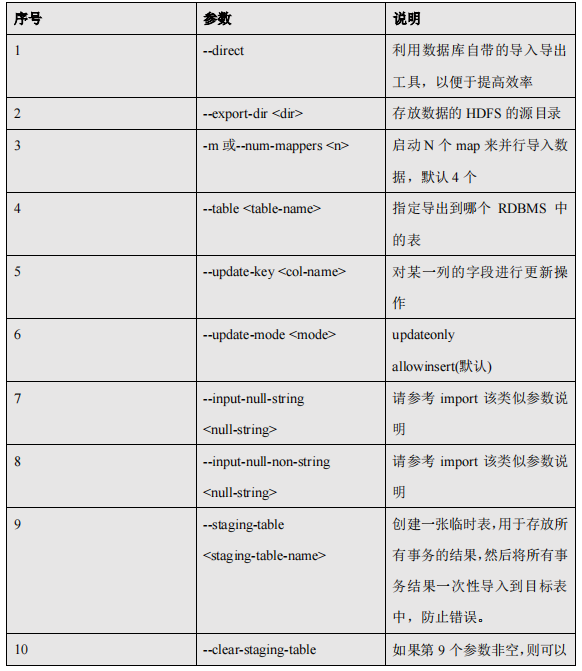

# Sqoop

## 11.1 Sqoop简介

Sqoop 是一款开源的工具，主要用于在 Hadoop(Hive)与传统的数据库(mysql、postgresql...)间进行数据的传递，可以将一个关系型数据库（例如 ： MySQL ,Oracle ,Postgres 等）中的数据导进到 Hadoop 的 HDFS 中，也可以将 HDFS 的数据导进到关系型数据库中。

Sqoop 项目开始于 2009 年，最早是作为 Hadoop 的一个第三方模块存在，后来为了让使用者能够快速部署，也为了让开发人员能够更快速的迭代开发，Sqoop 独立成为一个 Apache项目。

Sqoop2 的最新版本是 1.99.7。请注意，2 与 1 不兼容，且特征不完整，它并不打算用于生产部署

## 11.2 Sqoop原理

将导入或导出命令翻译成 mapreduce 程序来实现。

在翻译出的 mapreduce 中主要是对 inputformat 和 outputformat 进行定制。

## 11.3 Sqoop 安装

安装 Sqoop 的前提是已经具备 Java 和 Hadoop 的环境。

### 11.3.1 下载并解压

1) 下载地址：http://mirrors.hust.edu.cn/apache/sqoop/1.4.6/
2) 上传安装包 `sqoop-1.4.6.bin__hadoop-2.0.4-alpha.tar.gz` 到虚拟机中
3) 解压 sqoop 安装包到指定目录，如：

   ```
   $ tar -zxf sqoop-1.4.6.bin__hadoop-2.0.4-alpha.tar.gz -C /opt/module/
   ```

### 11.3.2 修改配置文件

Sqoop 的配置文件与大多数大数据框架类似，在 sqoop 根目录下的 conf 目录中。

1) 重命名配置文件

```
$ mv sqoop-env-template.sh sqoop-env.sh
```

2) 修改配置文件

```
sqoop-env.sh

export HADOOP_COMMON_HOME=/opt/module/hadoop-2.7.2

export HADOOP_MAPRED_HOME=/opt/module/hadoop-2.7.2

export HIVE_HOME=/opt/module/hive

export ZOOKEEPER_HOME=/opt/module/zookeeper-3.4.10

export ZOOCFGDIR=/opt/module/zookeeper-3.4.10

export HBASE_HOME=/opt/module/hbase
```

### 11.3.3 拷贝 JDBC 驱动

拷贝 jdbc 驱动到 sqoop 的 lib 目录下，如：

```
$ cp mysql-connector-java-5.1.27-bin.jar

/opt/module/sqoop-1.4.6.bin__hadoop-2.0.4-alpha/lib/
```

### 11.3.4 验证 Sqoop

我们可以通过某一个 command 来验证 sqoop 配置是否正确：

```
$ bin/sqoop help
```

出现一些 Warning 警告（警告信息已省略），并伴随着帮助命令的输出：

```
Available commands:

codegen Generate code to interact with database records

create-hive-table Import a table definition into Hive

eval Evaluate a SQL statement and display the results

export Export an HDFS directory to a database table

help List available commands

import Import a table from a database to HDFS

import-all-tables Import tables from a database to HDFS

import-mainframe Import datasets from a mainframe server to HDFS

job Work with saved jobs

list-databases List available databases on a server

list-tables List available tables in a database

merge Merge results of incremental imports

metastore Run a standalone Sqoop metastore

version Display version information
```

### 11.3.5 测试 Sqoop 是否能够成功连接数据库

```
$ bin/sqoop list-databases --connect jdbc:mysql://hadoop5:3306/

--username root --password 000000
```

出现如下输出：

```
information_schema

metastore

mysql

oozie

performance_schema
```

## 11.4 Sqoop 的简单使用案例

### 11.4.1 导入数据

在 Sqoop 中，“导入”概念指：从非大数据集群（RDBMS）向大数据集群（HDFS，HIVE， HBASE）中传输数据，叫做：导入，即使用 import 关键字。

RDBMS 到 HDFS

1) 确定 Mysql 服务开启正常
2) 在 Mysql 中新建一张表并插入一些数据

```
$ mysql -uroot -p000000

mysql> create database company;

mysql> create table company.staff(id int(4) primary key not null

auto_increment, name varchar(255), sex varchar(255));

mysql> insert into company.staff(name, sex) values('Thomas', 'Male');

mysql> insert into company.staff(name, sex) values('Catalina',

'FeMale');
```

3) 导入数据

（ 1）全部导入

```
$ bin/sqoop import \

--connect jdbc:mysql://hadoop5:3306/company \

--username root \

--password 000000 \

--table staff \

--target-dir /user/company \

--delete-target-dir \

--num-mappers 1 \

--fields-terminated-by "\t"
```

（ 2）查询导入

```
$ bin/sqoop import \

--connect jdbc:mysql://hadoop5:3306/company \

--username root \

--password 000000 \

--target-dir /user/company \

--delete-target-dir \

--num-mappers 1 \

--fields-terminated-by "\t" \

--query 'select name,sex from staff where id <=1 and $CONDITIONS;'
```

提示：must contain '$CONDITIONS' in WHERE clause.

如果 query 后使用的是双引号，则$CONDITIONS 前必须加转移符，防止 shell 识别为自己的

变量。

（ 3）导入指定列

```
$ bin/sqoop import \

--connect jdbc:mysql://hadoop5:3306/company 

--username root \

--password 000000 \

--target-dir /user/company \

--delete-target-dir \

--num-mappers 1 \

--fields-terminated-by "\t" \

--columns id,sex \

--table staff
```

提示：columns 中如果涉及到多列，用逗号分隔，分隔时不要添加空格

（ 4）使用 sqoop 关键字筛选查询导入数据

```
$ bin/sqoop import \

--connect jdbc:mysql://hadoop5:3306/company \

--username root \

--password 000000 \

--target-dir /user/company \

--delete-target-dir \

--num-mappers 1 \

--fields-terminated-by "\t" \

--table staff \

--where "id=1"
```

- RDBMS 到 Hive

```
$ bin/sqoop import \

--connect jdbc:mysql://hadoop5:3306/company \

--username root \

--password 000000 \

--table staff \

--num-mappers 1 \

--hive-import \

--fields-terminated-by "\t" \

--hive-overwrite \

--hive-table staff_hive
```

提示：该过程分为两步，第一步将数据导入到 HDFS，第二步将导入到 HDFS 的数据迁移到 Hive 仓库，第一步默认的临时目录是/user/atguigu/表名

- RDBMS 到 Hbase

```
$ bin/sqoop import \

--connect jdbc:mysql://hadoop5:3306/company \

--username root \

--password 000000 \

--table company \

--columns "id,name,sex" \

--column-family "info" \

--hbase-create-table \

--hbase-row-key "id" \

--hbase-table "hbase_company" \

--num-mappers 1 \

--split-by id
```

提示：sqoop1.4.6 只支持 HBase1.0.1 之前的版本的自动创建 HBase 表的功能

解决方案：手动创建 HBase 表

```
hbase> create 'hbase_company,'info'
```

(5) 在 HBase 中 scan 这张表得到如下内容

```
hbase> scan ‘hbase_company’
```

- 导出数据

在 Sqoop 中，“导出”概念指：从大数据集群（HDFS，HIVE，HBASE）向非大数据集群 （RDBMS）中传输数据，叫做：导出，即使用 export 关键字。

- HIVE/HDFS 到 RDBMS

```
$ bin/sqoop export \

--connect jdbc:mysql://hadoop5:3306/company \

--username root \

--password 000000 \

--table staff \

--num-mappers 1 \

--export-dir /user/hive/warehouse/staff_hive \

--input-fields-terminated-by "\t"
```

提示：Mysql 中如果表不存在，不会自动创建

- 脚本打包

使用 opt 格式的文件打包 sqoop 命令，然后执行

1) 创建一个.opt 文件

```
$ mkdir opt

$ touch opt/job_HDFS2RDBMS.opt
```

2) 编写 sqoop 脚本

```
$ vi opt/job_HDFS2RDBMS.opt

export

--connect

jdbc:mysql://hadoop5:3306/company

--username

root

--password

000000

--table

staff

--num-mappers

1

--export-dir

/user/hive/warehouse/staff_hive

--input-fields-terminated-by

"\t"
```

3) 执行该脚本

```
$ bin/sqoop --options-file opt/job_HDFS2RDBMS.opt
```

## 11.5 Sqoop 一些常用命令及参数

### 11.5.1 常用命令列举

这里给大家列出来了一部分 Sqoop 操作时的常用参数，以供参考，需要深入学习的可以参 看对应类的源代码。


### 11.5.2 命令&参数详解

刚才列举了一些 Sqoop 的常用命令，对于不同的命令，有不同的参数，让我们来一一列举
说明。
首先来我们来介绍一下公用的参数，所谓公用参数，就是大多数命令都支持的参数。

#### 11.5.2.1 公用参数：数据库连接


#### 11.5.2.2 公用参数：import


#### 11.5.2.3 公用参数：export


#### 11.5.2.4 公用参数：hive


公用参数介绍完之后，我们来按照命令介绍命令对应的特有参数。

#### 11.5.2.5 命令&参数：import

将关系型数据库中的数据导入到 HDFS（包括 Hive，HBase）中，如果导入的是 Hive，那么

当 Hive 中没有对应表时，则自动创建。

1) **命令：**

如：导入数据到 hive 中

```sql
$ bin/sqoop import \
--connect jdbc:mysql://hadoop5:3306/company \
--username root \
--password 000000 \
--table staff \
--hive-import
```

如：增量导入数据到 hive 中，mode=append

```sql
append 导入：
$ bin/sqoop import \
--connect jdbc:mysql://hadoop5:3306/company \
--username root \
--password 000000 \
--table staff \
--num-mappers 1 \
--fields-terminated-by "\t" \
--target-dir /user/hive/warehouse/staff_hive \
--check-column id \
--incremental append \
--last-value 3
```

提示：append 不能与--hive-等参数同时使用（Append mode for hive imports is not yet

supported. Please remove the parameter --append-mode）

如：增量导入数据到 hdfs 中，mode=lastmodified

```sql
先在 mysql 中建表并插入几条数据：
mysql> create table company.staff_timestamp(id int(4), name varchar(255), sex varchar(255), 
last_modified timestamp DEFAULT CURRENT_TIMESTAMP ON UPDATE 
CURRENT_TIMESTAMP);
mysql> insert into company.staff_timestamp (id, name, sex) values(1, 'AAA', 'female');
mysql> insert into company.staff_timestamp (id, name, sex) values(2, 'BBB', 'female');

先导入一部分数据：
$ bin/sqoop import \
--connect jdbc:mysql://hadoop5:3306/company \
--username root \
--password 000000 \
--table staff_timestamp \
--delete-target-dir \
--m 1
再增量导入一部分数据：
mysql> insert into company.staff_timestamp (id, name, sex) values(3, 'CCC', 'female');
$ bin/sqoop import \
--connect jdbc:mysql://hadoop5:3306/company \
--username root \
--password 000000 \
--table staff_timestamp \
--check-column last_modified \
--incremental lastmodified \
--last-value "2017-09-28 22:20:38" \
--m 1 \
--append
```

提示：使用 lastmodified 方式导入数据要指定增量数据是要--append（追加）还是要

--merge-key（合并）

提示：last-value 指定的值是会包含于增量导入的数据中

2) **参数：**


#### 11.5.2.6 命令&参数：export

从 HDFS（包括 Hive 和 HBase）中奖数据导出到关系型数据库中。

1) **命令：**
```sql
$ bin/sqoop export \
--connect jdbc:mysql://hadoop5:3306/company \
--username root \
--password 000000 \
--table staff \
--export-dir /user/company \
--input-fields-terminated-by "\t" \
--num-mappers 1
```
2) **参数：**




#### 11.5.2.7 命令&参数：codegen
将关系型数据库中的表映射为一个 Java 类，在该类中有各列对应的各个字段。
如：
```sql
$ bin/sqoop codegen \
--connect jdbc:mysql://hadoop5:3306/company \
--username root \
--password 000000 \
--table staff \
--bindir /home/admin/Desktop/staff \
--class-name Staff \
--fields-terminated-by "\t"
```
**参数：**


#### 11.5.2.8 命令&参数：create-hive-table

生成与关系数据库表结构对应的 hive 表结构。
命令：
```sql
$ bin/sqoop create-hive-table \
--connect jdbc:mysql://hadoop5:3306/company \
--username root \
--password 000000 \
--table staff \
--hive-table hive_staff
```
 参数：


#### 11.5.2.9 命令&参数：eval

可以快速的使用 SQL 语句对关系型数据库进行操作，经常用于在 import 数据之前，了解一
下 SQL 语句是否正确，数据是否正常，并可以将结果显示在控制台。
命令：
如：
```sql
$ bin/sqoop eval \
--connect jdbc:mysql://hadoop5:3306/company \
--username root \
--password 000000 \
--query "SELECT * FROM staff"
```
参数：


#### 11.5.2.10 命令&参数：import-all-tables
可以将 RDBMS 中的所有表导入到 HDFS 中，每一个表都对应一个 HDFS 目录  
命令：
如：
```sql
$ bin/sqoop import-all-tables \
--connect jdbc:mysql://hadoop5:3306/company \
--username root \
--password 000000 \
--warehouse-dir /all_tables
```
参数：


#### 11.5.2.11 命令&参数：job
用来生成一个 sqoop 任务，生成后不会立即执行，需要手动执行。
命令：  
如  
```sql
$ bin/sqoop job \
--create myjob -- import-all-tables \
--connect jdbc:mysql://hadoop5:3306/company \
--username root \
--password 000000
$ bin/sqoop job \
--list
$ bin/sqoop job \
--exec myjob
```
尖叫提示：注意 import-all-tables 和它左边的--之间有一个空格
尖叫提示：如果需要连接 metastore，则--meta-connect jdbc:hsqldb:hsql://hadoop5:16000/sqoop
参数：

尖叫提示：在执行一个 job 时，如果需要手动输入数据库密码，可以做如下优化
```sql
<property>
<name>sqoop.metastore.client.record.password</name>
<value>true</value>
<description>If true, allow saved passwords in the metastore.</description>
</property>
```
#### 11.5.2.12 命令&参数：list-databases
命令：
如：
```sql
$ bin/sqoop list-databases \
--connect jdbc:mysql://hadoop5:3306/ \
--username root \
--password 000000
```
参数：与公用参数一样
#### 11.5.2.13 命令&参数：list-tables
命令：  
如 
```sql
$ bin/sqoop list-tables \
--connect jdbc:mysql://hadoop5:3306/company \
--username root \
--password 000000
```
参数：与公用参数一样
#### 11.5.2.14 命令&参数：merge
将 HDFS 中不同目录下面的数据合并在一起并放入指定目录中  
数据环境：
```sql
new_staff
1 AAA male
2 BBB male
3 CCC male
4 DDD male
old_staff
1 AAA female
2 CCC female
3 BBB female
6 DDD female
```
尖叫提示：上边数据的列之间的分隔符应该为\t，行与行之间的分割符为\n，如果直接复制，请检查之。
命令：
如：
```sql
创建 JavaBean：
$ bin/sqoop codegen \
--connect jdbc:mysql://hadoop5:3306/company \
--username root \
--password 000000 \
--table staff \
--bindir /home/admin/Desktop/staff \
--class-name Staff \
--fields-terminated-by "\t"
开始合并：
$ bin/sqoop merge \
--new-data /test/new/ \
--onto /test/old/ \
--target-dir /test/merged \
--jar-file /home/admin/Desktop/staff/Staff.jar \
--class-name Staff \
--merge-key id
结果：
1 AAA MALE
2 BBB MALE
3 CCC MALE
4 DDD MALE
6 DDD FEMALE
```
参数：


#### 11.5.2.15 命令&参数：metastore
记录了 Sqoop job 的元数据信息，如果不启动该服务，那么默认 job 元数据的存储目录为
~/.sqoop，可在 sqoop-site.xml 中修改。

命令：  
如：启动 sqoop 的 metastore 服务  
```sql
$ bin/sqoop metastore
```
参数：
