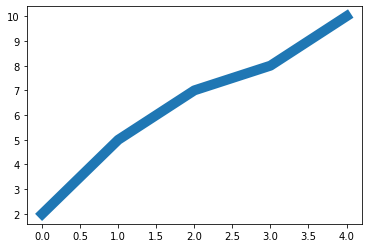

# 第二回：艺术画笔见乾坤
----

（本学习笔记来源于[DataWhale-数据可视化](https://datawhalechina.github.io/fantastic-matplotlib/)）
```md
It's not always about attacking. Sometimes, it's much better to take a piece back.
不要一味进攻，有时候要以退为进。
```


上一回我们了解matplotlib的基本用法以及`Figure`组成部分留下一个一个坑，这次，我们接着往下学习。


知识点归纳如下：

1.matplotlib的三层API：`绘图区`、`渲染器`、`图表组件`

2.Artist的分类：`primitives`、`containers`

3.primitives用法：`曲线`、`矩形`、`图像`

4.containers用法：`Figure容器`、`Axes容器`、`Axis容器`、`Tick容器`


## matplotlib的三层API

- `matplotlib.backend_bases.FigureCanvas` 绘图区，可理解为画布，所有的图像都是在绘图区完成的
- `matplotlib.backend_bases.Renderer` 渲染器，可理解为画笔，控制在 `FigureCanvas` 上画图。
- `matplotlib.artist.Artist` 具体的图表组件，即调用了`Renderer`的接口在`Canvas`上作图。


## Artist的分类

`Artist` 可分两种类型：`primitives` 和 `containers`。

- `primitive`：基本要素，包含一些标准图形对象，如**曲线Line2D，文字text，矩形Rectangle，图像image**等。

- `container`：容器，用来装基本要素，包括**图形figure、坐标系Axes、坐标轴Axis、Tick**。

他们之间的关系如下图所示：


## Artist 之primitives用法


容器中可能会包含多种基本要素-`primitives`, 所以先介绍下`primitives`，再介绍容器。

本章重点介绍下 `primitives` 的几种类型：

- 曲线-Line2D
- 矩形-Rectangle
- 图像-image （其中文本-Text较为复杂，会在之后单独详细说明。）


###  2DLines

在`matplotlib`中曲线的绘制，主要是通过类 `matplotlib.lines.Line2D`来完成的。
它的基类: `matplotlib.artist.Artist`

matplotlib中线-line的含义：它表示的可以是连接所有顶点的实线样式，也可以是每个顶点的标记。

构造函数：

> class matplotlib.lines.Line2D(xdata, ydata, linewidth=None, linestyle=None, color=None, marker=None, markersize=None, markeredgewidth=None, markeredgecolor=None, markerfacecolor=None, markerfacecoloralt='none', fillstyle=None, antialiased=None, dash_capstyle=None, solid_capstyle=None, dash_joinstyle=None, solid_joinstyle=None, pickradius=5, drawstyle=None, markevery=None, **kwargs)

常用的参数解释：

- xdata:需要绘制的line中点的在x轴上的取值，若忽略，则默认为range(1,len(ydata)+1)
- ydata:需要绘制的line中点的在y轴上的取值
- linewidth:线条的宽度
- linestyle:线型
- color:线条的颜色
- marker:点的标记，详细可参考markers API
- markersize:标记的size

1. #### 三种设置Line2D的属性

- 直接在plot()函数中设置

- 通过获得线对象，对线对象进行设置

- 获得线属性，使用setp()函数设置


```python
# 1) 直接在plot()函数中设置
import matplotlib.pyplot as plt
x = range(0,5)
y = [2,5,7,8,10]
plt.plot(x,y, linewidth=10); # 设置线的粗细参数为10
```


    

    


```python
# 2) 通过获得线对象，对线对象进行设置
x = range(0,5)
y = [2,5,7,8,10]
line, = plt.plot(x, y, '-')
line.set_antialiased(True) # 关闭抗锯齿功能
```


    

    


```python
# 3) 获得线属性，使用setp()函数设置
x = range(0,5)
y = [2,5,7,8,10]
lines = plt.plot(x, y)
plt.setp(lines, color='r', linewidth=10 ,linestyle=':');
```


    

    


#### 2. 如何绘制lines

- 绘制直线line

- errorbar绘制误差折线图

**1）绘制直线line** 

常用方法有两种:

- pyplot方法绘制

- Line2D对象绘制


```python
# 1. pyplot方法绘制
import matplotlib.pyplot as plt
x = range(0,5)
y = [2,5,7,8,10]
plt.subplot(111)
plt.plot(x,y);
```


    

    


```python
# 2. Line2D对象绘制
import matplotlib.pyplot as plt
from matplotlib.lines import Line2D      

fig = plt.figure()
ax = fig.add_subplot(111)
line = Line2D(x, y)
ax.add_line(line)
ax.set_xlim(min(x), max(x))
ax.set_ylim(min(y), max(y))

plt.show()
```


    

    


注意，pyplot的方式中`plt.subplot()`参数和面向对象绘制中的`add_subplot()`参数和含义都相同。

**2) errorbar绘制误差折线图**

pyplot里有个专门绘制误差线的功能，通过`errorbar`类实现，它的构造函数：

> matplotlib.pyplot.errorbar(x, y, yerr=None, xerr=None, fmt='', ecolor=None, elinewidth=None, capsize=None, barsabove=False, lolims=False, uplims=False, xlolims=False, xuplims=False, errorevery=1, capthick=None, *, data=None, **kwargs)

其中最主要的参数是前几个:

- x：需要绘制的line中点的在x轴上的取值

- y：需要绘制的line中点的在y轴上的取值

- yerr：指定y轴水平的误差

- xerr：指定x轴水平的误差

- fmt：指定折线图中某个点的颜色，形状，线条风格，例如‘co--’

- ecolor：指定error bar的颜色

- elinewidth：指定error bar的线条宽度


```python
import numpy as np
import matplotlib.pyplot as plt
fig = plt.figure()
x = np.arange(10)
y = 2.5 * np.sin(x / 20 * np.pi)
yerr = np.linspace(0.05, 0.2, 10)
plt.errorbar(x, y + 3, yerr=yerr, label='both limits (default)'); # 绘制折线
```


    

    


### patches

matplotlib.patches.Patch类是二维图形类。它的基类是matplotlib.artist.Artist，它的构造函数：
详细清单见 [matplotlib.patches API](https://matplotlib.org/stable/api/patches_api.html)

> Patch(edgecolor=None, facecolor=None, color=None, linewidth=None, linestyle=None, antialiased=None, hatch=None, fill=True, capstyle=None, joinstyle=None, **kwargs)


patch可以绘制以下几种图形效果：

- Rectangle-矩形: hist直方图和bar条形图 
- Polygon-多边形
- Wedge-契形

#### Rectangle-矩形

> class matplotlib.patches.Rectangle(xy, width, height, angle=0.0, **kwargs)


最常见的矩形图 : **hist直方图和bar条形图**。

1) hist-直方图

> matplotlib.pyplot.hist(x,bins=None,range=None, density=None, bottom=None, histtype='bar', align='mid', log=False, color=None, label=None, stacked=False, normed=None)

下面是一些常用的参数：

- x: 数据集，最终的直方图将对数据集进行统计

- bins: 统计的区间分布

- range: tuple, 显示的区间，range在没有给出bins时生效

- density: bool，默认为false，显示的是频数统计结果，为True则显示频率统计结果，这里需要注意，频率统计结果=区间数目/(总数*区间宽度)，和normed效果一致，官方推荐使用density

- histtype: 可选{'bar', 'barstacked', 'step', 'stepfilled'}之一，默认为bar，推荐使用默认配置，step使用的是梯状，stepfilled则会对梯状内部进行填充，效果与bar类似

- align: 可选{'left', 'mid', 'right'}之一，默认为'mid'，控制柱状图的水平分布，left或者right，会有部分空白区域，推荐使用默认

- log: bool，默认False,即y坐标轴是否选择指数刻度

- stacked: bool，默认为False，是否为堆积状图

hist绘制直方图


```python
import matplotlib.pyplot as plt
import numpy as np 
x=np.random.randint(0,100,100) #生成[0-100)之间的100个数据,即 数据集 
bins=np.arange(0,101,10) #设置连续的边界值，即直方图的分布区间[0,10),[10,20)... 
plt.hist(x,bins,color='fuchsia',alpha=0.5)#alpha设置透明度，0为完全透明 
plt.xlabel('scores') 
plt.ylabel('count') 
plt.xlim(0,100)#设置x轴分布范围 
plt.show()
```


    

    


`Rectangle`矩形类绘制直方图


```python
import pandas as pd
import re
df = pd.DataFrame(columns = ['data'])
df.loc[:,'data'] = x
df['fenzu'] = pd.cut(df['data'], bins=bins, right = False,include_lowest=True)

df_cnt = df['fenzu'].value_counts().reset_index()
df_cnt.loc[:,'mini'] = df_cnt['index'].astype(str).map(lambda x:re.findall('\[(.*)\,',x)[0]).astype(int)
df_cnt.loc[:,'maxi'] = df_cnt['index'].astype(str).map(lambda x:re.findall('\,(.*)\)',x)[0]).astype(int)
df_cnt.loc[:,'width'] = df_cnt['maxi']- df_cnt['mini']
df_cnt.sort_values('mini',ascending = True,inplace = True)
df_cnt.reset_index(inplace = True,drop = True)

#用Rectangle把hist绘制出来
import matplotlib.pyplot as plt

fig = plt.figure()
ax1 = fig.add_subplot(111)

for i in df_cnt.index:
    rect =  plt.Rectangle((df_cnt.loc[i,'mini'],0),df_cnt.loc[i,'width'],df_cnt.loc[i,'fenzu'])
    ax1.add_patch(rect)

ax1.set_xlim(0, 100)
ax1.set_ylim(0, 16)
plt.show()
```


    

    


2) bar-柱状图

> matplotlib.pyplot.bar(left, height, alpha=1, width=0.8, color=, edgecolor=, label=, lw=3)

下面是一些常用的参数：

- left：x轴的位置序列，一般采用range函数产生一个序列，但是有时候可以是字符串

- height：y轴的数值序列，也就是柱形图的高度，一般就是我们需要展示的数据；

- alpha：透明度，值越小越透明

- width：为柱形图的宽度，一般这是为0.8即可；

- color或facecolor：柱形图填充的颜色；

- edgecolor：图形边缘颜色

- label：解释每个图像代表的含义，这个参数是为legend()函数做铺垫的，表示该次bar的标签

有两种方式绘制柱状图

- bar绘制柱状图

- Rectangle矩形类绘制柱状图


```python
# bar绘制柱状图
import matplotlib.pyplot as plt
y = range(1,17)
x = np.arange(16)
plt.bar(x, y, alpha=0.5, width=0.5, color='yellow', edgecolor='red', label='The First Bar', lw=3);
plt.legend('l1')
```


    <matplotlib.legend.Legend at 0x215a43dba30>


    

    


```python
# Rectangle矩形类绘制柱状图
#import matplotlib.pyplot as plt
fig = plt.figure()
ax1 = fig.add_subplot(111)

for i in range(1,17):
    rect =  plt.Rectangle((i+0.25,0),0.5,i)
    ax1.add_patch(rect)
ax1.set_xlim(0, 16)
ax1.set_ylim(0, 16)
plt.show()
```


    

    


####  Polygon-多边形

`matplotlib.patches.Polygon`类是多边形类。其基类是`matplotlib.patches.Patch`，它的构造函数：

> class matplotlib.patches.Polygon(xy, closed=True, **kwargs)

xy是一个$N×2$的$numpy array$，为多边形的顶点。

closed为True则指定多边形将起点和终点重合从而显式关闭多边形。

`matplotlib.patches.Polygon`类中常用的是`fill`类，它是基于`xy`绘制一个填充的多边形，它的定义：

> matplotlib.pyplot.fill(*args, data=None, **kwargs)

参数说明 : 关于x、y和color的序列，其中color是可选的参数，每个多边形都是由其节点的x和y位置列表定义的，后面可以选择一个颜色说明符。您可以通过提供多个x、y、[颜色]组来绘制多个多边形。


```python
# 用fill来绘制图形
import matplotlib.pyplot as plt
x = np.linspace(0, 5 * np.pi, 1000) 
y1 = np.sin(x)
y2 = np.sin(2 * x) 
plt.fill(x, y1, color = "g", alpha = 0.3);
```


    

    


#### Wedge-契形

matplotlib.patches.Polygon类是多边形类。其基类是matplotlib.patches.Patch，它的构造函数：

> class matplotlib.patches.Wedge(center, r, theta1, theta2, width=None, **kwargs)

一个Wedge-契形 是以坐标x,y为中心，半径为r，从θ1扫到θ2(单位是度)。
如果宽度给定，则从内半径r -宽度到外半径r画出部分楔形。wedge中比较常见的是绘制饼状图。

matplotlib.pyplot.pie语法：

> matplotlib.pyplot.pie(x, explode=None, labels=None, colors=None, autopct=None, pctdistance=0.6, shadow=False, labeldistance=1.1, startangle=0, radius=1, counterclock=True, wedgeprops=None, textprops=None, center=0, 0, frame=False, rotatelabels=False, *, normalize=None, data=None)

制作数据x的饼图，每个楔子的面积用x/sum(x)表示。
其中最主要的参数是前4个：

- x：契型的形状，一维数组。

- explode：如果不是等于None，则是一个len(x)数组，它指定用于偏移每个楔形块的半径的分数。

- labels：用于指定每个契型块的标记，取值是列表或为None。

- colors：饼图循环使用的颜色序列。如果取值为None，将使用当前活动循环中的颜色。

- startangle：饼状图开始的绘制的角度。

pie绘制饼状图


```python
import matplotlib.pyplot as plt 
labels = 'Frogs', 'Hogs', 'Dogs', 'Logs'
sizes = [15, 30, 45, 10] 
explode = (0, 0.1, 0, 0) 
fig1, ax1 = plt.subplots() 
ax1.pie(sizes, explode=explode, labels=labels, autopct='%1.1f%%', shadow=True, startangle=90) 
ax1.axis('equal') # Equal aspect ratio ensures that pie is drawn as a circle. 
plt.show()
```


    

    


wedge绘制饼图


```python
import matplotlib.pyplot as plt 
from matplotlib.patches import Circle, Wedge
from matplotlib.collections import PatchCollection

fig = plt.figure()
ax1 = fig.add_subplot(111)
theta1 = 0
sizes = [15, 30, 45, 10] 
patches = []
patches += [
    Wedge((0.3, 0.3), .2, 0, 54),             # Full circle
    Wedge((0.3, 0.3), .2, 54, 162),  # Full ring
    Wedge((0.3, 0.3), .2, 162, 324),              # Full sector
    Wedge((0.3, 0.3), .2, 324, 360),  # Ring sector
]
colors = 100 * np.random.rand(len(patches))
p = PatchCollection(patches, alpha=0.4)
p.set_array(colors)
ax1.add_collection(p)
plt.show()
```


    

    


### collections

可绘制：**散点图**

> Axes.scatter(self, x, y, s=None, c=None, marker=None, cmap=None, norm=None, vmin=None, vmax=None, alpha=None, linewidths=None, verts=, edgecolors=None, *, plotnonfinite=False, data=None, **kwargs)

其中最主要的参数是前5个：

- x：数据点x轴的位置

- y：数据点y轴的位置

- s：尺寸大小

- c：可以是单个颜色格式的字符串，也可以是一系列颜色

- marker: 标记的类型


```python
# 用scatter绘制散点图
x = [0,2,4,6,8,10] 
y = [10]*len(x) 
s = [20*2**n for n in range(len(x))] 
plt.scatter(x,y,s=s) 
plt.show()
```


    

    


### images

images是matplotlib中绘制image图像的类，其中最常用的imshow可以根据数组绘制成图像，它的构造函数：

> class matplotlib.image.AxesImage(ax, cmap=None, norm=None, interpolation=None, origin=None, extent=None, filternorm=True, filterrad=4.0, resample=False, **kwargs)

imshow根据数组绘制图像

> matplotlib.pyplot.imshow(X, cmap=None, norm=None, aspect=None, interpolation=None, alpha=None, vmin=None, vmax=None, origin=None, extent=None, shape=, filternorm=1, filterrad=4.0, imlim=, resample=None, url=None, *, data=None, **kwargs）

使用imshow画图时首先需要传入一个数组，数组对应的是空间内的像素位置和像素点的值，interpolation参数可以设置不同的差值方法，具体效果如下。


```python
import matplotlib.pyplot as plt
import numpy as np
methods = [None, 'none', 'nearest', 'bilinear', 'bicubic', 'spline16',
           'spline36', 'hanning', 'hamming', 'hermite', 'kaiser', 'quadric',
           'catrom', 'gaussian', 'bessel', 'mitchell', 'sinc', 'lanczos']


grid = np.random.rand(4, 4)

fig, axs = plt.subplots(nrows=3, ncols=6, figsize=(9, 6),
                        subplot_kw={'xticks': [], 'yticks': []})

for ax, interp_method in zip(axs.flat, methods):
    ax.imshow(grid, interpolation=interp_method, cmap='viridis')
    ax.set_title(str(interp_method))

plt.tight_layout()
plt.show()
```


    

    


## Artist之对象容器 - Object container


容器会包含一些primitives，并且容器还有它自身的属性。
比如Axes Artist，它是一种容器，它包含了很多primitives，比如Line2D，Text；同时，它也有自身的属性，比如xscal，用来控制X轴是linear还是log的。


### Figure容器

matplotlib.figure.Figure是Artist最顶层的container-对象容器，它包含了图表中的所有元素。一张图表的背景就是在Figure.patch的一个矩形Rectangle。
当我们向图表添加Figure.add_subplot()或者Figure.add_axes()元素时，这些都会被添加到Figure.axes列表中。


```python
fig = plt.figure()
ax1 = fig.add_subplot(211) # 作一幅2*1的图，选择第1个子图
ax2 = fig.add_axes([0.1, 0.1, 0.7, 0.3]) # 位置参数，四个数分别代表了(left,bottom,width,height)
print(ax1) 
print(fig.axes) # fig.axes 中包含了subplot和axes两个实例, 刚刚添加的
```

    AxesSubplot(0.125,0.536818;0.775x0.343182)
    [<AxesSubplot:>, <matplotlib.axes._axes.Axes object at 0x00000215A4A14790>]
    


    

    


由于Figure维持了current axes，因此你不应该手动的从Figure.axes列表中添加删除元素，而是要通过Figure.add_subplot()、Figure.add_axes()来添加元素，通过Figure.delaxes()来删除元素。但是你可以迭代或者访问Figure.axes中的Axes，然后修改这个Axes的属性。

比如下面的遍历axes里的内容，并且添加网格线：


```python
fig = plt.figure()
ax1 = fig.add_subplot(211)

for ax in fig.axes:
    ax.grid(True)
```


    

    


Figure也有它自己的text、line、patch、image。你可以直接通过add primitive语句直接添加。但是注意Figure默认的坐标系是以像素为单位，你可能需要转换成figure坐标系：(0,0)表示左下点，(1,1)表示右上点。

Figure容器的常见属性：
- Figure.patch属性：Figure的背景矩形
- Figure.axes属性：一个Axes实例的列表（包括Subplot)
- Figure.images属性：一个FigureImages patch列表
- Figure.lines属性：一个Line2D实例的列表（很少使用）
- Figure.legends属性：一个Figure Legend实例列表（不同于Axes.legends)
- Figure.texts属性：一个Figure Text实例列表

### Axes容器


matplotlib.axes.Axes是matplotlib的核心。大量的用于绘图的Artist存放在它内部，并且它有许多辅助方法来创建和添加Artist给它自己，而且它也有许多赋值方法来访问和修改这些Artist。

和Figure容器类似，Axes包含了一个patch属性，对于笛卡尔坐标系而言，它是一个Rectangle；对于极坐标而言，它是一个Circle。这个patch属性决定了绘图区域的形状、背景和边框。


```python
import numpy as np
import matplotlib.pyplot as plt
import matplotlib

fig = plt.figure()
ax = fig.add_subplot(111)
rect = ax.patch  # axes的patch是一个Rectangle实例
rect.set_facecolor('green')
```


    

    


### Axis容器

matplotlib.axis.Axis实例处理tick line、grid line、tick label以及axis label的绘制，它包括坐标轴上的刻度线、刻度label、坐标网格、坐标轴标题。通常你可以独立的配置y轴的左边刻度以及右边的刻度，也可以独立地配置x轴的上边刻度以及下边的刻度。

刻度包括主刻度和次刻度，它们都是Tick刻度对象。

Axis也存储了用于自适应，平移以及缩放的data_interval和view_interval。它还有Locator实例和Formatter实例用于控制刻度线的位置以及刻度label。

每个Axis都有一个label属性，也有主刻度列表和次刻度列表。这些ticks是axis.XTick和axis.YTick实例，它们包含着line primitive以及text primitive用来渲染刻度线以及刻度文本。

刻度是动态创建的，只有在需要创建的时候才创建（比如缩放的时候）。Axis也提供了一些辅助方法来获取刻度文本、刻度线位置等等：

常见的如下：


```python
# 不用print，直接显示结果
from IPython.core.interactiveshell import InteractiveShell
InteractiveShell.ast_node_interactivity = "all"

fig, ax = plt.subplots()
x = range(0,5)
y = [2,5,7,8,10]
plt.plot(x, y, '-')

axis = ax.xaxis # axis为X轴对象
axis.get_ticklocs()     # 获取刻度线位置
axis.get_ticklabels()   # 获取刻度label列表(一个Text实例的列表）。 可以通过minor=True|False关键字参数控制输出minor还是major的tick label。
axis.get_ticklines()    # 获取刻度线列表(一个Line2D实例的列表）。 可以通过minor=True|False关键字参数控制输出minor还是major的tick line。
axis.get_data_interval()# 获取轴刻度间隔
axis.get_view_interval()# 获取轴视角（位置）的间隔
```


    array([-0.2,  4.2])


    

    


```python
下面的例子展示了如何调整一些轴和刻度的属性(忽略美观度，仅作调整参考)：
```


```python
fig = plt.figure() # 创建一个新图表
rect = fig.patch   # 矩形实例并将其设为黄色
rect.set_facecolor('lightgoldenrodyellow')

ax1 = fig.add_axes([0.1, 0.3, 0.4, 0.4]) # 创一个axes对象，从(0.1,0.3)的位置开始，宽和高都为0.4，
rect = ax1.patch   # ax1的矩形设为灰色
rect.set_facecolor('lightslategray')


for label in ax1.xaxis.get_ticklabels(): 
    # 调用x轴刻度标签实例，是一个text实例
    label.set_color('red') # 颜色
    label.set_rotation(45) # 旋转角度
    label.set_fontsize(16) # 字体大小

for line in ax1.yaxis.get_ticklines():
    # 调用y轴刻度线条实例, 是一个Line2D实例
    line.set_color('green')    # 颜色
    line.set_markersize(25)    # marker大小
    line.set_markeredgewidth(2)# marker粗细

plt.show()
```


    

    


### Tick容器

matplotlib.axis.Tick是从Figure到Axes到Axis到Tick中最末端的容器对象。

Tick包含了tick、grid line实例以及对应的label。

所有的这些都可以通过Tick的属性获取，常见的tick属性有
- Tick.tick1line：Line2D实例
- Tick.tick2line：Line2D实例
- Tick.gridline：Line2D实例
- Tick.label1：Text实例
- Tick.label2：Text实例

y轴分为左右两个，因此tick1对应左侧的轴；tick2对应右侧的轴。

x轴分为上下两个，因此tick1对应下侧的轴；tick2对应上侧的轴。

下面的例子展示了，如何将Y轴右边轴设为主轴，并将标签设置为美元符号且为绿色：


```python
import numpy as np
import matplotlib.pyplot as plt
import matplotlib

fig, ax = plt.subplots()
ax.plot(100*np.random.rand(20))

# 设置ticker的显示格式
formatter = matplotlib.ticker.FormatStrFormatter('$%1.2f')
ax.yaxis.set_major_formatter(formatter)

# 设置ticker的参数，右侧为主轴，颜色为绿色
ax.yaxis.set_tick_params(which='major', labelcolor='green',
                         labelleft=False, labelright=True);
```


    


## 练一练

1. 使用提供的drug数据集，画出下面折线图。PA加粗标黄，其他为灰色。      
图标题和横纵坐标轴标题，以及线的文本暂不做要求。  
    


**解答:**


```python
import pandas as pd
import numpy as np
import matplotlib.pyplot as plt


## 官方解法
## Dataset = pd.read_csv('data/Drugs.csv')
## group = Dataset.groupby(['YYYY','State']).agg('sum').reset_index()
## df = group.pivot(index='YYYY', columns='State', values='DrugReports').reset_index()

df = pd.read_csv('data/Drugs.csv')
data = pd.pivot_table(df,index='YYYY', columns='State', values='DrugReports',aggfunc=np.sum)
# data.head(10)
```


```python
c = 'PA' # 高亮类型

# 转换数据
# data = pd.pivot_table(df,index='YYYY', columns='State', values='DrugReports',aggfunc=np.sum)

# 设置绘图样式
plt.style.use('seaborn-darkgrid')

# 画图,定义窗口大小
ax = data.plot(lw=1, figsize=(10, 12))

# 获取最后一行的数据 [9394,46104,27894,10448,1614]
l_r = (data.iloc[-1].tolist())

# 遍历列名['KY','OH','PA','VA','WV']
for index, row in enumerate(data.columns.values): 
    if row==c: # PA样式
        ax.get_lines()[index].set_color('orange')
        ax.get_lines()[index].set_linewidth(3)
        ax.text(np.max(df['YYYY']), l_r[index],row,color='orange')
    else: # 其他样式
        ax.get_lines()[index].set_color('gray')
        ax.get_lines()[index].set_linewidth(1)
        ax.text(np.max(df['YYYY']), l_r[index],row,color='gray')  
        
ax.set_ylabel('Year')
ax.set_ylabel('DrugReports')
#ax.legend(loc='upper left') 
ax.set_title("Evolution of PA vs other states" ,fontdict={'fontsize':'12','color':'orange','horizontalalignment':'left'} ,x=0)  
plt.show()
```

    


**2.* 分别用一组长方形柱和填充面积的方式模仿画出下图，函数 y = -1 * (x - 2) * (x - 8) +10 在区间[2,9]的积分面积

```python
import numpy as np
import matplotlib.pyplot as plt
from matplotlib.patches import Polygon
plt.style.use('default')

def func(x):
    return -1 * (x - 2) * (x - 8) +10


a, b = 2, 9  
x = np.linspace(0, 10)
y = func(x)
fig, ax = plt.subplots(figsize=(5, 4))
plt.plot(x, y, 'r', linewidth=2,)

plt.ylim(ymin=0)
ix = np.linspace(a, b)
iy = func(ix)
plt.bar(ix, iy, alpha=0.5, width=0.05, color='lightgray', edgecolor='lightgray', label='The First Bar', lw=1);

plt.text(0.5 * (a + b), 5, r"$\int_a^b f(x)\mathrm{d}x$",
         horizontalalignment='center', fontsize=20)

plt.figtext(0.9, 0.05, '$x$')
plt.figtext(0.1, 0.9, '$y$')

plt.show()
```


    

    


```python
def func(x):
    return -1 * (x - 2) * (x - 8) +10


import numpy as np
import matplotlib.pyplot as plt
from matplotlib.patches import Polygon
plt.style.use('default')


a, b = 2, 9  

x = np.linspace(0, 10)
y = func(x)
fig, ax = plt.subplots(figsize=(5, 4))

plt.plot(x, y, 'r', linewidth=1)
plt.ylim(ymin=0)

ix = np.linspace(a, b)
iy = func(ix)
verts = [(a, 0), *zip(ix, iy), (b, 0)]
poly = Polygon(verts, facecolor='0.9', edgecolor='0.5')
ax.add_patch(poly)
plt.text(0.5 * (a + b), 5, r"$\int_a^b f(x)\mathrm{d}x$", horizontalalignment='center', fontsize=20)
#plt.figtext(0.9, 0.05, '$x$')
#plt.figtext(0.1, 0.9, '$y$')
plt.show()
```


    

    

## 参考资料
- [datawhale-matplotlib数据可视化-29期](https://datawhalechina.github.io/fantastic-matplotlib/)
- [matplotlib官网用户指南](https://matplotlib.org/stable/tutorials/introductory/usage.html)
- [AI算法工程师手册](https://www.bookstack.cn/read/huaxiaozhuan-ai/spilt.2.333f5abdbabf383d.md)

附上参考：

```sh

       b     blue          .     point              -     solid
       g     green         o     circle             :     dotted
       r     red           x     x-mark             -.    dashdot 
       c     cyan          +     plus               --    dashed   
       m     magenta       *     star             (none)  no line
       y     yellow        s     square
       k     black         d     diamond
       w     white         v     triangle (down)
                           ^     triangle (up)
                           <     triangle (left)
                           >     triangle (right)
                           p     pentagram
                           h     hexagram
                           
```

<link rel="stylesheet" href="https://cdnjs.cloudflare.com/ajax/libs/social-share.js/1.0.16/css/share.min.css">
<div class="social-share"></div>
<script type="text/javascript" src="https://cdnjs.cloudflare.com/ajax/libs/social-share.js/1.0.16/js/social-share.min.js"></script>

