# 第三回：布局格式定方圆 :id=task03_1
----
（本学习笔记来源于[DataWhale-数据可视化](https://datawhalechina.github.io/fantastic-matplotlib/)）

```md
Love actually is all around.
爱无处不在。
```

本回知识归纳：
- 子图： `plt.subplots`绘制均匀子图, `plt.GridSpec`绘制不均匀子图
- 子图的一些方法


matplotlib默认不支持中文绘制，添加中文支持需自定义增加中文字体


```python

import numpy as np
import pandas as pd
import matplotlib.pyplot as plt
plt.rcParams['font.sans-serif'] = ['SimHei']   #用来正常显示中文标签
plt.rcParams['axes.unicode_minus'] = False   #用来正常显示负号

```

## 使用 plt.subplots 绘制均匀子图 :id=task03_102

返回元素分别是画布和子图构成的列表，第一个数字为行，第二个为列

figsize 参数可以指定整个画布的大小

sharex 和 sharey 分别表示是否共享横轴和纵轴刻度

tight_layout 函数可以调整子图的相对大小使字符不会重叠


```python
fig, axs = plt.subplots(2, 5, figsize=(10, 4), sharex=True, sharey=True)
fig.suptitle('样例1', size=20)
for i in range(2):
    for j in range(5):
        axs[i][j].scatter(np.random.randn(10), np.random.randn(10))
        axs[i][j].set_title('第%d行，第%d列'%(i+1,j+1))
        axs[i][j].set_xlim(-5,5)
        axs[i][j].set_ylim(-5,5)
        if i==1: axs[i][j].set_xlabel('横坐标')
        if j==0: axs[i][j].set_ylabel('纵坐标')
fig.tight_layout()
```


    
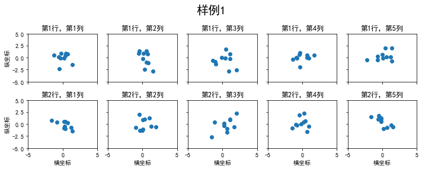
    


也可以用`projection`方法创建极坐标系下的图表


```python
N = 40
r = 2 * np.random.rand(N)
theta = 2 * np.pi * np.random.rand(N)
area = 200 * r**2
colors = theta

plt.figure(num=1, figsize=(8, 8))
plt.subplot(projection='polar')
plt.scatter(theta, r, c=colors, s=area, cmap='hsv', alpha=0.75);
```


    
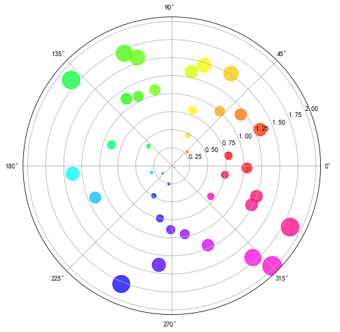
    


## 使用 GridSpec 绘制非均匀子图  :id=task03_103

先举个简单的例子： 

```python
ax = plt.subplot2grid((2,2),(0, 0))
```
等价于：

```python
ax = plt.subplot(2,2,1)
```

`subplot`下标从 $1$ 开始，`gridspec`中的下标从 $0$ 开始,示意图


```
       nRow=2, nCol=2
(0,0)  +-------+-------+
      |   1  |     |
      +-------+-------+
      |     |     |
      +-------+-------+
 ```     


再显示一个跨越多个格子的子图


```python
ax1 = plt.subplot2grid((3,3), (0,0), colspan=3)
ax2 = plt.subplot2grid((3,3), (1,0), colspan=2)
ax3 = plt.subplot2grid((3,3), (1, 2), rowspan=2)
ax4 = plt.subplot2grid((3,3), (2, 0))
ax5 = plt.subplot2grid((3,3), (2, 1))
```


    
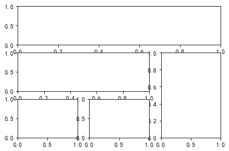
    


利用 `add_gridspec` 可以指定相对宽度比例 `width_ratios` 和相对高度比例参数 `height_ratios`


```python
fig = plt.figure(figsize=(10, 4))
spec = fig.add_gridspec(nrows=2, ncols=5, width_ratios=[1,2,3,4,5], height_ratios=[1,3])
fig.suptitle('样例2', size=20)
for i in range(2):
    for j in range(5):
        ax = fig.add_subplot(spec[i, j])
        ax.scatter(np.random.randn(10), np.random.randn(10))
        ax.set_title('第%d行，第%d列'%(i+1,j+1))
        if i==1: ax.set_xlabel('横坐标')
        if j==0: ax.set_ylabel('纵坐标')
fig.tight_layout()
```


    
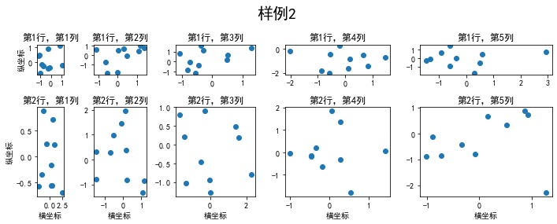
    


在上面的例子中出现了 spec[i, j] 的用法，事实上通过切片就可以实现子图的合并而达到跨图的共能


```python
fig = plt.figure(figsize=(10, 4))
spec = fig.add_gridspec(nrows=2, ncols=6, width_ratios=[2,2.5,3,1,1.5,2], height_ratios=[1,2])
fig.suptitle('样例3', size=20)
# sub1
ax = fig.add_subplot(spec[0, :3])
ax.scatter(np.random.randn(10), np.random.randn(10))
# sub2
ax = fig.add_subplot(spec[0, 3:5])
ax.scatter(np.random.randn(10), np.random.randn(10))
# sub3
ax = fig.add_subplot(spec[:, 5])
ax.scatter(np.random.randn(10), np.random.randn(10))
# sub4
ax = fig.add_subplot(spec[1, 0])
ax.scatter(np.random.randn(10), np.random.randn(10))
# sub5
ax = fig.add_subplot(spec[1, 1:5])
ax.scatter(np.random.randn(10), np.random.randn(10))
fig.tight_layout()
```


    
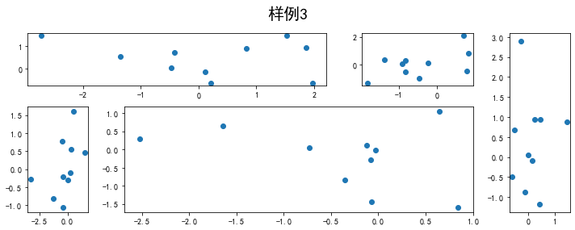
    


## 子图上的一些方法 :id=task03_104

在 `ax` 对象上定义了和 `plt` 类似的图形绘制函数，常用的有： `plot`, `hist`, `scatter`, `bar`, `barh`, `pie`


```python
fig, ax = plt.subplots(figsize=(4,3))
ax.plot([1,2],[2,1]);
```


    
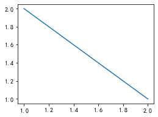
    


```python
fig, ax = plt.subplots(figsize=(4,3))
ax.hist(np.random.randn(1000));
```


    
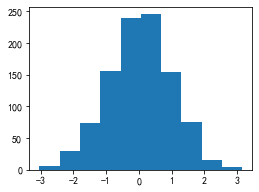
    


常用直线的画法为： `axhline`, `axvline`, `axline` （水平、垂直、任意方向）


```python
fig, ax = plt.subplots(figsize=(4,3))
ax.axhline(0.5,0.2,0.8)
ax.axvline(0.5,0.2,0.8)
ax.axline([0.3,0.3],[0.7,0.7]);
```


    
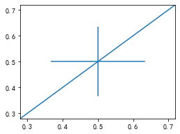
    


使用 `grid` 可以加灰色网格


```python
fig, ax = plt.subplots(figsize=(4,3))
ax.grid(True)
```


    
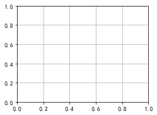
    


使用 `set_xscale`, `set_title`, `set_xlabel` 分别可以设置坐标轴的规度（指对数坐标等）、标题、轴名


```python
fig, axs = plt.subplots(1, 2, figsize=(10, 4))
fig.suptitle('大标题', size=20)
for j in range(2):
    axs[j].plot(list('abcd'), [10**i for i in range(4)])
    if j==0:
        axs[j].set_yscale('log')
        axs[j].set_title('子标题1')
        axs[j].set_ylabel('对数坐标')
    else:
        axs[j].set_title('子标题1')
        axs[j].set_ylabel('普通坐标')
fig.tight_layout()
```


    
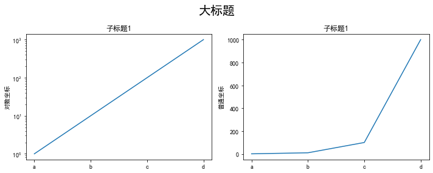
    


与一般的 `plt` 方法类似， `legend`, `annotate`, `arrow`, `text` 对象也可以进行相应的绘制


```python
fig, ax = plt.subplots()
ax.arrow(0, 0, 1, 1, head_width=0.03, head_length=0.05, facecolor='red', edgecolor='blue')
ax.text(x=0, y=0,s='这是一段文字', fontsize=16, rotation=70, rotation_mode='anchor', color='green')
ax.annotate('这是中点', xy=(0.5, 0.5), xytext=(0.8, 0.2), arrowprops=dict(facecolor='yellow', edgecolor='black'), fontsize=16);
```


    
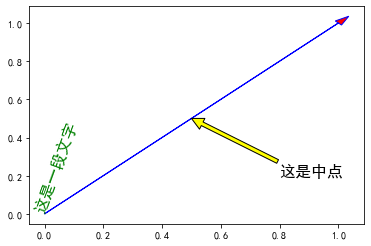
    


```python
fig, ax = plt.subplots()
ax.plot([1,2],[2,1],label="line1")
ax.plot([1,1],[1,2],label="line1")
ax.legend(loc=1);
```


    
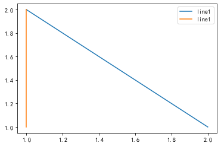
    


其中，图例的 `loc` 参数如下：


|  string   | code  |
|  ----  | ----  |
| best  | 0 |
| upper right | 1 |
| upper left  | 2 |
| lower left  | 3 |
| lower right  | 4 |
| right  | 5 |
| center left  | 6 |
| center right  | 7 |
| lower center  | 8 |
| upper center  | 9 |
| center  | 10 |
| center  | 10 |
| center  | 10 |
| center  | 10 |
| center  | 10 |

## 参考资料  :id=task03_101

- [datawhale-matplotlib数据可视化-29期](https://datawhalechina.github.io/fantastic-matplotlib/)
- [matplotlib官网用户指南](https://matplotlib.org/stable/tutorials/introductory/usage.html)
- [使用 GridSpec 自定义子图位置](https://blog.csdn.net/wizardforcel/article/details/54232788)

```python

```
