# 第2章　分析方法 :id=cp_2

> 什么是分析方法？

面对问题，通常的想法是零散的，没有一点思路。有什么方法可以将零散的想法整理成有条理的分析思路呢？这些方法就是分析方法。掌握了分析方法就可以具备这种能力。

将分析方法和盖房子做个类比：

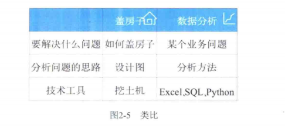

根据业务场景中分析目的的不同，可以选择对应的分析方法。常用的分析方法如：

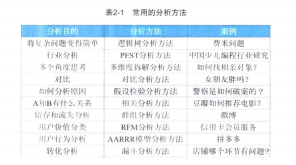

分析方法是将零散的想法整理成有条理的分析思路。有了分析思路，你就具备了分析思维。

我们可以通过思考4个问题来学习分析方法：

1. 是什么？先知道这个知识是什么；
2. 有什么用？知道在什么场景下使用这个知识；
3. 如何用？通过实际例子来看这个只是如何使用；
4. 使用这个知识的注意事项；

## 2.1 5W2H分析方法

> 什么是5W2H分析方法？

- **5W**代表：what(是什么)、when(何时)、where（何地）、why（为什么）、who（是谁）
- **2H**代表：how(怎么做)、how much(多少钱)

**案例1：如何设计一款产品？**

这时候可以用5W2H分析方法：
- what（是什么）：这是什么产品？
- when（何时）：什么时候需要上线？
- where（何地）：在哪里发布这些产品？
- why（为什么）：用户为什么需要它？
- who（是谁）：这是给谁设计的？
- how（怎么做）：这个产品需要怎么运作？
- how much（多少钱）：这个产品里有付费功能吗？价格是多少？

**案例2：设计一款App的调查问卷，如何设计问卷上的问题？**

这时候可以用5W2H分析方法：
- what（是什么）：你用这款App做什么事情？
- when（何时）：你通常在什么时间使用这款App？
- where（何地）：你会在什么场景使用这款App?
- why（为什么）：你为什么选择这款App？
- who（是谁）：如果你觉得你喜欢这个产品，你会推荐给谁？
- how（怎么做）：你觉得我们需要加入什么功能才是比较新颖的？
- how much（多少钱）：如果你认为这个App对你有帮助，你会花多少钱去购买APP里面的服务？

> 5W2H分析方法很好理解，但是在复杂的商业问题面前不起作用。这是因为复杂的商业问题不会只有一个原因，而是由多个原因引起。这时候就需要运用其他分析方法。

## 2.2 逻辑树分析方法

逻辑树分析方法就是把复杂的问题拆解成若干个简单的子问题，然后像树枝那样展开。

- 可通过`费米问题`来帮助理解逻辑数分析方法

> 注意事项：逻辑树分析方法在解决业务问题时，经常不是单独存在德，会融合在其他分析方法里，辅助解决问题。

## 2.3 行业分析方法

当个人在做职业规划时思考哪个行业更好发展或公司对外部环境或行业竞争对手进行分析，通常使用**PEST分析方法**进行行业分析。

PEST分析方法施对公司发展宏观环境德分析，所以经常用于行业分析。 通常是从`政策`、`经济`、`社会`和`技术`这四个方面来分析。

1. 政策环境主要包括政府的政策、法律等。
- 相关法律有哪些？对公司有什么影响？
- 投资政策有那些？对公司有什么影响？
- 最新的税收政策是什么？对公司有哪些影响？

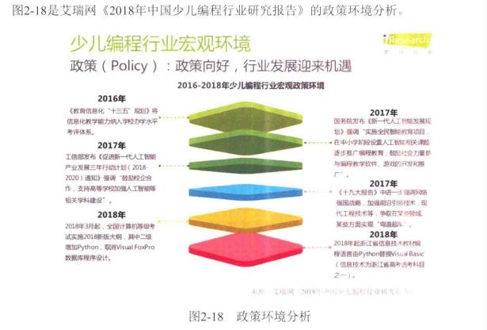

2. 经济环境主要指一个国家的国民收入、消费者的收入水平等。经济环境决定着公司未来市场能做多大。

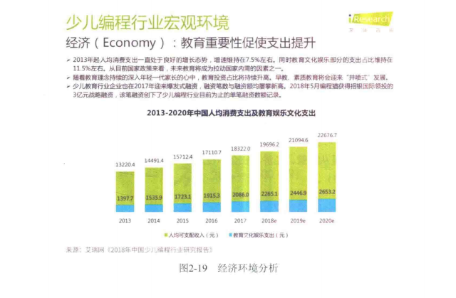

3. 社会环境主要包括一个地区的人口、年龄、收入分布、购买习惯、教育水平等。
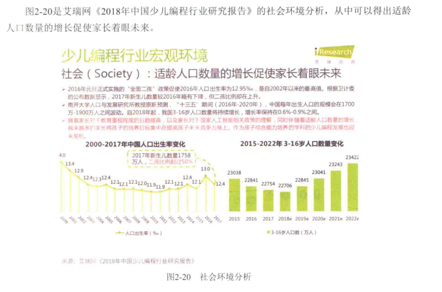

4. 技术环境是指外部技术对公司发展的影响。
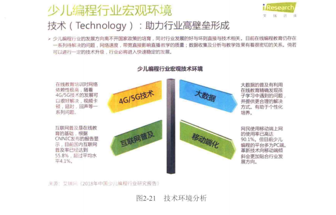

## 2.4 多维度拆解分析方法

对于多维度拆解分析方法，要理解两个关键词：维度、拆解。

> 多维度拆解分析方法有什么用？

**如何使用多维度拆解分析方法？**

1). 从指标构成来拆解

2). 从业务流程来拆解

3). 从指标构成拆解

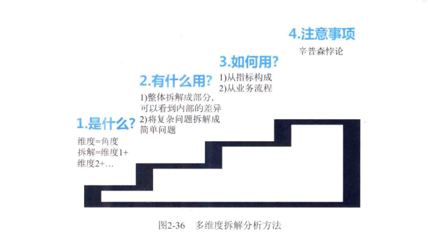

## 2.5 对比分析方法

这是一个和谁比、如何比较的分析方法

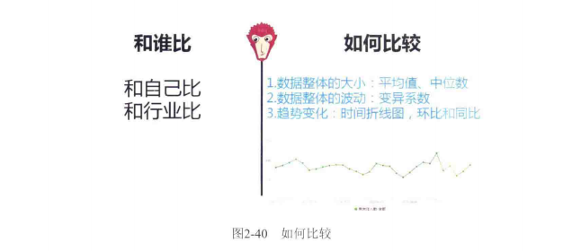

**如何比较**

- 数据整体的大小：某些指标可用来衡量整体数据的大小。常用的是平均值、中位数、或者某个业务指标。
- 数据整体的波动：标准差除以平均值得到的值叫做变异系数。变异系数可用来衡量整体数据的波动情况。
- 趋势变化：趋势变化是从时间维度来看数据随着时间发生的变化。常用的方法是时间折线图，环比和同比。

## 假设校验分析方法

假设检验分析方法是一种使用数据来作决策的过程。 假设检验分析方法分为3步：

1) 提出假设：用户、产品、竞品这三个维度提出假设

- 假设用户有问题：可以从用户来源渠道这个维度来拆解分析，或者画出用户使用产品的业务流程图来分析原因。
- 假设产品有问题：可以研究这段时销售的产品是否符合用户的需求
- 假设是竞品导致的问题：可以看竞品是不是在搞什么优惠活动，用户跑到竞争对手那里了。

**4P营销理论:** 产生于20世纪60年代的美国，它是随着营销组合理论的提出而出现的。营销组合实际上有几十个要素，这些要素可以概括为4类：产品、价格、渠道、促销。
（1）产品：公司提供给目标市场的有形或无形产品，包括产品实体、品牌、包装、样式、服务、技术等。  
（2）价格：用户购买产品时的价格，包括基本价格、折扣价格、付款期限及各种定价方法和定价技巧等。  
（3）渠道：产品从生产公司到消费用户所经历的销售路径。  
（4）促销：是指企业利用各种方法刺激用户消费，来促进销售的增长。包括广告、人员推销、营业推广等。
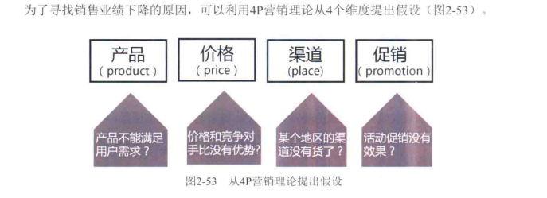

2) 收集证据
3) 得出结论

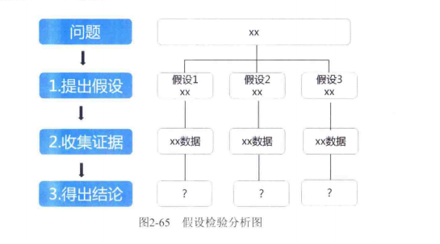

**假设校验分析方法有什么用？**

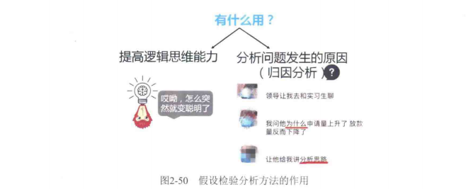

## 相关分析方法

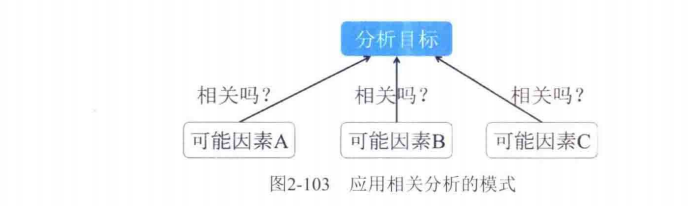

相关分析有很多好处，可以方便地应用在实际工作中。但是如果使用不正确，往往会得出一些错误的结论。使用相关分析的注意事项：相关关系不等于因果关系。在使用的时候注意这一点，可以提高分析的质量。

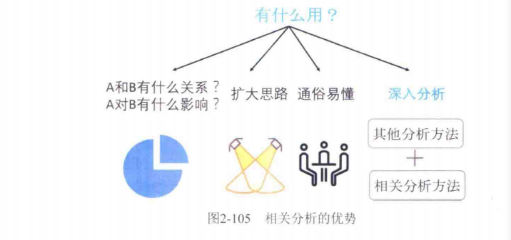

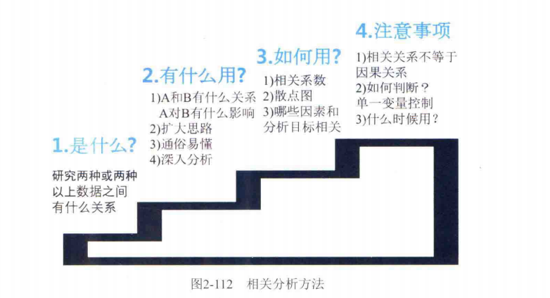

## 群组分析方法

也叫同期群分析方法是按照某个特征，将数据分为不同的组，然后比较各组的数据，说白了就是对数据分组然后来对比。

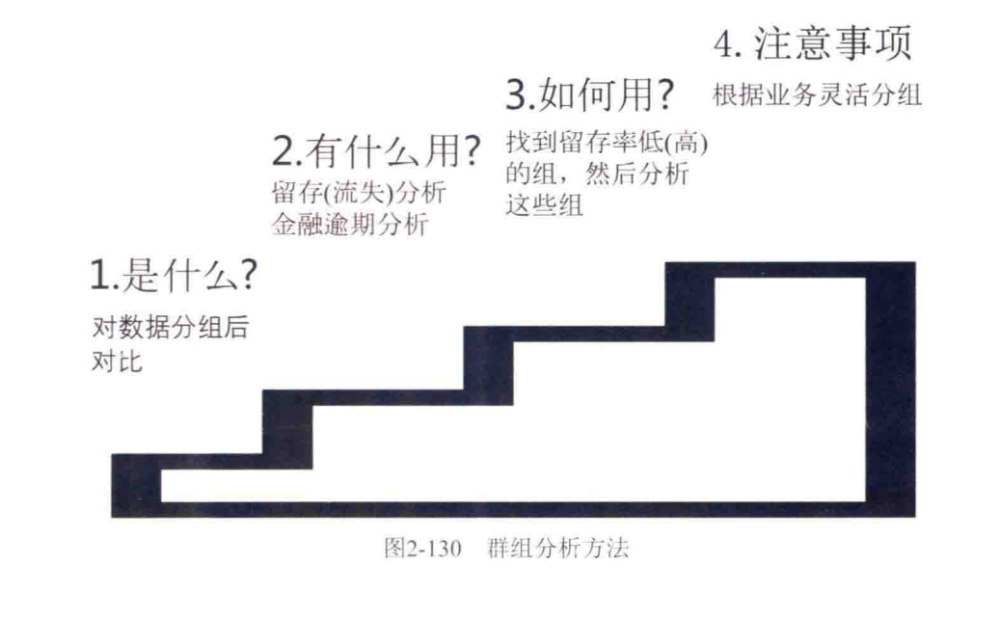

第一个问题：是什么？

“群组分析方法”是按某个特征，将数据分为不同的组，然后比较各组的数据。

第二个问题：有什么用？

群组分析方法常用来分析用户留存率（流失率）随时间发生了哪些变化，然后找出用户留下或者离开的原因。在金融行业，群组分析方法还可以用于用户预期分析。

第三个问题：如何用？

先使用群组分析方法，找到留存率低或留存率搞的组；然后使用假设检验、相关分析等方法，研究为什么这些组留存率低或留存率高。找到原因以后，就可以对应地优化产品。  
当群组分析表格里的数据比较多的时候，直接分析起来比较困难，这时可以把数据绘制成折线图，这样就可以很容易地发现数据发现了哪些变化。

第四个问题：注意事项

使用群组分析方法需要注意如何分组，除了按时间分组，还可以根据具体的业务场景来确定。

## RFM分析方法

RFM是3个指标的缩写：最近1次消费时间间隔（Recency）、消费频率（Frequency）、消费金额（Monetary）.

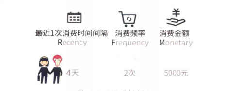

**注意事项：**

- R、F、M指标在不同业务下定义不同，要根据具体业务灵活应用。
- R、F、M按价值如何确定打分的规则。分支一般会1~5分，也可以根据具体业务灵活调整。
- R、F、M这三个指标可以灵活和其他分析方法结合使用。

**总结：**

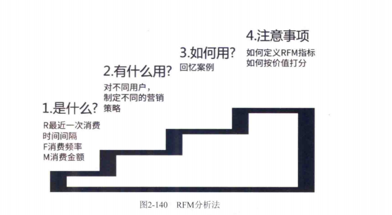

## AARRR模型分析方法

**什么是AARRR模型分析方法？**

AARRR模型对应产品运营的5个重要环节，分别是：

- 获取用户（Acquisition）:用户如何找到我们？
- 激活用户（Activation）:用户的首次体验如何?
- 提高留存（Retention）: 用户会回来吗？
- 增加收入（Revenue）: 如何赚到更多钱？
- 推荐（Referral）: 用户会告诉其他人吗？

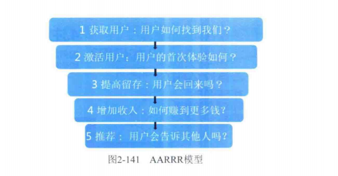

## 漏斗分析方法

从业务流程七点开始到最后目标完成的每个环节都会有用户流失，因此需要一种分析方法来衡量业务流程每一步的转化效率，漏斗分析方法就是这样的分析方法。

**注意事项**

使用漏斗分析方法来分析用户转化问题时，不同行业的业务流程不一样，所以漏斗分析图也不一样。如果把漏斗分析方法原封不动地滴入某个行业，不去结合所在行业的业务特点，那么分析出的结果很难具有业务指导性。

