# task03:HBase

---

（本学习笔记整理自[datawhale-大数据处理技术导论](https://github.com/datawhalechina/juicy-bigdata)，部分内容来自其他相关参考教程）

```md
Life is what you make it.
生活需要自己塑造。

```

## 3.1 NoSQL 简介

NoSQL(NoSQL = Not Only SQL )，意即"不仅仅是SQL"。

在现代的计算系统上每天网络上都会产生庞大的数据量。

这些数据有很大一部分是由关系数据库管理系统（RDBMS）来处理。 1970年 E.F.Codd's提出的关系模型的论文 "A relational model of data for large shared data banks"，这使得数据建模和应用程序编程更加简单。

通过应用实践证明，关系模型是非常适合于客户服务器编程，远远超出预期的利益，今天它是结构化数据存储在网络和商务应用的主导技术。

NoSQL 是一项全新的数据库革命性运动，早期就有人提出，发展至2009年趋势越发高涨。NoSQL的拥护者们提倡运用非关系型的数据存储，相对于铺天盖地的关系型数据库运用，这一概念无疑是一种全新的思维的注入。

### 3.1.1 关系型数据库遵循ACID规则

事务在英文中是transaction，和现实世界中的交易很类似，它有如下四个特性：

1. **A (Atomicity) 原子性**

> 原子性很容易理解，也就是说事务里的所有操作要么全部做完，要么都不做，事务成功的条件是事务里  的所有操作都成功，只要有一个操作失败，整个事务就失败，需要回滚。
> 比如银行转账，从A账户转100元至B账户，分为两个步骤：1）从A账户取100元；2）存入100元至B账户。这两步要么一起完成，要么一起不完成，如果只完成第一步，第二步失败，钱会莫名其妙少了100元。

2. **C (Consistency) 一致性**

> 一致性也比较容易理解，也就是说数据库要一直处于一致的状态，事务的运行不会改变数据库原本的一致性约束。
> 例如现有完整性约束a+b=10，如果一个事务改变了a，那么必须得改变b，使得事务结束后依然满足a+b=10，否则事务失败。

3. **I (Isolation) 独立性**

> 所谓的独立性是指并发的事务之间不会互相影响，如果一个事务要访问的数据正在被另外一个事务修改，只要另外一个事务未提交，它所访问的数据就不受未提交事务的影响。
> 比如现在有个交易是从A账户转100元至B账户，在这个交易还未完成的情况下，如果此时B查询自己的账户，是看不到新增加的100元的。

4. **D (Durability) 持久性**

> 持久性是指一旦事务提交后，它所做的修改将会永久的保存在数据库上，即使出现宕机也不会丢失。

### 3.1.2 RDBMS vs NoSQL

**RDBMS**

- 高度组织化结构化数据
- 结构化查询语言（SQL） (SQL)
- 数据和关系都存储在单独的表中。
- 数据操纵语言，数据定义语言
- 严格的一致性
- 基础事务

**NoSQL**

- 代表着不仅仅是SQL
- 没有声明性查询语言
- 没有预定义的模式
  -键 - 值对存储，列存储，文档存储，图形数据库
- 最终一致性，而非ACID属性
- 非结构化和不可预知的数据
- CAP定理
- 高性能，高可用性和可伸缩性

### 3.1.3 NoSQL 简史

NoSQL一词最早出现于1998年，是Carlo Strozzi开发的一个轻量、开源、不提供SQL功能的关系数据库。

2009年，Last.fm的Johan Oskarsson发起了一次关于分布式开源数据库的讨论[2]，来自Rackspace的Eric Evans再次提出了NoSQL的概念，这时的NoSQL主要指非关系型、分布式、不提供ACID的数据库设计模式。

2009年在亚特兰大举行的"no:sql(east)"讨论会是一个里程碑，其口号是"select fun, profit from real_world where relational=false;"。因此，对NoSQL最普遍的解释是"非关联型的"，强调Key-Value Stores和文档数据库的优点，而不是单纯的反对RDBMS。

### 3.1.4 CAP定理（CAP theorem）

在计算机科学中, CAP定理（CAP theorem）, 又被称作 布鲁尔定理（Brewer's theorem）, 它指出对于一个分布式计算系统来说，不可能同时满足以下三点:

* **一致性(Consistency)** (所有节点在同一时间具有相同的数据)
* **可用性(Availability)** (保证每个请求不管成功或者失败都有响应)
* **分隔容忍(Partition tolerance)** (系统中任意信息的丢失或失败不会影响系统的继续运作)

CAP理论的核心是：一个分布式系统不可能同时很好的满足一致性，可用性和分区容错性这三个需求，最多只能同时较好的满足两个。

因此，根据 CAP 原理将 NoSQL 数据库分成了满足 CA 原则、满足 CP 原则和满足 AP 原则三 大类：

* CA - 单点集群，满足一致性，可用性的系统，通常在可扩展性上不太强大。
* CP - 满足一致性，分区容忍性的系统，通常性能不是特别高。
* AP - 满足可用性，分区容忍性的系统，通常可能对一致性要求低一些。

### 3.1.5 NoSQL的优点/缺点

优点:

* 高可扩展性
* 分布式计算
* 低成本
* 架构的灵活性，半结构化数据
* 没有复杂的关系

缺点:

* 没有标准化
* 有限的查询功能（到目前为止）
* 最终一致是不直观的程序

### 3.1.6 BASE

BASE：Basically Available, Soft-state, Eventually Consistent。 由 Eric Brewer 定义。

CAP理论的核心是：一个分布式系统不可能同时很好的满足一致性，可用性和分区容错性这三个需求，最多只能同时较好的满足两个。

BASE是NoSQL数据库通常对可用性及一致性的弱要求原则:

* Basically Available --基本可用
* Soft-state --软状态/柔性事务。 "Soft state" 可以理解为"无连接"的, 而 "Hard state" 是"面向连接"的
* Eventually Consistency -- 最终一致性， 也是 ACID 的最终目的。

### ACID vs BASE


| ACID                    | BASE                                  |
| ------------------------- | --------------------------------------- |
| 原子性(**A**tomicity)   | 基本可用(**B**asically **A**vailable) |
| 一致性(**C**onsistency) | 软状态/柔性事务(**S**oft state)       |
| 隔离性(**I**solation)   | 最终一致性 (**E**ventual consistency) |
| 持久性 (**D**urable)    |                                       |

### NoSQL 数据库分类


| 类型          | 部分代表                                         | 特点                                                                                                                                 |
| --------------- | -------------------------------------------------- | -------------------------------------------------------------------------------------------------------------------------------------- |
| 列存储        | HbaseCassandraHypertable                         | 顾名思义，是按列存储数据的。最大的特点是方便存储结构化和半结构化数据，方便做数据压缩，对针对某一列或者某几列的查询有非常大的IO优势。 |
| 文档存储      | MongoDBCouchDB                                   | 文档存储一般用类似json的格式存储，存储的内容是文档型的。这样也就有机会对某些字段建立索引，实现关系数据库的某些功能。                 |
| key-value存储 | Tokyo Cabinet / TyrantBerkeley DBMemcacheDBRedis | 可以通过key快速查询到其value。一般来说，存储不管value的格式，照单全收。（Redis包含了其他功能）                                       |
| 图存储        | Neo4JFlockDB                                     | 图形关系的最佳存储。使用传统关系数据库来解决的话性能低下，而且设计使用不方便。                                                       |
| 对象存储      | db4oVersant                                      | 通过类似面向对象语言的语法操作数据库，通过对象的方式存取数据。                                                                       |
| xml数据库     | Berkeley DB XMLBaseX                             | 高效的存储XML数据，并支持XML的内部查询语法，比如XQuery,Xpath。                                                                       |

### 谁在使用

现在已经有很多公司使用了 NoSQL：

* Google
* Facebook
* Mozilla
* Adobe
* Foursquare
* LinkedIn
* Digg
* McGraw-Hill Education
* Vermont Public Radio

## 3.2 HBase 基础

> HBase，Cassandra，CouchDB，Dynamo 和 MongoDB 都是一些存储大量数据和以随机方式访问数据的数据库，这是HDFS和Hive做不到的地方。
>
> HBase 是 Hadoop Database 的简称，Hadoop Database，是一个高可靠性、高性能、面向列、可伸缩的分布式存储系统，利用 HBase 技术可在廉价 PC Server 上搭建起大规模结构化存储集群。
>
> HBase 项目是由 Powerset 公司的 Chad Walters 和 Jim Kelleman 在2006年末发起，根据 Google 的Chang 等人发表的论文"Bigtable：A Distributed Storage System for Strctured Data"来设计的。

### 3.2.1 HBase定义

HBase 是一种分布式、可扩展、支持海量数据存储的 NoSQL 数据库。

### 3.2.2 HBase 数据模型

逻辑上，HBase 的数据模型同关系数据库很类似，数据存储在一张表中，有行有列。

但从HBase的底层物理存储结构（K-V）来看，HBase 更像是一个 `mult-dimensional map`

#### 3.2.2.1 HBase 逻辑结构

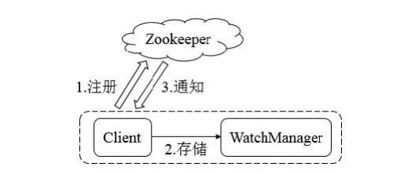

#### 3.2.2.2 HBase物理存储结构

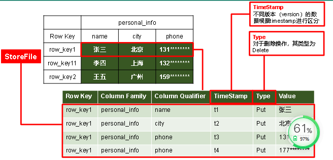

#### 3.2.2.3 数据模型

1. **Name Space**

命名空间，类似于关系数据库的DataBase概念，每个命名空间下有多个表。HBase有两个自带的命名空间，分别是`hbase`和`default`,`hbase`中存放的是HBase 内置的表，`default`表是用户默认使用的命名空间。

2. **Region**

类似于关系型数据库的概念。不同都是，HBase定义表时只需要声明**列族**即可，不需要声明具体的列。这意味着，往HBase写入数据时，字段可以**动态、按需**指定。
因此，和关系数据库相比，HBase能够轻松应对字段变更的场景。

3. **Row**

HBase 表中的每行数据都由一个**RowKey**和多个**Cloumn**(列)组成，数据是按照RowKey的字典顺序存储的，并且查询数据时只能根据RowKey进行检索，
所以RowKey的设计十分重要。

4. **Column**

HBase 中的每个列都由**Column Family(列族)**和**Cloumn Qualifier(列限定符)**进行限定，例如info: name,info:age.建表时，只需指明列族，而列限定符无需预先定义。

5. **Time Stamp**

用于标识数据的不同版本（version）,每条数据写入时，如果不指定时间戳，系统会自动为其加上该字段，其值为写入HBase的时间。

6. **Cell**

由{rowkey,column Family:column Qualifier,time Stamp}唯一确定的单元。cell中的数据是没有类型的，全部是字节码形式存贮。

### 3.2.4 HBase基本架构

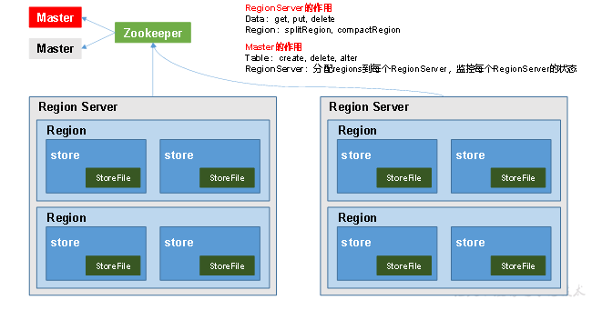

**架构角色：**

1） Region Server

Region Server 为 Region 的管理者，其实现类为**HRegionServer**,主要作用如下：

对于数据的操作：get ,put,delete;

对于Region的操作：spliteRegion,compactRegion。

2）Master

Master 是所有 Region Server的管理者，，其实现类为**RegionServer**，监控每个**RegionServer**的状态，负载均衡和故障转移。

3）Zookeeper

HBase 通过Zookeeper来做Master的高可用、RegionServer的监控、元数据的入口以及集群配置的维护等工作。

4）HDFS

HDFS为HBase提供最终的底层数据存储服务，同时为HBase提供高可用的支持。

## 3.3 Apache HBase 快速入门

HBase官网：http://hbase.apache.org/

### 3.3.1 HBase 单机部署

```
#考虑点：

版本选择 企业常用的：0.96 0.98 1.2.x（推荐） hbase-2.x

兼容问题 hadoop-2.7.7 hbase-1.2.12

依赖环境 HDFS, ZooKeeper, JDK

集群结构 主从架构 Hmaster/Hregionserver

版本选择：不新不旧的稳定兼容的版本

1、JDK-1.8

2、HBase-1.2.x

3、Hadoop-2.7.+

4、zookeeper-3.4.x

2、下载安装包

找到官网下载 hbase 安装包 hbase-1.2.12-bin.tar.gz

http://mirrors.hust.edu.cn/apache/hbase/

对应版本的官方文档：http://hbase.apache.org/1.3/book.html

如果要下载其他的版本：http://archive.apache.org/dist/hbase/
```

#### 3.3.1.1 Zookeeper 正常部署

首先保证Zookeeper集群的正常部署，并启动之：

```shell
[root@hadoop5 bin]# ./zkServer.sh tatus
ZooKeeper JMX enabled by default Using config: /root/install/zookeeper-3.4.14/bin/../conf/zoo.cfg
Usage: ./zkServer.sh {start|start-foreground|stop|restart|status|upgrade|print- cmd}
[root@hadoop5 bin]# ./zkServer.sh status ZooKeeper JMX enabled by default Using config: /root/install/zookeeper-3.4.14/bin/../conf/zoo.cfg
Mode: standalone
```

#### 3.3.1.2 Hadoop正常部署**

Hadoop集群的正常部署并启动：

```shell
root@hadoop5 hadoop-2.7.7]$ sbin/start-dfs.sh
```

#### 3.3.1.3 HBase 的解压

```shell
1. 解压zookeeper和hbaes 
tar -zxvf hbase-1.2.12-bin.tar.gz -C ../install/
```

#### 3.3.1.4 HBase的配置文件

修改HBase对应的配置文件。

1）hbase-xite.xml 修改内容

```shell
<configuration> 
<property>
  <name>hbase.rootdir</name>
  <value>hdfs://hadoop5:8020/hbase</value> 
</property>

 <property>
<name>hbase.cluster.distributed</name> 
<value>true</value> 
</property> 

<property>
<name>hbase.zookeeper.quorum</name> 
<value>hadoop5:2181</value> 
</property> 
</configuration>
```

2）把 hadoop的配置文件core-site.xml和hdfs-site.xml复制到hbase的conf目录

```shell
cp core-site.xml /root/install/hbase-1.2.12/conf/

cp hdfs-site.xml /root/install/hbase-1.2.12/conf/
```

3）jps 查看进程

### 3.3.2 HBase 集群部署


#### 3.3.2.1 解压安装包：

1. 解压安装包：

```
tar -zxvf hbase-1.2.12-bin.tar.gz -C ../install/ 
```

2. 修改配置文件：hbase-env.sh

```
cd /root/install/hbase-1.2.12/conf/

vi hbase-env.sh 
```

修改两个两地方：

```
export JAVA_HOME=/root/install/jdk1.8.0_65 #表示修改为自己的jdk目录 

export HBASE_MANAGES_ZK=false #默认为true，改为false，表示不用自带的 
```

zookeeper

3. 修改集群配置文件：hbase-site.xml

增加以下配置：

```
<configuration> 

<property>

<!-- 指定hbase表数据在HDFS上存储的根路径 -->

<name>hbase.rootdir</name> 

<value>hdfs://hadoop1:8020/hbase</value> 

</property> 

<property>

<!-- 指定hbase是分布式的集群模式 -->

<name>hbase.cluster.distributed</name> 

<value>true</value> 

</property> 

<property>

<!-- 指定zookeeper的地址，多个用","分割 -->

<name>hbase.zookeeper.quorum</name> 

<value>hadoop1:2181,hadoop2:2181,hadoop3:2181</value> 

</property> 

</configuration> 
```

5. 修改regionservers

```
执行命令：vi regionservers 

hadoop1 

hadoop2 

hadoop3
```

6. 在conf下创建backup-masters

```
touch backup-masters 
```

然后往文件中增加如下内容，配置你的backup master节点

```
hadoop3 
```

7. 拷贝hadoop的核心配置文件过来

最重要一步，要把hadoop的hdfs-site.xml和core-site.xml放到hbase-1.2.6/conf下，如果不是HA的

Hadoop集群，那可以不拷贝

```
cp core-site.xml hdfs-site.xml ~/install/hbase-1.2.12/conf/
```

8. 分发安装包到各节点，注意安装路径要一样！

```
scp -r hbase-1.2.12 root@hadoop2:/root/install 

scp -r hbase-1.2.12 root@hadoop2:/root/install 
```

9. 同步服务器时间

HBase集群对于时间的同步要求的比HDFS严格，所以，集群启动之前千万记住要进行时间同步，要求相差不要

超过30s，这个操作，我们最开始在准备集群的时候，就应该已经做了

在三台节点都执行如下命令：

```
yum install -y ntpdate 

ntpdate -u ntp.api.bz 
```

10. 配置环境变量

```
export HBASE_HOME=/home/bigdata/apps/hbase-1.2.12 

export PATH=$PATH:$HBASE_HOME/bin 
```

11. 启动（顺序别搞错了）

保证ZooKeeper集群和HDFS集群启动正常的情况下启动HBase集群

1、先启动zookeeper集群

```
zkServer.sh start 
```

2、启动hdfs集群

```
start-dfs.sh 
```

3、启动hbase

```
start-hbase.sh 
```

查看启动是否正常，是否成功

检查各进程是否启动正常

主节点和备用节点都启动hmaster进程

各从节点都启动hregionserver进程

12 通过访问浏览器页面：http://192.168.72.133:16010

13. 如果有节点相应的守护进程没有启动，那么可以手动启动

```
hbase-daemon.sh start master 

hbase-daemon.sh start regionserver
```

## 3.4 HBase Shell操作

### 3.4.1 命令说明


| hbase shell命令 | 描述                                                                   |
| ----------------- | ------------------------------------------------------------------------ |
| alter           | 修改列族（column family）模式                                          |
| count           | 统计表中行的数量                                                       |
| create          | 创建表                                                                 |
| describe        | 显示表相关的详细信息                                                   |
| delete          | 删除指定对象的值（可以为表，行，列对应的值，另外也可以指定时间戳的值） |
| deleteall       | 删除指定行的所有元素值                                                 |
| disable         | 使表无效                                                               |
| drop            | 删除表                                                                 |
| enable          | 使表有效                                                               |
| exists          | 测试表是否存在                                                         |
| exit            | 退出hbase shell                                                        |
| get             | 获取行或单元（cell）的值                                               |
| incr            | 增加指定表，行或列的值                                                 |
| list            | 列出hbase中存在的所有表                                                |
| put             | 向指向的表单元添加值                                                   |
| tools           | 列出hbase所支持的工具                                                  |
| scan            | 通过对表的扫描来获取对用的值                                           |
| status          | 返回hbase集群的状态信息                                                |
| shutdown        | 关闭hbase集群(与exit不同)                                              |
| truncate        | 重新创建指定表                                                         |
| version         | 返回hbase版本信息                                                      |

### 3.4.2 基本操作

#### 3.4.2.1 基本操作

**进入H****B****ase客户端命令行**

```shell
bin/hbase shell
```

**查看帮助命令**

````shell
help
````

**查看当前数据库中有那些表**

```shell
list
```

#### 3.4.2.2 表的操作

创建表，其中t1是表名，f1、f2是t1的列族。hbase中的表至少有一个列族.它们之中，列族直接影响 hbase数据存储的物理特性。

语法：`create <table>, {NAME => <family>, VERSIONS => <VERSIONS>}`

例如：创建表t1，有两个family name：f1，f2，且版本数均为2

```
create 't1',{NAME => 'f1', VERSIONS => 2},{NAME => 'f2', VERSIONS => 2}

create 'customer',{NAME=>'addr'},{NAME=>'order'}
```

list ： 查询所有表

查看表结构

```
desc 'customer'
customer1

COLUMN FAMILIES DESCRIPTION
 {NAME => 'addr', BLOOMFILTER => 'ROW', VERSIONS => '1', IN_MEMORY => 'false', KEEP_DELETED_CELLS => 'FAL SE', DATA_BLOCK_ENCODING => 'NONE', TTL => 'FOREVER', COMPRESSION => 'NONE', MIN_VERSIONS => '0', BLOCKC ACHE => 'true', BLOCKSIZE => '65536', REPLICATION_SCOPE => '0'} 
 
 {NAME => 'order', BLOOMFILTER => 'ROW', VERSIONS => '1', IN_MEMORY => 'false', KEEP_DELETED_CELLS => 'FA LSE', DATA_BLOCK_ENCODING => 'NONE', TTL => 'FOREVER', COMPRESSION => 'NONE', MIN_VERSIONS => '0', BLOCK CACHE => 'true', BLOCKSIZE => '65536', REPLICATION_SCOPE => '0'}
```

插入数据

```
put 'customer','jsmith','addr:city','wuhan' 
put 'customer','jsmith','addr:state','hubei' 
put 'customer','jsmith','order:numb','1111' 
put 'customer','jsmith','order:date','2019-1-1'
```

查询数据

```
get 'customer','jsmith' 
get 'customer','jsmith','addr' 
get 'customer','jsmith',{COLUMNS=>['addr']} 
get 'customer','jsmith',{COLUMNS=>['addr:city']} 
put 'customer','jsmith','order:numb','2222' 
get 'customer','jsmith',{COLUMNS=>['order:numb']}
```

保留多个版本的值

```
alter 'customer', {NAME=>'order', VERSIONS=>5} 
alter 't1', {NAME=>'f1', VERSIONS=>3}
```

插入多个值

```
put 'customer','jsmith','order:numb','3333' 
put 'customer','jsmith','order:numb','4444' 
put 'customer','jsmith','order:numb','5555' 
put 'customer','jsmith','order:numb','6666' 
put 'customer','jsmith','order:numb','7777'
```

全表扫描(一般不会做)：`scan 'customer' `

查询记录数，查询的是rowKey的记录。`count 'customer`

查询order:numb第二个版本号的值

```
get 'customer','jsmith',{COLUMN=>'order:numb',VERSIONS=>3}
```

查询rowKey 开始包含j or 结束包含t的显示出来

```
scan 'customer',{STARTROW => 'j', STOPROW => 't'}
```

删除数据。

```
disable 'customer'
delete 'customer','jsmith','addr:city'
deleteall 'customer','jsmith'
```

清空表数据

```
truncate 'customer'
```

删除表

```
drop 'customer'
```

## 3.5 HBase 进阶

### 3.5.1  架构原理

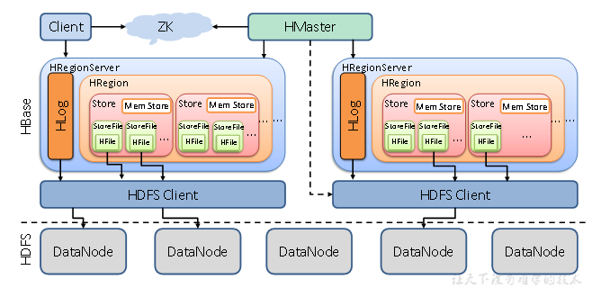

1） StoreFile

保存实际数据的物理文件，StoreFile以HFile的形式存储在HDFS上。每个Store会有一个或多个StoreFile(HFile)，数据在每个StoreFile中都是有序的。

2）MemStore

写缓存，由于HFile中的数据要求是有序的，所以数据是有先存储在MemStore中，排好序后，等到达刷写时机才会刷写到HFile,每次刷写都会形成一个新的HFile。

3）WAL

由于数据要经MemStore排序后才能刷写到HFile，但把数据保存在内存中会有很高的概率导致数据丢失，为了解决这个问题，数据会写在一个叫做Write-Ahead logfile的文件中，然后再写MemStore中。所以在系统出现故障的时候，数据可以通过这个日志文件重建。

### 3.5.2 写流程

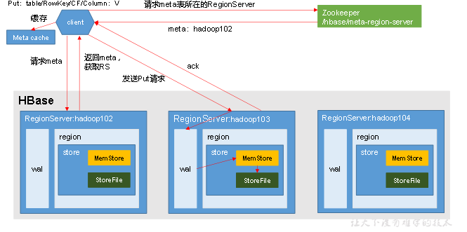

**写流程**

1）client 先访问zookeepr,获取hbase:meta表位于哪个Region Server。

2）访问对应的Region Server,获取hbase:meta表，根据读物请求的namespace:table/rowkey,查询出目标数据位于哪个Region Server 中的哪个Region中。并将该table的region信息以及meta表的位置信息缓存在客户端的meta cache,方便下次访问。

3）与目标Region Server进行通讯；

4）将数据顺序写入（追加）到WAL；

5）将数据写入对应的MemStore，数据会在MemStore进行排序；

6）向客户端发送ack；

7）等达到MemStore的刷写时机后，将数据刷写到HFile。

### 3.5.3 MemStore Flush

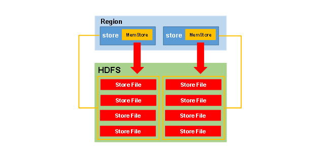

**MemStore刷写时机：**

1.当某个memstroe的大小达到了 **hbase.hregion.memstore.flush.size（默认值128M）** ，其所在region的所有memstore都会刷写。

当memstore的大小达到了

**hbase.hregion.memstore.flush.size（默认值128M）**

***hbase.hregion.memstore.block.multiplier** **（默认值4）**

时，会阻止继续往该memstore写数据。

2.当region server中memstore的总大小达到

**java_heapsize**

***hbase.regionserver.global.memstore.size**  **（默认值0.4** **）**

**hbase.regionserver.global.memstore.size.lower.limit**  **（默认值0.95）** ，

region会按照其所有memstore的大小顺序（由大到小）依次进行刷写。直到region server中所有memstore的总大小减小到上述值以下。

当region server中memstore的总大小达到

**java_heapsize**

***hbase.regionserver.global.memstore.size**  **（默认值0.4** **）**

时，会阻止继续往所有的memstore写数据。

3. 到达自动刷写的时间，也会触发memstore flush。自动刷新的时间间隔由该属性进行配置 **hbase.regionserver.optionalcacheflushinterval**  **（默认1小时）** 。
4. 当WAL文件的数量超过 **hbase.regionserver.max.logs** ，region会按照时间顺序依次进行刷写，直到WAL文件数量减小到**hbase.regionserver.max.log**以下（该属性名已经废弃，现无需手动设置，最大值为32）。

### 3.5.4 读流程

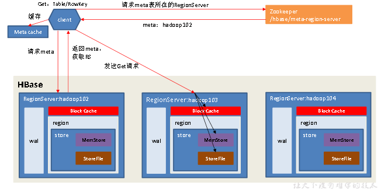

**读流程**

1）Client先访问zookeeper，获取hbase:meta表位于哪个Region Server。

2）访问对应的Region Server，获取hbase:meta表，根据读请求的namespace:table/rowkey，查询出目标数据位于哪个Region Server中的哪个Region中。并将该table的region信息以及meta表的位置信息缓存在客户端的meta cache，方便下次访问。

3）与目标Region Server进行通讯；

4）分别在Block Cache（读缓存），MemStore和Store File（HFile）中查询目标数据，并将查到的所有数据进行合并。此处所有数据是指同一条数据的不同版本（time stamp）或者不同的类型（Put/Delete）。

5） 将从文件中查询到的数据块（Block，HFile数据存储单元，默认大小为64KB）缓存到Block Cache。

6）将合并后的最终结果返回给客户端。

### 3.5.5 StoreFile Compaction

由于memstore每次刷写都会生成一个新的HFile，且同一个字段的不同版本（timestamp）和不同类型（Put/Delete）有可能会分布在不同的HFile中，因此查询时需要遍历所有的HFile。

为了减少HFile的个数，以及清理掉过期和删除的数据，会进行StoreFile Compaction。

Compaction分为两种，分别是Minor Compaction和Major Compaction。Minor Compaction会将临近的若干个较小的HFile合并成一个较大的HFile，但**不会**清理过期和删除的数据。Major Compaction会将一个Store下的所有的HFile合并成一个大HFile，并且**会**清理掉过期和删除的数据。

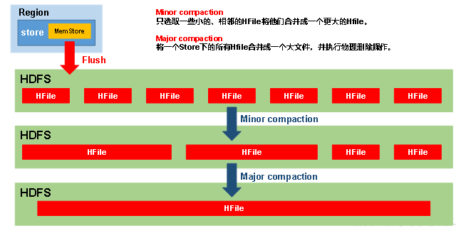

### 3.5.6 Region Split

默认情况下，每个Table起初只有一个Region，随着数据的不断写入，Region会自动进行拆分。刚拆分时，两个子Region都位于当前的Region Server，但处于负载均衡的考虑，HMaster有可能会将某个Region转移给其他的Region Server。

Region Split时机：

1.当1个region中的某个Store下所有StoreFile的总大小超过hbase.hregion.max.filesize，该Region就会进行拆分（0.94版本之前）。

2.当1个region中的某个Store下所有StoreFile的总大小超过Min(R^2 * "hbase.hregion.memstore.flush.size",hbase.hregion.max.filesize")，该Region就会进行拆分，其中R为当前Region Server中属于该Table的个数（0.94版本之后）。

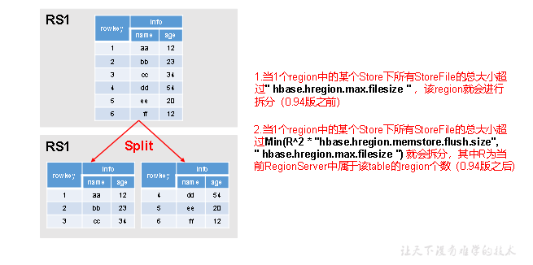

## 3.6 HBase 编程实战

### 3.6.1 实验一：HBase的安装部署和使用

#### 3.6.1.1 实验准备

**实验环境：**Linux Ubuntu 22.04  **  **
**前提条件：**

1. **完成Java运行环境部署（详见第2章Java安装）**
2. **完成Hadoop 3.3.1的单点部署（详见第2章安装单机版Hadoop）**

#### 3.6.1.2 实验步骤

1. 启动Hadoop的HDF相关进程

   ```shell
   datawhale@datawhale001:/opt$ sudo mv /opt/hbase-2.4.8/ /opt/hbase
   datawhale@datawhale001:/opt$ sudo chown -R datawhale:datawhale /opt/hbase/
   datawhale@datawhale001:sudo tar -zxvf /data/hadoop/hbase-2.4.8-bin.tar.gz -C /opt/

   ....省略

   datawhale@datawhale001:~$ cd /opt
   datawhale@datawhale001:/opt$ ls
   google  hadoop  hbase-2.4.8  java  spark
   datawhale@datawhale001:/opt$ sudo mv /opt/hbase-2.4.8/ /opt/hbase
   datawhale@datawhale001:/opt$ sudo chown -R datawhale:datawhale /opt/hbase/
   
   ```
   
配置HBASE_HOME环境变量

```shell
sudo vim /etc/profile
```
在文件末尾，添加如下内容：
```shell
# hbase
export HBASE_HOME=/opt/hbase
export PATH=$PATH:$HBASE_HOME/bin
```
&emsp;&emsp;使用`Shift+:`，输入`wq`后回车，保存退出。运行下面命令使环境变量生效：
```shell
source /etc/profile
```
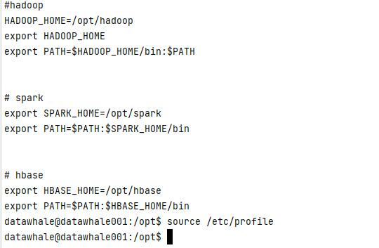

4.修改hbase-site.xml配置文件

```shell
sudo vim /opt/hbase/conf/hbase-site.xml
```
emsp;&emsp;添加下面配置到`<configuration>与</configuration>`标签之间，添加内容如下：
```shell
<configuration>
    <property>
        <name>hbase.cluster.distributed</name>
        <value>true</value>
    </property>
    <property>
        <name>hbase.zookeeper.property.dataDir</name>
        <value>/opt/hadoop/zookeeper</value>
    </property>
    <property>
        <name>hbase.rootdir</name>
        <value>hdfs://datawhal001:9000/hbase</value>
    </property>
    <property>
        <name>hbase.unsafe.stream.capability.enforce</name>
        <value>false</value>
    </property>
</configuration>
```
&emsp;使用`Shift+:`，输入`wq`后回车，保存并退出。

5.修改hbase-env.sh配置文件
```shell
sudo vim /opt/hbase/conf/hbase-env.sh
```
&emsp;&emsp;配置`JAVA_HOME`，`HBASE_CLASSPATH`，`HBASE_MANAGES_ZK`。`hbase-env.sh`中本来就存在这些变量的配置，大家只需要删除前面的`#`并修改配置内容即可(`#`代表注释)，或者直接在文件中增加以下内容：

```shell
&emsp;&emsp;配置`JAVA_HOME`，`HBASE_CLASSPATH`，`HBASE_MANAGES_ZK`。`hbase-env.sh`中本来就存在这些变量的配置，大家只需要删除前面的`#`并修改配置内容即可(`#`代表注释)，或者直接在文件中增加以下内容：
```
emsp;&emsp;使用`Shift+:`，输入`wq`后回车，保存并退出。

6.启动hadoop

```shell
cd /opt/hadoop/sbin/
./start-all.sh
```
&emsp;&emsp;执行`jps`命令检查`hadoop`是否启动成功，出现了6个进程，则表示正常启动，可以得到如下类似结果：
```shell
datawhale@datawhale001:/opt/hadoop/sbin$ jps
63459 Jps
34755 DataNode
35253 SecondaryNameNode
20634 ResourceManager
34572 NameNode
36205 NodeManager

```

7. 启动HBase  

&emsp;启动HBase，命令如下：
```shell
cd /opt/hbase/bin/
start-hbase.sh
```
&emsp;执行`jps`命令检查HBase是否启动成功，新增了3个进程（`HQuorumPeer`、`HMaster`和`HRegionServer`），则表示正常启动，可得到如下类似结果：

```shell
78625 HQuorumPeer
34755 DataNode
35253 SecondaryNameNode
92425 Jps
20634 ResourceManager
91819 HMaster
92027 HRegionServer
34572 NameNode
36205 NodeManager
```
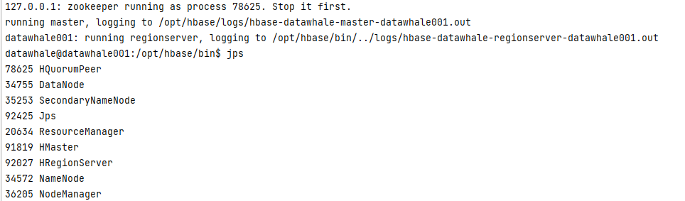


**注意事项：Tips：**

- 如果HMaster启动后瞬间消失，请查看`/opt/hbase/logs`日志文件。  一般为 hbase  的 `cat /opt/hbase/conf/hbase-site.xml` 和 hadoop 的`cat /opt/hadoop/etc/hadoop/core-site.xml` 中的hdfs的路径不匹配，修改一致即可。
 > -- 已验证
- 如果出现`connection failed`，注意虚拟机环回IP的通信问题以及防火墙是否关闭！！！

1. 关闭防火墙  
   ⚠ 如果熟悉Linux操作，可以不用关闭防火墙，只需要开放9000端口就行。但是为了避免这类问题，建议直接关闭防火墙，命令如下：

```shell
systemctl disable firewalld.service
```

2. 修改`/etc/hosts`文件  
   &emsp;&emsp;打开`/etc/hosts`文件，命令如下：

   ```shell
   sudo vim /etc/hosts
   ```

   &emsp;&emsp;在文件中添加以下内容：

   ```
   127.0.1.1 虚拟机的名称
   ```

   &emsp;&emsp;使用`Shift+:`，输入`wq`后回车，保存并退出。

3. 修改`/opt/hbase/conf/regionservers`文件，打开`/opt/hbase/conf/regionservers`文件，命令如下：

   ```shell
   vim /opt/hbase/conf/regionservers
   ```

   &emsp;&emsp;在文件中添加以下内容：

   ```shell
   <虚拟机的名称>
   ```

✅**官方HBase安装指南**：[HBase伪集群分布安装](https://hbase.apache.org/book.html#quickstart_pseudo)

**tips:**

```
1. HBase报错ERROR: KeeperErrorCode = NoNode for /hbase/master
解答： 
https://blog.csdn.net/Y_6155/article/details/110455338 
https://blog.csdn.net/haiyan09/article/details/99863987
```
## 3.7 参考资料

1. 尚硅谷大数据之HBase
2. https://www.runoob.com/mongodb/nosql.html

