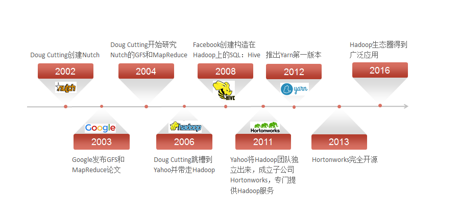
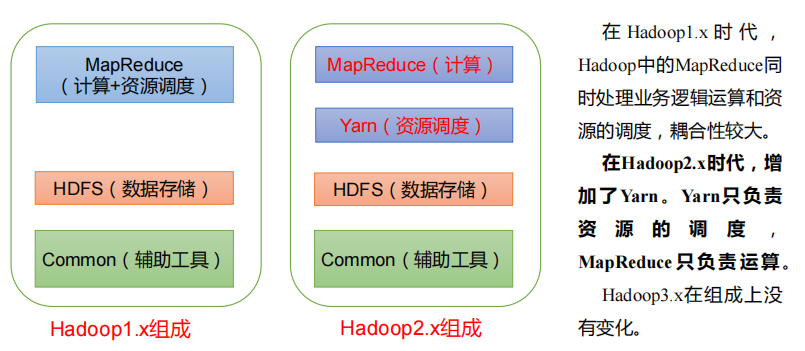
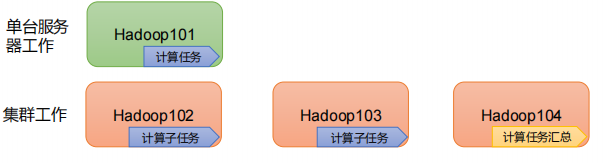
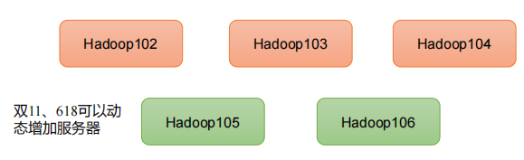
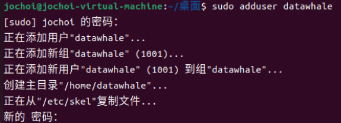
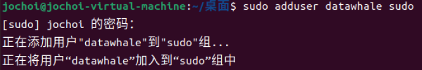
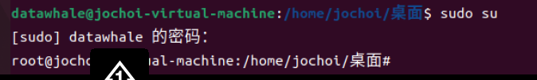

# 第二章 大数据处理架构Hadoop

---

（本学习笔记整理自[datawhale-大数据处理技术导论](https://github.com/datawhalechina/juicy-bigdata)，部分内容来自其他相关参考教程）

```md
Life is what you make it.
生活需要自己塑造。

```

---

> 1） Hadoop是一个由Apache基金会所开发的"分布式系统基础框架"。
> 2） 主要解决，海量数据的**存储**和海量数据的**分析计算**问题。
> 3） 广义上来说，Hadoop通常是指一个更广泛的概念 --- **Hadoop生态圈**。

## 2.0 Hadoop的发展阶段:id=2-0



**Hadoop 三大发行版本 :**  Apache、Cloudera、Hortonworks

- Apache 版本最原始（最基础）的版本，对于入门学习最适合。 - 始于2006年
- Cloudera版本内部集成了很多大数据框架，对应产品**CDH** - 始于2008
- Hortonworks版本文档较好，对应产品**HDP** - 始于2011年
- Hortonworks现在已经被Cloudera公司收购，推出新的品牌**CDP** 。

1） **Apache Hadoop**

官网地址：http://hadoop.apache.org

下载地址：https://hadoop.apache.org/releases.html

**2**）**Cloudera Hadoop**

官网地址：https://www.cloudera.com/downloads/cdh

下载地址：https://docs.cloudera.com/documentation/enterprise/6/release-notes/topics/rg_cdh_6_download.html

（1）2008 年成立的 Cloudera 是最早将 Hadoop 商用的公司，为合作伙伴提供 Hadoop 的

商用解决方案，主要是包括支持、咨询服务、培训。

**（2）2009**年 **Hadoop** **的创始人** **Doug Cutting** **也加盟** **Cloudera** **公司**。Cloudera 产品主

要为 CDH，Cloudera Manager，Cloudera Support

（3）CDH 是 Cloudera 的 Hadoop 发行版，完全开源，比 Apache Hadoop 在兼容性，安

全性，稳定性上有所增强。Cloudera 的标价为每年每个节点 **10000** **美元**。

（4）Cloudera Manager 是集群的软件分发及管理监控平台，可以在几个小时内部署好一

个 Hadoop 集群，并对集群的节点及服务进行实时监控。

**3）Hortonworks Hadoop**

官网地址：https://hortonworks.com/products/data-center/hdp/

下载地址：https://hortonworks.com/downloads/#data-platform

（1）2011 年成立的 Hortonworks 是雅虎与硅谷风投公司 Benchmark Capital 合资组建。

**（**2）公司成立之初就吸纳了大约**25** **名至** **30** **名专门研究** **Hadoop** **的雅虎工程师，上述工程师均在 2005 年开始协助雅虎开发Hadoop，贡献了 **Hadoop80%的代码。

（3）Hortonworks 的主打产品是 Hortonworks Data Platform（HDP），也同样是 100%开源的产品，HDP 除常见的项目外还包括了 **Ambari**，一款开源的安装和管理系统。

（4）2018 年 Hortonworks 目前**已经被** **Cloudera** **公司收购**


**Hadoop的不同版本：**

Hadoop-0.x # 古老的Hadoop，连YARN都没有，现在应该没有任何企业还在使用这么古老的Hadoop了
hadoop-1.x # 基本淘汰的Hadoop版本。不用考虑
hadoop-2.x # 现阶段主流的使用版本。比如Hadoop-2.6.5， hadoop-2.7.7， hadoop-2.8.5，支持两个NameNode提供HA功能Active NameNode和Standby NameNode 。前者负责对外提供服务，后者作为前者的热备节点，它们通过一个共享的存储结构--QJM(Quorum Journal Manager)实现数据同步。
hadoop-3.x # 在Hadoop2.0基础改动项主要是围绕提高系统的可扩展性和资源利用率上。为YARN提供了Federation，是其规模可达到上万台，还为NameNode提供了多个Standby NameNode。HDFS增加了纠错码副本策略，可以提高存储资源的利用率。为YARN新增了Node Attribute功能，并且新增了Hadoop Ozone (一种对象存储方案，缓解HDFS集群中小文件的问题，)和 Hadoop Submarine(机器学习引擎，可使TensorFlow或Pytorch运行在Yarn中)。

**Hadoop1.x、2.x、3.x的区别：**



## 2.1 概述:id=2-1

### 2.1.1 Hadoop简介

- Hadoop是Apache软件基金会旗下的一个开源分布式计算平台
- Hadoop是基于Java语言开发的，具有很好的跨平台特性，并且可以部署在廉价的计算机集群中。

- Hadoop的核心是分布式文件系统HDFS（Hadoop Distributed File System）和MapReduce。

  ```
  - HDFS是对谷歌文件系统(Google File System，GFS）的开源实现，是面向普通硬件环境的分布式文件系统，具有较高的读写速度、很好的容错性和可伸缩性，支持大规模数据的分布式存储，其冗余数据存储的方式，很好地保证了数据的安全性。
  - MapReduce是针对谷歌MapReduce的开源实现，允许用户在不了解分布式系统底层细节的情况下开发并行应用程序，采用MapReduce来整合分布式文件系统上的数据，可保证分析和处理数据的高效性。借助于Hadoop，程序员可以轻松地编写分布式并行程序，可将其运行于廉价计算机集群上，完成海量数据的存储与计算。
  ```

  

Hadoop 几个基础模块：

- **Common:** 支持其他模块的公用工具包,它主要包括**configuration、FileSystem、远程调用包RPC、用于指标检测的jmx和metrics包，以及串行化库等其他**。
- **HDFS:**  一个可高吞吐访问应用数据的分布式文件系统,HAFS的设计场景是一次写入，多次读取。HDFS具有处理超大数据、流式处理、高度容错性，能够自动检测和应对硬件故障，并可以运行在廉价商用服务器上等优点。
- **YARN:** 从JobTracker的资源管理功能中独立出来，用于作业调度和资源管理的框架。一个管理集群服务器资源和任务调度的框架。
- **MapReduce:** 基于Yarn对大数据集进行并行计算的系统，将整个计算过程分为Map和reduce两个任务。map任务从输入的数据集中读取数据，并对取出的数据进行指定的逻辑处理，然后生成键值对形式的中间结果，并将该结果写入本地磁盘。reduce任务从map任务输出的中间结果中读取相应的键值对，然后进行聚合处理，最后输出结果。

​    mapreduce主要用于对大规模进行离线计算。一个完整的mapreduce作业由n个map任务和M个reduce任务组成，处于对性能优化的考虑，n>m 。另外，对于某些特定的场景，可以对map任务使用的combiner个数进行优化以减少它的输出数据。至于reduce任务要读取哪些数据，这是由map任务的分区策略决定的，默认是散列分区策略，也可以根据需要自定义。

- Hadoop Ozone 。专门为Hadoop 设计的，有HDDS (hadoop Distributed Data Store)构建成的可扩展的分布式对象存储系统。
- Hadoop Submarine 一个机器学习引擎，可以运行TensorFlow,pytorch,mxnet等框架。


### 2.1.2 Hadoop的特性

Hadoop的特性：

- **高可靠性：** 采用冗余数据存储方式，即使一个副本发生故障，其他副本也可以保证正常对外提供服务。Hadoop按位存储和处理数据的能力，值得人们信赖。

  
- **高效性：** 在MapReduce的思想下，Hadoop作为**并行分布式计算平台**采用分布式存储和分布式处理两大核心技术，能够高效地处理PB级数据。Hadoop能够在节点之间动态地移动数据，并保证各个节点的动态平衡，因此处理速度非常快。
- **高可扩展性：** Hadoop的设计目标是可以高效稳定地运行在廉价的计算机集群上，可以扩展到数以千计的计算机节点。
  
- **高容错性：** 采用冗余数据存储方式，自动保存数据的多个副本，并且**能够自动将失败的任务进行重新分配**。

  
- **成本低：** Hadoop采用廉价的计算机集群，成本较低，普通用户也很容易用自己的PC上搭建Hadoop运行环境，与一体机、商用数据仓库以及QlinkView、Yonghong Z-Suit等数据集相比，Hadoop是开源的，项目的软件成本因此会大大降低。
- **运行在Linux平台上：** Hadoop是基于Java语言开发的，可以较好地运行在Linux平台上。
- **支持多种编程语言：** Hadoop上的应用程序也可以使用其他语言编写，如C++.

### 2.1.3 Hadoop的应用现状

- **国外应用：** Yahoo、Facebook等大厂
- **国内应用：** 百度、阿里巴巴、腾讯、华为等大厂

### 2.1.4 Hadoop的项目架构:id=2-2


- **HBase:** 一个提供高可靠性、高性能、可伸缩、实时读写和分布式的列式数据库.HBase是一个适合于非结构化数据存储的数据库,HBase是基于列而不是基于行的存储模式，HBase主要用于需要随机访问、实时读写的大数据（Big Data）。
- **pig:** Pig是一种数据流语言和运行环境，适合于使用Hadoop和MapReduce的平台来查询大型半结构化数据集，
- **Sqoop:** 主要用来在Hadoop和关系数据库之间交换数据,Sqoop可以改进数据的互操作性。通过JDBC（Java DataBase Connectivity）与关系数据库进行交互理论上，支持JDBC的关系数据库都可以用Sqoop与Hadoop进行数据交互。
- **Chukwa：** Chukwa是开源的数据收集系统，用于监控和分析大型分布式系统的数据。
- **Zookeeper：** Zookeeper是一个为分布式应用所涉及的开源协调服务，主要为用户提供同步、配置管理、分组和命名等服务，减轻分布式应用程序所承担的协调任务，Zookeeper的文件系统使用了我们所熟悉的目录树结构，Zookeeper是主要使用Java语言编写，同时支持C语言。

## 2.2 阅读Hadoop源码


## 2.3 实验一：Hadoop3.3.1伪分布式安装 :id=2-3

### 2.3.1 集群规划

Hadoop集群的几种模式。

```md
伪分布式
分布式
高可用
联邦集群
```

主要有这么四种，企业中搭建的 Hadoop 集群都是**高可用的分布式集群**！

所以这里讲一下Hadoop集群的规划主要针对Hadoop分布式集群来进行说明。

一台服务器：伪分布式


| 节点名称 | Hadoop                                  | YARN                             |
| ---------- | ----------------------------------------- | ---------------------------------- |
| bigdate2 | NameNode + DataNode + SecondaryNamenode | ResouceManager+<br />NodeManager |

三台服务器：


| 节点名称 | Hadoop                       | YARN                                   |
| ---------- | ------------------------------ | ---------------------------------------- |
| bigdate2 | NameNode + DataNode 主节点   | NodeManager                            |
| bigdate3 | DataNode + SecondaryNamenode | NodeManager                            |
| bigdate4 | DataNode                     | ResouceManager主节点+<br />NodeManager |

四台服务器：


| 节点名称 | Hadoop                       | YARN           |
| ---------- | ------------------------------ | ---------------- |
| bigdate2 | NameNode                     | NodeManager    |
| bigdate3 | DataNode + SecondaryNamenode | NodeManager    |
| bigdate4 | DataNode                     | NodeManager    |
| bigdate4 | DataNode                     | ResouceManager |

如果有更多的服务器，那么可以按需分配集群角色。实际企业中，一般会将单独性能较好的机器作为集群的主节点。我们在这儿把HDFS和YARN集群的主节点分开安装的不同的节点，主要是为了降低个节点的压力。毕竟我们使用的是虚拟机呀。当然，也可以调整把他们安装在同一个节点。

### 2.3.2 集群安装

刚才讲集群规划的时候，提到了四种安装模式。

```md
伪分布式 # 主要用来测试学习，搭建快速 
分布式 # 正儿八经的分布式集群。用来了解集群的工作机制，用于正儿八经的企业生产 
高可用 # 现阶段流行的主要集群模式。因为避免Hadoop的SPOF问题。提高集群的可用性。 
联邦集群 # 一些超大型企业可以使用的模式。主要为了应对超大规模的数据量对集群的主节点造 成的压力。
```

#### 2.3.3 伪分布式安装

<nav>
<a href="#一前置条件">一、前置条件</a><br/>
<a href="#二配置-SSH-免密登录">二、配置 SSH 免密登录</a><br/>
<a href="#三HadoopHDFS环境搭建">三、Hadoop(HDFS)环境搭建</a><br/>
<a href="#四HadoopYARN环境搭建">四、Hadoop(YARN)环境搭建</a><br/>
</nav>
首先我们搭建`window10+wmware15+ubuntu20.04`环境  (`考虑到wsl兼容的话，需要wmware15.5.1以上版本`)

**大数据组件地址：**

链接：https://pan.baidu.com/s/1-wVNYd1rdF9EPxcVatZMGQ?pwd=bdag 
提取码：bdag 
复制这段内容后打开百度网盘手机App，操作更方便哦

**Windows：**

**系统镜像下载链接：**[https://mirror.bjtu.edu.cn/ubuntu-releases/22.04.1/ubuntu-22.04.1-desktop-amd64.iso](https://mirror.bjtu.edu.cn/ubuntu-releases/22.04.1/ubuntu-22.04.1-desktop-amd64.iso)

**✅参考教程：**[2020最新版VMware安装Ubuntu20.04教程(巨细)！](https://zhuanlan.zhihu.com/p/141033713)

**Mac：**

**下载VMware：**[https://customerconnect.vmware.com/cn/downloads/get-download?downloadGroup=FUS-PUBTP-2021H1](https://customerconnect.vmware.com/cn/downloads/get-download?downloadGroup=FUS-PUBTP-2021H1)

**系统镜像下载链接：**[http://old-releases.ubuntu.com/releases/22.04/ubuntu-22.04-live-server-arm64.iso](http://old-releases.ubuntu.com/releases/22.04/ubuntu-22.04-live-server-arm64.iso)

**✅参考教程：**[Mac M1芯片 安装vmware 和ubuntu 以及换源全过程](https://blog.csdn.net/nuomituansama/article/details/125909957)

**🔑**：教程以Windows版为主，Mac版后续操作可能略有不同，自行百度,具体搭建见参考教程。

> 注意：
> Ubuntu的默认root密码是随机的，即每次开机都有一个新的root密码。可以在终端输入命令 sudo passwd，然后输入当前用户的密码，终端会提示输入新的密码并确认，此时的密码就是root新密码。修改成功后，输入命令 su root，再输入新的密码就ok了。
>
> 另传输文件失败，可以查看这个链接：[解决XShell无法连接Ubuntu中的root用户](https://blog.csdn.net/zhanshixiang/article/details/104348192)

接下来我们正式进入hadoop的搭建工作：

**环境：**Linux Ubuntu 22.04**要求：**在Linux系统的虚拟机上安装Hadoop软件，基本安装配置主要包括以下几个步骤：

1. 创建Hadoop用户
2. 安装Java
3. 设置SSH登录权限。
4. 单机安装配置。
5. 伪分布式安装配置。

#### 1. 创建Hadoop用户

** ** **创建用户的命令是**`adduser`：会自动为创建的用户指定主目录、系统shell版本，会在创建时输入用户密码。

```shell
sudo adduser datawhale # 创建datawhale用户  我设置的密码为：datawhale
```



输入`sudo adduser datawhale sudo`,给用户'datawhale'赋予管理员'sudo'权限

```shell
sudo adduser datawhale sudo
```



&emsp;&emsp;切换用户为`datawhale`用户，在该用户环境下进行操作。

```shell
su datawhale # 切换到datawhale用户
```


输入sudo su查看添加管理员权限是否成功，成功下如图所示



#### 2. **安装 Hadoop 的运行依赖 JDK**

> **JDK 版本**：jdk 1.8.0_20

**注意：课程里默认是把安装包下载到`/data/hadoop`文件夹下，并解压到`/opt`下**

1. 下载并解压

在[官网](https://www.oracle.com/technetwork/java/javase/downloads/index.html) 下载所需版本的 JDK，这里我下载的版本为[JDK 1.8](https://www.oracle.com/technetwork/java/javase/downloads/jdk8-downloads-2133151.html) ,下载后进行解压：


将`/data/hadoop`目录下`jdk-8u311-linux-x64.tar.gz`解压缩到`/opt`目录下。 jdk-8u311-linux-x64.tar

```shell
sudo tar -xzvf /data/hadoop/jdk-8u311-linux-x64.tar.gz -C /opt 
sudo mv /opt/jdk1.8.0_311/ /opt/java # 文件夹重命名为`java`
sudo chown -R datawhale:datawhale /opt/java # 修改`java`目录的所属用户
sudo adduser datawhale sudo # 给用户'datawhale'赋予管理员'sudo'权限
```

其中，`wget`下载远程文件命令 ，`tar -xzvf` 对文件进行解压缩，-C 指定解压后，将文件放到/opt目录下。

> **注意：**如果`sudo`命令无法使用，输入`sudo adduser datawhale sudo`,给用户'datawhale'赋予管理员'sudo'权限。具体见上文有说明。

2. 设置环境变量

```shell
datawhale@datawhale001:/opt/java$ sudo vim /etc/profile
```

在该文件末尾，添加如下配置：

```shell
export JAVA_HOME=/opt/java  
export JRE_HOME=${JAVA_HOME}/jre  
export CLASSPATH=.:${JAVA_HOME}/lib:${JRE_HOME}/lib  
export PATH=${JAVA_HOME}/bin:$PATH
```

使用`i`改为使用`Shift+:`，输入`wq`后回车，保存并关闭编辑器。
执行 `source` 命令，使得配置立即生效：

```shell
[root@ java]# source /etc/profile
```

3. 检查是否安装成功

```shell
root@datawhale01:/data/hadoop# java -version
java version "1.8.0_311"
Java(TM) SE Runtime Environment (build 1.8.0_311-b11)
Java HotSpot(TM) 64-Bit Server VM (build 25.311-b11, mixed mode)
```

> `source /etc/profile` 临时有效，每次都打开终端重新创建会话，需要重新生效配置文件，太繁琐

执行完`source /etc/profile`后，再执行下面操作即可生效全局命令：

```
sudo vi ~/.bashrc

# 在文件最后一行添加：

source /etc/profile
```

#### 3. **配置shh免密登录**

Hadoop 组件之间需要基于 SSH 进行通讯。

1. 配置映射

配置 ip 地址和主机名映射：

```shell
sudo vim hostname 
datawhale01
sudo vim /etc/hosts
# 文件末尾增加
192.168.163.129  datawhale01 # 分别为本机ip(通过ifconfig查看) 本机hostname
```

2. 生成公私钥


```

ssh-keygen -t rsa # 执行下面命令行生成公匙和私匙
#进入 `~/.ssh` 目录下，查看生成的公匙和私匙，并将公匙写入到授权文件：
datawhale@datawhale001:~/.ssh$  cd ~/.ssh
datawhale@datawhale001:~/.ssh$ ll
-rw-------. 1 root root 1675 3 月  15 09:48 id_rsa
-rw-r--r--. 1 root root  388 3 月  15 09:48 id_rsa.pub
# 写入公匙到授权文件
datawhale@datawhale001:~/.ssh$ cat id_rsa.pub >> authorized_keys
datawhale@datawhale001:~/.ssh$ chmod 600 authorized_keys
```

通过`ssh localhost`命令来检测一下是否需要输入密码。 测试ssh连接，看到“sucessful login”，则配置成功，命令如下：

如果显示拒绝访问，则安装`openssh-server`再试一次：

```angular2html
datawhale@datawhale001:~/.ssh$ ssh localhost
ssh: connect to host localhost port 22: Connection refused 
datawhale@datawhale001:~/.ssh$ sudo apt-get install openssh-server # 
# 其他命令如下：
sudo apt update #更新全部
sudo apt-get install openssh-server # 安装服务端
sudo apt-get install ssh # 安装客户端 
ps -e|grep ssh # 检查是否安装成功 
sudo /etc/init.d/ssh start # 启动ssh 
sudo systemctl enable ssh #开机启动
```
 对于ssh详细配置，可以参考：https://cloud.tencent.com/developer/article/1751149

```
sudo vim /etc/ssh/sshd_config

#Port 22，去掉注释，修改端口：

Port 22333

#PermitRootLogin yes，去掉注释不允许root登录，修改为：

PermitRootLogin no

# 配置完成后记得重启

sudo/etc/init.d/ssh start # 启动ssh 
```


#### 4. Hadoop 正式安装

安装Hadoop版本为3.3.1。下载地址为http://archive.apache.org/dist/hadoop/core/hadoop-3.3.1/hadoop-3.3.1.tar.gz  （或者在readme文件中提供的链接地址下载也可）

将该文件夹解压后，可以放置到自己喜欢的位置，如`/data/hadoop`文件夹下，注意，文件夹的用户和组必须都为hadoop。

```shell
datawhale@datawhale001:/data/hadoop$ sudo wget http://archive.apache.org/dist/hadoop/core/hadoop-3.3.1/hadoop-3.3.1.tar.gz # 如果没有本地文件，直接外网下载 
sudo tar -xzvf /data/hadoop/hadoop-3.3.1.tar.gz -C /opt/
sudo mv /opt/hadoop-3.3.1/ /opt/hadoop
sudo chown -R datawhale:datawhale /opt/hadoop # &emsp;修改hadoop目录的所属用户和所属组
```

打开`/etc/profile`文件，命令如下：

```shell
sudo vi /etc/profile
在文件末尾，添加如下内容：
#hadoop
HADOOP_HOME=/opt/hadoop
export HADOOP_HOME
export PATH=$HADOOP_HOME/bin:$PATH

```

使用`Shift+:`，输入`wq`后回车，保存并关闭编辑器。

输入以下命令，使得环境变量生效：

```shell
source /etc/profile
```

#### 5. 单机环境配和实例

单机安装需要更改`hadoop-env.sh`文件，用于配置Hadoop运行的环境变量，命令如下：

修改hadoop-env.sh文件配置

```shell
cd /opt/hadoop
vi etc/hadoop/hadoop-env.sh
```

在文件末尾，添加如下内容：

```shell
export JAVA_HOME=/opt/java/
```

通过查看版本号命令验证是否安装成功，命令如下：

```shell
root@datawhale001:/opt/java# hadoop version
Hadoop 3.3.1
Source code repository https://github.com/apache/hadoop.git -r a3b9c37a397ad4188041dd80621bdeefc46885f2
Compiled by ubuntu on 2021-06-15T05:13Z
Compiled with protoc 3.7.1
From source with checksum 88a4ddb2299aca054416d6b7f81ca55
This command was run using /opt/hadoop/share/hadoop/common/hadoop-common-3.3.1.jar
root@datawhale001:/opt/java# 


```

Hadoop文档中还附带了一些例子来供我们测试，可以运行`WordCount`的示例，检测一下Hadoop安装是否成功。运行示例的步骤如下：

1. 在`/opt/hadoop/`目录下新建`input`文件夹，用来存放输入数据；
2. 将`etc/hadoop/`文件夹下的配置文件拷贝至`input`文件夹中；
3. 在`hadoop`目录下新建`output`文件夹，用于存放输出数据；
4. 运行`wordCount`示例
5. 查看输出数据的内容。

执行命令如下：

```shell
datawhale@datawhale01:/opt/hadoop$ mkdir input
datawhale@datawhale01:/opt/hadoop$ cp etc/hadoop/*.xml input
datawhale@datawhale01:/opt/hadoop$ bin/hadoop jar share/hadoop/mapreduce/hadoop-mapreduce-examples-3.3.1.jar grep input output 'dfs[a-z.]+'

```


#### 6. Hadoop伪分布式安装

**伪分布式安装是指在一台机器上模拟一个小的集群**。

当Hadoop应用于集群时，不论是伪分布式还是真正的分布式运行，都需要通过配置文件对各组件的协同工作进行设置。

对于伪分布式配置，我们需要修改4个文件：

- `core-site.xml`
- `hdfs-site.xml`
- `mapred-site.xml`
- `yarn-site.xml`

1）**修改xml文件配置**

```
vim /opt/hadoop/etc/hadoop/core-site.xml
```

添加下面配置到<configuration>与</configuration>标签之间，添加内容如下：

```
<configuration>
    <property>
        <name>fs.defaultFS</name>
        <value>hdfs://localhost:9000</value>
    </property>
</configuration>
```

`core-site.xml`配置文件的格式十分简单，`<name>`标签代表了配置项的名字，`<value>`项设置的是配置的值。对于该文件，我们只需要在其中指定HDFS的地址和端口号，端口号按照官方文档设置为9000即可。

```
vim /opt/hadoop/etc/hadoop/hdfs-site.xml
```

添加下面配置到`<configuration>与</configuration>`标签之间，添加内容如下：

```
<configuration>
    <property>
        <name>dfs.replication</name>
        <value>1</value>
    </property>
</configuration>
```

对于`hdfs-site.xml`文件，我们设置`replication`值为1，这也是Hadoop运行的默认最小值，用于设置HDFS文件系统中同一份数据的副本数量。

```
vim /opt/hadoop/etc/hadoop/mapred-site.xml
```

添加下面配置到`<configuration>与</configuration>`标签之间，修改后的`mapred-site.xml`文件内容如下：

```
<configuration>
    <property>
        <name>mapreduce.framework.name</name>
        <value>yarn</value>
    </property>
    <property>
        <name>mapreduce.application.classpath</name>
        <value>$HADOOP_MAPRED_HOME/share/hadoop/mapreduce/*:$HADOOP_MAPRED_HOME/share/hadoop/mapreduce/lib/*</value>
    </property>
</configuration>
```

```
 vim /opt/hadoop/etc/hadoop/yarn-site.xml
```

添加下面配置到`<configuration>与</configuration>`标签之间。

```
<configuration>
    <property>
        <name>yarn.nodemanager.aux-services</name>
        <value>mapreduce_shuffle</value>
    </property>
    <property>
        <name>yarn.nodemanager.env-whitelist</name>
        <value>JAVA_HOME,HADOOP_COMMON_HOME,HADOOP_HDFS_HOME,HADOOP_CONF_DIR,CLASSPATH_PREPEND_DISTCACHE,HADOOP_YARN_HOME,HADOOP_MAPRED_HOME</value>
    </property>
</configuration>
```

这里再给出一个官方文档的详细地址，感兴趣的小伙伴可以查看文档配置的其他项（网址如下：https://hadoop.apache.org/docs/stable ）


#### 7.格式化分布式文件系统

重新格式化`Namenode `，如果格式化报错出现类似字样  `Cannot create directory /home/datawhale/hadoop_tmp/dfs/name/current`,先执行`sudo chown -R datawhale<用户名> /home/datawhale/hadoop_tmp`，再格式化：

```shell

su datawhale # 切换到权限用户 

hadoop namenode -format
  
```

 在看到运行结果中出现“successfully formatted”之后，则说明初始化成功。

4. 启动hadoop
```shell
    /opt/hadoop/sbin/start-all.sh
```

最后执行下`JPS`命令就可以看到NameNode了。
```shell
datawhale@datawhale001:/opt/hadoop/sbin$ jps
122291 DataNode
123042 NodeManager
122117 NameNode
123259 Jps
122922 ResourceManager
122526 SecondaryNameNode
```

**Tips:**

**namenode无法启动解决方案**

1. 首先在home目录下建立一个hadoop_tmp目录 `sudo mkdir ~/hadoop_tmp`
2. 修改hadoop/conf目录里面的`core-site.xml`文件，加入以下节点：

```shell
<property>
<name>hadoop.tmp.dir</name>
<value>/home/datawhale<用户名>/hadoop_tmp</value>
<description>临时文件</description>
</property>
```

> 注意：我的用户是`datewhale`所以目录是`/home/datawhale/hadoop_tmp`

#### 8.Hadoop WebUI管理界面

 此时，可以通过`http://datawhale01:8088`访问web界面，查看hadoop的信息。

#### 9.测试HDFS集群以及MapReduce任务程序

利用Hadoop自带的`WordCount`示例程序进行检查集群，并在主节点上进行如下操作，创建执行MapReduce任务所需的HDFS目录：

```
datawhale@datawhale01:hadoop fs -mkdir /user
datawhale@datawhale01:hadoop fs -mkdir /user/datawhale
datawhale@datawhale01:hadoop fs -mkdir /input
# 查看结果
datawhale@datawhale01:/opt/hadoop$ hadoop fs -ls /
Found 2 items
drwxr-xr-x   - datawhale supergroup          0 2023-03-12 22:40 /input
drwxr-xr-x   - datawhale supergroup          0 2023-03-12 22:39 /user
```

创建测试文件，命令如下：

```
vim /home/datawhale/test
```

&emsp;在`test`文件中，添加以下内容：

```
datawhale@datawhale01:/opt/hadoop$ cat /home/datawhale/test
Hello world!
hello hadoop!
hello big data world!`
```

将测试文件上传到Hadoop HDFS集群目录，命令如下：

```
datawhale@datawhale01:/opt/hadoop$ hadoop fs -put /home/datawhale/test /input
```

&emsp;执行wordcount程序，命令如下：

```
hadoop jar /opt/hadoop/share/hadoop/mapreduce/hadoop-mapreduce-examples-3.3.1.jar wordcount /input /out
```

通过以下命令，查看执行结果：

```
datawhale@datawhale01:/opt/hadoop$ hadoop fs -ls /out
Found 2 items
-rw-r--r--   1 datawhale supergroup          0 2023-03-12 22:50 /out/_SUCCESS
-rw-r--r--   1 datawhale supergroup         58 2023-03-12 22:50 /out/part-r-00000

```

可以看到，结果中包含`_SUCCESS`文件，表示Hadoop集群运行成功。

查看具体的输出结果，命令如下：

```
datawhale@datawhale01:/opt/hadoop$ hadoop fs -text /out/part-r-00000
Hello   1
big     1
data    1
hadoop! 1
hello   2
world!  1
world!` 1
```

#### Tips

✅ **官网安装**请参考：[Hadoop单节点集群安装](https://hadoop.apache.org/docs/stable/hadoop-project-dist/hadoop-common/SingleCluster.html#Execution)

✅ **安装问题**：[Hadoop中DataNode没有启动](https://www.cnblogs.com/mtime2004/p/10008325.html)  

>`VERSION`参考查询目录：`tmp/hadoop-datawhale/dfs/data/current/VERSION`


### 实验二：Hadoop3.3.1集群模式安装

java与hadoop的安装与伪分布式流程一致，此处不再赘述，后面的配置文件有所不同。

## 2.4 参考资料

1. [datawhale-大数据处理技术导论](https://github.com/datawhalechina/juicy-bigdata)
2. 尚硅谷-hadoop资料
3. https://hadoop.org.cn/download/