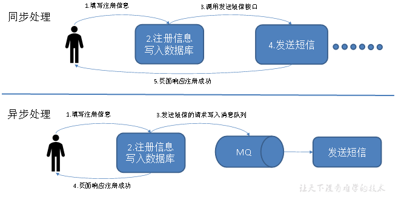

# Kafka

## Kafka 概述

kafka 是一个**分布式**的基于**发布/订阅**的**消息队列**（Message Queue），主要应用于大数据实时处理领域。

## 消息队列

传统消息队列的应用场景

### 使用消息队列的好处

1）解耦

2）可恢复性

3）缓冲

4）灵活性 & 峰值处理能力

5）异步通信

### 消息队列的两种模式

（1）**点对点模式**（**一对一**，消费者主动拉取数据，消息收到后消息清除）（比如忘记密码）

（2）**发布/订阅模式** （**一对多**，消费者消费数据之后不会清除消息）

## Kafka 基础架构

