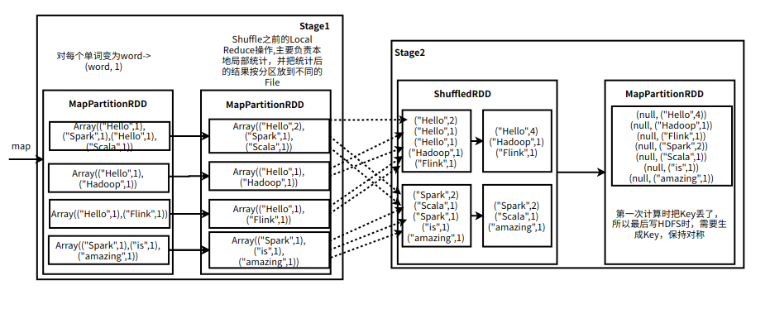

# task07：Spark

---

（本学习笔记整理自[datawhale-大数据处理技术导论](https://github.com/datawhalechina/juicy-bigdata)，部分内容来自其他相关参考教程）

## 7.0 引言


### 7.0.1 Spark简介

Spark 于 2009 年诞生于加州大学伯克利分校 AMPLab，2013 年被捐赠给 Apache 软件基金会，2014 年 2 月成为 Apache 的顶级项目。**相对于 MapReduce 的批处理计算，Spark 可以带来上百倍的性能提升，因此它成为继 MapReduce 之后，最为广泛使用的分布式计算框架。**

### 7.0.2 特点

Apache Spark 具有以下特点：- 使用先进的 DAG 调度程序，查询优化器和物理执行引擎，以实现性能上的保证；

- 多语言支持，目前支持的有Java，Scala，Python和R;
- 提供了80多个高级API,可以轻松地构建应用程序；
- 支持批处理，流处理和复杂的业务分析；
- 丰富的类库支持：包括SparkSQL(SQL语句), MLlib GraphX（图计算），MLlib(机器学习) 和 Spark Steaming(流计算) 等库，并且可以将它们无缝地进行组合；
- 丰富的部署模式：支持本地模式和自带的集群模式，也支持在Hadoop,Mesos,Kubernetes上运行；
- 多数据源支持：支持访问HDFS,Alluxio,Cassandra,HBase,Hive以及数百个其他数据源中的数据。


### 7.0.3 集群架构


| Term(术语)      | Meaning(含义)                                                                |
| ----------------- | ------------------------------------------------------------------------------ |
| Application     | Spark 应用程序，有集群上的一个Driver节点和多个Executor节点组成               |
| Driver program  | 主运用程序，该进程运行应用的main()方法并且创建SparkContext                   |
| Cluster manager | 集群资源管理器（例如：Standlone Manager,Mesos,YARN）                         |
| Work node       | 执行计算任务的工作节点                                                       |
| Executor        | 位于工作节点上的应用进程，负责执行计算任务并且将输出数据保存到内存或者磁盘中 |
| Task            | 被发送到Executor中的工作单元                                                 |


**执行过程** ：

1. 用户程序创建`SparkContext`后，它会连接到集群资源管理器，集群资源管理器会为用户程序分配计算资源，并启动`Executor`
2. Driver将计算程序分为不同的执行阶段和多个Task,之后将Task发送给Executor;
3. Executor负责执行Task,并将执行状态汇报给Driver,同时也会将当前节点资源的使用情况汇报给集群资源管理器。

### 7.0.4 核心组件

Spark 基于Spark Core 扩展了四个核心组件，分别用于满足不同领域的计算需求。


**Ø** ***\*Spark Core\****

Spark Core中提供了Spark最基础与最核心的功能，Spark其他的功能如：Spark SQL，Spark Streaming，GraphX, MLlib都是在Spark Core的基础上进行扩展的

**Ø** ***\*Spark SQL\****

Spark SQL是Spark用来操作结构化数据的组件。通过Spark SQL，用户可以使用SQL或者Apache Hive版本的SQL方言（HQL）来查询数据。

**Spark SQL 特点：**

- 能够将 SQL 查询与 Spark 程序无缝混合，允许您使用 SQL 或DataFrame API 对结构化数据进行查询；
- 支持多种数据源，包括 Hive,Avro,parquet,ORC,JSON 和 JDBC;
- 支持HiveQL 语法以及用户自定义函数（UDF）,允许你访问现有的Hive仓库；
- 支持标准的 JDBC 和 ODBC 连接；
- 支持优化器，列式存储和代码生成等特性，以提高查询效率；

**Ø** ***\*Spark Streaming\****

Spark Streaming是Spark平台上针对实时数据进行流式计算的组件，提供了丰富的处理数据流的API。

Spark Streaming 主要用于快速构建可扩展，高吞吐量，高容错的流处理程序。支持从HDFS,Flume,kafka,Twitter和ZeroMQ读取数据，并进行处理。


Spark Streaming 本质上十微批处理，它将数据流进行极小粒度的拆分，拆分为多个批处理，从而达到接近于流处理的效果。


**Ø** ***\*Spark MLlib\****

MLlib是Spark提供的一个机器学习算法库。MLlib不仅提供了模型评估、数据导入等额外的功能，还提供了一些更底层的机器学习原语。

MLlib 的一些工具：

- **常见的机器学习算法** ：如分类，回归，聚类和协同过滤；
- **特征化** ：特征提取，转换，降维和选择；
- **管道** ：用于构建，评估和调整 ML 管道的工具；
- **持久性** ：保存和加载算法，模型，管道数据；
- **实用工具** ：线性代数，统计，数据处理等。

**Ø** ***\*Spark GraphX\****

GraphX是Spark面向图计算提供的框架与算法库。

在高层次上，GraphX 通过引入一个新的图形抽象来扩展 RDD(一种具有附加到每个顶点和边缘的属性的定向多重图形)。为了支持图计算，GraphX 提供了一组基本运算符（如： subgraph，joinVertices 和 aggregateMessages）以及优化后的 Pregel API。此外，GraphX 还包括越来越多的图形算法和构建器，以简化图形分析任务。

#### 

### 7.0.5 相关的几个问题

#### 1）Spark和MapReduce在处理问题的方式上有什么区别

- MapReduce每一个步骤发生在内存中，但产生的中间值（溢写文件）都会写入在磁盘里，下一步操作时又会将这个中间值`merge`到内存中，如此循环直到最终完成计算。MapReduce每一个步骤发生在内存中，但产生的中间值（溢写文件）都会写入在磁盘里，下一步操作时又会将这个中间值`merge`到内存中，如此循环直到最终完成计算。


- Spark，每个步骤也是发生在内存之中，但产生的中间值会直接进入下一个步骤，直到所有的步骤完成之后才会将最终结果保存进磁盘。所以在使用Spark做数据分析时，较少进行很多次相对没有意义的读写，节省大量的时间。当计算步骤很多时，Spark的优势就体现出来了。


#### 2） Spark与Hadoop、MapReduce、HDFS的关系?

**Hadoop处理大数据的流程:**

首先从**HDFS**读取输入数据；接着**在 Map 阶段**使用用户定义的`mapper function`；然后把结果写入磁盘； **在Reduce阶段** ，从各个处于Map阶段的机器中读取Map计算的中间结果，使用用户定义的`reduce function`，最后 **把结果写回HDFS** 。

在这个过程中， 至少进行了三次数据读写，Hadoop处理大数据的流程高度依赖**磁盘读写**，那么在数据处理上就出现了瓶颈，面对更复杂的计算逻辑的处理任务时，Hadoop存在很大局限性。

**Spark：**

Spark不像Hadoop一样采取磁盘读写，而是 **基于性能更高的内存存储来进行数据存储和读写** （这里说的是计算数据的存储，而非持久化的存储）。但是Spark并非完美，缺乏对数据存储这一块的支持，即没有分布式文件系统，必须依赖外部的数据源，这个依赖可以是Hadoop系统的HDFS，也可以是其他的分布式文件系统，甚至可以是MySQL或本地文件系统。

基于以上分析，我们可以得出 **结论** ：Hadoop和Spark两者都是大数据框架，但是各自存在的目的不同。Hadoop实质上是一个 **分布式数据基础设施** ，它将巨大的数据集分派到一个集群中的多个节点 **进行存储** ，并具有**计算处理**的功能。Spark则不会进行分布式数据的 **存储** ，是**计算**分布式数据的工具，可以部分看做是MapReduce的竞品（ **准确的说是SparkCore** ）。综上所示，见下图：


## 7.1 Spark编程模型

### 7.1.1 RDD概述

RDD （Resilient Distributed Datasets） 叫做弹性分布式数据集，是 spark中最基本的数据处理模型。

代码中是一个抽象类，它代表一个弹性的、不可变、可分区、里面的元素可并行计算的集合。

大数据计算就是在大规模的数据集上进行一系列的数据计算处理。类比MapReduce，针对输入数据，将计算过程分为两个阶段，Map阶段和Reduce阶段，可以理解成是**面向过程**的大数据计算。我们在用MapReduce编程的时候，思考的是，如何将计算逻辑用 Map和Reduce两个阶段实现，map和reduce函数的输入和输出是什么。

  而Spark则直接针对数据进行编程，将大规模数据集合抽象成一个RDD对象，然后在这个RDD上进行各种计算处理，得到一个新的RDD，并继续计算处理，直至得到最后的数据结果。所以， **Spark可以理解成是面向对象的大数据计算** 。我们在进行Spark编程的时候，主要思考的是 **一个RDD对象需要经过什么样的操作，转换成另一个RDD对象，思考的重心和落脚点都在RDD上** 。

### 7.1.2 RDD定义

RDD是分布式内存的一个抽象概念，是只读的、记录分区的集合，能横跨集群所有节点进行并行计算。Spark建立在抽象的RDD上，可用统一的方式处理不同的大数据应用场景，把所有需要处理的数据转化为RDD，然后对RDD进行一系列的算子运算，通过丰富的API来操作数据，从而得到结果。

### 7.1.3 RDD五大特性

RDD共有五大特性，我们将对每一种特性进行介绍：


* **一个 RDD 由一个或者多个分区（Partitions）组成** 。Spark将计算以**分区**为单位,对于 RDD 来说，每个分区会被一个计算任务所处理，用户可以在创建 RDD 时指定其分区个数，如果没有指定，则默认采用程序所分配到的 CPU 的核心数；
* **并行计算：** RDD 拥有一个用于计算分区的函数 compute, 计算函数以分片为基本单位进行并行计算，**RDD的分区数决定着并行计算的数量** ；
* **RDD 会保存彼此间的依赖关系，RDD 的每次转换都会生成一个新的依赖关系，这种 RDD 之间的依赖关系就像流水线一样** 。**依赖关系列表**会告诉Spark如何从必要的输入来构建RDD。d当遇到错误如部分分区数据丢失后，可以通过这种依赖关系重新计算丢失的分区数据，而不是对 RDD 的所有分区进行重新计算,依赖关系赋予了RDD**的容错机制**；
* **Key-Value 型的 RDD 还拥有 Partitioner(分区器)，用于决定数据被存储在哪个分区中** ，目前 Spark 中支持 `HashPartitioner`(按照哈希分区) 和 `RangeParationer`(按照范围进行分区)；

> 想要理解分区器的概念，我们需要先来比较一下MapReduce的任务机制。MapReduce任务的Map阶段，处理结果会进行分片（也可以叫分区，这个分区不同于上面的分区），分片的数量就是Reduce Task的数量。而具体分片的策略由分区器Partitioner决定，Spark目前支持Hash分区（默认分区）和Range分区，用户也可以自定义分区。
> 总结一下，Partitioner决定了RDD如何分区。通过Partitioner来决定下一步会产生并行的分片数，以及当前并行Shuffle输出的并行数据，使得Spark可以控制数据在不同节点上分区。
> 值得注意的是，其本身只针对于key-value的形式（key-value形式的RDD才有Partitioner属性），Partitioner会从0到numPartitions-1区间内映射每一个key到partition ID上。

* **一个优先位置列表 (可选)，用于存储每个分区的优先位置 (prefered location)** 。对于一个 HDFS 文件来说，这个列表保存的就是每个分区所在的块的位置，按照“移动数据不如移动计算“的理念，Spark 在进行任务调度的时候，会尽可能的将计算任务分配到其所要处理数据块的存储位置。

`RDD[T]` 抽象类的部分相关代码如下：

```md

// 由子类实现以计算给定分区
def compute(split: Partition, context: TaskContext): Iterator[T]

// 获取所有分区
protected def getPartitions: Array[Partition]

// 获取所有依赖关系
protected def getDependencies: Seq[Dependency[_]] = deps

// 获取优先位置列表
protected def getPreferredLocations(split: Partition): Seq[String] = Nil

// 分区器 由子类重写以指定它们的分区方式
@transient val partitioner: Option[Partitioner] = None

```

### 7.1.4 创建RDD

RDD 有两种创建方式，分别介绍如下：

#### 7.1.4.1 由现有集合创建

这里使用`spark-shell`进行测试，启动命令如下：

```md
 spark-shell --master local[4]   # master 为hostname 
```

启动`spark-shell`后，程序会自动创建上下文，相当于执行了下面的scala语句：

```bash
val conf = new SparkConf().setAppName("Spark shell").setMaster("local[4]")
val sc = new SparkContext(conf)
```

由现有集合创建 RDD，你可以在创建时指定其分区个数，如果没有指定，则采用程序所分配到的 CPU 的核心数：

```bash
val data = Array(1, 2, 3, 4, 5)
// 由现有集合创建 RDD,默认分区数为程序所分配到的 CPU 的核心数
val dataRDD = sc.parallelize(data) 
// 查看分区数
dataRDD.getNumPartitions
// 明确指定分区数
val dataRDD = sc.parallelize(data,2)

```

#### 7.1.4.2 引用外部存储系统中的数据集

引用外部存储系统中的数据集，例如本地文件系统，HDFS,HBase或支持Hadoop InputFormat的任何数据源。

```md
val fileRDD = sr.textFile("/usr/file/emp.txt")
// 获取第一行文本
fileRDD.take(1)
```

使用外部存储系统时需要注意以下两点：

- 如果在集群环境下从本地文件系统读取数据，则要求该文件必须在集群中所有机器上都存在，且路径相同；
- 支持目录路径，支持压缩文件，支持使用通配符。

#### 7.1.4.3  textFile & wholeTextFiles

两者都可以用来读取外部文件，但是返回格式是不同的：

- textFile：其返回格式是 RDD[String] ，返回的是就是文件内容，RDD 中每一个元素对应一行数据；
- wholeTextFiles：其返回格式是 RDD[(String, String)]，元组中第一个参数是文件路径，第二个参数是文件内容；
- 两者都提供第二个参数来控制最小分区数；
- 从 HDFS 上读取文件时，Spark 会为每个块创建一个分区。

## 7.2 Spark架构原理

> 移动计算而非移动数据

MapReduce：通过固定的`map`与`reduce`分阶段计算

Spark：计算框架通过`DAG`来实现计算。

### 7.2.1 spark计算阶段

&emsp;MapReduce中，一个应用一次只运行一个`map`和一个`reduce`，而Spark可以根据应用的复杂程度，将过程分割成更多的计算阶段（stage），这些计算阶段组成一个有向无环图（DAG），Spark任务调度器根据**DAG的依赖关系**执行计算阶段（stage）。
&emsp;&emsp;Spark比MapReduce快100 多倍。因为某些机器学习算法可能需要进行大量的迭代计算，产生数万个计算阶段，这些计算阶段在一个应用中处理完成，而不是像MapReduce那样需要启动数万个应用，因此极大地提高了运行效率。
&emsp;&emsp;DAG是有向无环图，即是说**不同阶段的依赖关系是有向**的，计算过程只能沿着依赖关系方向执行，被依赖的阶段执行完成之前，依赖的阶段不能开始执行，同时，这个依赖关系不能是环形依赖，否则就造成死循环。下面这张图描述了一个典型的Spark运行DAG的不同阶段：

<center></center>

&emsp;&emsp;从图上看，整个应用被切分成3个阶段，阶段3需要依赖阶段1和阶段2，阶段1和阶段2互不依赖。Spark在执行调度时，先执行阶段1和阶段2，完成以后再执行阶段3。如果有更多的阶段，Spark的策略是一样的。**Spark大数据应用的计算过程**为：Spark会根据程序初始化DAG，由DAG再建立依赖关系，根据依赖关系顺序执行各个计算阶段。
&emsp;&emsp;**Spark 作业调度执行核心是DAG**，由DAG可以得出 **整个应用就被切分成哪些阶段**以及**每个阶段的依赖关系**。再根据每个阶段要处理的数据量生成相应的任务集合（TaskSet），每个任务都分配一个任务进程去处理。
&emsp;&emsp;那DAG是怎么来生成的呢？在Spark中，`DAGScheduler`组件负责应用DAG的生成和管理，`DAGScheduler`会根据程序代码生成DAG，然后将程序分发到分布式计算集群，按计算阶段的先后关系调度执行。

### 7.2.2 如何划分计算阶段

&emsp;&emsp;上图的DAG对应Spark伪代码可以表示为：

```python
rddB = rddA.groupBy(key)
rddD = rddC.map(func)
rddF = rddD.union(rddE)
rddG = rddB.join(rddF)
```

&emsp;&emsp;可以看到，共有4个转换函数，但是只有3个阶段。看起来并不是RDD上的每个转换函数都会生成一个计算阶段。那**RDD的计算阶段是怎样来进行划分**的呢？

<center></center>

&emsp;&emsp;再看下上图，我们发现了一个规律，当 **RDD之间的转换连接线呈现多对多交叉连接**的时候，就会产生新的阶段。图中每个RDD里面都包含多个小块，每个小块都表示RDD的一个分片。
&emsp;&emsp;**一个RDD表示一个数据集，一个数据集中的多个数据分片需要进行分区传输，写入到另一个数据集的不同分片中**。这种涉及到数据分区交叉传输的操作，是否在MapReduce中也有印象？我们来回忆下MapReduce的过程：

<center></center>

&emsp;&emsp;MapReduce把这种从数据集跨越，由多个分区传输的过程，叫做**Shuffle**。同样，Spark也需要通过`Shuffle`将数据进行重新组合，把相同`key`的数据放一起。由于会进行新的聚合、关联等操作，所以Spark每次`Shuffle`都会产生新的计算阶段。而每次计算时，需要的数据都是由前面一个或多个计算阶段产生的，所以计算阶段需要依赖关系，必须等待前面的阶段执行完毕后，才能进行`Shuffle`。
&emsp;&emsp;**Spark中计算阶段划分的依据是Shuffle**，而不是操作函数的类型，并不是所有的函数都有`Shuffle`过程。比如Spark计算阶段示例图中，RDD B和RDD F进行join后，得到RDD G。**RDD B不需要Shuffle**，因为RDD B在上一个阶段中，已经进行了数据分区，分区数和分区key不变，就不需要进行`Shuffle`。而RDD F的分区数不同，就需要进行`Shuffle`。Spark把**不需要Shuffle**的依赖，称为**窄依赖**。**需要Shuffle**的依赖，称为**宽依赖**。`Shuffle`是Spark最重要的一个环节，只有通过`Shuffle`，相关数据才能互相计算，从而构建起复杂的应用逻辑。

&emsp;&emsp;那么Spark和MapReduce一样，都进行了`Shuffle`，为什么Spark会比MapReduce更高效呢？  我们从**本质和存储方式**两个方面，对Spark和MapReduce进行比较：

- **从本质上**：Spark可以算是一种MapReduce计算模型的不同实现，Hadoop MapReduce根据`Shuffle`将大数据计算分为Map和Reduce两个阶段。而Spark更流畅，将前一个的Reduce和后一个的Map进行连接，当作一个阶段进行计算，从而形成了一个更高效流畅的计算模型。其本质仍然是Map和Reduce。但是这种多个计算阶段依赖执行的方案可以有效减少对HDFS的访问（落盘），减少作业的调度执行次数，因此执行速度也更快。
- **从存储方式上**：MapReduce主要使用磁盘存储`Shuffle`过程的数据，而Spark优先使用内存进行数据存储（RDD也优先存于内存）。这也是Spark比Hadoop性能高的另一个原因。

### 7.2.3 Spark 作业管理

> 本小节主要说明作业、计算阶段、任务的依赖和时间先后关系。

&emsp;&emsp;Spark的RDD有两种函数：转换函数和`action`函数。`action`函数调用之后不再返回RDD。Spark的`DAGScheduler`遇到`Shuffle`时，会生成一个计算阶段，在遇到`action`函数时，会生成一个作业（Job）。RDD里的每个数据分片，Spark都会创建一个计算任务进行处理，所以，一个计算阶段会包含多个计算任务（Task）。
&emsp;&emsp;一个作业至少包含一个计算阶段，每个计算阶段由多个任务组成，这些任务（Task）组成一个任务集合。
&emsp;&emsp;`DAGScheduler`根据代码生成DAG图，Spark的任务调度以任务为单位进行分配，将任务分配到分布式集群的不同机器上进行执行。

### 7.2.4 Spark 执行过程

&emsp;&emsp;Spark支持多种部署方案（Standalone、Yarn、Mesos等），不同的部署方案核心功能和运行流程基本一样，只是不同组件角色命名不同。

<center></center>

&emsp;&emsp;**首先**，Spark在自己的`JVM`进程里启动应用程序，即`Driver`进程。启动后，`Driver`调用`SparkContext`初始化执行配置和输入数据。再由`SparkContext`启动`DAGScheduler`构造执行的DAG图，切分成计算任务这样的最小执行单位。
&emsp;&emsp;**接着**，`Driver`向`Cluster Manager`请求计算资源，用于`DAG`的分布式计算。`ClusterManager`收到请求以后，将`Driver`的主机地址等信息通知给集群的所有计算节点`Worker`。
&emsp;&emsp;**最后**，`Worker`收到信息后，根据`Driver`的主机地址，向`Driver`通信并注册，然后根据自己的空闲资源向`Driver`通报可以领用的任务数。`Driver`根据DAG图向注册的`Worker`分配任务。

## 7.3 实验内容

### 7.3.1 实验一：Spark Local模式的安装

#### 7.3.1.1 安装

**实验环境：**

运行环境：**Linux Ubuntu 22.04**

部署要求：

1. 完成Java运行环境部署（详见第2章Java安装）
2. 完成Hadoop 3.3.1的单点部署（详见第2章安装单机版Hadoop）


##### 1.解压安装包

&emsp;&emsp;通过官网下载地址（✅**官网下载地址**：[Spark下载](https://spark.apache.org/downloads.html)），下载[spark-3.2.0-bin-without-hadoop.tgz](https://www.apache.org/dyn/closer.lua/spark/spark-3.2.0/spark-3.2.0-bin-without-hadoop.tgz)。


&emsp;&emsp;将安装包放置本地指定目录，如`/data/hadoop/`下。解压安装包至`/opt`目录下，命令如下：

```shell
sudo tar -zxvf /data/hadoop/spark-3.2.0-bin-without-hadoop.tgz -C /opt/
```

&emsp;&emsp;解压后，在`/opt`目录下会产生`spark-3.2.0-bin-without-hadoop`文件夹。

##### 2.更改文件夹名和所属用户

&emsp;&emsp;使用`mv`命令，将文件名改为`spark`，命令如下：

```shell
sudo mv /opt/spark-3.2.0-bin-without-hadoop/ /opt/spark
```

&emsp;&emsp;使用`chown`命令，更改文件夹及其下级的所有文件的所属用户和用户组，将其改为`datawhale`用户和`datawhale`用户组，命令如下：

```shell
sudo chown -R datawhale:datawhale /opt/spark/
```

##### 3.修改Spark的配置文件spark-env.sh

&emsp;&emsp;进入`/opt/spark/conf`目录下，将`spark-env.sh.template`文件拷贝一份并命名为`spark-env.sh`，命令如下：

```shell
cd /opt/spark/conf
cp ./spark-env.sh.template ./spark-env.sh
```

&emsp;&emsp;编辑`spark-env.sh`文件，命令如下：

```shell
vim spark-env.sh
```

&emsp;&emsp;在第一行添加如下配置信息：

```shell
export SPARK_DIST_CLASSPATH=$(/opt/hadoop/bin/hadoop classpath)
```

&emsp;&emsp;配置完成后就可以直接使用，不需要像Hadoop运行启动命令。

##### 4.设置Spark的环境变量

&emsp;&emsp;将`SPARK_HOME`环境变量设置为`/opt/spark`，作为工作目录，打开系统环境变量配置文件，命令如下：

```shell
sudo vim /etc/profile
```

&emsp;&emsp;在文件末尾，添加如下内容：

```shell
# spark
export SPARK_HOME=/opt/spark
export PATH=$PATH:$SPARK_HOME/bin
```

&emsp;&emsp;使用`Shift+:`，输入`wq`后回车，保存退出。运行如下命令使环境变量生效：

```shell
source /etc/profile
```

##### 5.检验Spark是否成功部署

&emsp;&emsp;通过运行Spark自带的示例，验证Spark是否安装成功，命令如下：

```shell
cd /opt/spark
bin/run-example SparkPi
```

&emsp;&emsp;执行时会输出非常多的运行信息，输出结果不容易找到，可以通过`grep`命令进行过滤（命令中的`2>&1`可以将所有的信息都输出到`stdout`中，否则由于输出日志的性质，还是会输出到屏幕中），命令如下：

```shell
cd /opt/spark
bin/run-example SparkPi 2>&1 | grep "Pi is"
```

&emsp;&emsp;过滤后的运行结果如下，可以得到$\pi$的5位小数近似值：


至此`Spark`安装部署完成！

## 7.4 WordCount

### 7.4.1 代码实现

#### 1. 文本准备：

新建一个文本文件`helloSpark.txt`，将该文件放到文件目录` /opt/spark/data/wordcount/`中，文本内容如下：

```shell
cd /opt/spark/data
mkdir wordcount
cd wordcount
sudo vim helloSpark.txt

datawhale@datawhale001:/opt/spark/data/wordcount$ cat helloSpark.txt  # 文件内容如下：
Hello Spark Hello Scala
Hello Hadoop
Hello Flink
Spark is amazing

```

#### 2.本地模式启动spark-shell

通过进入`/opt/spark/bin`目录，启动spark-shell的本地环境，指定核数为`2`个

```shell
spark-shell --master local[2]
```

然后运行

```scala
1. 创建RDD
scala> val lines = sc.textFile("file:///opt/spark/data/wordcount/helloSpark.txt", 1) // 读取本地文件并设置为一个Partition
//也可以将helloSpark.txt上传到hdfs中，直接读取hdfs中的文件，此时path路径不需要加"file://"前缀

2. 对数据进行转换处理
scala> val words = lines.flatMap{line => line.split(" ")} // 把每行字符串进行单词拆分，把拆分结果通过flat合并为一个大的单词集合

scala> val pairs = words.map{word => (word, 1)}

scala> val wordCountOdered = pairs.reduceByKey(_+_).map(pair=>(pair._2, pair._1)).sortByKey(false).map(pair => (pair._2, pair._1))

3. 打印数据
scala> wordCountOdered.collect.foreach(wordNumberPair => println(wordNumberPair._1 + "：" + wordNumberPair._2))
```

本地执行就崩，所以无法提供打印效果页面

### 7.4.2  WordCount在RDD的运行原理

1.textFile操作


emsp;&emsp;在`textFile`操作之后，产生了两个RDD：**HadoopRDD** 和 **MapPartitionRDD**。

- HadoopRDD
  &emsp;&emsp;先产生HadoopRDD的原因是先从HDFS中抓取数据，导致先产生HadoopRDD。HadoopRDD会从HDFS上读取分布式文件，并将输入文件以数据分片的方式存在于集群中。数据分片就是把要处理的数据分成不同的部分。
  &emsp;&emsp;例如，集群现在有4个节点，将数据分成4个数据分片（当然，这是一种粗略的划分），“Hello Spark"在第1台机器，"Hello Hadoop"在第2台机器，"Hello Flink“在第3台机器，”Spark is amazing“在第4台机器。HadoopRDD会从磁盘上读取数据，在计算的时候将数据以分布式的方式存储在内存中。
  &emsp;&emsp;在默认情况下，Spark分片的策略是**分片的大小与存储数据的Block块的大小是相同的**。假设现在有4个数据分片（partition），每个数据分片有128M左右。这里描述为"左右"的原因是分片记录可能会跨越两个Block来存储，如果最后一条数据跨了两个Block块，那么分片的时候会把最后一条数据都放在前面的一个分片中，此时分片大小会大于128M（Block块大小）。
- MapPartitionsRDD
  &emsp;&emsp;MapPartitionsRDD是基于HadoopRDD产生的RDD，MapPartitionsRDD将HadoopRDD产生的数据分片（(partition） 去掉相应行的`key`，只留`value`。 产生RDD的个数与操作并不一一对应。在textFile操作产生了2个RDD，Spark中一个操作可以产生一个或多个RDD。

2.flatMap操作


&emsp;&emsp;flatMap操作产生了一个**MapPartitionsRDD**，其作用是对每个Partition中的每一行内容进行单词切分，并合并成一个大的单词实例的集合。

3.map操作


emsp;map操作产生了一个**MapPartitionsRDD**，其作用是在单词拆分的基础上，对单词计数为1。例如将“Hello”和“Spark“变为`(Hello, 1)`,`(Spark, 1)`。

4.reduceByKey操作


&emsp;&emsp;reduceByKey操作是对相同`key`进行`value`的统计。包括本地级别和全局级别的统计。 该操作实际上产生了两个 RDD：**MapPartitionsRDD**与**ShuffledRDD**。



- MapPartitionsRDD
  &emsp;&emsp;reduceByKey在MapPartitionRDD之后，首先，进行本地级别（local）的归并操作，把统计后的结果按照分区策略放到不同的分布式文件中。
  &emsp;&emsp;例如将`(Hello, 1)`,`(Spark, 1)`,`(Hello, 1)`汇聚为`(Hello, 2)`, `(Spark, 1)`进行局部统计，然后将统计的结果传给下一个阶段，如果下一个阶段是3个并行度，每个Partition进行local reduce后，将自己的数据分成了3种类型传给下一个阶段。分成3种类型最简单的方式是通过`HashCode`按3进行取模。
  &emsp;&emsp;这个步骤发生在`Stage1`的末尾端，能够基于内存进行计算，减少网络的传输，并加快计算速度。
- ShuffledRDD
  &emsp;&emsp;reduceByKey进行Shuffle操作会产生ShuffleRDD，因为在全局进行聚合的操作时，网络传输不能在内存中进行迭代，因此需要一个新的Stage来重新分类。把结果收集后，会进行全局reduce级别的归并操作。
  &emsp;&emsp;对照上述流程图，4个机器对4行数据进行并行计算，并在各自内存中进行了局部聚集，将数据进行分类。图中，第1台机器获取数据为`(Hello, 2)`，第2台机器获取数据为`(Hello, 1)`，第3台机器获取数据为`(Hello, 1)`，把所有的`Hello`进行全局`reduce`在内部变成`(Hello, 4)`，产生reduceByKey的最后结果，其他数据也类似操作。

&emsp;&emsp;综上所述，reduceByKey包含两个阶段：**第一个是本地级别的reduce，一个是全局级别的reduce**，其中第一个本地级别是我们容易忽视的。

##### 5.输出

&emsp;&emsp;reduceByKey操作之后，我们得到了数据的最后结果，需要对结果进行输出。在该阶段会产生**MapPartitionsRDD**，这里的输出有两种情况：**Collect**或**saveAsTextFile**。

- 对于`Collect`来说，MapPartitionsRDD的作用是把结果收集起来发送给Driver。
- 对于`saveAsTextFile`，将`Stage2`产生的结果输出到HDFS中时，数据的输出要符合一定的格式，而现在的结果只有`value`，没有`key`。所以MapPartitionsRDD会生成相应的`key`。例如输出`(Hello, 4)`，这里`(Hello, 4)`是`value`，而不是"Hello"是`key`，4是`value`的形式。

&emsp;&emsp;由于最初在textFile读入数据时，`split`分片操作将`key`去掉了，只对`value`计算。所以，最后需要将去掉的`key`恢复。这里的`key`只对Spark框架有意义（满足格式），在向HDFS写入结果时，生成的`key`为`null`即可。

## 7.5 本章小结

&emsp;在本章的学习中，主要介绍`Spark`的编程模型：`RDD`的定义、特性和操作函数，接着从`Spark`的架构原理出发，简述了`Spark`的计算阶段、作业管理和执行过程。最后通过实验，介绍了`Spark`的安装、并通过`WordCount`实例观察`RDD`的数据流向。如果想要更多的了解Spark SQL和Scala API的内容，可以参考本仓库[experiments](https://github.com/datawhalechina/juicy-bigdata/tree/master/experiments)目录下的笔记[Spark SQL的基本使用](https://github.com/datawhalechina/juicy-bigdata/blob/master/experiments/Spark%20SQL的基本使用.md)以及[Spark的Scala API介绍](https://github.com/datawhalechina/juicy-bigdata/blob/master/experiments/Spark的Scala%20API介绍.md)（✅**Gitee地址**：[Spark SQL的基本使用](https://gitee.com/shenhao-stu/Big-Data/blob/master/experiments/Spark%20SQL的基本使用.md)以及[Spark的Scala API介绍](https://gitee.com/shenhao-stu/Big-Data/blob/master/experiments/Spark的Scala%20API介绍.md)）。
