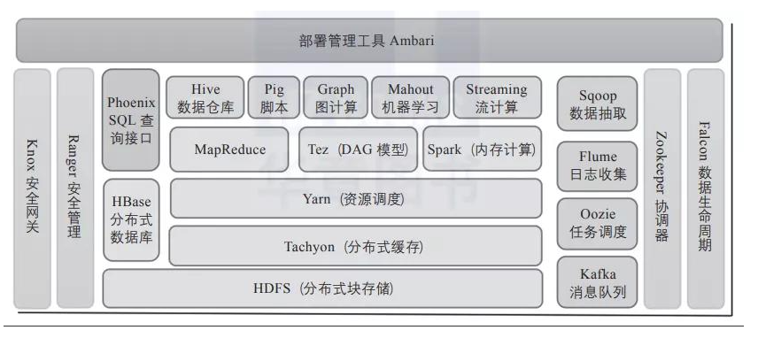

# task08: 期末大作业

---

（本学习笔记整理自[datawhale-大数据处理技术导论](https://github.com/datawhalechina/juicy-bigdata)，部分内容来自其他相关参考教程）

## 面试题

### 10.1.1 hive外部表和内部表的区别

**解答：**

未被`external `修饰的是内部表，被` externa`l 修饰的为外部表；

内部表数据由hive自身管理，外部表数据由HDFS管理；

| 对比内容     | 内部表                                                       | 外部表                                                       |
| ------------ | ------------------------------------------------------------ | ------------------------------------------------------------ |
| 数据存储位置 | 内部表数据存储的位置由`hive.Metastore.warehouse.dir`参数指定， 默认情况下，表的数据存储在`HDFS`的`/user/hive/warehouse/数据库名.db/表名/`目录下 | 外部表数据的存储位置创建表时由`Location`参数指定             |
| 导入数据     | 在导入数据到内部表，内部表将数据移动到自己的数据仓库目录下， 数据的生命周期由`Hive`来进行管理 | 外部表不会将数据移动到自己的数据仓库目录下， 只是在元数据中存储了数据的位置 |
| 删除表       | 删除元数据（metadata）和文件                                 | 只删除元数据（metadata）                                     |

详细参见：[task06之一：数据仓库Hive基础关于表的知识点](Hive?id=_64-hive%e6%95%b0%e6%8d%ae%e7%b1%bb%e5%9e%8b)

### 10.1.2 简述对Hive桶的理解？

### 10.1.3 HBase和Hive的区别？

解答：

**两者的共同点：**
1.hbase与hive都是架构在hadoop之上的。都是用hadoop作为底层存储

**两者的区别：**

2.Hive是建立在Hadoop之上为了减少MapReduce jobs编写工作的批处理系统，HBase是为了支持弥补Hadoop对实时操作的缺陷的项目 。

3.想象你在操作RMDB数据库，如果是全表扫描，就用Hive+Hadoop,如果是索引访问，就用HBase+Hadoop 。

4.Hive query就是MapReduce jobs可以从5分钟到数小时不止，HBase是非常高效的，肯定比Hive高效的多。

5.Hive本身不存储和计算数据，它完全依赖于HDFS和MapReduce，Hive中的表纯逻辑。

6.hive借用hadoop的MapReduce来完成一些hive中的命令的执行

7.hbase是物理表，不是逻辑表，提供一个超大的内存hash表，搜索引擎通过它来存储索引，方便查询操作。

8.hbase是列存储。所以Hbase可以对数据进行增改删等操作，但Hive是行的，只能追加数据。

9.hdfs作为底层存储，hdfs是存放文件的系统，而Hbase负责组织文件。

10.hive需要用到hdfs存储文件，需要用到MapReduce计算框架。

### 10.1.4 简述Spark宽窄依赖

解答：

一，首先我们来简简述为什么要设计宽窄依赖？

1.对于窄依赖：Spark可以并行计算。例如 map，filter等操作。 如果有一个分区数据丢失，只需要从父RDD的对应1个分区重新计算即可，不需要重新计算整个任务，提高容错。

2.对于宽依赖： 是划分Stage的依据，产生Shuffle。例如GroupByKey，reduceByKey，join，sortByKey等操作。

3.构建Lineage血缘关系： RDD只支持粗粒度转换，即只记录单个块上执行的单个操作。将创建RDD的一系列Lineage（即血统）记录下来，以便恢复丢失的分区。RDD的Lineage会记录RDD的元数据信息和转换行为，当该RDD的部分分区数据丢失时，它可以根据这些信息来重新运算和恢复丢失的数据分区。

二，区分RDD之间的依赖为宽依赖还是窄依赖，主要在于父RDD分区数据和子RDD分区数据关系：

窄依赖：父RDD的一个分区只会被子RDD的一个分区依赖。

宽依赖：父RDD的一个分区会被子RDD的多个分区依赖，涉及Shuffle。

在spark中pipeline是一个partition对应一个partition，所以在stage内部只有窄依赖。stage与stage之间是宽依赖。

详细参见：https://blog.csdn.net/Buutoorr/article/details/126947392

### 10.1.5 Hadoop和Spark的相同点和不同点

解答：

Hadoop 底层使用 MapReduce 计算架构，只有 map 和 reduce 两种操作，表达能力比较欠缺，而且在 MR 过程中会重复的读写 hdfs，造成大量的磁盘 io 读写操作，所以适合高时延环境下批处理计算的应用；

Spark 是基于内存的分布式计算架构，提供更加丰富的数据集操作类型，主要分成转化操作和行动操作，包括 map、reduce、filter、flatmap、groupbykey、reducebykey、union 和 join 等，数据分析更加快速，所以适合低时延环境下计算的应用；

spark 与 hadoop 最大的区别在于迭代式计算模型。基于 mapreduce 框架的 Hadoop 主要分为 map 和 reduce 两个阶段，两个阶段完了就结束了，所以在一个 job 里面能做的处理很有限；spark 计算模型是基于内存的迭代式计算模型，可以分为 n 个阶段，根据用户编写的 RDD 算子和程序，在处理完一个阶段后可以继续往下处理很多个阶段，而不只是两个阶段。所以 spark 相较于 mapreduce，计算模型更加灵活，可以提供更强大的功能。

但是 spark 也有劣势，由于 spark 基于内存进行计算，虽然开发容易，但是真正面对大数据的时候，在没有进行调优的轻局昂下，可能会出现各种各样的问题，比如 OOM 内存溢出等情况，导致 spark 程序可能无法运行起来，而 mapreduce 虽然运行缓慢，但是至少可以慢慢运行完。

Hadoop/MapReduce 和 Spark 最适合的都是做离线型的数据分析，但 Hadoop 特别适合是单次分析的数据量 “很大” 的情景，而 Spark 则适用于数据量不是很大的情景。

一般情况下，对于中小互联网和企业级的大数据应用而言，单次分析的数量都不会 “很大”，因此可以优先考虑使用 Spark。

业务通常认为 Spark 更适用于机器学习之类的 “迭代式” 应用，80GB 的压缩数据（解压后超过 200GB），10 个节点的集群规模，跑类似 “sum+group-by” 的应用，MapReduce 花了 5 分钟，而 spark 只需要 2 分钟。

### 10.1.6 Spark为什么比MapReduce块？

解答：

Spark计算比MapReduce快的根本原因在于DAG计算模型。一般而言，DAG相比Hadoop的MapReduce在大多数情况下可以减少shuffle次数。Spark的DAGScheduler相当于一个改进版的MapReduce，如果计算不涉及与其他节点进行数据交换，Spark可以在内存中一次性完成这些操作，也就是中间结果无须落盘，减少了磁盘IO的操作。

详细参见：https://www.zhihu.com/question/31930662


### 10.1.7 说说你对Hadoop生态的认识

解答：

Hadoop体系也是一个计算框架，在这个框架下，可以使用一种简单的编程模式，通过多台计算机构成的集群，分布式处理大数据集。

Hadoop体系也是一个计算框架，在这个框架下，可以使用一种简单的编程模式，通过多台计算机构成的集群，分布式处理大数据集。Hadoop是可扩展的，它可以方便地从单一服务器扩展到数千台服务器，每台服务器进行本地计算和存储。除了依赖于硬件交付的高可用性，软件库本身也提供数据保护，并可以在应用层做失败处理，从而在计算机集群的顶层提供高可用服务。Hadoop核心生态圈组件如图1所示。



Hadoop包括以下4个基本模块。

1)Hadoop基础功能库：支持其他Hadoop模块的通用程序包。

2)HDFS：一个分布式文件系统，能够以高吞吐量访问应用中的数据。

3)YARN：一个作业调度和资源管理框架。

4)MapReduce：一个基于YARN的大数据并行处理程序。

除了基本模块，Hadoop还包括以下项目。

1)Ambari：基于Web，用于配置、管理和监控Hadoop集群。支持HDFS、MapReduce、Hive、HCatalog、HBase、ZooKeeper、Oozie、Pig和Sqoop。Ambari还提供显示集群健康状况的仪表盘，如热点图等。Ambari以图形化的方式查看MapReduce、Pig和Hive应用程序的运行情况，因此可以通过对用户友好的方式诊断应用的性能问题。

2)Avro：数据序列化系统。

3)Cassandra：可扩展的、无单点故障的NoSQL多主数据库。

4)Chukwa：用于大型分布式系统的数据采集系统。

5)HBase：可扩展的分布式数据库，支持大表的结构化数据存储。

6)Hive：数据仓库基础架构，提供数据汇总和命令行即席查询功能。

7)Mahout：可扩展的机器学习和数据挖掘库。

8)Pig：用于并行计算的高级数据流语言和执行框架。

9)Spark：可高速处理Hadoop数据的通用计算引擎。Spark提供了一种简单而富有表达能力的编程模式，支持ETL、机器学习、数据流处理、图像计算等多种应用。

10)Tez：完整的数据流编程框架，基于YARN建立，提供强大而灵活的引擎，可执行任意有向无环图(DAG)数据处理任务，既支持批处理又支持交互式的用户场景。Tez已经被Hive、Pig等Hadoop生态圈的组件所采用，用来替代 MapReduce作为底层执行引擎。

11)ZooKeeper：用于分布式应用的高性能协调服务。

除了以上这些官方认可的Hadoop生态圈组件之外，还有很多十分优秀的组件这里没有介绍，这些组件的应用也非常广泛，例如基于Hive查询优化的Presto、Impala、Kylin等。

此外，在Hadoop生态圈的周边，还聚集了一群“伙伴”，它们虽然未曾深入融合Hadoop生态圈，但是和Hadoop有着千丝万缕的联系，并且在各自擅长的领域起到了不可替代的作用。图2是阿里云E-MapReduce平台整合的Hadoop生态体系中的组件，比Apache提供的组合更为强大。


## 期末作业

#### 1. 文本准备：


新建一个文本文件`sample.txt`，将该文件放到文件目录` /opt/spark/data/wordcount/`中，文本内容如下：
```shell
cd /opt/spark/data
mkdir wordcount
cd wordcount
sudo vim helloSpark.txt

datawhale@datawhale001:/opt/spark/data/wordcount$ cat helloSpark.txt  # 文件内容如下：
Hello Spark Hello Scala
Hello Hadoop
Hello Flink
Spark is amazing

```