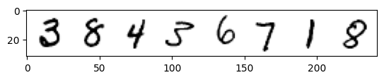
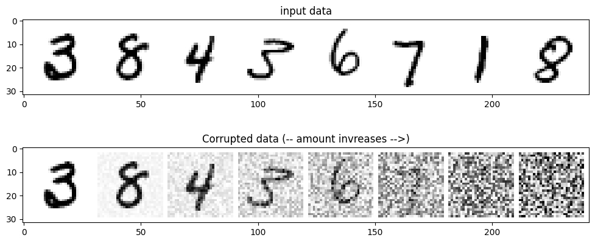
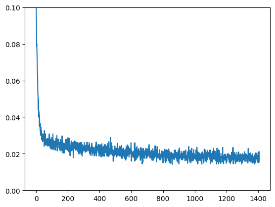
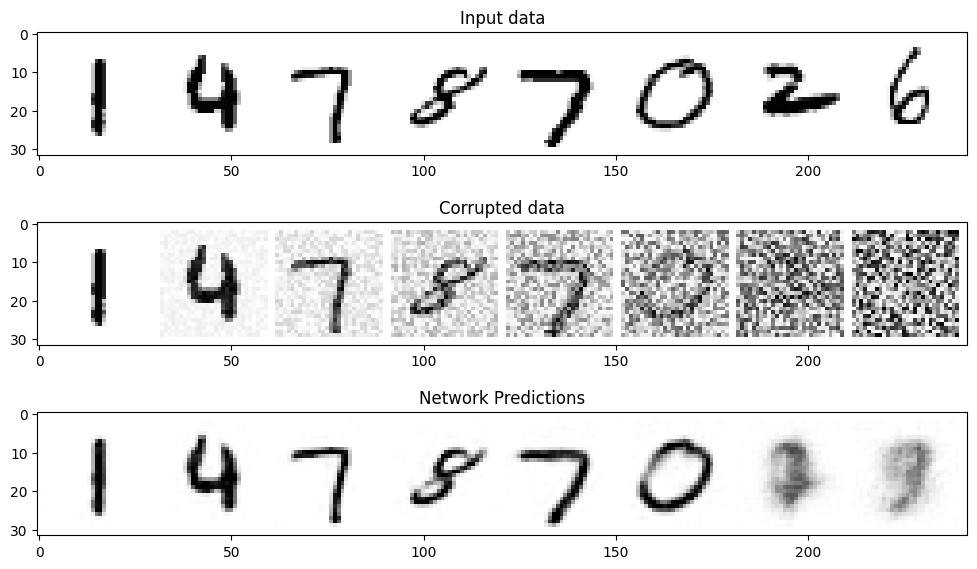

# 第3章 从零开始搭建扩散模型

> 第一周实验题地址：[unit01实验](./docs/diffusion_models_51/colab_Doffisers/colab_Doffisers.md) 


以MNIST数据集为例，从零构建扩散模型，具体会涉及到如下知识点：

* 退化过程（向数据中添加噪声）
* 构建一个简单的UNet模型
* 训练扩散模型
* 采样过程分析

下面介绍具体的实现过程：

## **环境配置&python包的导入**

最好有GPU环境，比如公司的GPU集群或者Google Colab，下面是代码实现：

默认您已经配置部署了torch cuda等基本python环境

```python
!pip install -qq -U diffusers datasets transformers accelerate ftfy pyarrow==9.0.0

```

Looking in indexes: https://pypi.tuna.tsinghua.edu.cn/simple
Requirement already satisfied: torchvision in d:\programdata\anaconda3\lib\site-packages (0.16.0)
Requirement already satisfied: pillow!=8.3.*,>=5.3.0 in d:\programdata\anaconda3\lib\site-packages (from torchvision) (9.4.0)
Requirement already satisfied: numpy in d:\programdata\anaconda3\lib\site-packages (from torchvision) (1.23.5)
Requirement already satisfied: torch==2.1.0 in d:\programdata\anaconda3\lib\site-packages (from torchvision) (2.1.0)
Requirement already satisfied: requests in d:\programdata\anaconda3\lib\site-packages (from torchvision) (2.31.0)
Requirement already satisfied: filelock in d:\programdata\anaconda3\lib\site-packages (from torch==2.1.0->torchvision) (3.9.0)
Requirement already satisfied: fsspec in d:\programdata\anaconda3\lib\site-packages (from torch==2.1.0->torchvision) (2023.6.0)
Requirement already satisfied: networkx in d:\programdata\anaconda3\lib\site-packages (from torch==2.1.0->torchvision) (2.8.4)
Requirement already satisfied: typing-extensions in d:\programdata\anaconda3\lib\site-packages (from torch==2.1.0->torchvision) (4.4.0)
Requirement already satisfied: sympy in d:\programdata\anaconda3\lib\site-packages (from torch==2.1.0->torchvision) (1.11.1)
Requirement already satisfied: jinja2 in d:\programdata\anaconda3\lib\site-packages (from torch==2.1.0->torchvision) (3.1.2)
Requirement already satisfied: idna<4,>=2.5 in d:\programdata\anaconda3\lib\site-packages (from requests->torchvision) (3.4)
Requirement already satisfied: certifi>=2017.4.17 in d:\programdata\anaconda3\lib\site-packages (from requests->torchvision) (2023.7.22)
Requirement already satisfied: charset-normalizer<4,>=2 in d:\programdata\anaconda3\lib\site-packages (from requests->torchvision) (2.0.4)
Requirement already satisfied: urllib3<3,>=1.21.1 in d:\programdata\anaconda3\lib\site-packages (from requests->torchvision) (1.26.14)
Requirement already satisfied: MarkupSafe>=2.0 in d:\programdata\anaconda3\lib\site-packages (from jinja2->torch==2.1.0->torchvision) (2.1.1)
Requirement already satisfied: mpmath>=0.19 in d:\programdata\anaconda3\lib\site-packages (from sympy->torch==2.1.0->torchvision) (1.2.1)
导入数据

```python
import torch
import torchvision
from torch import nn
from torch.nn import functional as F
from torch.utils.data import DataLoader
from diffusers import DDPMScheduler,UNet2DModel
from matplotlib import pyplot as plt
```

```python
device = torch.device("cuda" if torch.cuda.is_available() else "cpu")
```

```python
device
```

device(type='cpu')


## **加载MNIST数据集**

MNIST数据集是一个小数据集，存储的是0-9手写数字字体， **每张图片都28X28的灰度图片** ，每个 **像素的取值范围是[0,1]** ，下面加载该数据集，并展示部分数据：

```python
# 数据集测试
dataset = torchvision.datasets.MNIST(root="mnist/",train=True,download=True,
                                     transform = torchvision.transforms.ToTensor())
train_dataloader = DataLoader(dataset,batch_size=8,shuffle=True)
X,y = next(iter(train_dataloader))
```

```python
print('Input shape:',X.shape)
print('Labels:',y)
```

Input shape: torch.Size([8, 1, 28, 28])
Labels: tensor([3, 8, 4, 3, 6, 7, 1, 8])

```python
plt.imshow(torchvision.utils.make_grid(X)[0],cmap='Greys')
plt.show()
```



扩散模型之退还过程，加噪处理

```python
noise = torch.rand_like(X)
print(noise)
noise_x = (1-amount)*x + amount *noise
print(noise_x)
```

tensor([[[[0.9725, 0.1362, 0.0055,  ..., 0.8954, 0.5954, 0.9557],
[0.2739, 0.1441, 0.7130,  ..., 0.0763, 0.9014, 0.8036],
[0.2717, 0.0215, 0.5987,  ..., 0.5749, 0.8831, 0.7877],
...,
[0.3577, 0.7342, 0.9360,  ..., 0.8288, 0.1170, 0.2100],
[0.0727, 0.7874, 0.0232,  ..., 0.3517, 0.3704, 0.0842],
[0.9401, 0.3682, 0.8547,  ..., 0.3919, 0.7051, 0.8212]]],

    [[[0.6090, 0.5128, 0.8487,  ..., 0.7624, 0.5771, 0.9627],
      [0.6877, 0.1810, 0.9591,  ..., 0.2062, 0.4897, 0.9158],
      [0.8917, 0.8614, 0.6123,  ..., 0.5489, 0.2407, 0.8588],
      ...,
      [0.2057, 0.8763, 0.2494,  ..., 0.9776, 0.5409, 0.6939],
      [0.1989, 0.6003, 0.1747,  ..., 0.9940, 0.8953, 0.0018],
      [0.6786, 0.5474, 0.8621,  ..., 0.5362, 0.2420, 0.5512]]],


    [[[0.5521, 0.8470, 0.0980,  ..., 0.8023, 0.6370, 0.1208],
      [0.4843, 0.0719, 0.8899,  ..., 0.4104, 0.4038, 0.1181],
      [0.2522, 0.4760, 0.4622,  ..., 0.2301, 0.0107, 0.9304],
      ...,
      [0.6580, 0.2189, 0.3673,  ..., 0.4832, 0.6070, 0.6537],
      [0.0577, 0.8620, 0.2840,  ..., 0.3502, 0.0541, 0.9542],
      [0.3388, 0.4352, 0.5886,  ..., 0.8388, 0.1497, 0.7331]]],


    ...,


    [[[0.7178, 0.3540, 0.9239,  ..., 0.8422, 0.8976, 0.6933],
      [0.5136, 0.2475, 0.9702,  ..., 0.2241, 0.6503, 0.9387],
      [0.6186, 0.9684, 0.7022,  ..., 0.9688, 0.4364, 0.1337],
      ...,
      [0.4580, 0.8694, 0.5327,  ..., 0.5967, 0.7941, 0.0274],
      [0.0806, 0.1470, 0.6793,  ..., 0.5186, 0.4562, 0.6186],
      [0.9049, 0.5955, 0.6597,  ..., 0.3603, 0.7393, 0.5483]]],


    [[[0.4506, 0.3733, 0.5328,  ..., 0.3329, 0.8143, 0.8310],
      [0.6917, 0.3962, 0.3275,  ..., 0.9890, 0.8522, 0.9373],
      [0.4757, 0.4834, 0.7509,  ..., 0.7883, 0.2475, 0.1201],
      ...,
      [0.6959, 0.3800, 0.5440,  ..., 0.3005, 0.9339, 0.1359],
      [0.3102, 0.8342, 0.7441,  ..., 0.8070, 0.4576, 0.1477],
      [0.1803, 0.3572, 0.2446,  ..., 0.3387, 0.6652, 0.5981]]],


    [[[0.8787, 0.0896, 0.5676,  ..., 0.7036, 0.6299, 0.8369],
      [0.6883, 0.5250, 0.6635,  ..., 0.8808, 0.4384, 0.1023],
      [0.7187, 0.7400, 0.9255,  ..., 0.7382, 0.7587, 0.8811],
      ...,
      [0.1172, 0.4570, 0.5974,  ..., 0.6148, 0.4413, 0.8467],
      [0.9590, 0.8091, 0.4775,  ..., 0.9932, 0.6617, 0.7768],
      [0.3852, 0.0300, 0.6570,  ..., 0.9534, 0.8852, 0.9442]]]])
---

NameError                                 Traceback (most recent call last)

Cell In[8], line 3
1 noise = torch.rand_like(X)
2 print(noise)
----> 3 noise_x = (1-amount)*x + amount *noise
4 print(noise_x)

NameError: name 'amount' is not defined

```python
def corrupt(x,amount):
    """根据amount为输入x加入噪声，这就是退化过程"""
    noise = torch.rand_like(x)
    amount = amount.view(-1,1,1,1) # 整理形状以保证广播机制不出错
    return x*(1-amount) + noise*amount
```
```python
# 绘制输入数据
fig ,axs = plt.subplots(2,1,figsize=(12,5))
axs[0].set_title('input data')
axs[0].imshow(torchvision.utils.make_grid(X)[0],cmap='Greys')

# 加入噪声
amount = torch.linspace(0,1,X.shape[0]) # 从0到1 -> 退化更强烈
noise_x = corrupt(X,amount)

# 绘制加噪版本的图像
axs[1].set_title('Corrupted data (-- amount invreases -->)')
axs[1].imshow(torchvision.utils.make_grid(noise_x)[0],cmap='Greys')
```
<matplotlib.image.AxesImage at 0x2bfe3a4f730>


## 构建一个简单的UNet模型

UNet模型与自编码器有异曲同工之妙，UNet最初是用于完成医学图像中分割任务的，网络结构如下所示：

```python
class BasicUNet(nn.Module):
    """一个简单的unet网络部署."""
    def __init__(self, in_channels=1, out_channels=1):
        super().__init__()
    
        # 编码器（下采样）部分
        self.down_layers = torch.nn.ModuleList([ 
            nn.Conv2d(in_channels, 32, kernel_size=5, padding=2),
            nn.Conv2d(32, 64, kernel_size=5, padding=2),
            nn.Conv2d(64, 64, kernel_size=5, padding=2),
        ])
         # 编码器（上采样）部分
        self.up_layers = torch.nn.ModuleList([
            nn.Conv2d(64, 64, kernel_size=5, padding=2),
            nn.Conv2d(64, 32, kernel_size=5, padding=2),
            nn.Conv2d(32, out_channels, kernel_size=5, padding=2), 
        ])
        self.act = nn.SiLU() # 激活函数
        self.downscale = nn.MaxPool2d(2)
        self.upscale = nn.Upsample(scale_factor=2)

    def forward(self, x):
        h = []
        # 编码器部分
        for i, l in enumerate(self.down_layers):
            x = self.act(l(x)) # 通过运算层和激活函数
            if i < 2: # 选择除了第3层（最后一层）以外的层
              h.append(x) # 排列供残差丽连接使用的数据
              x = self.downscale(x) # 进行下采杨以适配下一层的输入
         # 解码器部分   
        for i, l in enumerate(self.up_layers):
            if i > 0: # 选择除了第1个上采样层意外的层
              x = self.upscale(x) # Upscale 上采样
              x += h.pop() # 得到之前排列好的供残差连接使用的数据 
            x = self.act(l(x)) # 通过运算层与激活函数
        
        return x
```
```python
net = BasicUNet()
x = torch.rand(8, 1, 28, 28)
net(x).shape
# 输出
torch.Size([8, 1, 28, 28])
```
torch.Size([8, 1, 28, 28])

```python
sum([p.numel() for p in net.parameters()])
```
309057
可以尝试更改每一层的通道数或者尝试不同的Unet结构设计

## 开始训练扩散模型

扩散模型应该学习什么？其实有很多不同的目标，比如学习噪声，我们先以一个简单的例子开始，输入数据为带噪声的MNIST数据，扩散模型应该输出对应的最佳数字预测，因此学习的目标是预测值与真实值的MSE，训练代码如下：

- 1. 获取一批数据
- 2. 添加随机噪声
- 3. 将数据输入模型
- 4. 对模型预测与初始图像进行比较，计算损失更新模型的参数

```python
# Dataloader (you can mess with batch size)
batch_size = 128
train_dataloader = DataLoader(dataset, batch_size=batch_size, shuffle=True)

# How many runs through the data should we do?
n_epochs = 3

# Create the network
net = BasicUNet()
net.to(device)

# Our loss finction
loss_fn = nn.MSELoss()

# The optimizer
opt = torch.optim.Adam(net.parameters(), lr=1e-3) 

# Keeping a record of the losses for later viewing
losses = []

# The training loop
for epoch in range(n_epochs):

    for x, y in train_dataloader:

        # Get some data and prepare the corrupted version
        x = x.to(device) # Data on the GPU
        noise_amount = torch.rand(x.shape[0]).to(device) # Pick random noise amounts
        noisy_x = corrupt(x, noise_amount) # Create our noisy x

        # Get the model prediction
        pred = net(noisy_x)

        # Calculate the loss
        loss = loss_fn(pred, x) # How close is the output to the true 'clean' x?

        # Backprop and update the params:
        opt.zero_grad()
        loss.backward()
        opt.step()

        # Store the loss for later
        losses.append(loss.item())

    # Print our the average of the loss values for this epoch:
    avg_loss = sum(losses[-len(train_dataloader):])/len(train_dataloader)
    print(f'Finished epoch {epoch}. Average loss for this epoch: {avg_loss:05f}')

# View the loss curve
plt.plot(losses)
plt.ylim(0, 0.1)

```
Finished epoch 0. Average loss for this epoch: 0.026031
Finished epoch 1. Average loss for this epoch: 0.019810
Finished epoch 2. Average loss for this epoch: 0.018192

(0.0, 0.1)



## 扩散评估模型：

```python
# Fetch some data
x, y = next(iter(train_dataloader))
x = x[:8] # Only using the first 8 for easy plotting

# Corrupt with a range of amounts
amount = torch.linspace(0, 1, x.shape[0]) # Left to right -> more corruption
noised_x = corrupt(x, amount)

# Get the model predictions
with torch.no_grad():
    preds = net(noised_x.to(device)).detach().cpu()

# Plot
fig, axs = plt.subplots(3, 1, figsize=(12, 7))
axs[0].set_title('Input data')
axs[0].imshow(torchvision.utils.make_grid(x)[0].clip(0, 1), cmap='Greys')
axs[1].set_title('Corrupted data')
axs[1].imshow(torchvision.utils.make_grid(noised_x)[0].clip(0, 1), cmap='Greys')
axs[2].set_title('Network Predictions')
axs[2].imshow(torchvision.utils.make_grid(preds)[0].clip(0, 1), cmap='Greys');
```


## 参考资料

1. [扩散模型从原理到实战](https://item.jd.com/14193538.html)
2. [《扩散模型从原理到实践》学习手册》](https://datawhaler.feishu.cn/docx/PfUFdqkoOoGeqBx6dYVclVWwntd)
