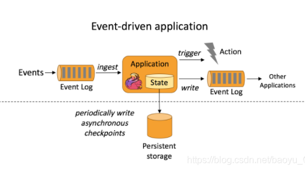
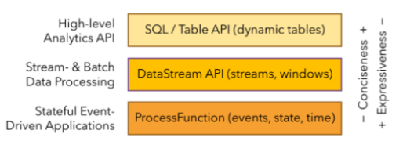
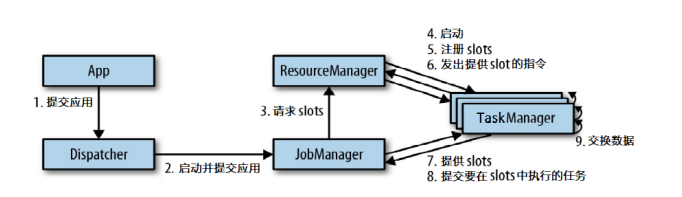
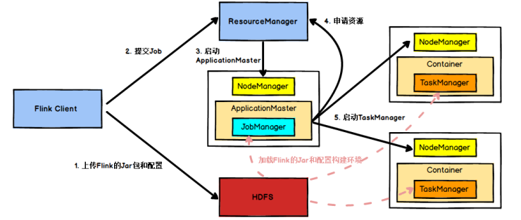

# Flink

## 1. Flink 简介

Flink项目的理念是：“**Apache Flink是为分布式、高性能、随时可用以及准确的流处理应用程序打造的开源流处理框架**”。

Flink 是一个分布式的流处理框架，它能够对有界和无界的数据流进行有状态计算。FLink被设计在所有常见的集群环境中运行，以内存执行速度和任意规模来执行计算。Flink 的核心是流处理，当然它也能支持批处理，Flink 将批处理看成是流处理的一种特殊情况，即数据流是有明确界限的。这和 Spark Streaming 的思想是完全相反的.

### Flink的重要特点

#### **事件驱动型(Event-driven)**

事件驱动型应用是一类具有状态的应用，它从一个或多个事件流提取数据，并根据到来的事件**触发**计算、状态更新或其他外部动作。比较典型的就是以kafka为代表的消息队列几乎都是事件驱动型应用。

**特点**

1. 如何触发来源于接收的数据流，无需连接远程数据库，应用只需访问本地（内存或磁盘）即可获取流式数据；
2. 能够定期向远程持久化存储写入（checkpoint）,保证系统的容错性。

**spark streaming数据流微批次和Flink流式事件驱动对比：**

Spark Streaming 微批次：

事件驱动型：

### 流与批

**批处理**的特点是有界、持久、大量、非常适合需要访问全套记录才能完成的计算工作，一般用于离线统计。

**流处理**的特点是无界、实时、无需针对整个数据集执行操作，而是对通过系统传输的每个数据项执行操作，一般用于实时统计。

在spark中，一切都是由批次组成的，离线数据是一个大批此，而实时数据是由一个一个无限小的批次组成的。

在Flink中，一切都是由流组成的，离线数据是有界限的流，实时数据是一个没有界限的流，这就是所谓的有界流和无界流。

**无界数据流：** 无界数据流有一个开始，但是没有结束。它们不会再生成时终止并提供数据，必须连续处理无界流，也就是说必须再获取后理解处理event。对于无界数据流我们无法等待所有数据都到达，因为输入是无界的，并且在任何时间点都不会完成。处理无界数据通常要求以特定顺序（例如事件发生的顺序）获取event,以便能够推断结果完整性。

**有界数据流：** 有界数据流有明确定义的开始和结束，可以在执行人和计算之前通过获取所有数据来处理有界流，处理有界流不需要有序获取，因为可以始终对有界数据集进行排序，有界流的处理也称为批处理。

**流架构最大的好处就是具有极低的延迟。**

### 分层 api

最底层级的抽象仅仅提供了有状态流，它将通过过程函数（Process Function）被嵌入到DataStream API中。底层过程函数（Process Function）与 DataStream API 相集成，使其可以对某些特定的操作进行底层的抽象，它允许用户可以自由地处理来自一个或多个数据流的事件，并使用一致的容错的状态。除此之外，用户可以注册事件事件并处理事件回调，从而使程序可以处理复杂的计算。

实际上，大多数应用并不需要上述的底层抽象，而是针对核心API(Core APIs)进行编程，比如DataStream API(有界或无界流数据)以及DataSet API(有界数据集)。这些API为数据处理提供了通用的构建模块，比如由用户定义的多种形式的转换（transformations），连接（joins）,聚合（aggregations）,窗口操作（Windows）等等。

DataSet API 为有界数据集提供了额外的支持，例如循环与迭代。这些API处理的数据类型以类（classes）的形式由各自的编程语言所表示。

## 2. Flink 核心架构

Flink 采用分层的架构设计，从而保证各层在功能和职责上的清晰。如下图所示，由上而下分别是 API & Libraries 层、Runtime 核心层以及物理部署层：

### 2.1 API & Libraries 层

这一层主要提供了编程 API 和 顶层类库：

* 编程 API : 用于进行流处理的 DataStream API 和用于进行批处理的 DataSet API；
* 顶层类库：包括用于复杂事件处理的 CEP 库；用于结构化数据查询的 SQL & Table 库，以及基于批处理的机器学习库 FlinkML 和 图形处理库 Gelly。

### 2.2 Runtime 核心层

这一层是 Flink 分布式计算框架的核心实现层，包括作业转换，任务调度，资源分配，任务执行等功能，基于这一层的实现，可以在流式引擎下同时运行流处理程序和批处理程序。

### 2.3 物理部署层

Flink 的物理部署层，用于支持在不同平台上部署运行 Flink 应用。

## 3. Flink 分层 API

在上面介绍的 API & Libraries 这一层，Flink 又进行了更为具体的划分。具体如下：

按照如上的层次结构，API 的一致性由下至上依次递增，接口的表现能力由下至上依次递减，各层的核心功能如下：

### 3.1 SQL & Table API

SQL & Table API 同时适用于批处理和流处理，这意味着你可以对有界数据流和无界数据流以相同的语义进行查询，并产生相同的结果。除了基本查询外， 它还支持自定义的标量函数，聚合函数以及表值函数，可以满足多样化的查询需求。

### 3.2 DataStream & DataSet API

DataStream & DataSet API 是 Flink 数据处理的核心 API，支持使用 Java 语言或 Scala 语言进行调用，提供了数据读取，数据转换和数据输出等一系列常用操作的封装。

### 3.3 Stateful Stream Processing

Stateful Stream Processing 是最低级别的抽象，它通过 Process Function 函数内嵌到 DataStream API 中。 Process Function 是 Flink 提供的最底层 API，具有最大的灵活性，允许开发者对于时间和状态进行细粒度的控制。

## 4. Flink 集群架构

## 4.1  核心组件

按照上面的介绍，Flink 核心架构的第二层是 Runtime 层， 该层采用标准的 Master - Slave 结构， 其中，Master 部分又包含了三个核心组件：Dispatcher（分发器）、ResourceManager（资源管理器） 和 JobManager（作业管理器），而 Slave 则主要是 TaskManager（任务管理器） 进程。它们的功能分别如下：

* **JobManagers** (也称为  *masters* ) ：
  * 控制一个应用程序执行的主进程，也就是说，每个应用程序都会被一个不同的JobManager所控制执行。JobManagers 接收由 Dispatcher 传递过来的执行程序，该执行程序包含了作业图 (JobGraph)，逻辑数据流图 (logical dataflow graph) 及其所有的 classes 文件以及第三方类库 (libraries) 等等 。紧接着 JobManagers 会将 JobGraph 转换为一个物理层面的数据流图，这个图被叫做执行图 (ExecutionGraph)，包含了所有可以并发执行的任务。然后JobManager向 ResourceManager 申请资源来执行该任务，一旦申请到资源，就将执行图分发给对应的 TaskManagers 。因此每个作业 (Job) 至少有一个 JobManager；高可用部署下可以有多个 JobManagers，其中一个作为  *leader* ，其余的则处于 *standby* 状态。
* **TaskManagers** (也称为  *workers* ) : Flink的工作进程，通常Flink中会有多个TaskManager运行，TaskManagers 负责实际的子任务 (subtasks) 的执行，每个 TaskManagers 都拥有一定数量的插槽(slots)。Slot 是一组固定大小的资源的合集 (如计算能力，存储空间)。TaskManagers 启动后，会将其所拥有的 slots 注册到 ResourceManager 上，由 ResourceManager 进行统一管理。
* **Dispatcher** ：可以跨作业运行，它为应用提交提供了REST接口。负责接收客户端提交的执行程序，并传递给 JobManager 。由于是REST接口，所以Dispatcher可以作为集群的一个HTTP接入点，这样就能够不受防火墙阻拦。除此之外，它还提供了一个 WEB UI 界面，用于展示和监控作业的执行情况。Dispatcher在架构中可能并不是必需的，这取决于应用提交运行的方式。
* **ResourceManager** ：负责管理任务管理器(TaskManager)的插槽（slots） 并协调集群资源。ResourceManager 接收来自 JobManager 的资源请求，并将存在空闲 slots 的 TaskManagers 分配给 JobManager 执行任务。Flink 基于不同的部署平台，如 YARN , Mesos，K8s 等提供了不同的资源管理器，当 TaskManagers 没有足够的 slots 来执行任务时，它会向第三方平台发起会话来请求额外的资源。另外，ResourceManager还负责终止空闲的TaskManager，释放计算资源。

## 任务提交流程

我们来看看当一个应用提交执行时，Flink的各个组件是如何交互协作的：

上图是从一个较为高层级的视角，来看应用中各组件的交互协作。如果部署的集群环境不同（例如YARN,Mesos,Kubernetes,standalone等），其中一些步骤可以被省略，或是有些组件会运行在同一个JVM进程中。

具体地，如果我们将Flink集群部署到YARN上，那么就会有如下的提交流程：

Flink任务提交后，client向HDFS上传Flink的Jar包和配置，之后向Yarn ResourceManager提交任务，ResourceManager分配Container资源并通知对应的NodeManager启动ApplicationMaster，

## 5. Flink 的优点

最后基于上面的介绍，来总结一下 Flink 的优点：

* Flink 是基于事件驱动 (Event-driven) 的应用，能够同时支持流处理和批处理；
* 基于内存的计算，能够保证高吞吐和低延迟，具有优越的性能表现；
* 支持精确一次 (Exactly-once) 语意，能够完美地保证一致性和正确性；
* 分层 API ，能够满足各个层次的开发需求；
* 支持高可用配置，支持保存点机制，能够提供安全性和稳定性上的保证；
* 多样化的部署方式，支持本地，远端，云端等多种部署方案；
* 具有横向扩展架构，能够按照用户的需求进行动态扩容；
* 活跃度极高的社区和完善的生态圈的支持。

## 参考资料

1. [大数据学习](https://gitee.com/jerry-chen417/flink-real-time-data-warehouse/blob/master/Flink%E5%9F%BA%E7%A1%80.md)
2. [Flink 原理与实现：内存管理](https://zhuanlan.zhihu.com/p/27241485)
3. [Flink (二）Flink 三种类型的应用来处理流式数据：事件驱动型、数据分析型、数据管道型](https://blog.csdn.net/baoyu_G/article/details/112848383)
