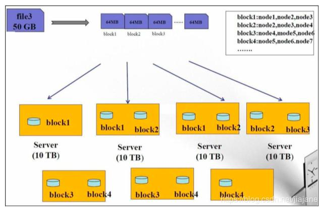
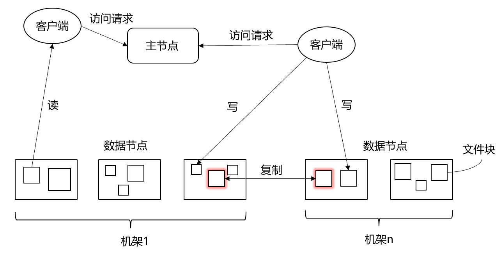
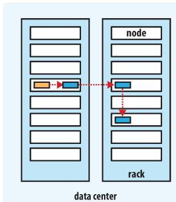
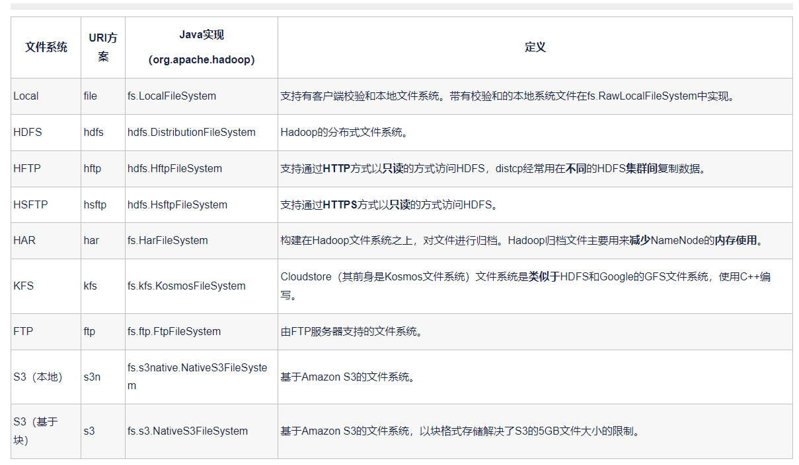

# 第3章 Hadoop分布式文件系统
---

（本学习笔记来源于[DataWhale-妙趣横生大数据](https://shenhao-stu.github.io/Big-Data/)）

`数据块/副本` `负载均衡` `心跳机制` `副本存放策略` `元数据/元数据管理` `安全模式` `机架感知`

## 3.1 HDFS前言 

**HDFS(hadoop Distributed File System)** 是Hadoop下的分布式文件系统，主要用来解决海量数据的存储问题。具有高容错、高吞吐量等特性，可以部署在低成本的硬件上。

- 设计思想
   分而治之，将大文件，大批量文件，分布式的存放于大量服务器上。以便于采取分而治之的方法对海量数据及逆行运算分析
- 在大数据系统架构中的应用：为各类分布式运算框架（MapReduce,Spark,Tez,Flink）提供数据存储服务。
- 重点概念：数据块/副本，负载均衡，心跳机制，副本存放策略，元数据/元数据管理，安全模式，机架感知

## 3.2 HDFS设计思路

HDFS被设计成用来使用低廉的服务器来进行海量数据的存储，那是怎么做到的呢？

- 大文件被切割成小文件，使用分而治之的思想让很多服务器对同一个文件进行联合管理
- 每个小文件做冗余备份，并且分散存到不同的服务器，做到高可靠不丢失



**HDFS 数据存储单元（block）**

- 文件被切分成固定大小的数据块
  - 基本读写单位，类似于磁盘的页，每次读写一个块
  - 默认数据块大小为128MB(hadoop2.x),可配置
  - 若文件大小不到128MB,则单独存成一个block
  - 配置大数据块主要是因为：
   1）  减少寻址开销，一般硬盘传输速率比寻址时间要快，大数据块可以最小化寻址开销；  
   2）  简化存储管理，每个块都需要在NameNode上有对应的记录；  
   3）  对数据块进行读写，减少建立网络的连接成本；  
- 一个文件存储方式
  - 按大小被切分成若干个block，存储道不同节点上。
  - 默认情况下每个block都有三个副本
- Block大小和副本数通过client端上传文件时设置，文件上传成功后副本数可以变更，Block  size 不可变更。


HDFS中的`fsck`指令可以显示块信息。

```md
% hdfs fsck / -files -blocks 
```


## 3.3 HDFS架构





### 3.2.1 HDFS 架构

HDFS遵循主/从架构，由单个名称节点NameNode(NN)和多个数据节点DataNode(DN)组成：

- **NameNode**:负责执行有关`文件系统命名空间`的操作，它维护着文件系统树及整颗树内所有的文件和目录。 这些信息以两个文件形式永久保存在本地磁盘上:`命名空间镜像文件`和`编辑日志文件`。例如打开，关闭，重命名文件和目录等。它同时还负责集群元数据的存储，记录着文件中各个数据块的位置信息。
- **SecondaryNamenode**： 辅助namenode,严格说并不是 NameNode 备份节点，主要给 namenode 分担压力之用
- **DataNode**:负责提供来自文件系统客户端的读写请求，在NameNode的统一调度下进行数据块的创建，删除和复制等操作。
- 每个数据节点会周期性地向名称节点发送"**心跳**"信息，报告自己的状态，没有按时发送心跳信息的数据节点会被标记为"宕机"，不会再给它分配任何I/O请求。 由于数据不再可用，可能会导致某些块的复制因子小于其指定值，NameNode 会跟踪这些块，并在必要的时候进行重新复制。

用户在使用HDFS时，仍然可以像在普通文件系统中那样，使用文件名去存储和访问文件。


实际上，在系统内部，一个文件会被切分成若干个数据块，这些数据块被分布存储到若干个数据节点.当客户端需要访问一个文件时，首先把文件名发送给名称节点，名称节点根据文件名找到对应的数据块（所有相关），再根据每个数据块信息找到实际存储的数据节点位置并发送给客户端，客户端直接访问这些数据节点并获取数据。

> 注意：在整个访问过程中，名称节点并不参与数据的传输。

这种设计方式，是的各个文件的数据能够在不同的数据节点上实现并发访问，大大提高数据访问速度。


### 3.2.2 文件系统命名空间

HDFS的`文件系统命名空间`的层次结构与大多数文件系统类似（如linux）,支持目录和文件的创建、移动、删除和重命名等操作，支持配置用户和访问权限，但不支持硬连接和软连接。

`NameNode`负责维护文件系统名称空间，记录对名称空间或其属性的任何更改。


## 3.3 数据存放策略

数据存取策略包括**数据存放、数据读取和数据复制**。


### 3.3.1 数据存放

HDFS采用了以机架(Rack)为基础的数据存放策略。一个HDFS集群通常包含多个机架，不同机架之间的数据通信需要经过**交换机或路由器**，同一个机架的不同机器之间数据通信**不需要交换机或路由器**，在大多数情况下，相同机架上节点间的网络带宽优于在不同机架上的节点。

另外，Hadoop 将每个文件的数据进行分块存储，每一个数据块又保存有多个副本，NameNode 设法将数据块副本保存在不同的机架上以提高容错性。

但是 HDFS 是如何确定两个节点是否是同一节点，如何确定不同节点跟客户端的远近呢？

答案就是机架感知！！！！

HDFS默认每个数据节点都是在不同机架上的，这样有一个缺点：**写入数据的时候不能充分利用同一机架内部机器之间的带宽。**,这种方法同时也带来了更多显著的优点：

- 可以获得很高的数据可靠性，即使一个机架发生故障，位于其他机架上的数据副本仍然可用。
- 在读数据的时候，可以在多个机架上并行读取数据，大大提高了数据读取速度。
- 可以更容易实现系统内部负载均衡和错误纠正。

副本的存放策略是 HDFS 实现高可靠性和高性能的关键。

HDFS默认的冗余复制因子是3，每一个文件会被同时保存到3个地方。其中两份副本放在同一个机架的不同机器上面，第三个副本放在不同机架的机器上面。



- 第一个 block 副本存放在 client 所在的 node 中（如果 client 不在集群范围内，则第一个 node 是随机选取 的，系统会尝试不选择那些太满或者太忙的 node）；

- 第二个副本放置在与第一个 node 不同机架的 node 中（近乎随机选择，系统会尝试不选择那些太满或者太忙 的 node）；

- 第三个副本放在与第二个副本同机架不同的 node 中。

如果还有更多的副本就随机放在集群的 node 中，限制每个 node 不超过一个副本，同时保持每个机架的副本数量低于上限（（副本数-1）/机架 + 2）。

### 3.3.2 数据读取

HDFS提供了一个API，用于确定一个数据节点所属的机架的ID，客户端可以调用该API获取自己所属机架的ID。
当客户端读取数据时，从名称节点获取数据块不同副本的存放位置的列表，列表中包含了副本所在的数据节点，可以调用API确定客户端和这些数据节点所属的机架ID。当发现某个数据块副本对应的机架ID和客户端对应的机架的ID相同时，则优先选择该副本读取数据；如果没有发现，则随机选择一个副本读取数据。

### 3.3.3 数据复制

HDFS的数据复制采用了 **流水线复制** 的策略，大大提高了数据复制过程的效率。

流水线复制原理:

> 当客户端要向HDFS中写入一个文件时，这个文件会首先被写入本地，并被切分成若干个块，每个块的大小是由HDFS的设定值来决定。每个块都向HDFS集群中的名称节点发起写请求，名称节点会根据系统中各个数据节点的使用情况，选择一个数据节点列表返回给客户端，然后客户端就把数据首先写入列表中的第1个数据节点，同时把列表传给第1个数据节点，当第1个数据节点接收到一个块的数据的时候，将其写入本地，并且向列表中的第2个数据节点发起连接请求，把自己已经接收到的数据和列表传给第2个数据节点，当第2个数据节点接收到数据的时候，将其写入本地，并且向列表中的第3个数据节点发起连接请求，依次类推，列表中的多个数据节点形成一条数据复制的流水线。最后，当文件写完的时候，数据复制也同时完成。

### 3.3.4  修改副本数

第一种方式:修改集群文件 hdfs-site.xml

```
<property> 
	<name>dfs.replication</name> 
	<value>1</value>
</property>

```

第二种方式:命令设置

```
bin/hadoop fs -setrep -R 1 /
```

## 3.4 HDFS 核心设计

### 3.4.1 Hadoop 心跳机制

- Hadoop 是 Master/Slave 结构，Master 中有 NameNode 和 ResourceManager，Slave 中有 Datanode 和 NodeManager
- aster 启动的时候会启动一个 IPC(Inter-Process Comunication，进程间通信)server 服 务，等待 slave 的链接
  Slave 启动时，会主动链接 master 的 ipc server 服务，并且每隔 3 秒链接一次 master，这 个间隔时间是可以调整的，参数为 dfs.heartbeat.interval，这个每隔一段时间去连接一次 的机制，我们形象的称为心跳。Slave 通过心跳汇报自己的信息给 master，master 也通 过心跳给 slave 下达命令
- NameNode 通过心跳得知 Datanode 的状态 ResourceManager 通过心跳得知 NodeManager 的状态
  如果 master 长时间都没有收到 slave 的心跳，就认为该 slave 挂掉了。

**Namenode 感知到 Datanode 掉线死亡的时长计算:**

HDFS 默认的超时时间为 `10 分钟+30 秒`。 这里暂且定义超时时间为 timeout

计算公式为:

$$
timeout = 2 * heartbeat.recheck.interval + 10 * dfs.heartbeat.interval
$$

而默认的heartbeat.recheck.interval 大小为 5分 钟，dfs.heartbeat.interval 默认的大小为 3 秒。
需要注意的是 hdfs-site.xml 配置文件中的 heartbeat.recheck.interval 的单位为毫秒， dfs.heartbeat.interval 的单位为秒
所以，
举个例子，如果 heartbeat.recheck.interval 设置为 5000(毫秒)，dfs.heartbeat.interval 设置为 3(秒，默认)，则总的超时时间为 40 秒

```
<property> 
	<name>heartbeat.recheck.interval</name>
	<value>5000</value>
</property> 
<property>
	<name>dfs.heartbeat.interval</name>
	<value>3</value> 
</property>

```


### 3.4.2 HDFS安全模式

**问题：** 集群启动后，可以查看目录，但是上传文件时报错，打开 web 页面可看到 namenode正处于 `safemode` 状态，怎么处理?

**解释：**

`safemode` 是 NameNode 的一种状态(active/standby/safemode 安全模式)

#### NameNode进入安全模式的原理

- NameNode发现集群中的block丢失率达到一定比例时(0.1%),NameNode就会进入安全模式
- 在安全模式下，客户端不能对任何数据进行操作，只能查看元数据信息(比如 Is/mkdir),丢失率可以手动配置，默认是 `dfs.safemode.threshold.pct=0.999f`
- 如何退出安全模式？ 
  - 找到问题所在，进行修复(比如修复宕机的datanode)或者可以手动强行退出安全模式(但是并没有真正解决问题)

在 HDFS 集群正常冷启动时，NameNode也会在 safemode 状态下维持相当长的一段时间，此时你不需要理会，等待它自动退出安全模式即可。

#### 正常启动的时候进入安全的原理

原理:
namenode 的内存元数据中，包含文件路径、副本数、blockid，及每一个 block 所在 datanode 的信息，而 fsimage 中，不包含 block 所在的 datanode 信息，那么，当 namenode 冷启动时，此时内存中的元数据只能从 fsimage 中加载而来，从而就没有 block 所在的 datanode 信息——>就会导致 namenode 认为所有的 block 都已经丢失——>进入安全模式— —>datanode 启动后，会定期向 namenode 汇报自身所持有的 blockid 信息，——>随着 datanode 陆续启动，从而陆续汇报 block 信息，namenode 就会将内存元数据中的 block 所 在 datanode 信息补全更新——>找到了所有 block 的位置，从而自动退出安全模式

#### 安全模式常用操作命令

```
hdfs dfsadmin -safemode leave //强制 NameNode 退出安全模式
hdfs dfsadmin -safemode enter //进入安全模式
hdfs dfsadmin -safemode get //查看安全模式状态
hdfs dfsadmin -safemode wait //等待，一直到安全模式结束
```
如果你使用的版本是 2.X 之前的版本，那么这个 hdfs 命令可以替换成 hadoop，它们都在 bin 目录下


### 3.4.3 负载均衡

机器与机器之间磁盘利用率不平衡时HDFS集群非常容易出现的情况。
尤其在DataNode节点出现故障或在现有的集群上增添新的DataNode的时候分析数据块分布和重新均衡DataNode上的数据分布的工具

命令：

```shell
sbin/start-balancer.sh
sbin/start-balancer.sh -threshold 5 
```

自动进行均衡非常慢，一天能移动的数据量在10G-10T的级别，很难满足超大集群的需求，原因：HDFS集群默认不允许balance操作占用很大的网络带宽，这个带宽是可以调整的。

```md
hdfs dfsadmin -setBalancerBandwidth newbandwidth
hdfs dfsadmin -setBalancerBandwidth 10485760 
```
该数值的单位是字节，上面的配置是10M/s，默认为1M/s，另外，也可以在 hdfs-site.xml 配置文件中进行设置:

```md
<property>
	<name>dfs.balance.bandwidthPerSec</name>
	<value>10485760</value>
	<description> Specifies the maximum bandwidth that each datanode can utilize for the balancing purpose in term of the number of bytes per second. 	</description> 
</property>

sbin/start-balancer.sh -t 10%

```
机器容量最高的那个值 和 最低的那个值得差距 不能超过 10%


## 3.5 HDFS的数据读写过程

### 3.5.1 读数据的过程

具体流程：

1. 客户端通过 FileSystem.open() 打开文件，相应地，在HDFS文件系统中，DistributedFileSystem具体实现了FileSystem。因此，调用open()方法后，DistributedFileSystem会创建输入流FSDataInputStream，对于HDFS而言，具体的输入流就是DFSInputStream。
2. 在DFSInputStream的构造函数中，输入流通过ClientProtocal.getBlockLocations() 远程调用名称节点，获得文件开始部分的数据块保存位置。对于该数据块，名称节点返回保存该数据块的所有数据节点的地址，同时，根据距离客户端的远近对数据节点进行排序；然后，DistributedFileSystem会利用DFSInputStream来实例化FSDataInputStream，返回给客户端，同时返回了数据块的数据节点地址。
3. 获得输入流FSDataInputStream后，客户端调用read()函数读取数据。输入流根据前面的排序结果，选择距离客户端最近的数据节点建立连接并读取数据。
4. 数据从该数据节点读到客户端；当该数据块读取完毕时，FSDataInputStream关闭与该数据节点的连接。
5. 输入流通过getBlockLocations()方法查找下一个数据块（如果客户端缓存中已经包含了该数据块的位置信息，就不需要调用该方法）。
6. 找到该数据块的最佳数据节点，读取数据。
7. 当客户端读取完毕数据的时候，调用FSDataInputStream的close()函数，关闭输入流。需要注意的是，在读取数据的过程中，如果客户端与数据节点通信时出现错误，就会尝试连接包含此数据块的下一个数据节点。

### 3.5.2 写数据的过程

具体流程：

1. 客户端通过 FileSystem.create() 创建文件。相应地，在HDFS文件系统中， DistributedFile System具体实现了FileSystem。因此，调用create()方法后，DistributedFileSystem会创建输出流对象FSDataOutputStream，对于HDFS而言，具体的输出流就是DFSOutputStream。
2. 然后，DistributedFileSystem通过RPC远程调用名称节点，在文件系统的命名空间中创建一个新的文件。名称节点会执行一些检查，比如文件是否已经存在，客户端是否有权限创建文件等。检查通过之后，名称节点会构造一个新文件，并添加文件信息。远程方法调用结束后，DistributedFileSystem会利用DFSOutputStream来实例化FSDataOutputStream，返回给客户端，客户端使用这个输出流写入数据。
3. 获得输出流FSDataOutputStream以后，客户端调用输出流的write()方法向HDFS对应的文件写入数据。
4. 客户端向输出流FSDataOutputStream中写入的数据，会首先被分成一个个的分包，这些分包被放入DFSOutputStream对象的内部队列。输出流FSDataOutputStream会向名称节点申请保存文件和副本数据块的若干个数据节点，这些数据节点形成一个数据流管道。队列中的分包最后被打包成数据包，发往数据流管道中的第一个数据节点，第一个数据节点将数据包发送给第二个数据节点，第二个数据节点将数据包发送给第三个数据节点，这样，数据包会流经管道上的各个数据节点（即流水线复制策略）。
5. 因为各个数据节点位于不同机器上，数据需要通过网络发送，因此，为了保证所有数据节点的数据都是准确的，接收到数据的数据节点要向发送者发送“确认包”（ACK Packet）。确认包沿着数据流管道逆流而上，从数据流管道依次经过各个数据节点并最终发往客户端，当客户端收到应答时，它将对应的分包从内部队列移除。不断执行第3~5步，直到数据全部写完。
6. 客户端调用close()方法关闭输出流，此时开始，客户端不会再向输出流中写入数据，所以，当DFSOutputStream对象内部队列中的分包都收到应答以后，就可以使用ClientProtocol.complete()方法通知名称节点关闭文件，完成一次正常的写文件过程。

## 3.6 HDFS优缺点

**HDFS优点：**

- **可构建在廉价的硬件设备：** 通过多副本提高可靠性，提供了容错和恢复机制
- **高容错性：** 数据自动保存多个副本，副本丢失后，自动恢复
- **流式数据访问：** 一次性写入，多次读取，保证数据一致性，不支持随机读写的操作
- **适合大数据处理：** GB、TB、甚至 PB 级数据，百万规模以上的文件数量，10K+节点规模
- **强大的跨平台兼容性：** 采用`JAVA`语言实现
- **适合批处理：** 移动计算而非数据，数据位置暴露给计算框架

**HDFS 局限性：**


- **不适合低延迟数据访问：** HDFS主要是**面向大规模数据批量处理而设计**的，采用**流式数据读取**，具有**很高的数据吞吐率**，但是，这也意味着**较高的延迟**，因此，HDFS不适用在需要较低延迟*（如数十毫秒）的应用场合。对于低延迟要求的应用程序而言，HBase是一个更好的选择；
- **无法高效存储大量小文件：** 小文件存取占用namenode大量内存，寻道时间超过读取时间
- **不支持多用户写入及任意修改文件：** 一个文件只能有一个写入者，仅支持append，即写操作总是以"只添加"方式在文件末尾写数据。它不支持多个写入者的操作。也不支持在文件的任意位置进行修改。

**HDFS 不适合存储小文件：**

- 元信息存储在NameNode内存中，一个节点的内存是有限的
- 存取大量小文件消耗大量的寻道时间，类比拷贝大量小文件和拷贝同等大小的一个文件
- NameNode存储block数量有限的，一个block元信息消耗大约150byte内存，存储1亿个block，大约需要20GB内存，如果一个文件大小为10k,则1亿个文件大小为1TB(但要消耗掉namenode 20GB 内存)。


## 3.7 HDFS 文件系统

HDFS 文件系统可以执行常用的文件系统操作，例如，读取文件，新建目录，移动文件，删除数据，列出目录，等等。可以输入 `hadoop fs -help`命令获取每个命令的详细帮助文件。

本地文件系统将一个文件复制到HDFS:

```shell
% hadoop fs -copyFromLocal input/docs/quangle.txt \ hdfs://localhost/user/tom/quangle.txt  
```
本地文件`quangle.txt`被复制到运行在localhost上的HDFS实例中，路径为`/user/tom/quangle.txt`.  事实上，我们可以省略主机的URL并使用默认设置，即省略`hdfs://localhost`, 因为该项已在`core-site.xml`中指定。

```shell
% hadoop fs -copyFromLocal input/docs/quangle.txt /user/tom/quangle.txt  
```
我们也可以使用相对路径，并将文件复制到HDFS的home目录中，本地中为`/user/tom`

```shell
% hadoop fs -copyFromLocal input/docs/quangle.txt quangle.txt  
```

我们把文件复制回本地系统，并检查是否一致：

```md
% hadoop fs -copytoLocal quangle.txt quangle.copy.txt
% md5 input/docs/quangle.txt quangle.copy.txt 
```

MD5键值相同，表明这个文件在HDFS之旅中得以幸存并保存完整。

新建一个目录，并且在列表中显示：

```shell
hadoop fs -mkdir books
hadoop fs -ls . 
```

HDFS的文件访问权限模式跟POSIX 的权限模式非常相似。一个提供了三类权限模式：只读权限(r)、写入权限(w)和可执行权限(x)。每个文件和目录都有所属用户(owner)、所属组别（group）及模式（mode）.

### 3.7.2 Hadoop文件系统 

Hadoop有一个抽象的文件系统概念，HDFS只是其中的一个实现。Java抽象类`org.apache.hadoop.fs.FileSystem`定义了Hadoop中一个文件系统的客户端接口。


其他常见命令

```md
#cat 数据
hadoop fs -cat /usr/hive/warehouse/hivewithhdfs.db/record/data.txt
#修改目录或者文件权限
hadoop fs -chmod -R 777 /usr
#改变文件或者目录 owner
hadoop fs -chown -R root:root /usr
#创建文件夹
hadoop fs -mkdir <paths>
#本地文件发送到 HDFS 上
hadoop fs -put <localsrc> ... <dst>
#本地文件系统将一个文件复制到 HDFS 上
hadoop fs -copyFromLocal input/docs/quangle.txt \ <hdfs://localhost/>user/tom/quangle.txt    # hdfs://localhost/ 可省略，core-site.xml已指定。

#查看文件或者目录的存储使用量
hadoop fs -du URI [URI …]
#删除文件
hadoop fs -rm URI [URI …]
#设置目录或者文件的拷贝数
hadoop fs–setrep [-R] [-w] REP PATH [PATH …]
#检查集群文件坏块
hadoop fsck <path> [-move | -delete | -openforwrite] [-files [-blocks [-locations | -racks]]]
```

另外，此外如果您的集群是高 HA 集群（双 namenode），您可以通过如下命名查看哪个 namenode 是 active 的。

```md
#nn1 是 namenode 的 ID，一般为 nn1 和 nn2
hdfs haadmin -getServiceState nn1
#查看当前集群报告
hdfs dfsadmin -report
#namenode 离开安全模式
hdfs dfsadmin -safemode leave
```

## 参考资料

1. [HDFS 副本存放策略](https://www.freesion.com/article/32251142386/)
2. [HDFS知识整理](https://www.freesion.com/article/3093185943/)
4. [Hadoop源码分析之FileSystem抽象文件系统](https://www.cnblogs.com/dj-blog/p/9178465.html)

