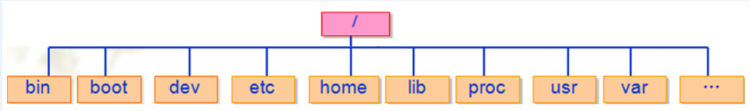
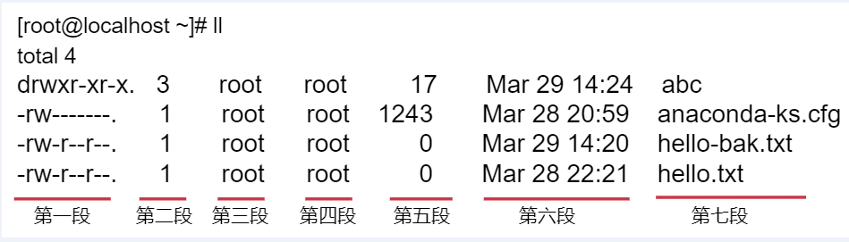

# Linux

Linux文件系统 和 Windows文件系统有一些区别，Windows是分C盘、D盘、E盘...的，但是在Linux中是有一个最大的目录，称之为根目录，用 / 表示，根目录下面会有很多子目录，这些子目录其实可以理解为windows中C盘、D盘、E盘。



- bin 存放二进制可执行文件(ls,cat,mkdir等)
- boot 存放用于系统引导时使用的各种文件
- dev 存放设备文件
- etc 存放系统配置文件
- home 存放所有用户文件的根目录
- lib 存放跟文件系统中的程序运行所需要的共享库及内核模块
- proc 虚拟文件系统，存放当前内存的映射
- usr 存放系统应用程序，比较重要的目录/usr/local 管理员软件安装目录
- var 存放运行时需要改变数据的文件
- mnt 挂载目录
- sbin 存储管理级别的二进制执行文件
- root 超级用户主目录
- opt 额外安装的可选应用程序包安装位置

下面开始正式分析Linux中的基本命令。

## 文件查看

pwd 列出当前目录的路径

查看当前所在的路径

注意，~表示是用户家目录，目前我们登陆的是root用户，root用户的家目录是/root

```shell
root@ustc01:~# pwd
/root
```

ls 列出当前目录下的所有文件

```shell
root@ustc01:/# ls
bin   dev  home  lib    lib64   lost+found  mnt  proc  run   snap  sys  usr
boot  etc  init  lib32  libx32  media       opt  root  sbin  srv   tmp  var
```

ll(ls -l缩写) 列出当前目录下的文件（带文件信息）

```shell
root@ustc01:/home# ll
total 12
drwxr-xr-x  3 root      root      4096 Feb 25 20:33 ./
drwxr-xr-x 19 root      root      4096 Feb 26 20:58 ../
drwxr-xr-x  4 datawhale datawhale 4096 Feb 26 18:24 datawhale/
```

ll -a 列出当前目录下的所有文件（包括隐藏文件）

```shell
root@ustc01:~# ll -a
total 20
drwx------  3 root root 4096 Feb 25 20:36 ./
drwxr-xr-x 19 root root 4096 Feb 26 20:58 ../
-rw-r--r--  1 root root 3106 Dec  5  2019 .bashrc
drwxr-xr-x  3 root root 4096 Feb 25 20:36 .docker/
-rw-r--r--  1 root root  161 Dec  5  2019 .profile
```

ll --help 查看ls用法，--help是一个帮助命令

```shell
root@ustc01:~# ll --help
Usage: ls [OPTION]... [FILE]...
List information about the FILEs (the current directory by default).
Sort entries alphabetically if none of -cftuvSUX nor --sort is specified.

Mandatory arguments to long options are mandatory for short options too.
  -a, --all                  do not ignore entries starting with .
........
```

## 创建、重命名文件\文件夹

touch filename 创建空文件

创建空文件hello.txt

```shell
root@ustc01:/home# touch hello.txt
root@ustc01:/home# ll
total 12
drwxr-xr-x  3 root      root      4096 Feb 26 21:14 ./
drwxr-xr-x 19 root      root      4096 Feb 26 20:58 ../
drwxr-xr-x  4 datawhale datawhale 4096 Feb 26 18:24 datawhale/
-rw-r--r--  1 root      root         0 Feb 26 21:14 hello.txt
```

mkdir 创建目录
创建目录abc

```shell
root@ustc01:/home# mkdir abc
root@ustc01:/home# ll
total 16
drwxr-xr-x  4 root      root      4096 Feb 26 21:14 ./
drwxr-xr-x 19 root      root      4096 Feb 26 20:58 ../
drwxr-xr-x  2 root      root      4096 Feb 26 21:14 abc/
drwxr-xr-x  4 datawhale datawhale 4096 Feb 26 18:24 datawhale/
-rw-r--r--  1 root      root         0 Feb 26 21:14 hello.txt
```

mkdir -p 目标目录存在也不报错

当我们在创建目录时不确定这个目录是否已存在的时候，可以使用-p参数， 就算目录已存在也不会报错，如果不指定-p参数会报错，会提示目录已存在

创建目录abc

```shell
root@ustc01:/home# mkdir abc
mkdir: cannot create directory ‘abc’: File exists
root@ustc01:/home# mkdir -p abc
root@ustc01:/home# ll
total 16
drwxr-xr-x  4 root      root      4096 Feb 26 21:14 ./
drwxr-xr-x 19 root      root      4096 Feb 26 20:58 ../
drwxr-xr-x  2 root      root      4096 Feb 26 21:14 abc/
drwxr-xr-x  4 datawhale datawhale 4096 Feb 26 18:24 datawhale/
-rw-r--r--  1 root      root         0 Feb 26 21:14 hello.txt
```

mv 重命名文件\文件夹

修改目录abc的名称为abx

```shell
root@ustc01:/home# mv abc abx
root@ustc01:/home# ls
abx  datawhale  hello.txt
```

## 链接文件

linux有两种链接：硬链接、符号(软)链接

软链接功能类似类似于windows的快捷方式，主要用于节省磁盘空间

首先看硬链接：硬链接相当于对原始文件的一个复制，不能对目录使用硬链接。

命令如下：

ln hello.txt hlink

```shell
root@ustc01:/home# ls
abx  datawhale  hello.txt
root@ustc01:/home# ln hello.txt hllink
root@ustc01:/home# ll
total 16
drwxr-xr-x  4 root      root      4096 Feb 26 21:18 ./
drwxr-xr-x 19 root      root      4096 Feb 26 20:58 ../
drwxr-xr-x  2 root      root      4096 Feb 26 21:14 abx/
drwxr-xr-x  4 datawhale datawhale 4096 Feb 26 18:24 datawhale/
-rw-r--r--  2 root      root         0 Feb 26 21:14 hello.txt
-rw-r--r--  2 root      root         0 Feb 26 21:14 hllink
root@ustc01:/home# ls
abx  datawhale  hello.txt  hllink
```

再看符号(软)链接：

如果想使用软连接，需要添加-s，相当于快捷方式，不能删除原文件

命令如下：

ln -s hello.txt vlink

```shell
root@ustc01:/home# ln -s hello.txt vlink
root@ustc01:/home# ls
abx  datawhale  hello.txt  hllink  vlink
root@ustc01:/home# ll
total 16
drwxr-xr-x  4 root      root      4096 Feb 26 21:19 ./
drwxr-xr-x 19 root      root      4096 Feb 26 20:58 ../
drwxr-xr-x  2 root      root      4096 Feb 26 21:14 abx/
drwxr-xr-x  4 datawhale datawhale 4096 Feb 26 18:24 datawhale/
-rw-r--r--  2 root      root         0 Feb 26 21:14 hello.txt
-rw-r--r--  2 root      root         0 Feb 26 21:14 hllink
lrwxrwxrwx  1 root      root         9 Feb 26 21:19 vlink -> hello.txt
```

## 切换目录

cd . 当前目录

一个`.`表示当前目录

```shell
root@ustc01:/home# pwd
/home
root@ustc01:/home# cd .
root@ustc01:/home# pwd
/home
```

cd .. 去上一级目录

两个`..`表示上一级目录

```shell
root@ustc01:/home# pwd
/home
root@ustc01:/home# cd ..
root@ustc01:/# pwd
/
```

cd ~ 去当前用户主(家)目录

```shell
root@ustc01:/# cd ~
root@ustc01:~# pwd
/root
```

cd xxx/xxx 直接跳转到某个目录

```shell
root@ustc01:~# cd /home/abx
root@ustc01:/home/abx# pwd
/home/abx
```

## 删除文件\文件夹(目录)

rm命令可以删除文件或者目录，也可以将某个目录及其下属的所有文件及其子目录均删除掉

对于链接文件，只是删除整个链接文件，而原有文件保持不变。

常见用法：

rm 删除文件

删除文件，但是会有提示确认对话，输入y确认删除！

```shell
root@ustc01:/home/abx# ls
abc.txt
root@ustc01:/home/abx# rm abc.txt
root@ustc01:/home/abx# ls
root@ustc01:/home/abx#
```

rm -r 删除目录，需要确认

删除目录需要指定r参数，否则会提示不能删除

r是给rm加入递归(recursion)特性，也就是目标为文件夹时删除文件夹下所有数据

使用rm -r 在删除目录的时候也会有提示确认对话，输入y确认删除

```shell
root@ustc01:/home/abx# mkdir test
root@ustc01:/home/abx# ls
test
root@ustc01:/home/abx# rm -r test
root@ustc01:/home/abx# ls
```

rm -f 强制删除
f给rm加入强制(force)特性，也就是遇到删除时不需要询问即可直接删除

注意：这个操作还是比较危险的，建议慎用，因为删除之后就找不到了

**Linux系统中没有回收站**

```shell
root@ustc01:/home/abx# ls
root@ustc01:/home/abx# mkdir test
root@ustc01:/home/abx# rm -f test
rm: cannot remove 'test': Is a directory
root@ustc01:/home/abx# rm test
rm: cannot remove 'test': Is a directory
root@ustc01:/home/abx# touch abc.txt
root@ustc01:/home/abx# rm -r abc.txt
root@ustc01:/home/abx# ls
test
root@ustc01:/home/abx# touch abc.txt
root@ustc01:/home/abx# rm -f abc.txt
root@ustc01:/home/abx# ls
test
```

m -rf 递归删除目录及其文件

Linux中最危险的操作，最具破坏性

rf参数可以强制递归删除任何数据，并且没有任何提示，慎用！慎用！慎用！

```shell
root@ustc01:/home/abx# touch abc.txt
root@ustc01:/home/abx# ls
abc.txt  test
root@ustc01:/home/abx# rm -rf /
rm: it is dangerous to operate recursively on '/'
rm: use --no-preserve-root to override this failsafe
root@ustc01:/home/abx# rm -rf
root@ustc01:/home/abx# ls
abc.txt  test
root@ustc01:/home/abx# rm -rf abc.txt
root@ustc01:/home/abx# ls
test
root@ustc01:/home/abx# rm -rf test
root@ustc01:/home/abx# ls
root@ustc01:/home/abx#
```

## 复制\粘贴\剪切

常见用法：

cp 复制&粘贴文件

复制hello.txt文件，复制后的文件名为hello-bak.txt

```shell
root@ustc01:/home# ls
abx  datawhale  hello.txt  hllink  vlink
root@ustc01:/home# cp hello.txt hello-bak.txt
root@ustc01:/home# ls
abx  datawhale  hello-bak.txt  hello.txt  hllink  vlink
```

cp -r 复制&粘贴文件或目录

复制目录，需要指定r参数

```shell
root@ustc01:/home# cd abx
root@ustc01:/home/abx# ls
abc.txt
root@ustc01:/home/abx# cd ..
root@ustc01:/home# cp -r abx xyz
root@ustc01:/home# ls
abx  datawhale  hello-bak.txt  hello.txt  hllink  vlink  xyz
root@ustc01:/home# cd xyz
root@ustc01:/home/xyz# ls
abc.txt
```

mv 移动（剪切）文件或目录

将目录xyz移动到目录abc下面

```shell
root@ustc01:/home# mv xyz abx
root@ustc01:/home# cd
root@ustc01:/home# ls
abx  datawhale  hello-bak.txt  hello.txt  hllink  vlink
root@ustc01:/home# cd abx
root@ustc01:/home/abx# ls
abc.txt  xyz
root@ustc01:/home/abx# cd xyz
root@ustc01:/home/abx/xyz# ls
abc.txt
```

## 远程复制

scp命令用于在网络中不同主机之间复制文件或目录。scp是有Security的文件copy，基于ssh登录，如果没有配置免密码登陆，需要输入主机密码。

常见用法：

从本地复制（192.168.182.131）到远程主机 （192.168.182.130）

scp /root/hello.txt 192.168.182.130:/root

```shell
[root@localhost ~]# scp /root/hello.txt  192.168.182.130:/root/
The authenticity of host '192.168.182.130 (192.168.182.130)' can't be established.
ECDSA key fingerprint is SHA256:uUG2QrWRlzXcwfv6GUot9DVs9c+iFugZ7FhR89m2S00.
ECDSA key fingerprint is MD5:82:9d:01:51:06:a7:14:24:a9:16:3d:a1:5e:6d:0d:16.
Are you sure you want to continue connecting (yes/no)? yes 【第一次会提示此信息，输入yes即可，以后就不提示了】
Warning: Permanently added '192.168.182.130' (ECDSA) to the list of known hosts.
root@192.168.182.130's password: 【在这里输入192.168.182.130机器的密码即可】
hello.txt                        100%    0     0.0KB/s   00:00
```

登录到192.168.182.130机器，确认文件是否成功复制过去

```shell
[root@localhost ~]# cd /root/
[root@localhost ~]# ll
total 4
-rw-------. 1 root root 1243 Mar 28 20:59 anaconda-ks.cfg
-rw-r--r--. 1 root root    0 Mar 29 14:30 hello.txt
[root@localhost ~]#
```

提示：

显示进度在scp后添加-v

复制目录在scp后添加-r

静默复制模式在scp后添加-q

scp -rq /root/abc 192.168.182.130:/root

```shell
[root@localhost ~]# scp -rq /root/abc/ 192.168.182.130:/root/
root@192.168.182.130's password:【在这里输入192.168.182.130机器的密码即可】
```

登录到192.168.182.130机器，确认目录是否成功复制过去

```shell
[root@localhost ~]# ll
total 4
drwxr-xr-x. 3 root root   17 Mar 29 14:33 abc
-rw-------. 1 root root 1243 Mar 28 20:59 anaconda-ks.cfg
-rw-r--r--. 1 root root    0 Mar 29 14:30 hello.txt
```

## 文件属性



**第一段：权限** 长度`11`，不足补`-`,结尾符`.`

第一个字符代表文件（-）、目录（d），链接（l）

其余字符每3个一组（rwx），读（r）、写（w）、执行（x）

第一组：文件所有者的权限是读、写和执行

第二组：与文件所有者同一组的用户的权限

第三组：不与文件所有者同组的其他用户的权限

也可用数字表示为：$r=4，w=2，x=1$，如：权限6可以表示为$r+w=6$

**第二段：目录/链接个数**

对于目录文件，表示它的第一级子目录的个数

> 注意：此处的值要减2才等于该目录下的子目录的实际个数(目录下默认包含.和..这两个目录)
>
> 对于其他文件，默认是1

**第三段：所属用户**

**第四段：所属组**

**第五段：文件大小（字节）**

**第六段：最后修改时间**

**第七段：文件\文件夹名称**

## chmod 分配权限

常见用法：

`chmod u+x xxx.txt` 给当前所有者添加执行权限【x表示是执行权限】

针对abc.txt文件，给当前用户添加执行权限

```shell
root@ustc01:/home/abx# ll
total 8
drwxr-xr-x 2 root root 4096 Feb 27 11:54 ./
drwxr-xr-x 4 root root 4096 Feb 27 11:53 ../
-rw-r--r-- 1 root root    0 Feb 26 21:31 abc.txt
root@ustc01:/home/abx# chmod u+x abc.txt
root@ustc01:/home/abx# ll
total 8
drwxr-xr-x 2 root root 4096 Feb 27 11:54 ./
drwxr-xr-x 4 root root 4096 Feb 27 11:53 ../
-rwxr--r-- 1 root root    0 Feb 26 21:31 abc.txt*
```

chmod 777 xxx.txt 添加rwxrwxrwx权限

给`abc.txt`添加`777`权限

```shell
root@ustc01:/home/abx# chmod 777 abc.txt
root@ustc01:/home/abx# ll
total 8
drwxr-xr-x 2 root root 4096 Feb 27 11:54 ./
drwxr-xr-x 4 root root 4096 Feb 27 11:53 ../
-rwxrwxrwx 1 root root    0 Feb 26 21:31 abc.txt*
```

chmod -R 777 xxx 给指定目录递归添加rwxrwxrwx权限

给abx目录及其子目录中的所有内容添加777权限

```shell
root@ustc01:/home# chmod -R 777 abx
root@ustc01:/home# ll
drwxrwxrwx  2 root      root      4096 Feb 27 11:54 abx/
```

## 内容查看

cat 显示文本内容，类似windows中的type(顺序输出)

```shell
[root@localhost ~]# cat anaconda-ks.cfg 
#version=DEVEL
#System authorization information
auth --enableshadow --passalgo=sha512
......
```

cat -b 显示行号输出

```shell
[root@localhost ~]# cat -b anaconda-ks.cfg 
     1  #version=DEVEL
     2  # System authorization information
     3  auth --enableshadow --passalgo=sha512
     4  # Use CDROM installation media
........
```

分屏显示 more

用一次显示一屏，没有显示完时最后一行显示进度。回车显示下一行，按b显示上一页，空格显示下一页，q退出。

根据当前屏幕大小显示一屏内容

```shell
[root@localhost ~]# more anaconda-ks.cfg 
#version=DEVEL
#System authorization information
auth --enableshadow --passalgo=sha512
#Use CDROM installation media
cdrom
#Use graphical install
graphical
#Run the Setup Agent on first boot
firstboot --enable
ignoredisk --only-use=sda
#Keyboard layouts
keyboard --vckeymap=us --xlayouts='us'
#System language
lang en_US.UTF-8

#Network information
network  --bootproto=dhcp --device=ens33 --ipv6=auto --activate
network  --hostname=localhost.localdomain

#Root password
rootpw --iscrypted $6$sx2fOWF8AMiHgQTV$ExkpEX6Sq1EfZVHaP4RxfYls3B0o
dX2ouFfaTX2S0TttzWz7tX3L3cWRFeb1M4qfGUA2FGzrkylhlGfp4psze.
--More--(48%)
```

## 压缩、解压

常见用法：压缩和解压

参数：

`-z` 是否同时具有 gzip 的属性？亦即是否需要用 gzip 压缩？

`-c` 创建一个压缩文件的参数指令(create 的意思)；

`-x` 解开一个压缩文件的参数指令！

`-v` 压缩的过程中显示文件！

`-f` 使用档案名字，这个参数是最后一个参数，后面只能接档案名！

注意：特别注意，在参数的下达中， `c/x` 仅能存在一个！不可同时存在！

**压缩：**

`tar -zcvf` 打包及压缩（gzip方式）

将abx目录的内容打包压缩为abx.tar.gz

```shell
root@ustc01:/home# tar -zcvf abx.tar.gz abx
abx/
abx/abc.txt
```

**解压：**

tar -zxvf 解压（gzip包）

先把abx.tar.gz移动到test目录下，再解压缩

```shell
root@ustc01:/home# mkdir test
root@ustc01:/home# mv abx.tar.gz ./test
root@ustc01:/home# ls
abx  datawhale  hello-bak.txt  hello.txt  test
root@ustc01:/home# cd test
root@ustc01:/home/test# ls
abx.tar.gz
root@ustc01:/home/test# tar -zxvf abx.tar.gz
abx/
abx/abc.txt
root@ustc01:/home/test# ll
total 16
drwxr-xr-x 3 root root 4096 Feb 27 12:10 ./
drwxr-xr-x 5 root root 4096 Feb 27 12:09 ../
drwxrwxrwx 2 root root 4096 Feb 27 11:54 abx/
-rw-r--r-- 1 root root  142 Feb 27 12:06 abx.tar.gz
```

## 输出及显示

echo：将内容输出到设备，类似java里面的system.out.println()

常见用法：

`echo "hello\t\t world！"` 不解析转义字符

`echo -e "hello\t\t world！"` 解析转义字符

`echo $PATH` 输出环境变量

注意：在打印变量信息的时候，使用`echo ${PATH}` 也可以，效果是一样的

```shell
root@ustc01:/home/test# echo "hello\t\t world！"
hello\t\t world！
root@ustc01:/home/test# echo -e "hello\t\t world！"
hello            world！
root@ustc01:/home/test# echo $PATH
/usr/local/sbin:/usr/local/bin:/usr/sbin:/usr/bin:/sbin:/bin:/usr/games:/usr/local/games:/snap/bin
root@ustc01:/home/test# echo ${PATH}
/usr/local/sbin:/usr/local/bin:/usr/sbin:/usr/bin:/sbin:/bin:/usr/games:/usr/local/games:/snap/bin

```

## 软件安装和卸载

主要用到apt-get dpkg两个命令：

Ubuntu软件操作的相关命令

sudo apt-get update  更新源

sudo apt-get install package 安装包

sudo apt-get remove package 删除包

sudo apt-cache search package 搜索软件包

sudo apt-cache show package  获取包的相关信息，如说明、大小、版本等

sudo apt-get install package --reinstall  重新安装包

sudo apt-get -f install  修复安装

sudo apt-get remove package --purge 删除包，包括配置文件等

sudo apt-get build-dep package 安装相关的编译环境

sudo apt-get upgrade 更新已安装的包

sudo apt-get dist-upgrade 升级系统

sudo apt-cache depends package 了解使用该包依赖那些包

sudo apt-cache rdepends package 查看该包被哪些包依赖

sudo apt-get source package  下载该包的源代码

sudo apt-get clean && sudo apt-get autoclean 清理无用的包

sudo apt-get check 检查是否有损坏的依赖

安装deb软件包 dpkg -i xxx.deb

删除软件包 dpkg -r xxx.deb

连同配置文件一起删除 dpkg -r --purge xxx.deb

查看软件包信息 dpkg -info xxx.deb

查看文件拷贝详情 dpkg -L xxx.deb

查看系统中已安装软件包信息 dpkg -l

重新配置软件包 dpkg-reconfigure xx

sudo dpkg -p package_name卸载软件包及其配置文件，但无法解决依赖关系！

sudo aptitude purge pkgname卸载软件包及其配置文件与依赖关系包！

清除所有已删除包的残馀配置文件

dpkg -l |grep ^rc|awk '{print $2}' |sudo xargs dpkg -P

附上centos环境的操作

```shell
第一种：压缩包安装方式，直接解压，配置相应的环境变量即可使用

第二种：在线安装，使用yum

yum集成了连接网络，软件安装，删除，更新等功能，yum在配置好repo后，机器只要连网，就能智能化安装软件，使用yum 安装的好处在于可以自动安装软件需要的依赖包

安装

yum install -y 安装

升级

yum update 不跟则更新全部

查找和显示

yum info 显示包信息

yum list 不跟则显示已安装或可安装包

删除程序

yum remove

清除缓存

yum clean all 清除所有缓存（包含文件、旧软件）

在这里大家先了解yum的基本语法，等后面具体使用到的时候我们再演示。
```

## 查看操作历史

istory保留了最近执行的命令记录，默认可以保留1000。

历史清单从0开始编号到最大值。

常见用法：

history N 显示最近N条命令

history -c 清除所有的历史记录

history -w xxx.txt 保存历史记录到文本xxx.txt

```shell
[root@localhost ~]# history 10
  142  ll
  143  tar -zxvf abc.tar.gz 
  144  ll
  145  cd .
  146  ll
  147  echo "hello\t\t world！"
  148  echo -e "hello\t\t world！"
  149  env
  150  echo $PATH
  151  history 10
[root@localhost ~]# history  -w his.txt
[root@localhost ~]# ll
-rw-------. 1 root root 1395 Mar 29 15:41 his.txt
[root@localhost ~]# more his.txt 
ip addr
ls /
pwd
ls
ll
..........
```


## 磁盘使用情况


使用df命令查看硬盘使用情况

查看磁盘使用情况

这里显示一共17G，已使用1.2G，还剩余16G

```shell
[root@localhost ~]# df -h
Filesystem               Size  Used Avail Use% Mounted on
devtmpfs                 898M     0  898M   0% /dev
tmpfs                    910M     0  910M   0% /dev/shm
tmpfs                    910M  9.5M  901M   2% /run
tmpfs                    910M     0  910M   0% /sys/fs/cgroup
/dev/mapper/centos-root   17G  1.2G   16G   7% /
/dev/sda1               1014M  150M  865M  15% /boot
tmpfs                    182M     0  182M   0% /run/user/0
```

## 清屏小命令

在控制台操作一会以后，屏幕上就显示了一屏内容，看起来乱成一团，可以使用clear命令清屏，类似于widows中的cls命令。

```shell
root@ustc01:/home/test# clear
```


## 查看内存使用情况

free 查看内存和交换空间的使用情况

常见用法：

free -m：显示内存单位为MB

free -h：根据值的大小，显示易于识别的单位

```shell
root@ustc01:/home/test# free -m
              total        used        free      shared  buff/cache   available
Mem:          15887          70       15660           0         156       15578
Swap:          4096           0        4096
root@ustc01:/home/test# free -h
              total        used        free      shared  buff/cache   available
Mem:           15Gi        70Mi        15Gi       0.0Ki       156Mi        15Gi
Swap:         4.0Gi          0B       4.0Gi
```


## 关机重启快捷命令

`shutdown -h now` 关机

`reboot -h now` 重启

`exit` 退出当前登录状态
