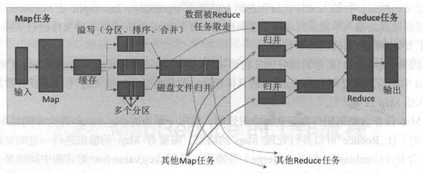
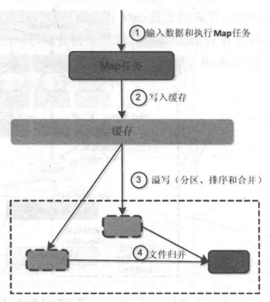

# Chapter5 分布式并行编程模型MapReduce
---

（本学习笔记来源于[DataWhale-妙趣横生大数据](https://shenhao-stu.github.io/Big-Data/)）

## 5.1 MapReduce概述

Hadoop MapReduce 是一个分布式计算框架，用于编写批处理应用程序。编写好的程序可以提交到Hadoop集群上用于并行处理大规模的数据集。

MapReduce 作业通过将输入的数据集拆分为独立的块，这些块由`Map`以并行的方式处理，框架对`Map`

## 5.2 MapReduce的工作流程

### 5.2.1 工作流程概述

大规模数据集的处理包括:`分布式存储`和`分布式计算`

| 对比     | 分布式存储  | 分布式计算 |
|--------| ----  | ----  |
| google | 布式文件系统GFS  | MapReduce |
| Hadoop | 分布式文件系统HDFS  | Hadoop MapReduce |

MapReduce的核心思想可以用**"分而治之"**来描述，即把一个大的数据集拆分成多个小数据块在多台机器上并行处理，也就是说，一个大的MapReduce作业的处理流程如下：

- 首先，会被分成许多个Map任务在多台机器上并行执行。每个`Map`任务通常运行在数据存储的节点上，这样，计算和数据就可以放在一起运行，不需要额外的数据传输开销。当`Map`任务结束后，会生成以`<key,value>`形式表示的许多中间的结果。
- 然后，这些中间结果会被分发到多个`Reduce`任务在多台机器上**并行执行**，**具有相同key**的`<key,value>`会被发送到同一个`reduce`任务那里，`reduce`任务会对中间结果进行汇总计算得到最后结果，并输出到分布式文件系统中。

> 不同的Map任务之间不会进行通信，不同的reduce任务之间也不会发生任何信息交换；用户不能显示地从一台机器向另一台机器发送消息，所有的数据交换都是通过mapreduce框架自身去实现的。
> 在MapReduce的整个执行过程中，Map任务的输入文件，reduce任务的处理结果都是保存在分布式文件系统中的，而Map任务处理得到的中间结果则保存在本地存储（如磁盘）中。

### 5.2.2 MapReduce的各个执行阶段 

MapReduce算法的执行过程：

1. MapReduce框架使用`InputFormat`模块做`Map`前的预处理。作用：验证输入的格式是否符合输入定义，如果符合，将输入文件切分为逻辑上的多个`InputSplit`,`InputSplit`是MapReduce对文件进行处理和运算的输入单位，只是一个逻辑概念，每个`InputSplit`并没有对文件进行实际切割，知识记录了要处理的数据的位置和长度。

2. 因为`InputSplit`是逻辑切分，所以，还需要通过`RecordReader`(RR)并根据`InputSplit`中的信息来处理`InputSplit`中的具体记录，加载数据并转换为适合`Map`任务读取的键值对，输入给`Map`任务。

3. `Map`任务会根据用户自定义的映射规则，输出一系列的`<key,value>`作为中间结果。

4. 为了让`Reduce`可以并行处理`Map`的结果，需要对`Map`的输出进行一定的分区，排序(Sort)、合并(Combine)和归并等操作，得到`<key,value-list>`形式的中间结果，再交给对应的`Reduce`程序进行处理，这个过程称为`shuffle`。

5. `Reduce`以一系列`<key,value-list>`中间结果作为输入，执行用户定义的逻辑，输出结果给`OutputFormat`模块。
6. `OutputFormat`模块会验证输出目录是否已经存在，以及输出结果类型是否符合配置文件中的配置类型，如果都满足，就输出`Reduce`的结果到分布式文件系统。

### 5.2.3 shuffle过程详解

#### 5.2.3.1 shuffle过程简介

> list(k2,v2) -> <k2,v2-list>的过程 

`shuffle`过程是MapReduce整个工作流程的核心环节，理解`shuffle`过程的基本原理，对于理解MapReduce流程至关重要。

所谓`shuffle`，是针对`Map`输出结果进行**分区、排序和合并**等处理,并交给`reduce`的过程。因此，**shuffle过程**分为**Map端的操作和Reduce端的操作**。

1. 在`Map`端的shuffle过程。`Map`的输出结果首先被写入缓存，当缓存满时，就启动溢写操作（分区、排序、合并），把缓存中的数据写入磁盘文件，并清空缓存，当启动溢写操作时，首先需要把缓存中的数据进行分区，然后对每个分区的数据进行排序(sort)和合并（Combine）,之后写入磁盘文件。 每次溢写操作会生成要给新的磁盘文件，随着`Map`任务的执行，磁盘中就会生成多个溢写文件。在`Map`任务全部结束之<前[todo]，这些溢写文件会被归并(merge)成一个大的磁盘文件，然后，通知相应的`reduce`任务来领取属于自己需要处理的数据。

2. 在`reduce`端的shuffle过程。`Reduce`任务从`Map`端的不同`Map`机器领回属于自己需要处理的那部分数据，然后，对数据进行归并(Merge)后交给`Reduce`处理。

#### 5.2.3.2 Map端的shuffle过程

`Map`端的`shuffle`过程包括4个步骤：

1. 输入数据和执行`Map`任务 `k1,v1 -> list(k2,v2)`

`Map`任务的输入数据一般保存在分布式文件系统(如GFS或HDFS)的文件块中，这些文件块的格式时任意的，可以是文档，也可以是二进制格式的。`Map`任务接受`<key,value>`作为输入后，按一定的映射规则转换成一批`<key,value>`进行输出。

2. 写入缓存

每个`Map`任务都会被分配一个缓存，`Map`的输出结果不是立即写入磁盘，而是首先写入缓存。在缓存中积累一定数量的`map`输出结果以后，在一次性批量写入磁盘，这样可以大大减少对磁盘`I/O`的影响。

因为，磁盘包含机械部件，它事实通过磁头移动和盘片的转动来寻址定位数据的，每次寻址的开销很大，如果每个`Map`输出结果都直接写入磁盘，回引入很多寻址开销，而**一次性批量写入**,就只需要一次寻址，连续写入，大大降低了开销。需要注意的是，在写入缓存之前，`key`于`value`值都会被序列化成字节数组。

3. 溢写（分区、排序和合并）

提供给MapReduce的缓存的容量是有限的，默认大小是100MB. 随着`Map`任务的执行，缓存中`Map`结果的数量不断增加，很快就会占满整个缓存，这时，就必须启动溢写（spill）操作，把缓存中的内容一次性写入磁盘，并清空缓存。

## 参考资料

1. [大数据学习指南](https://ldbmcs.gitbook.io/bigdata/hadoop/fen-bu-shi-ji-suan-kuang-jia-mapreduce)
2. [MapReduce 计算框架入门](https://www.cnblogs.com/shoufeng/p/15377088.html)

