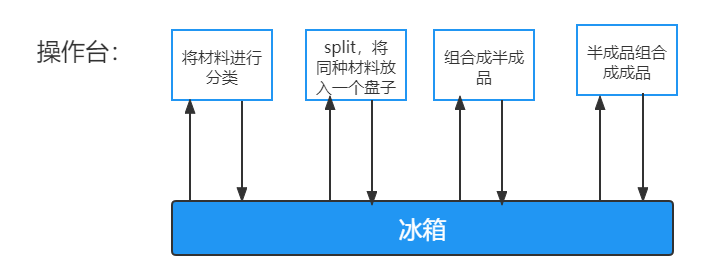

# 第七章：Spark

## 7.0 引言

### 7.0.1 Spark简介

Spark 于 2009 年诞生于加州大学伯克利分校 AMPLab，2013 年被捐赠给 Apache 软件基金会，2014 年 2 月成为 Apache 的顶级项目。**相对于 MapReduce 的批处理计算，Spark 可以带来上百倍的性能提升，因此它成为继 MapReduce 之后，最为广泛使用的分布式计算框架。**

### 7.0.2 特点

Apache Spark 具有以下特点：- 使用先进的 DAG 调度程序，查询优化器和物理执行引擎，以实现性能上的保证；

- 多语言支持，目前支持的有Java，Scala，Python和R;
- 提供了80多个高级API,可以轻松地构建应用程序；
- 支持批处理，流处理和复杂的业务分析；
- 丰富的类库支持：包括SparkSQL(SQL语句), MLlib GraphX（图计算），MLlib(机器学习) 和 Spark Steaming(流计算) 等库，并且可以将它们无缝地进行组合；
- 丰富的部署模式：支持本地模式和自带的集群模式，也支持在Hadoop,Mesos,Kubernetes上运行；
- 多数据源支持：支持访问HDFS,Alluxio,Cassandra,HBase,Hive以及数百个其他数据源中的数据。


### 7.0.3 集群架构


| Term(术语)      | Meaning(含义)                                                                |
| ----------------- | ------------------------------------------------------------------------------ |
| Application     | Spark 应用程序，有集群上的一个Driver节点和多个Executor节点组成               |
| Driver program  | 主运用程序，该进程运行应用的main()方法并且创建SparkContext                   |
| Cluster manager | 集群资源管理器（例如：Standlone Manager,Mesos,YARN）                         |
| Work node       | 执行计算任务的工作节点                                                       |
| Executor        | 位于工作节点上的应用进程，负责执行计算任务并且将输出数据保存到内存或者磁盘中 |
| Task            | 被发送到Executor中的工作单元                                                 |


**执行过程** ：

1. 用户程序创建`SparkContext`后，它会连接到集群资源管理器，集群资源管理器会为用户程序分配计算资源，并启动`Executor`
2. Driver将计算程序分为不同的执行阶段和多个Task,之后将Task发送给Executor;
3. Executor负责执行Task,并将执行状态汇报给Driver,同时也会将当前节点资源的使用情况汇报给集群资源管理器。

### 7.0.4 核心组件

Spark 基于Spark Core 扩展了四个核心组件，分别用于满足不同领域的计算需求。


#### 7.0.4.1 Spark SQL 主要用于结构化数据的处理，其具有以下特点：

- 能够将 SQL 查询与 Spark 程序无缝混合，允许您使用 SQL 或DataFrame API 对结构化数据进行查询；
- 支持多种数据源，包括 Hive,Avro,parquet,ORC,JSON 和 JDBC;
- 支持HiveQL 语法以及用户自定义函数（UDF）,允许你访问现有的Hive仓库；
- 支持标准的 JDBC 和 ODBC 连接；
- 支持优化器，列式存储和代码生成等特性，以提高查询效率；

#### 7.0.4.2 Spark Streaming

Spark Streaming 主要用于快速构建可扩展，高吞吐量，高容错的流处理程序。支持从HDFS,Flume,kafka,Twitter和ZeroMQ读取数据，并进行处理。


Spark Streaming 本质上十微批处理，它将数据流进行极小粒度的拆分，拆分为多个批处理，从而达到接近于流处理的效果。


#### 7.0.4.3 MLlib

MLlib 是 Spark 的机器学习库。其设计目标是使得机器学习变得简单且可扩展。它提供了以下工具：

- **常见的机器学习算法** ：如分类，回归，聚类和协同过滤；
- **特征化** ：特征提取，转换，降维和选择；
- **管道** ：用于构建，评估和调整 ML 管道的工具；
- **持久性** ：保存和加载算法，模型，管道数据；
- **实用工具** ：线性代数，统计，数据处理等。

#### 7.0.4.4 Graphx

GraphX 是 Spark 中用于图形计算和图形并行计算的新组件。在高层次上，GraphX 通过引入一个新的图形抽象来扩展 RDD(一种具有附加到每个顶点和边缘的属性的定向多重图形)。为了支持图计算，GraphX 提供了一组基本运算符（如： subgraph，joinVertices 和 aggregateMessages）以及优化后的 Pregel API。此外，GraphX 还包括越来越多的图形算法和构建器，以简化图形分析任务。

### 7.0.5 相关的几个问题

#### 1. Spark和MapReduce在处理问题的方式上有什么区别

- MapReduce每一个步骤发生在内存中，但产生的中间值（溢写文件）都会写入在磁盘里，下一步操作时又会将这个中间值`merge`到内存中，如此循环直到最终完成计算。MapReduce每一个步骤发生在内存中，但产生的中间值（溢写文件）都会写入在磁盘里，下一步操作时又会将这个中间值`merge`到内存中，如此循环直到最终完成计算。



- Spark，每个步骤也是发生在内存之中，但产生的中间值会直接进入下一个步骤，直到所有的步骤完成之后才会将最终结果保存进磁盘。所以在使用Spark做数据分析时，较少进行很多次相对没有意义的读写，节省大量的时间。当计算步骤很多时，Spark的优势就体现出来了。


#### 2. Spark与Hadoop、MapReduce、HDFS的关系?

**Hadoop处理大数据的流程:**

首先从**HDFS**读取输入数据；接着**在 Map 阶段**使用用户定义的`mapper function`；然后把结果写入磁盘； **在Reduce阶段** ，从各个处于Map阶段的机器中读取Map计算的中间结果，使用用户定义的`reduce function`，最后 **把结果写回HDFS** 。

在这个过程中， 至少进行了三次数据读写，Hadoop处理大数据的流程高度依赖**磁盘读写**，那么在数据处理上就出现了瓶颈，面对更复杂的计算逻辑的处理任务时，Hadoop存在很大局限性。

**Spark：**

Spark不像Hadoop一样采取磁盘读写，而是 **基于性能更高的内存存储来进行数据存储和读写** （这里说的是计算数据的存储，而非持久化的存储）。但是Spark并非完美，缺乏对数据存储这一块的支持，即没有分布式文件系统，必须依赖外部的数据源，这个依赖可以是Hadoop系统的HDFS，也可以是其他的分布式文件系统，甚至可以是MySQL或本地文件系统。

基于以上分析，我们可以得出 **结论** ：Hadoop和Spark两者都是大数据框架，但是各自存在的目的不同。Hadoop实质上是一个 **分布式数据基础设施** ，它将巨大的数据集分派到一个集群中的多个节点 **进行存储** ，并具有**计算处理**的功能。Spark则不会进行分布式数据的 **存储** ，是**计算**分布式数据的工具，可以部分看做是MapReduce的竞品（ **准确的说是SparkCore** ）。综上所示，见下图：


## 7.1 Spark编程模型

### 7.1.1 RDD概述

RDD是Spark的核心概念，是弹性数据集（Resilient Distributed Datasets）的缩写。RDD既是Spark面向开发者的编程模型，又是Spark自身架构的核心元素。

大数据计算就是在大规模的数据集上进行一系列的数据计算处理。类比MapReduce，针对输入数据，将计算过程分为两个阶段，Map阶段和Reduce阶段，可以理解成是**面向过程**的大数据计算。我们在用MapReduce编程的时候，思考的是，如何将计算逻辑用 Map和Reduce两个阶段实现，map和reduce函数的输入和输出是什么。

  而Spark则直接针对数据进行编程，将大规模数据集合抽象成一个RDD对象，然后在这个RDD上进行各种计算处理，得到一个新的RDD，并继续计算处理，直至得到最后的数据结果。所以， **Spark可以理解成是面向对象的大数据计算** 。我们在进行Spark编程的时候，主要思考的是 **一个RDD对象需要经过什么样的操作，转换成另一个RDD对象，思考的重心和落脚点都在RDD上** 。

### 7.1.2 RDD定义

RDD是分布式内存的一个抽象概念，是只读的、记录分区的集合，能横跨集群所有节点进行并行计算。Spark建立在抽象的RDD上，可用统一的方式处理不同的大数据应用场景，把所有需要处理的数据转化为RDD，然后对RDD进行一系列的算子运算，通过丰富的API来操作数据，从而得到结果。

### 7.1.3 RDD五大特性

RDD共有五大特性，我们将对每一种特性进行介绍：


* **一个 RDD 由一个或者多个分区（Partitions）组成** 。Spark将计算以**分区**为单位,对于 RDD 来说，每个分区会被一个计算任务所处理，用户可以在创建 RDD 时指定其分区个数，如果没有指定，则默认采用程序所分配到的 CPU 的核心数；
* **并行计算：** RDD 拥有一个用于计算分区的函数 compute, 计算函数以分片为基本单位进行并行计算，**RDD的分区数决定着并行计算的数量** ；
* **RDD 会保存彼此间的依赖关系，RDD 的每次转换都会生成一个新的依赖关系，这种 RDD 之间的依赖关系就像流水线一样** 。**依赖关系列表**会告诉Spark如何从必要的输入来构建RDD。d当遇到错误如部分分区数据丢失后，可以通过这种依赖关系重新计算丢失的分区数据，而不是对 RDD 的所有分区进行重新计算,依赖关系赋予了RDD**的容错机制**；
* **Key-Value 型的 RDD 还拥有 Partitioner(分区器)，用于决定数据被存储在哪个分区中** ，目前 Spark 中支持 `HashPartitioner`(按照哈希分区) 和 `RangeParationer`(按照范围进行分区)；

> 想要理解分区器的概念，我们需要先来比较一下MapReduce的任务机制。MapReduce任务的Map阶段，处理结果会进行分片（也可以叫分区，这个分区不同于上面的分区），分片的数量就是Reduce Task的数量。而具体分片的策略由分区器Partitioner决定，Spark目前支持Hash分区（默认分区）和Range分区，用户也可以自定义分区。
> 总结一下，Partitioner决定了RDD如何分区。通过Partitioner来决定下一步会产生并行的分片数，以及当前并行Shuffle输出的并行数据，使得Spark可以控制数据在不同节点上分区。
> 值得注意的是，其本身只针对于key-value的形式（key-value形式的RDD才有Partitioner属性），Partitioner会从0到numPartitions-1区间内映射每一个key到partition ID上。

* **一个优先位置列表 (可选)，用于存储每个分区的优先位置 (prefered location)** 。对于一个 HDFS 文件来说，这个列表保存的就是每个分区所在的块的位置，按照“移动数据不如移动计算“的理念，Spark 在进行任务调度的时候，会尽可能的将计算任务分配到其所要处理数据块的存储位置。

`RDD[T]` 抽象类的部分相关代码如下：

```md

// 由子类实现以计算给定分区
def compute(split: Partition, context: TaskContext): Iterator[T]

// 获取所有分区
protected def getPartitions: Array[Partition]

// 获取所有依赖关系
protected def getDependencies: Seq[Dependency[_]] = deps

// 获取优先位置列表
protected def getPreferredLocations(split: Partition): Seq[String] = Nil

// 分区器 由子类重写以指定它们的分区方式
@transient val partitioner: Option[Partitioner] = None

```

### 7.1.4 创建RDD

RDD 有两种创建方式，分别介绍如下：


#### 7.1.4.1 由现有集合创建

这里使用`spark-shell`进行测试，启动命令如下：

```md
 spark-shell --master local[4]   # master 为hostname 
```

启动`spark-shell`后，程序会自动创建上下文，相当于执行了下面的scala语句：

```bash
val conf = new SparkConf().setAppName("Spark shell").setMaster("local[4]")
val sc = new SparkContext(conf)
```

由现有集合创建 RDD，你可以在创建时指定其分区个数，如果没有指定，则采用程序所分配到的 CPU 的核心数：

```bash
val data = Array(1, 2, 3, 4, 5)
// 由现有集合创建 RDD,默认分区数为程序所分配到的 CPU 的核心数
val dataRDD = sc.parallelize(data) 
// 查看分区数
dataRDD.getNumPartitions
// 明确指定分区数
val dataRDD = sc.parallelize(data,2)

```

#### 7.1.4.2 引用外部存储系统中的数据集

引用外部存储系统中的数据集，例如本地文件系统，HDFS,HBase或支持Hadoop InputFormat的任何数据源。

```md
val fileRDD = sr.textFile("/usr/file/emp.txt")
// 获取第一行文本
fileRDD.take(1)
```
使用外部存储系统时需要注意以下两点：

- 如果在集群环境下从本地文件系统读取数据，则要求该文件必须在集群中所有机器上都存在，且路径相同；
- 支持目录路径，支持压缩文件，支持使用通配符。

#### 7.1.4.3  textFile & wholeTextFiles

两者都可以用来读取外部文件，但是返回格式是不同的：

- textFile：其返回格式是 RDD[String] ，返回的是就是文件内容，RDD 中每一个元素对应一行数据；
- wholeTextFiles：其返回格式是 RDD[(String, String)]，元组中第一个参数是文件路径，第二个参数是文件内容；
- 两者都提供第二个参数来控制最小分区数；
- 从 HDFS 上读取文件时，Spark 会为每个块创建一个分区。


## 7.2 Spark架构原理

Spark和MapReduce一样，也遵循着 移动计算而非移动数据这一大数据计算基本原则。MapReduce通过固定的`map`与`reduce`分阶段计算，而Spark的计算框架通过`DAG`来实现计算。