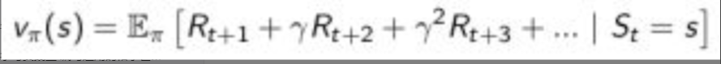

# Task01:强化学习基础

---

> （本学习笔记来源于DataWhale-第39期组队学习：[强化学习](https://linklearner.com/datawhale-homepage/#/learn/detail/91)） ,
> [B站视频讲解](https://www.bilibili.com/video/BV1HZ4y1v7eX) 观看地址

```md
“生活中有一些决定只有你可以选择。” ——(默尔·沙困)
```

## 简介

强化学习是机器学习的一个分支：监督学习、无监督学习、强化学习

强化学习的特点：

- 没有监督数据、只有奖励信号
- 奖励信号不一定是实时的，而很可能是延后的，有时甚至延后很多。
- 时间（序列）是一个重要因素
- 当前的行为影响后续接收到的数据

强化学习有广泛的应用：像直升机特技飞行、经典游戏、投资管理、发电站控制、让机器人模仿人类行走等


## 强化学习的要素

在个体和环境之外，强化学习系统一般有四个要素：策略，奖励信号，价值函数，和可选的环境模型。

- 策略: 是决定个体行为的机制。是从状态到行为的一个映射，可以是确定性的，也可以是不确定性的。
- 价值函数 Value Function是一个未来奖励的预测，用来评价当前状态的好坏程度。当面对两个不同的状态时，个体可以用一个Value值来评估这两个状态可能获得的最终奖励区别，继而指导选择不同的行为，即制定不同的策略。同时，一个价值函数是基于某一个特定策略的，不同的策略下同一状态的价值并不相同。某一策略下的价值函数用下式表示：


- 奖励信号 定义了强化学习问题的目标。$R_{t}$ 是信号的反馈，是一个标量，它反映个体在t时刻做得怎么样。个体的工作就是最大化累计奖励。
- 模型 Model
  个体对环境的一个建模，它体现了个体是如何思考环境运行机制的（how the agent think what the environment was.），个体希望模型能模拟环境与个体的交互机制。

模型至少要解决两个问题：
- 一是状态转化概率，即预测下一个可能状态发生的概率;
- 另一项工作是预测可能获得的即时奖励.
模型并不是构建一个个体所必需的，很多强化学习算法中个体并不试图（依赖）构建一个模型。

## 强化学习个体的分类

解决强化学习问题，个体可以有多种工具组合，比如通过建立对状态的价值的估计来解决问题，或者通过直接建立对策略的估计来解决问题。这些都是个体可以使用的工具箱里的工具。因此，根据个体内包含的“工具”进行分类，可以把个体分为如下三类：

仅基于价值函数的 Value Based：在这样的个体中，有对状态的价值估计函数，但是没有直接的策略函数，策略函数由价值函数间接得到。
仅直接基于策略的 Policy Based：这样的个体中行为直接由策略函数产生，个体并不维护一个对各状态价值的估计函数。
演员-评判家形式 Actor-Critic：个体既有价值函数、也有策略函数。两者相互结合解决问题。
此外，根据个体在解决强化学习问题时是否建立一个对环境动力学的模型，将其分为两大类：

不基于模型的个体: 这类个体并不视图了解环境如何工作，而仅聚焦于价值和/或策略函数。
基于模型的个体：个体尝试建立一个描述环境运作过程的模型，以此来指导价值或策略函数的更新。

## 学习和规划 Learning & Planning

学习：环境初始时是未知的，个体不知道环境如何工作，个体通过与环境进行交互，逐渐改善其行为策略。
规划: 环境如何工作对于个体是已知或近似已知的，个体并不与环境发生实际的交互，而是利用其构建的模型进行计算，在此基础上改善其行为策略。
一个常用的强化学习问题解决思路是，先学习环境如何工作，也就是了解环境工作的方式，即学习得到一个模型，然后利用这个模型进行规划。

## 探索和利用 Exploration & Exploitation

强化学习类似于一个试错的学习，个体需要从其与环境的交互中发现一个好的策略，同时又不至于在试错的过程中丢失太多的奖励。探索和利用是个体进行决策时需要平衡的两个方面。

一个形象的比方是，当你去一个餐馆吃饭，“探索”意味着你对尝试新餐厅感兴趣，很可能会去一家以前没有去过的新餐厅体验，“利用”则意味着你就在以往吃过的餐厅中挑一家比较喜欢的，而不去尝试以前没去过的餐厅。这两种做法通常是一对矛盾，但对解决强化学习问题又都非常重要。

其它一些例子，在线广告推广时，显示最受欢迎的广告和显示一个新的广告；油气开采时选择一个已知的最好的地点同在未知地点进行开采；玩游戏时选择一个你认为最好的方法同实验性的采取一个新的方法。

## 预测和控制 Prediction & Control

在强化学习里，我们经常需要先解决关于预测（prediction）的问题，而后在此基础上解决关于控制（Control）的问题。

预测：给定一个策略，评价未来。可以看成是求解在给定策略下的价值函数（value function）的过程。How well will I(an agent) do if I(the agent) follow a specific policy?
控制：找到一个好的策略来最大化未来的奖励。


## 关键词

**强化学习(Reinforcement learning)的本质：** 一个智能体（agent）怎么在一个复杂不确定的环境（environment）里面去极大化它能获得的奖励。

**Action:** 环境（Environment）接收到的智能体（Agent）当前状态的输出。

**State：** 智能体（Agent）从Environment中获取到的状态。

**Reward：** Agent从Environment中获取的反馈信号，这个信号指定了Agent在某一步采取了某个策略以后是否得到奖励。

**Exploration：** 在当前的情况下，继续尝试**新的**Action,其有可能会使你得到更高的这个奖励，也有可能使你一无所有。

**Exploitation:** 在当前的情况下，继续尝试**已知的**可以获得最大Reward的过程，即重复执行这个Action就可以了。

**深度强化学习(Deep Reinforcement Learning)：** 不需要手工设计特征，仅需要输入state让系统直接输出Action的一个end-to-end traing的强化学习方法。通常使用神经网络来拟合value function或者policy network.

**Full observability、fully observed和partially observed:** 当Agent的状态跟Environment的状态等价的时候，我们就说现在Environment是full observability(全部可观测).当Agent能够观察到Environment的所有状态时，我们称这个环境时partially observced（部分可观测）。

**POMDP(Partially observable markov decision processes):** 部分可观测马尔可夫决策过程，即马尔可夫决策过程的泛化。POMDP依然具有马尔可夫性质，但是假设智能体无法感知环境的状态$s$,只能知道部分观测值$o$

**Action space(discrete action spaces and continuous action spaces):** 在给定的Environment中，有效动作的集合经常被称为动作空间(Action space),Agent的动作数量是有限的动作空间为离散动作空间（discrete action spaces）.

**policy-based（基于策略的）：** Agent会制定一套动作策略（确定在给定状态下需要采取何种动作），并根据这个策略进行操作。强化学习算法直接对策略进行优化，使制定的策略能够获得最大的奖励。

**valued-based(基于价值的)：** Agent不需要制定显式的策略，它维护一个价值表格或价值函数，并通过这个价值表或价值函数来选取价值最大的动作。

**model-based(有模型结构)：** Agent通过学习状态的转移来采取措施。

**model-free(无模型结构)：** Agent没有去直接估计状态的转移，也没有得到Environment的具体转移变量。它通过学习value function 和 policy function进行决策。

## Questions

- 强化学习的基本结构是什么？

  答：本质是Agent和Environment间的交互。具体地，当Agent在Environment中得到当前时刻的state,Agent会基于此状态输出一个Action。然后这个Action会加入到Environment中去并输出下一个state和当前的这个Action得到Reward。Agent在Environment里面存在的目的就是为了极大它的期望积累的Reward。
- 强化学习相对于监督学习为什么训练会更加困难？（强化学习的特征）

  答：

  1. 强化学习处理的多是序列数据，其很难像监督学习的样本一样满足IID(独立同分布)条件。
  2. 强化学习有奖励的延迟（Delay Reward），即在Agent的action作用在Environment中时，Environment对于Agent的state的**奖励的延迟**(Delayed Reward),使得反馈不及时。
  3. 相比于监督学习有正确的label,可以通过其修正自己的预测，强化学习相当于一个"试错"的过程，其完全根据Environment的“**反馈**”更新对自己最有利的Action.
- 强化学习的基本特征有哪些？

  答：

  1. 有trial-and-error exploration的过程，即需要通过探索Environment来获取对这个Environment的理解。
  2. 强化学习的Agent会从Environment里面获得**延迟**的Reward。
  3. 强化学习的训练过程中**时间**非常重要，因为数据都是有时间关联的，而不是像监督学习一样时**IID**分布的。
  4. 强化学习中Agent的Action会**影响**它随后得到的**反馈**。
- 近几年强化学习发展迅速的原因？

  答：

  1. **算力(GPU、TPU)的提升**，我们可以更快地做更多的trial-and-error的尝试来使得Agent在Environment里面获得很多信息，取得更大的Reward。
  2. 我们有了深度强化学习这样一个端到端的训练方法，可以把特征提取和价值估计或者决策一起优化，这样就可以得到一个更强的决策网络。

- 状态和观测有什么关系？
  
  答：
   状态（state）是对世界的完整描述，不会隐藏世界的信息。观测（observation）是对状态的部分描述，可能会遗漏一些信息。在深度强化学习中，我们几乎总是用一个实值向量、矩阵或者更高阶的张量来表示状态和观测。

- 对于一个强化学习Agent，它由什么组成？

  答：
  1. 策略函数（policy function）,Agent会用这个函数来选取它下一步的动作，包括**随机性策略（stochastic policy ）** 和 **确定性策略（deterministic policy）**
  2. **价值函数（value function）**, 我们用价值函数来对当前状态进行评估，即进入现在的状态，到底可以对你后面的收益带来多大的影响。当这个价值函数大的时候，说明你进入这个状态越有利。
  3. **模型（model）** 其表示了Agent对这个Environment的状态进行的理解，它决定了这个系统是如何进行的。

- 根据强化学习Agent的不同，我们可以将其分为哪几类？

  答：
  1. 基于策略迭代的强化学习方法，agent会制定一套动作策略（确定在给定状态下需要采取何种动作），并根据这个策略进行操作。强化学习算法直接对策略进行优化，使制定的策略能够获得最大的奖励；基于价值迭代的强化学习方法，agent不需要制定显式的策略，它维护一个价值表格或价值函数，并通过这个价值表格或价值函数来选取价值最大的动作。
  2. 基于价值迭代的方法只能应用在不连续的、离散的环境下（如围棋或某些游戏领域），对于行为集合规模庞大、动作连续的场景（如机器人控制领域），其很难学习到较好的结果（此时基于策略迭代的方法能够根据设定的策略来选择连续的动作）
  3. 基于价值迭代的强化学习算法有Q-learning,Sarsa等，而基于策略迭代的强化学习算法有策略梯度算法等。
  4. 此外，Actor-Critic算法同时使用策略和价值评估来做出决策，其中，智能体会根据策略做出动作，而价值函数会对做出的动作给出价值，这样可以在原有的策略梯度算法的基础上加速学习过程，取得更好的结果。

- 有模型（model-based）学习和免模型（model-free）学习有什么区别？

  答：
  针对是否需要对真实环境建模，强化学习可以分为有模型学习和免模型学习。有模型学习是指根据环境中的经验，构建一个虚拟世界，同时在真实环境和虚拟世界中学习；免模型学习是指不对环境进行建模，直接与真实环境进行交互来学习到最优策略。总的来说，有模型学习相比于免模型学习仅仅多出一个步骤，即对真实环境进行建模。免模型学习通常属于数据驱动型方法，需要大量的采样来估计状态、动作及奖励函数。从而优化动作策略。免模型学习的泛化性要优于有模型学习，原因是有模型学习需要对真实环境进行建模，并且虚拟世界与真实环境之间可能还有差异，这限制了有模型学习算法的泛化性。

- 强化学习的通俗理解：

  答：
  environment跟reward function 不是我们可以控制的，environment跟reward function是在开始学习之前，就已经事先给定的。我们唯一能做的事情就是调整actor里面的policy，使得actor可以得到最大的reward.Actor里面会有一个policy，这个policy决定了actor的行为。policy就是给一个外界的输入，然后它会输出actor现在应该要执行的行为。

- 用一句话谈一下你对于强化学习的认识吗?

  答：强化学习包括环境，动作和奖励三部分，其本质是agent通过与环境的交互，使得其做出的action所得到的决策得到的总的奖励达到最大，或者是期望值最大。

- 你认为强化学习与监督学习和无监督学习有什么区别?
  
  答：强化学习和无监督学习不需要标签，监督学习需要许多有标签的样本来进行模型的构建；对于强化学习与无监督学习,无监督学习是直接对于给定的数据进行建模,寻找数据(特征)给定的隐藏的结构,一般对应的聚类问题,而强化学习需要通过延迟奖励学习策略来得到"模型"对于正确目标的远近(通过奖励惩罚函数进行判断),这里我们可以将奖励惩罚函数视为正确目标的一个稀疏、延迟形式。另外强化学习处理的多是序列数据,样本之间通常具有强相关性，但其很难像监督学习的样本一样满足IID条件。

- 你认为强化学习的使用场景有哪些呢?

  答：多学列决策问题；

- 强化学习中所谓的损失函数与DL中的损失函数有什么区别呀?

  答：DL中的loss function目的是使预测值和真实值之间的差距最小,而RL中的loss function是是奖励和的期望最大。
  
- 你了解model-free和model-based吗?两者有什么区别呢?

  答：两者区别在于是否对真实环境进行建模，model-free不需要对于环境进行建模,直接与真实环境进行交互即可,所以其通常需要较大的数据或者采样工作来优化策略,这也帮助model-free对于真实环境具有更好的泛化性能; 而model-based 需要对于环境进行建模,同时再真实环境与虚拟环境中进行学习,如果建模的环境与真实环境的差异较大,那么会限制其泛化性能。现在通常使用model-free进行模型的构建工作。


## 参考资料

1. https://rl.qiwihui.com/zh_CN/latest/
2. https://github.com/cuhkrlcourse/RLexample