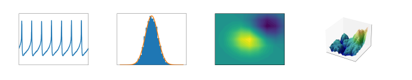
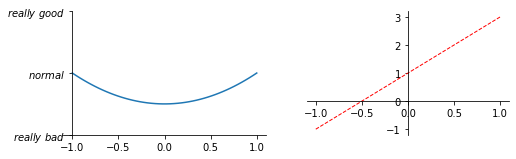
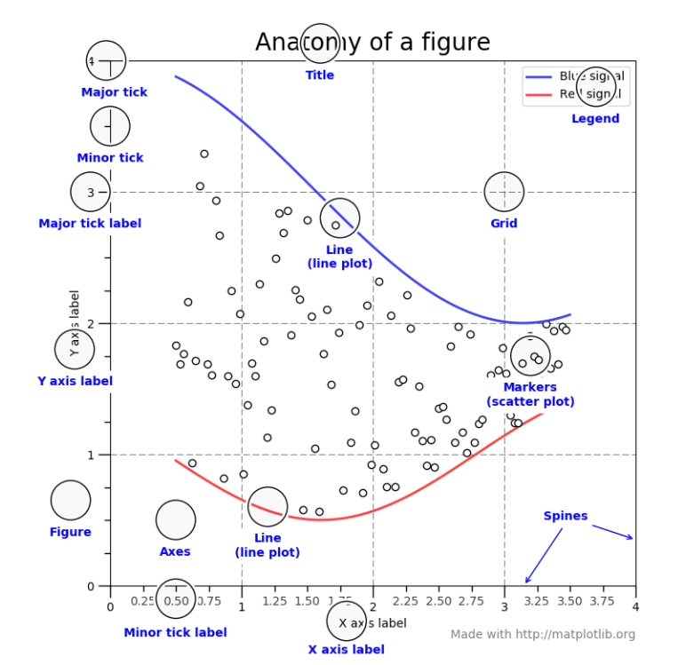
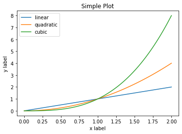
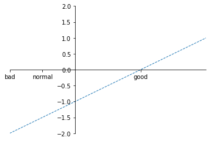

# 第一回：Matplotlib初相识

----

（本学习笔记来源于[DataWhale-数据可视化](https://datawhalechina.github.io/fantastic-matplotlib/)，部分内容来自莫烦PYTHON教程）


```md
Life is what you make it.
生活需要自己塑造。

```
## 认识matplotlib

Matplotlib是一个Python 2D绘图库，它以多种硬拷贝格式和跨平台的交互式环境生成出版物质量的图形。 Matplotlib可用于Python脚本，Python和IPython (opens new window)Shell、Jupyter (opens new window)笔记本，Web应用程序服务器和四个图形用户界面工具包。



Matplotlib是Python数据可视化库中的泰斗，它已经成为python中公认的数据可视化工具，我们所熟知的pandas和seaborn的绘图接口其实也是基于matplotlib所作的高级封装。通过它，你可以画出线图、散点图、等高线图、条形图、柱状图、3D 图形甚至是图形动画等等。


## 安装

**Linux**

打开 Terminal 窗口, 输入以下内容：

```sh
# python 3+ 请复制以下在 terminal 中执行
sudo apt-get install python3-matplotlib

# python 2+ 请复制以下在 terminal 中执行
sudo apt-get install python-matplotlib

```

**MacOS**

打开 Terminal 窗口, 输入以下内容

```sh
# python 3+ 请复制以下在 terminal 中执行
pip3 install matplotlib

# python 2+ 请复制以下在 terminal 中执行
pip install matplotlib

```

**官方推荐**

访问 [官方Matplotlib安装说明](https://www.matplotlib.org.cn/users/installing.html#installing-an-official-release)。

```sh
python -m pip install -U pip
python -m pip install -U matplotlib
```

如果安装不成功, 还有一种方法可以简便安装所有科学运算模块。 可以搜索一下 Anaconda python。 

Anaconda 是一个便捷的虚拟环境、包管理工具,Anaconda 使用软件包管理系统Conda 进行包管理，为用户对不同版本、不同功能的工具包的环境进行配置和管理提供便利。
 

下面，我们将开始正式学习 **Matplotlib** 的使用！


## 基本用法

知识点归纳：

- 导入模块：import matplotlib.pyplot as plt
- 定义图像窗口：plt.figure()
- 画图：plt.plot(x, y)
- 定义坐标轴范围：plt.xlim()/plt.ylim()
- 定义坐标轴名称：plt.xlabel()/plt.ylabel()
- 定义坐标轴刻度及名称：plt.xticks()/plt.yticks()
- 设置图像边框颜色：ax = plt.gca() ax.spines[].set_color()
- 调整边框（坐标轴）位置：ax.spines[].set_position()
- 调整刻度位置：ax.xaxis.set_ticks_position()/ax.yaxis.set_ticks_position()


先来一个简单实例


```python
%matplotlib inline

import matplotlib.pyplot as plt
import numpy as np
x = np.linspace(-1, 1, 50)
y = x**2 + 1

plt.figure(num=3, figsize=(8, 5))
plt.xlim((-1, 1))
plt.ylim((-0, 3))
plt.xlabel('x label')
plt.ylabel('y label')
plt.title('matplotlib title')
plt.plot(x, y)
plt.show()
```


    

    


上述实例代码部分，我们看到一个完整的代码包括了几部分：

- 1、导入模块：


```python
# 使用import导入模块matplotlib.pyplot，并简写成plt；使用import导入模块numpy，并简写成np
import matplotlib.pyplot as plt
import numpy as np
```

    创建一组数据，使用np.linspace定义x：范围是(-1,1)，个数是50，将产生一组（-1，1）内均匀分布的50个数；(x,y)表示曲线。

```python
x = np.linspace(-1, 1, 50)
y = x**2 + 1
```

- 2、定义图像窗口：plt.figure()

```python
# plt.figure()定义一个图像窗口：编号为3；大小为(8,6)；
plt.figure(num=3, figsize=(8, 6))

```

- 3、定义坐标轴范围：plt.xlim()/plt.ylim()

```python
plt.xlim((-1, 1))
plt.ylim((-0, 3))

```
- 4、定义坐标轴名称：plt.xlabel()/plt.ylabel()

```python
plt.xlabel('x label')
plt.ylabel('y label')

```
- 5、画图：plt.plot(x, y)
```python
plt.plot(x, y)
```
`plt.plot`也可以指定颜色和其他指定属性：
```        
plt.plot(x, y1, color='red', linewidth=1.0, linestyle='--')
```

- 6、显示：plt.show(x, y)
```python
plt.show()
```

**接着**，我们用另一个例子介绍一下另外的几个配置项


```python
x = np.linspace(-1, 1, 50)
y1 = 2*x + 1
y2 = x**2
plt.figure(num=3, figsize=(8, 5))
plt.subplot(2, 2,1)
plt.plot(x, y2)
ax = plt.gca()
ax.spines['right'].set_color('none')
ax.spines['top'].set_color('none')
ax.spines['left'].set_position(('data',-1))
ax.spines['bottom'].set_position(('data',-1))
ticklevels = np.linspace(-1, 1, 5)
plt.xticks(ticklevels)
plt.yticks([-1, 1,  3],[ r'$really\ bad$', r'$normal$', r'$really\ good$'])
plt.subplot(2, 2,2)
plt.plot(x, y1, color='red', linewidth=1.0, linestyle='--')
ax = plt.gca()
ax.spines['right'].set_color('none')
ax.spines['top'].set_color('none')
ax.spines['left'].set_position(('data',0))
ax.spines['bottom'].set_position(('data',0))
plt.show()
```


    

    


我们看到实例显示了两个子图，以及图像坐标边框等都有了变化：

- 定义多个子图：plt.subplot(nrows, ncols, index, **kwargs)

```python
plt.subplot(2, 2,1) # 三个参数分别对应 行数，列数，索引号
plt.plot(x, y2)

```

- 定义坐标轴刻度及名称：plt.xticks()/plt.yticks()

```python

ticklevels = np.linspace(-1, 1, 5)
plt.xticks(ticklevels)
plt.yticks([-1, 1,  3],[ r'$really\ bad$', r'$normal$', r'$really\ good$'])

```

- 设置图像边框颜色：ax = plt.gca() ax.spines[].set_color()

```python
ax = plt.gca()
ax.spines['right'].set_color('none')
ax.spines['top'].set_color('none')
                        
```
- 调整刻度位置：ax.xaxis.set_ticks_position()/ax.yaxis.set_ticks_position()

```python
ax.spines['left'].set_position(('data',0))
ax.spines['bottom'].set_position(('data',0))
```

## Figure的组成

现在我们来深入看一下`figure`的组成。

通过一张`figure`解剖图，我们可以看到一个完整的matplotlib图像通常会包括以下四个层级，这些层级也被称为**容器（container）**:

**这里不详细讲解**

**Figure：**顶层级，用来容纳所有绘图元素

**Axes：**matplotlib宇宙的核心，容纳了大量元素用来构造一幅幅子图，一个figure可以由一个或多个子图组成

**Axis：**axes的下属层级，用于处理所有和坐标轴，网格有关的元素

**Tick：**axis的下属层级，用来处理所有和刻度有关的元素




## 两种绘图接口

matplotlib提供了两种最常用的绘图接口

- 显式创建figure和axes，在上面调用绘图方法，也被称为OO模式（object-oriented style)

- 依赖pyplot自动创建figure和axes，并绘图

使用第一种绘图接口，是这样的：


```python
%matplotlib inline

x = np.linspace(0, 2, 100)

fig, ax = plt.subplots()  
ax.plot(x, x, label='linear')  
ax.plot(x, x**2, label='quadratic')  
ax.plot(x, x**3, label='cubic')  
ax.set_xlabel('x label') 
ax.set_ylabel('y label') 
ax.set_title("Simple Plot")  
ax.legend() 
plt.show()
```


    

    


而如果采用第二种绘图接口，绘制同样的图，代码是这样的：


```python
x = np.linspace(0, 2, 100)

plt.plot(x, x, label='linear') 
plt.plot(x, x**2, label='quadratic')  
plt.plot(x, x**3, label='cubic')
plt.xlabel('x label')
plt.ylabel('y label')
plt.title("Simple Plot")
plt.legend()
plt.show()
```


    

    


## 练一练

现在，请根据上述所学内容，画出直线 y = x-1, 线型为虚线，线宽为1，纵坐标范围（-2，1），横坐标范围（-1，2），横纵坐标在（0，0）坐标点相交。

横坐标的 [-1,-0.5,1] 分别对应 [bad, normal, good]。请一定自己尝试一番再看下面的答案噢~


```python
#答案

%matplotlib inline

import matplotlib.pyplot as plt
import numpy as np

x = np.linspace(-1, 2, 50)
y = x - 1
plt.figure()
plt.plot(x,y, linewidth=1.0, linestyle='--')
plt.xlim((-1,2))
plt.ylim((-2,2))
plt.xticks([-1,-0.5,1],['bad', 'normal', 'good'])
ax = plt.gca()
ax.spines['top'].set_color('none')
ax.spines['right'].set_color('none')
ax.spines['left'].set_position(('data',0))
ax.spines['bottom'].set_position(('data',0))
plt.show()
```


    


## 后记

### 报错解决：
```
DeprecationWarning: `should_run_async` will not call `transform_cell` automatically in the future. 
Please pass the result to `transformed_cell` argument 
and any exception that happen during thetransform in `preprocessing_exc_tuple` in IPython 7.17 
and above. and should_run_async(code)
```

**解决：** 执行 `shell命令`，重启jupyter即可；


```python
pip install --upgrade ipykernel
```


###  参考资料

- [datawhale-matplotlib数据可视化-29期](https://datawhalechina.github.io/fantastic-matplotlib/)
- [matplotlib官网用户指南](https://matplotlib.org/stable/tutorials/introductory/usage.html)
- [莫烦PYTHON](https://morvanzhou.github.io/tutorials/data-manipulation/plt/1-1-why/)

<link rel="stylesheet" href="https://cdnjs.cloudflare.com/ajax/libs/social-share.js/1.0.16/css/share.min.css">
<div class="social-share"></div>
<script type="text/javascript" src="https://cdnjs.cloudflare.com/ajax/libs/social-share.js/1.0.16/js/social-share.min.js"></script>

