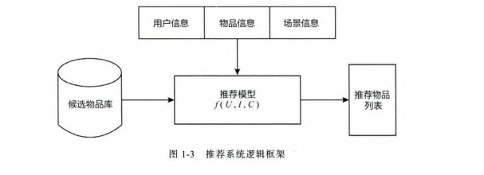
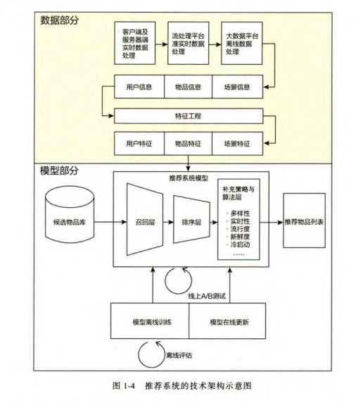
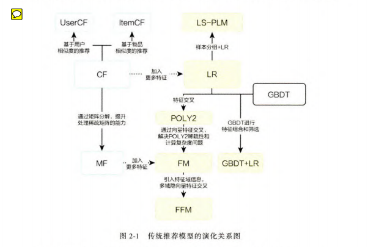

# 推荐算法进化之路
---


```md
It's not the mountain we conquer, but ourselves.
我们要战胜的不是高山，而是自己。
```


## 一、互联网的增长引擎 - 推荐系统

### 1. 推荐系统的作用

- 用户角度：推荐系统解决在“信息过载”的情况下，用户如何高效获得感兴趣信息的问题。
- 公司角度：推荐系统解决产品能够最大限度吸引用户、留存用户、增加用户黏性、提高产品的用户转化率的问题，从而达到公司商业目标连续增长的目的。

论文推荐：[Deep Neural Network for YouTube Recommendation论文精读](https://zhuanlan.zhihu.com/p/25343518)


### 2. 推荐系统的架构

**逻辑框架**

- 对于用户U(user)，在特定场景C(contxt)下，针对海量的"物品"信息，构建一个函数$f(U,I,C)$,预测用户对特定候选物品$I(item)$的喜好程度,再根据喜好程度对所有候选物品进行排序、生成推荐列表。



**技术架构**

- 问题解答
    - **数据和信息信息相关的问题** ， 即“用户信息”，“物品信息”，“场景信息”分别是什么？如何存储、更新和处理？
    - **推荐系统算法和模型相关的问题**，即推荐模型如何训练、如何预测、如何达成更好的推荐效果？


- 数据部分
    - 数据收集
        - 推荐模型所需的样本数据,用于算法模型的训练和评估
        - 推荐模型服务（model serving）所需特征，用于推荐系统的线上推断
        - 系统监控、商业智能（Business Intelligence,BI）所需的统计数据.

    - 数据加工
        - 客户端以及服务器端实时数据处理
        - 流处理平台准实时数据处理
        - 大数据平台离线数据处理

- 模型部分
    - 召回层 ， 快速从海量的候选集中召回用户可能敢兴趣的物品
    - 排序层 ，对初筛的候选集进行精排序，`研究重点`
    - 补充策略与算法层 ，也称为“再排序层”， 
    - 评估模型：离线评估和线上A/B测试


## 二、前深度学习时代 - 推荐系统的进化之路



### 1. 协同过滤 （Collaborative Filtering,CF）- 最经典、最常用的推荐算法

- "协同过滤"是协同大家的反馈、评价和意见一起对海量的信息进行过滤，从中筛选出目标用户可能感兴趣的信息的推荐过程。
- 基本思想：根据用户之前的喜好以及其他兴趣相近的用户的选择来推荐物品给用户（基于对用户历史行为数据的挖掘发现用户的喜好偏向，并预测用户可能喜好的产品进行推荐）
  ，注意这里仅基于用户的数据（评价，购买，点击，下载等），而不依赖物品任何附加信息（物品自身特征）或用户的任何附加信息（年龄，性别等）。
- 目前广泛运用**基于邻域的方法**，这种方法主要有两种算法： 
- 基于用户的协同过滤（UserCF）
    -  给用户推荐和他兴趣相似的其他用户喜欢的产品
    - 更强的社交性
    - 适用于发现热点
- 基于物品的协同过滤ItemCF
    - 给用户推荐和他之前喜欢的物品相似的物品
    - 适用于兴趣变化较为稳定的应用
  
- 相似度度量方法： 
  
1). 杰卡德（Jaccard）相似系数(集合相似性) [例子参考](https://qinqianshan.com/math/distance/jaccard-coefficient/)： 两个用户$u$和$v$交互商品交集的数量占这两个用户交互商品并集数量的比例，称为两个集合的杰卡德相似系数。 
2). 余弦相似性
3). 皮尔逊相似性

- 推荐结果的头部效应明显，处理**稀疏向量能力弱**

> 论文推荐：[Amazon.com Recommendations Item-to-Item Collaborative Filtering](http://blog.sina.com.cn/s/blog_586631940100pduh.html)

### 2. 矩阵分解算法(Matrix Factorization,MF) - 协同过滤的进化

**主要方法**

- 特征值分解：只适用于方阵
- 奇异值分解：计算复杂度高
- 梯度下降：主流方法
    - 目的是原始评分与用户向量和物品向量的内积的差尽量小
    - 加入正则化避免过拟合
    - 加入用户和物品的偏差向量消除偏差
- 优缺点
    - 优点：泛化能力强、空间复杂度低、更好的扩展性和灵活性
    - 缺点：不方便加入用户、物品和上下文特征

### 3. 逻辑回归- 融合多种特征的推荐模型

- 综合利用用户、物品、上下文多种不同特征，生成较为全面的推荐模型
- 训练方法：梯度下降法、牛顿法、拟牛顿法
- 优势
    - 数字含义上的支撑：广义线性模型的一种，假设y服从伯努利分布
    - 可解释性强
    - 工程化的需要：并行化、模型简单、训练开销小
- 局限性
    - 表达能力不强，无法进行特征交叉，特征筛选等

### 4. 从FM和FFM - 自动特征交叉的解决方案

- 多维度特征交叉的重要性："辛普森悖论"
- POLOY2模型 - 特征交叉的开始
    - 暴力进行特征组合
    - 训练复杂度高、稀疏数据下大部分权重得不到有效训练
- FM模型 - 隐向量特征交叉
    - 为每一个特征赋予一个对应的隐向量
    - 更好地解决数据稀疏性问题
    - 线上推断过程简单，更容易进行线上部署
    - 不易扩展到三阶特征交叉
- FFM模型 - 引入特征域的概念
    - 域可以简单理解为采用one-hot编码形成的一段one-hot特征向量
    - 每个特征对应每一个域，都有一个隐向量
    - 缺点：训练开销大

### 5. GDBT + LR - 特征工程化的开端

- 利用GBDT构建特征工程、利用LR预估CTR
- 大大推进了特征工程模型化这一趋势

### 6. LS-PLM - 阿里巴巴曾经的主流推荐模型

- 对样本进行分片，再在样本分片中应用LR
- 优势
    - 端到端的非线性学习能力
    - 稀疏性强、部署更加轻量化
- 可以看作一个加入注意力机制的三层NN


## 三、浪潮之巅 - 深度学习再推荐系统中的应用

### 1. 深度学习时代的模型

- 表达能力更强，能够挖掘更多数据中潜藏的模式
- 结构灵活，能够结合业务灵活性选择模型结构
- 两类思路
    - 特征工程自动化的思路：PNN , Wide&Deep , Deep & Cross, FNN, DeepFM, NFM等
    - 模型结构的尝试：注意力机制（AFM,DIN）,序列模型（DIEN）,强化学习（DRN）

### 2. AutoRec - 单隐层神经网络推荐模型

- 自编码思想和协同过滤结合
- 模型较为简单，存在一定表达能力不足问题

### 3. Deep Crossing模型 - 经典的深度学习架构

- 分为Embedding层，Stacking层（concatenate层），Multiple Residual Units层和Scoring层
- 全部特征交叉的任务交给模型，是对特征交叉方法的革命

### 4. NeuralCF模型- CF与深度学习的结合

- 利用互操作层代替简单的用户和物品向量求内积的方式，广义矩阵分解模型
- 互操作：用户向量和物品向量拼接后输入多层神经网络/元素承连（GMF层）
- 没有引入更多其他类型的特征

### 5. PNN模型 - 加强特征交叉的能力

- 用Product layer代替了Deep Crossing中的Stack层，使用Product操作地特征进行两两交互。
- 分为IPNN和OPNN
- Product操作更强调不同特征之间的交互，模型更容易捕获特征的交叉信息
- 对所有特征进行无差别的交叉，一定程度忽略了原始特征中包含的有价值信息

### 6. Wide&Deep模型 - 记忆能力和泛化能力的综合

- wide部分让模型具有较强的记忆能力，记忆能力可以被理解为模型直接学习并利用历史数据中物品或者特征共现频率的能力。
- Deep部分让模型具有泛化能力，泛化能力可以被理解为模型传递特征的相关性，以及发掘稀疏甚至从未出现过的稀有特征与最终标签相关性的能力。
  
### 7. Wide&Deep模型进化 - Deep & Cross模型

  - 利用Cross Net代替Wide部分，增加特征交叉力度。

### 8. FM与深度学习模型的结合

- 结合FM思路的深度学习模型，基本特点是在经典多层神经网络的基础上加入针对性的特征交叉操作，让模型具有更强的非线性能力
- FNN: 用FM训练好的隐向量来初始化Embedding层，为Embedding预训练提供了借鉴思路
- DeepFM: 用FM代替了Wide&Deep的Wide部分，加强了浅层网络部分特征组合的能力
- NFM: 用一个表达能力更强的函数代替FM中二阶隐向量内积的部分

### 9. 注意力机制在推荐模型中的应用

- AFM: 引入注意力机制的FM
    - 在特征交叉曾和最终输出层之间加入attention,为每一组交叉特征提供权重
- DIN: 引入注意力机制的深度学习网络
    - 候选商品和历史行为商品之间计算权重

### 10. DIEN - 序列模型和推荐系统的结合

- 用序列模型模拟了用户兴趣的进化过程
  
- 序列信息的重要性
  - 加强了最近行为对下次行为预测的影响
  - 能够学习到购买趋势的信息
  
- 模型主要结构
  - 行为序列层
  - 兴趣抽取层：模拟用户兴趣迁移过程，抽取用户兴趣
  - 兴趣进化层：针对性地模拟与目标广告相关的兴趣进化路径
  
- 序列模型非常适合预估用户经过一系列行为后的下一次动作，但由于是串行推断，需要在工程上着重优化

### 11. DRN: 强化学习与推荐系统的结合

- Dueling-DQN结构
- 在线学习方法：竞争梯度下降算法
- 与其他深度学习模型的不同之处在于变静态为动态，把模型学习的实时性得到了一个空前重要的位置


## 四、Embedding技术在推荐系统中的应用

### 1. 什么是Embedding

- 用一个低维稠密向量“表示”一个对象。“表示”意味着Embedding向量能够表达相应对象的某些特征，同时向量之间的距离反映了对象之间的相似性。
- Embedding在推荐场景的重要性
    - Embedding层将高维稀疏特征向量转换成稠密低维度向量
    - Embedding本身就是极其重要的特征向量
    - Embedding对物品、用户相似度的计算是常用的推荐系统召回层技术

### 2. Word2Vec: 经典的Embedding方法

- 模型结构
    - CBOW模型：输入周边词，预测中间词。
    - Skip-Gram模型：输入中间层，预测周边词，经验上讲Skip-Gram模型效果更好

- 训练方法
    - 负采样
    - 层级softmax

### 3. Item2Vec: Word2Vec在推荐系统领域的推广

- 利用用户历史行为记录，摒弃时间窗口概念，认为两两物品都相关
- 广义的Item2Vec:任何能够生成物品向量的方法，如双塔模型

### 4. Graph Embedding: 引入更多结构信息的图嵌入技术

- 互联网场景下，数据更多呈现图结构
- DeepWalk: 在图上随机游走，产生物品序列，然后使用word2vec进行训练，游走的概率取决于边的权重
- Node2Vec: 通过调整随机游走权重的方法使Graph Embedding的结果更倾向于体现网络的同质性和结构性
- EGES: 在DeepWalk的基础上补充Side information

### 5. Embedding于深度学习推荐系统的结合

- 深度学习中的Embedding层
- 作为预训练的Embedding特征向量
- 计算物品和用户的相似度，作为召回层的策略
    youtube推荐系统召回层

### 6. 局部敏感Hash

- 快速Embedding向量最近邻搜索方法
- 基本思想是让相邻的点落入同一个桶


## 五、多角度审视推荐系统

### 1. 推荐系统的特征工程

- 原则：尽可能地让特征工程抽取出一组特征能够保留推荐环境及用户行为过程的所有有用信息，尽量摒弃冗余信息。
- 特征工程需要深入了解业务的运行模式，了解用户在业务场景下的思考方式和行为动机。
- 常用特征
  - 用户行为数据
    - 显性反馈行为
    - 隐性反馈行为
  - 用户关系数据
  - 属性、标签类数据
  - 内容类数据：描述型文字、图片、视频
  - 上下文信息：推荐行为产生的场景的信息
  - 统计类特征：历史CTR、CVR等
  - 组合类特征
  
- 常用的特征处理方法
  - 连续型：归一化、离散化、加非线性函数
  - 类别型：one/multi-hot + embedding 

### 2. 推荐系统召回层主要策略

- 召回层的特点：候选集合大、速度快、模型简单、特征较少
- 多路召回策略（主流方法）
  - 如信息流应用中：热门新闻、兴趣标签、协同过滤、最近流行、朋友喜欢
  
- 基于Embedding的方法
  - 如youtube召回策略
  
### 3. 推荐系统的实时性

- 特征的实时性
  - 客户端实时特征
  - 流计算平台的实时
  - 分布式批处理平台的全量特征处理
  
- 模型的实时性
  - 全量更新
  - 增量更新
  - 在线学习：获得一个新样本就更新模型，一个附带问题是稀疏性不强，相关研究包括：FOBOS,FTRL
  - 局部更新：降低训练效率低部分的更新频率，提高训练效率高的部分的更新频率，如GBDT+LR,Embedding层+神经网络
  - 客户端模型实时更新：探索阶段
  
### 4. 如何合理设定推荐系统中的优化目标

- 推荐系统的目标是完成公司的某个商业目的：如Youtube以观看时长为优化目标
- 优化场景和应用场景的统一性：阿里ESMM
- 构建成功的推荐系统需要和其他团队协调一致

### 5. 推荐系统中比模型结构更重要的是什么

- 在构建推荐模型的过程中，从应用场景出发，基于用户行为和数据的特点，提出合理的改进模型的动机才是最重要的。

### 6. 冷启动的解决方法

- 分类：用户冷启动，物品冷启动，系统冷启动
- 冷启动策略
  - 基于规则
    - 用户冷启动：热门排行榜、最近流行趋势等
    - 物品冷启动：利用相似物品的推荐逻辑
  
  - 丰富冷启动过程中可获得的用户和物品特征
    - 用户的注册信息
    - 第三方数据管理平台提供的数据
    - 物品的内容特征
    - 引导用户输入的冷启动特征
  
  - 利用主动学习、迁移学习和“探索与利用”机制
  
### 7. 探索与利用

  - 传统方法
    - 简化为多臂老虎机问题，方法有e-Greedy,Thompson Sampling 和 UCB
    - 无法引入用户的上下文和个性化信息
  - 个性化方法
    - 在传统方法的基础上，引入个性化信息，如LinUCB方法
    - 无法与深度学习模型有效的整合
  - 基于模型方法
    - 如DRN中的探索网络
  - 作用
    - 物品冷启动
    - 发掘用户新兴趣
    - 增加结果多样性
  
## 六、深度学习推荐系统的工程实现

### 1. 推荐系统的数据流
  
- 批处理大数据架构
  - 分布式文件系统如HDFS和Map Reduce
  - 数据处理延迟较大，影响相关应用的实用性
  
- 流计算大数据架构
  - storm,spark streaming,flink等
  - 数据处理的延迟小，数据流的灵活性非常强
  
- Lambda架构
  - 数据通道分实时流和离线处理
  - 实时流保持了流计算架构、离线处理以批处理为主
  - 实时流和离线处理部分存在大量逻辑冗余，需要重复地进行编码工作，浪费了大量计算资源。
  
- Kappa架构
  - 一切皆是流
  - 批处理部分看作时间窗口较大的流处理过程
  
- 大数据平台与推荐系统的融合
  - 训练数据的处理
  - 特征的预计算
  
### 2. 深度学习推荐模型的分布式离线训练

- spark MLlib
  - 全局广播：全量参数广播到所有partition
  - 阻断式梯度下降方法：所有节点计算完成后再汇总，效率低
  
- Parameter Server
  - 异步非阻断式梯度下降
  - 要在一致性和并行效率之间取舍
  - 应用一致性Hash管理每个节点负责的参数
  
- Tensorflow
  - 基于Parameter Server架构的数据并行训练过程
  - 每个worker节点内部，CPU+GPU任务级别的并行计算工程，CPU主要负责数据和任务的调度，GPU负责计算密度高的张量运算。
  
### 3. 深度学习推荐模型的线上部署

- 预训练Embedding+轻量级线上模型
- 利用PMLL转换并部署模型
- Tensorflow Serving

### 4. 工程与理论之间的权衡

- 在现有实际条件的制约下，以工程完成和技术落地为目的，寻找并实现最优的解决方案
- 关注模型的稀疏性，关注主要特征，舍此次要特征
- 技术升级兼顾日常开发进度
- 在有限的硬件资源下优化模型相关的一切工程实现

## 七、推荐系统的评估

### 1. 离线评估方法和指标

- 主要方法
  - Holdout检验
  - 交叉验证
  - 自助法Bootstrap
  - Replay: 逐一样本回放的精确线上仿真过程
  
- 评估指标
  - 准确率
  - 精确率和召回率
  - 均方误差RMSE
  - 对数损失函数
  - P-R曲线
  - ROC曲线与AUC
  - 平均精度均值MAP
  - 归一化折扣累计收益NDCG
  
### 2. A/B测试与线上评估指标

- 又称分桶测试，在利用控制变量法保持单一变量的前提下，将A、B两组数据进行对比
- 需要注意样本的独立性和采样方法的无偏性
- 层与层之间流量正交、同层流量互斥
- A/B测试通常是模型上线前的最后一道测试，A/B测试的指标应与线上业务的核心指标保持一致

### 3. 快速线上评估方法 Interleaving

- 不区分A/B组，同时把A和B模型的推荐结果推荐给同一批用户，通过指标衡量两个模型的效果
- 需要注意位置偏差，不同模型的推荐结果，等概率交替领先
- 所需样本少，测试速度快，与A/B测试结果无明显差异
- 工程框架复杂、只是对“用户对算法推荐结果偏好程度”的相对测量，不能得出一个算法真实的表现


## 参考
---

> 笔记来源： https://cloud.tencent.com/developer/article/1705148


