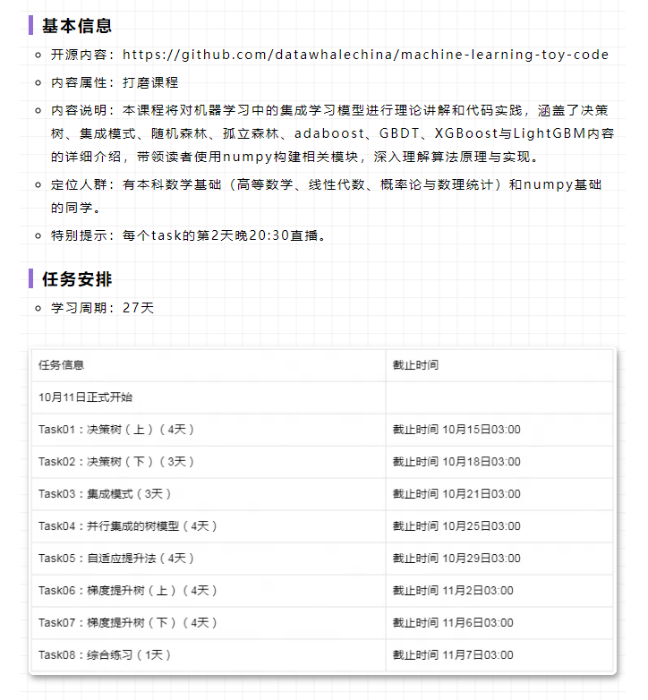

# 第30期 树模型与集成学习

### 目录

  * [Task01: 决策树(上)](docs/tree_ensemble_30/task01.md)
  * [Task02: 决策树（下）](docs/tree_ensemble_30/task02.md)
  * [Task03: 集成模式](docs/tree_ensemble_30/task03.md)
  * [Task04: 并行集成的树模型](docs/tree_ensemble_30/task04.md)
  * [Task05: 自适应提升法](docs/tree_ensemble_30/task05.md)
  * [Task06: 梯度提升树（上）](docs/tree_ensemble_30/task06.md)
  * [Task07: 梯度提升树（下）](docs/tree_ensemble_30/task07.md)
  * [Task08: 综合练习](docs/tree_ensemble_30/task08.md)

### 扩展

### 主要贡献者
[@ Choi-恒者行远](https://github.com/caioo0)  
      
