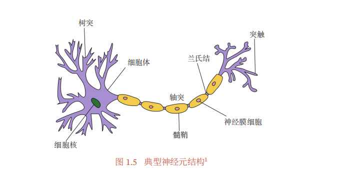
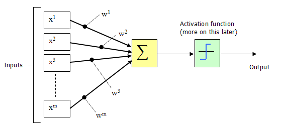
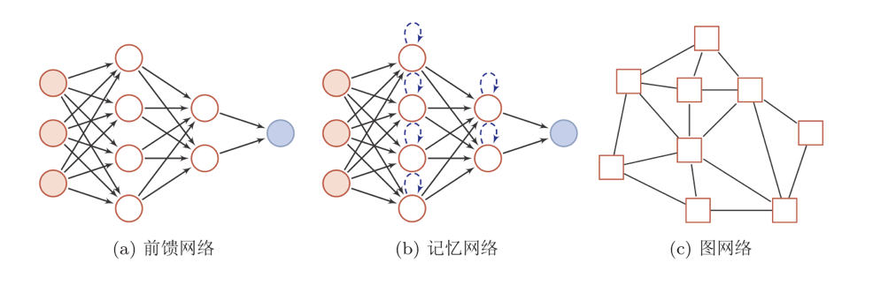
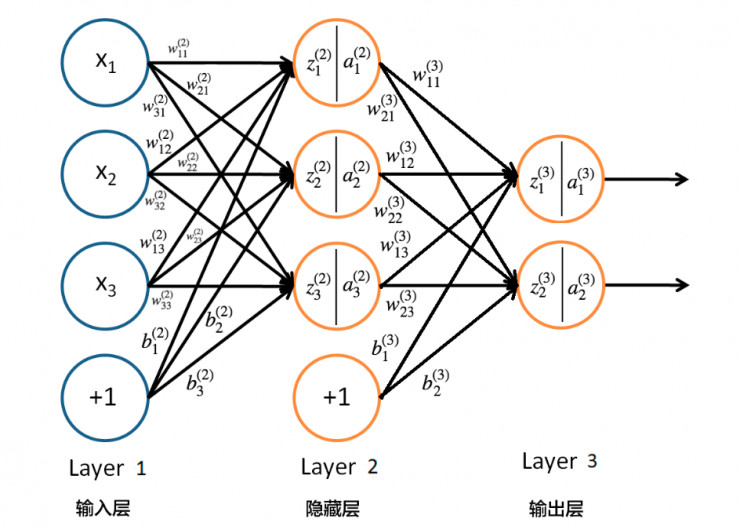
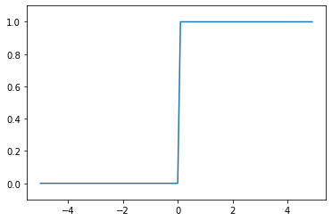
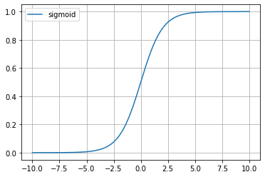
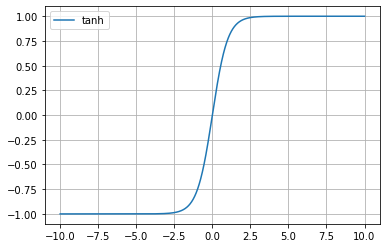
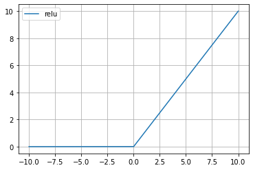

# Task03: 前馈神经网络
----
>（本学习笔记来源于DataWhale-11月组队学习：[水很深的深度学习学习地址](https://datawhalechina.github.io/unusual-deep-learning/#/04.%E5%89%8D%E9%A6%88%E7%A5%9E%E7%BB%8F%E7%BD%91%E7%BB%9C) ,[B站视频讲解地址](https://www.bilibili.com/video/BV1iq4y197L4?from=search&seid=15514429050345514467&spm_id_from=333.337.0.0) ）
```md
神经网络是一种大规模的并行分布式处理器，天然具有存储并使用经验知识的能力．
它从两个方面上模拟大脑：
（1）网络获取的知识是通过学习来获取的；
（2）内部神经元的连接强度，即突触权重，用于储存获取的知识．
——西蒙·赫金（Simon Haykin）[Haykin, 1994]
```

## 1. 神经元

---
人类大脑是人体最复杂的器官，由**神经元**、**神经胶质细胞**、**神经干细胞**和**血管**组成．

其中，神经元（Neuron），也叫神经细胞（Nerve Cell），是携带和传输信息的细胞，是人脑神经系统中最基本的单元．人脑包含近860亿个神经元 [Azevedo et al., 2009]．[神经网络与深度学习.,邱锡鹏 2020](https://nndl.github.io/)

早在 $1904$ 年，生物学家就已经发现了神经元的结构．典型的神经元结构大致可分为**细胞体**和**细胞突起**． 

（1） **细胞体（Soma）**中的神经细胞膜上有各种受体和离子通道，胞膜的受体可与相应的化学物质神经递质结合，引起离子通透性及膜内外电位差发生改变，产生相应的生理活动：兴奋或抑制． 

（2） **细胞突起** 是由细胞体延伸出来的细长部分，又可分为树突和轴突．

    a ) 树突（Dendrite）可以接收刺激并将兴奋传入细胞体．每个神经元可以有一或多个树突．
    b ) 轴突（Axon）可以把自身的兴奋状态从胞体传送到另一个神经元或其他组织．每个神经元只有一个轴突．

神经元可以接收其他神经元的信息，也可以发送信息给其他神经元．神经元之间没有物理连接，两个“连接”的神经元之间留有 20 纳米左右的缝隙，并靠突 触（Synapse）进行互联来传递信息，形成一个神经网络，即神经系统．

突触可以理解为神经元之间的连接“接口”，将一个神经元的兴奋状态传到另一个神经元．

一个神经元可被视为一种只有两种状态的细胞：兴奋和抑制．神经元的状态取决于从其他的神经细胞收到的输入信号量，以及突触的强度（抑制或加强）．

当信号量总和超过了某个阈值时，细胞体就会兴奋，产生电脉冲．电脉冲沿着轴突并通过突触传递到其他神经元．

下图给出了一种典型的神经元结构．




### 1.1 神经元(M-P)模型


MP神经元模型是1943年，由美国神经生理学家沃伦·麦卡洛克( Warren McCulloch ) 和数学家沃尔特 ·皮茨(Walter Pitts )提出的。

**MP神经元模型**根据生物神经元的结构，一个非常简单的**神经元**模型，。




现代神经网络中的神经元和MP神经元的结构并无太多变化。

- MP神经元：激活函数$f$为[0,1]的阶跃函数
- 现代神经元：激活函数通常要求是**连续可导的函数**


M-P模型表达公式：

$$
 y = f(\sum^{m}_{i=1}w_{i}x_i - \theta)
$$

其中，$y$ 表示输出，$w_i$ 表示连接权重， $x_i$ 表示输入数据， $\theta$ 为激活阈值，函数f(⋅)也被称为激活函数
    
**M-P模型的工作原理：**

当所有的输入与对应的连接权重的乘积${{\omega _i} \cdot {x_i}}$之和大于阈值$\theta$时，$y$输出为1，否则输出为0。
需要注意的是，${{x_i}}$ 也只能是0或1的值，而${{\omega _i}}$和$\theta$则根据需要自行设置。

如上图所示，函数f(⋅)可以用一个阶跃方程表示，大于阈值激活；否则则抑制。但是这样有点太粗暴，因为阶跃函数不光滑，不连续，不可导，因此我们更常用的方法是用**sigmoid**函数来表示函数函数f(⋅)。

**M-PM模型的应用：**

M-P模型在创建之初，研究者就发现通过手动设置 ${{\omega _i}}$ 和 $h$ ，可以实现基本的逻辑运算——AND, OR , NOT (`不能实现异或`)


**M-P模型总结:**

明白M-P模型的计算公式，以及STEP激活函数的取值为0-1折线型。熟悉M-P模型在逻辑运算中的应用，体验人为添加权重和阈值，实现逻辑运算。


### 1.2 网络结构

人工神经网络由神经元模型构成，这种由许多神经元组成的信息处理网络具有**并行分布结构**,目前常用的神经网络结构有以下三种：


- 前馈网络：全连接前馈网络和卷积神经网络

>前馈网络中各个神经元按接收信息的先后分为不同的组．每一组可以看作一个神经层．
每一层中的神经元接收前一层神经元的输出，并输出到下一层神经元．
整个网络中的信息是朝一个方向传播，没有反向的信息传播，可以用一个有向无环路图表示

- 记忆网络：循环神经网络、Hopfield 网络、玻尔兹曼机（第12.1节）、受限玻尔兹曼机等

>记忆网络，也称为反馈网络，网络中的神经元不但可以接收其他神经元的信
息，也可以接收自己的历史信息．和前馈网络相比，记忆网络中的神经元具有记 忆功能，在不同的时刻具有不同的状态．记忆神经网络中的信息传播可以是单向
或双向传递，因此可用一个有向循环图或无向图来表示．
记忆网络可以看作一个程序，具有更强的计算和记忆能力．


- 图网络：知识图谱、社交网络、分子（Molecular ）网络等

> 前馈网络和记忆网络的输入都可以表示为向量或向量序列．


前馈网络和记忆网络很难处理图结构的数据．

图网络是前馈网络和记忆网络的泛化，包含很多不同的实现方式，比如 图卷积网络（Graph Convolutional Network，GCN）[Kipf et al., 2016]、图注意力网络（Graph Attention Network，GAT）[Veličković et al., 2017]、消息传递神经网络（Message Passing Neural Network，MPNN）[Gilmer et al., 2017]等．


前馈网络、记忆网络和图网络的网络结构示例，其中圆形节点表示一个神经元，方形节点表示一组神经元．





## 2. 感知器


### 2.1 单层感知器

1958 年，罗森布拉特( Roseblatt )提出了感知器，与 M-P 模型需 要人为确定参数不同，**感知器能够通过训练自动确定参数**。
训练方式为有监督学习，即需要设定训练样本和期望输出，然后调整实际输出和期望输出之差的方式(误差修正学习)。

$$
 w_i ← w_i + \alpha(r-y)x\\
 \theta ←\theta - \alpha(r-y)
$$

其中，$\alpha$ 是学习率，$r$ 和 $y$ 分别是期望输出和实际输出。

感知器权重调整的基本思路：


- 实际输出 y 与期望输出 r 相等时，w 和 θ 不变

- 实际输出 y 与期望输出 r 不相等时，调整 w 和 θ 的值


```python
import numpy as np
#建立数据集
x = np.mat([[1,0,0],[1,0,1],[1,1,0],[1,1,1],[0,0,1],[0,1,0],[0,1,1],[0,0,0]])
y = np.mat([[-1],[1],[1],[1],[-1],[-1],[1],[-1],])

#设置初始权值和偏置值
w = np.mat([0.1,0.2,0.2])
baise = 0.4

#学习率
rate = 0.01

#激活函数
def sgn(x):
  return np.where(x >= 0.0, 1, -1)

#通过学习规则，进行迭代
for i in range(1000):
  #误差计算
  errors = 0
  for j in range(len(x)):
    #误差计算
    r = rate*(y[j] - sgn(x[j]*w.T+baise))
    #r = rate*(y[j] - (x[j]*w.T+baise))
    #调整权值
    w += r*x[j]
    baise += r
    #误差计算
    errors += abs(r)
  print(i,'w=',w,'baise=',baise,' iter :error is ', errors)
  if errors ==0:
    break
```

    0 w= [[0.08 0.18 0.18]] baise= [[0.32]]  iter :error is  [[0.08]]
    1 w= [[0.06 0.16 0.16]] baise= [[0.24]]  iter :error is  [[0.08]]
    2 w= [[0.04 0.14 0.14]] baise= [[0.16]]  iter :error is  [[0.08]]
    3 w= [[0.02 0.12 0.12]] baise= [[0.08]]  iter :error is  [[0.08]]
    4 w= [[-6.9388939e-18  1.0000000e-01  1.0000000e-01]] baise= [[-6.24500451e-17]]  iter :error is  [[0.08]]
    5 w= [[-6.9388939e-18  8.0000000e-02  8.0000000e-02]] baise= [[-0.04]]  iter :error is  [[0.04]]
    6 w= [[-6.9388939e-18  6.0000000e-02  6.0000000e-02]] baise= [[-0.08]]  iter :error is  [[0.04]]
    7 w= [[0.02 0.06 0.06]] baise= [[-0.08]]  iter :error is  [[0.04]]
    8 w= [[0.04 0.06 0.06]] baise= [[-0.08]]  iter :error is  [[0.04]]
    9 w= [[0.04 0.06 0.06]] baise= [[-0.08]]  iter :error is  [[0.]]


### 2.2 多层感知器（MLP）

单层感知器只能解决**线性可分**问题，而不能解决**线性不可分**问题；为了解决线性不可分问题，我们需要使用**多层感知器**（Muti-Layer Perception ，MLP）。


多层感知器指的是由多层结构的感知器递阶组成的输入值向前传播的网络，也被称为**前馈网络**或**正向传播网络**。

以三层结构的多层感知器为例，它由输入层、中间层及输出层组成

- 与M-P模型相同，中间层的感知器通过权重与输入层的各单元相连接，通过阈值函数计算中间层各单元的输出值
- 中间层与输出层之间同样是通过权重相连接


###  MLP神经网络的结构和原理

MLP包括包括三层：**输入层、隐层和输出层**

MLP神经网络不同层之间是**全连接**的（**全连接**的意思就是：上一层的任何一个神经元与下一层的所有神经元都有连接）。


神经网络三个基本要素：**权重**、**偏置**和**激活函数**

**权重：**神经元之间的连接强度由权重表示，权重的大小表示可能性的大小

**偏置：**偏置的设置是为了正确分类样本，是模型中一个重要的参数，即保证通过输入算出的输出值不能随便激活。

**激活函数：**起非线性映射的作用，其可将神经元的输出幅度限制在一定范围内，一般限制在（-1 - 1）或（0 - 1）之间。最常用的激活函数是Sigmoid函数，其可将（-∞，+∞）的数映射到（0 - 1）的范围内。


## 3. BP算法


反向传播算法(Error Back Propagation)，即BP算法最早有沃博斯于1974年提出，鲁梅尔哈特等人进一步发展了该理论。


### 3.1 BP算法概念

BP神经网络是一种多层的前馈神经网络，其主要的特点是：信号是前向传播的，而误差是反向传播的。具体来说，对于如下的只含一个隐层的神经网络模型：

BP神经网络的过程主要分为两个阶段，

- 第一阶段是信号的前向传播，从输入层经过隐含层，最后到达输出层；
- 第二阶段是误差的反向传播，从输出层到隐含层，最后到输入层，依次调节隐含层到输出层的权重和偏置，输入层到隐含层的权重和偏置。



### 3.2 梯度下降法

BP算法就是通过比较实际输出和期望输出得到误差信号，把误差信 号从输出层逐层向前传播得到各层的误差信号，再通过调整各层的连接权重以减小误差。权重的调整主要使用梯度下降法：

$$
   Δ{w} = -\alpha{\frac{∂{E}}{∂{w}}}
$$

### 3.3 激活函数

### 3.3.1 阶跃函数


$$
g(z)=\left\{\begin{array}{cc} 
		0, & (x<=0)\\ 
		1, & (x>0)\ 
\end{array}\right.
$$


```python
# coding: utf-8
import numpy as np
import matplotlib.pylab as plt
 
 
def step_function(x):
    return np.array(x > 0, dtype=np.int)
 
X = np.arange(-5.0, 5.0, 0.1)
Y = step_function(X)
plt.plot(X, Y)
plt.ylim(-0.1, 1.1)  # 指定图中绘制的y轴的范围
plt.show()

#
```


​    

​    


阶跃函数以 0 为界，输出从 0 切换为 1（或从 1切换 0） 。其值呈阶梯式变化，所以称之为阶跃函数。

###  3.3.2 sigmoid函数:

 $ a = g(z) = \frac{1}{1+e^{-z}}$


```python
#导入相关库
import matplotlib.pyplot as plt
import numpy as np 

#函数
g=lambda z:1.0/(1.0+np.exp(-x))

start=-10 #输入需要绘制的起始值（从左到右）
stop=10#输入需要绘制的终点值
step=0.01#输入步长
num=int((stop-start)/step) #计算点的个数

x = np.linspace(start,stop,num)
y = g(x)

fig=plt.figure(1)
plt.plot(x, y,label='sigmoid')
plt.grid(True)#显示网格

plt.legend()#显示旁注#注意：不会显示后来再定义的旁注
plt.show(fig)

#
```


​    

​    


由图像可知，sigmoid函数的值域为（0，1）


**导数：**
$$
g'(z) = g(z) * (1 - g(z))
$$

### 3.3.3 tanh：

 $ g(z) = \frac{e^z-e^{-z}}{e^z+e^{-z}}$


```python
#导入相关库
import matplotlib.pyplot as plt
import numpy as np 

#函数
g=lambda z:(np.exp(z)-np.exp(-z))/(np.exp(z)+np.exp(-z))

start=-10 #输入需要绘制的起始值（从左到右）
stop=10 #输入需要绘制的终点值
step=0.01#输入步长
num=int((stop-start)/step) #计算点的个数
x = np.linspace(start,stop,num)
y = g(x)

fig=plt.figure(1)
plt.plot(x, y,label='tanh')
plt.grid(True)#显示网格

plt.legend()#显示旁注
plt.show(fig)
# 
```


    


由图像可知，tanh函数是sigmoid函数向下平移和收缩后的结果。

**导数:**

$$
g'(z) = 1-(g(z))^2
$$

sigmoid和tanh激活函数有共同的缺点：即在z很大或很小时，梯度几乎为零，因此使用梯度下降优化算法更新网络很慢。

### 3.3.4 ReLU (Rectified Linear Unit，修正线性单元)：

 $ g(x) = max(0,x)$


```python
#导入相关库
import matplotlib.pyplot as plt
import numpy as np 

#函数
g=lambda z:np.maximum(0,z)

start=-10 #输入需要绘制的起始值（从左到右）
stop=10 #输入需要绘制的终点值
step=0.01#输入步长
num=int((stop-start)/step) #计算点的个数
x = np.linspace(start,stop,num)
y = g(x)

fig=plt.figure(1)
plt.plot(x, y,label='relu')
plt.grid(True)#显示网格

plt.legend()#显示旁注
plt.show(fig)

# 
```


​    

​    


**导数：**
$$
g(z)=\left\{\begin{array}{cc} 
		1, & if z>0\\ 
      undifined, & if z=0\\ 
		0, & if z<0\ 
\end{array}\right.
$$

由于sigmoid和tanh存在上述的缺点，因此**relu**激活函数成为了大多数神经网络的默认选择。

但是relu也存在缺点：即在 z 小于0时，斜率即导数为0，因此引申出下面的leaky relu函数，但是实际上leaky relu使用的并不多。


## 4. 优化问题

**难点**

-参数过多，影响训练
-非凸优化问题：即存在局部最优而非全局最优解，影响迭代
-梯度消失问题，下层参数比较难调
-参数解释起来比较困难

**需求**

-计算资源要大
-数据要多
-算法效率要好：即收敛快

**非凸优化问题**

- 平方误差损失
- 交叉熵损失


**梯度消失问题**

- logistic函数的导数
- tanh函数的导数


## 参考资料

1. [周志华《机器学习》习题解答：Ch5.6 - BP算法改进](https://pnyuan.github.io/blog/zzh-ml/%E5%91%A8%E5%BF%97%E5%8D%8E%E3%80%8A%E6%9C%BA%E5%99%A8%E5%AD%A6%E4%B9%A0%E3%80%8B%E4%B9%A0%E9%A2%98%E8%A7%A3%E7%AD%94%EF%BC%9ACh5.6%20-%20BP%E7%AE%97%E6%B3%95%E6%94%B9%E8%BF%9B/)
2. [零基础入门深度学习(1) - 感知器](https://www.zybuluo.com/hanbingtao/note/433855)
3. [神经网络1：多层感知器-MLP](https://zhuanlan.zhihu.com/p/63184325)
4. [深入理解BP神经网络](https://www.jianshu.com/p/6ab6f53874f7)
5. [神经网络中 BP 算法的原理与 Python 实现源码解析](https://zhuanlan.zhihu.com/p/30187353)
6. [神经网络，BP算法的理解与推导](https://zhuanlan.zhihu.com/p/45190898)
7. [常见的激活函数（sigmoid、tanh、relu）](https://zhuanlan.zhihu.com/p/63775557)


```python

```
