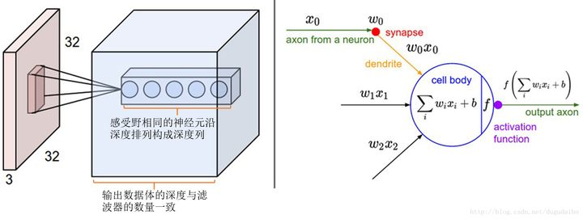
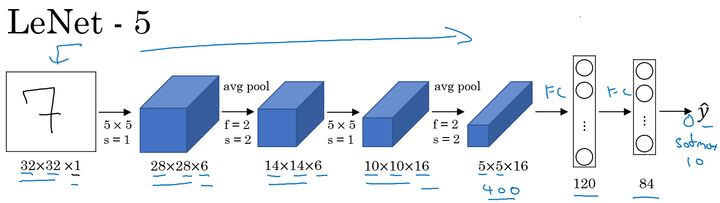
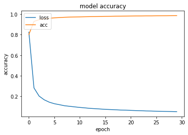
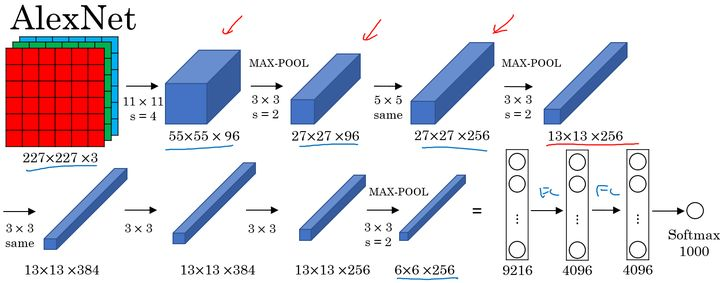
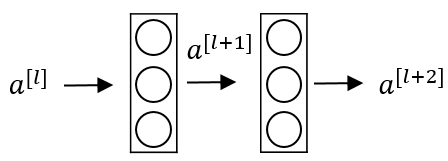
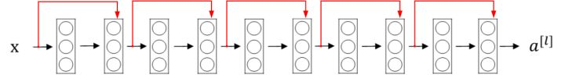

# Task04: 卷积神经网络CNN
----
>（本学习笔记来源于DataWhale-11月组队学习：[水很深的深度学习学习地址](https://datawhalechina.github.io/unusual-deep-learning/#/5.CNN) ,[B站视频讲解](https://www.bilibili.com/video/BV1iq4y197L4?p=3) ）
```md
如果人工智能是一块蛋糕，
那么强化学习（ Reinforcement Learning）是蛋糕上的一粒樱桃，
监督学习（Supervised Learning）是外面的一层糖霜，
无监督学习（ Unsupervised Learning）则是蛋糕胚。
```

**全连接网络 VS 卷积网络**

全连接神经网络

- 参数数量太多 
- 没有利用像素之间的位置信息
- 网络层数限制
- 所需内存和计算量巨大。

卷积神经网络

- 局部连接: 每个神经元不再和上一层的所有神经元相连，而只和一小部分神经元相连。这样就减少了很多参数。
- 权值共享:一组连接可以共享同一个权重，而不是每个连接有一个不同的权重，这样又减少了很多参数
- 下采样 : 使用Pooling来减少每层的样本数，进一步减少参数数量，同时还可以提升模型的鲁棒性。


## 1. 卷积（Convolution）


卷积（Convolution），也叫褶积，是分析数学中一种重要的运算．

### 1.1 卷积分类:

**连续卷积：**  

$ (f*g)(n)= \int^{\infty}_{-\infty}f(\tau)g(n-\tau)d\tau ， n=\tau + (n-\tau)$


**离散卷积：**  

$ (f*g)(n)= \sum^{\infty}_{\tau=-\infty}f(\tau)g(n-\tau) ， n=\tau + (n-\tau)$


**卷积应用场景**

- 统计学中加权平均法
- 概率论中两个独立变量之和概率密度的计算
- 信号处理中的线性系统
- 物理学的线性系统
- 图像处理中的应用(卷积神经网络)


其他卷积：

- 转置卷积/微步卷积：低维特征映射到高维特征

- 空洞卷积：为了增加输出单元的感受野，通过给卷积核插入“空洞”来变相地增加其大小。


实际应用中卷积网络中的卷积核常见为离散卷积运算.


在信号处理或图像处理中，经常使用一维或二维卷积．

### 1.2  一维卷积

一维卷积经常用在信号处理中，用于计算信号的延迟累积. 


假设一个信号发生器每个时刻 $𝑡$ 产生一个信号 $𝑥_𝑡$，其信息的衰减率为 $𝑤_𝑘$，即在 $𝑘 − 1$ 个时间步长
后，信息为原来的$𝑤_𝑘$ 倍．假设$𝑤_1 = 1, 𝑤_2 = 1/2, 𝑤_3 = 1/4$，那么在时刻 $𝑡$ 收到的信号 $𝑦_𝑡$ 为当前时刻产生的信息和以前时刻延迟信息的叠加

$$
𝑦_𝑡 = 1 × 𝑥_𝑡 + 1/2 × 𝑥_{𝑡−1} + 1/4 × 𝑥_{𝑡−2}   \\
= 𝑤_1 × 𝑥_𝑡 + 𝑤_2 × 𝑥_{𝑡−1} + 𝑤_3 × 𝑥_{𝑡−2}  \\
= \sum^{3}_{𝑘=1}𝑤_𝑘𝑥_{𝑡−𝑘+1}.
$$

我们把$𝑤_1, 𝑤_2, ⋯$称为`滤波器`（Filter）或`卷积核`（Convolution Kernel）．

假设滤波器长度为$𝐾$，它和一个信号序列$𝑥_1, 𝑥_2, ⋯$的**卷积**为


$$
𝑦_𝑡 =  \sum^{k}_{𝑘=1}𝑤_𝑘𝑥_{𝑡−𝑘+1}.
$$


### 1.3 二维卷积

二维卷积运算：给定二维的图像$I$作为输入，二维卷积核$K$，卷积运算可表示为 
$$
S(i,j)=(I∗K)(i,j)=∑m∑nI(i−m,j−n)K(m,n)
$$
卷积核需要进行上下翻转和左右反转，`吴恩达的说法，RNN中二维卷积核可以不必做任何翻转,并不影响结果`


卷积通常有三种类型：full卷积、same卷积和valid卷积.这里就不多展开,想了解可以阅读书籍:[图解深度学习与神经网络：从张量到TensorFlow实现](https://github.com/XQLuck/DeepLearning-Notes/blob/master/Books/%E3%80%8A%E5%9B%BE%E8%A7%A3%E6%B7%B1%E5%BA%A6%E5%AD%A6%E4%B9%A0%E4%B8%8E%E7%A5%9E%E7%BB%8F%E7%BD%91%E7%BB%9C%EF%BC%9A%E4%BB%8E%E5%BC%A0%E9%87%8F%E5%88%B0TensorFlow%E5%AE%9E%E7%8E%B0%E3%80%8B_%E5%BC%A0%E5%B9%B3_2018-09-01.pdf)


## 2. 卷积神经网络基本原理

卷积神经网络的基本结构大致包括：`卷积层`、`激活函数`、`池化层`、`全连接层`、`输出层`等。

### 2.1 卷积层


卷积层的运算过程如下图，用一个卷积核扫完整张图片：


这个过程我们可以理解为我们使用一个过滤器（卷积核）来过滤图像的各个小区域，从而得到这些小区域的特征值。


**步长（Stride）**

Stride的作用：是成倍缩小尺寸，而这个参数的值就是缩小的具体倍数，比如步幅为2，输出就是输入的1/2；步幅为3，输出就是输入的1/3。以此类推。

【卷积核的大小一般为奇数 * 奇数】 $1* 1，3* 3，5 * 5，7 * 7$ 都是最常见的。这是为什么呢？为什么没有 偶数 * 偶数？

```md
 奇数卷积核中心只有一列，可以满足两边对称，比较容易判断。好像跟垂直边缘和水平边缘有关。
```

**数据填充（padding）**

两种padding：

- valid padding：不进行任何处理，只使用原始图像，不允许卷积核超出原始图像边界
- same padding：进行填充，允许卷积核超出原始图像边界，并使得卷积后结果的大小与原来的一致


**感受野**

在处理图像这样的高维度输入时，让每个神经元都与前一层中的所有神经元进行全连接是不现实的。相反，我们让每个神经元只与输入数据的一个局部区域连接。该连接的空间大小叫做神经元的感受野（receptive field），它的尺寸是一个超参数（其实就是滤波器的空间尺寸）。在深度方向上，这个连接的大小总是和输入量的深度相等。需要再次强调的是，我们对待空间维度（宽和高）与深度维度是不同的：连接在空间（宽高）上是局部的，但是在深度上总是和输入数据的深度一致，这一点会在下面举例具体说明。





在图 2 中展现的卷积神经网络的一部分，其中的红色为输入数据，假设输入数据体尺寸为[32x32x3]（比如CIFAR-10的RGB图像），如果感受野（或滤波器尺寸）是5x5，那么卷积层中的每个神经元会有输入数据体中[5x5x3]区域的权重，共5x5x3=75个权重（还要加一个偏差参数）。注意这个连接在深度维度上的大小必须为3，和输入数据体的深度一致。其中还有一点需要注意，对应一个感受野有75个权重，这75个权重是通过学习进行更新的，所以很大程度上这些权值之间是不相等（也就对于同一个卷积核，它对于与它连接的输入的每一层的权重都是独特的，不是同样的权重重复输入层层数那么多次就可以的）。在这里相当于前面的每一个层对应一个传统意义上的卷积模板，每一层与自己卷积模板做完卷积之后，再将各个层的结果加起来，再加上偏置，注意是一个偏置，无论输入输入数据是多少层，一个卷积核就对应一个偏置。


**总结:**

卷积层是构建卷积神经网络的核心层，它产生了网络中大部分的计算量。注意是计算量而不是参数量。

**卷积层的作用:**

1. 滤波器的作用或者说是卷积的作用
2. 可以被看做是神经元的一个输出
3. 降低参数的数量

### 2.2 激活函数

激活函数是用来加入非线性因素，提高网络表达能力，卷积神经网络中最常用的是ReLU，Sigmoid使用较少。


1. ReLU函数


$$
f(z)=\left\{\begin{array}{cc} 
		z, & if z>=0\\ 
		0, & if z<0\ 
\end{array}\right.
$$


 
ReLU函数的优点：

- 计算速度快，ReLU函数只有线性关系，比Sigmoid和Tanh要快很多
- 输入为正数的时候，不存在梯度消失问题


ReLU函数的缺点：

- 强制性把负值置为0，可能丢掉一些特征
- 当输入为负数时，权重无法更新，导致“神经元死亡”(学习率不 要太大)

2. Parametric ReLU

$$
f(z)=\left\{\begin{array}{cc} 
		{z}, & if z>=0\\ 
		\alpha{z}, & if  z<0\ 
\end{array}\right.
$$
 
当 𝛼=0.01 时，称作Leaky ReLU
当 𝛼 从高斯分布中随机产生时，称为Randomized ReLU(RReLU)

PReLU函数的优点：

- 比sigmoid/tanh收敛快
- 解决了ReLU的“神经元死亡”问题

PReLU函数的缺点：需要再学习一个参数，工作量变大

3. ELU函数

$$
f(z)=\left\{\begin{array}{cc} 
		{z}, & if z>=0\\ 
		\alpha{e^z-1}, & if z<0\ 
\end{array}\right.
$$
 
ELU函数的优点：

- 处理含有噪声的数据有优势
- 更容易收敛

ELU函数的缺点：计算量较大，收敛速度较慢

- CNN在卷积层尽量不要使用Sigmoid和Tanh，将导致梯度消失。
- 首先选用ReLU，使用较小的学习率，以免造成神经元死亡的情况。
- 如果ReLU失效，考虑使用Leaky ReLU、PReLU、ELU或者Maxout，此时一般情况都可以解决

特征图

- 浅层卷积层：提取的是图像基本特征，如边缘、方向和纹理等特征
- 深层卷积层：提取的是图像高阶特征，出现了高层语义模式，如“车轮”、“人脸”等特征
    

### 2.3 池化层

池化层（Pooling Layer）也叫子采样层（Subsampling Layer）：促进特征选择，降低特征/参数数量，避免过拟合

池化（Pooling）是指对每个区域进行下采样（Down Sampling）得到一个值，作为这个区域的概括


常用汇聚函数：

1. 最大汇聚（Maximum Pooling/ Max Pooling）：$y\_{m, n}^{d}=\max \_{i \in R\_{m, n}^{d}} x\_{i}$
2. 平均汇聚（Mean Pooling）：$y\_{m, n}^{d}=\frac{1}{\left|R\_{m, n}^{d}\right|} \sum\_{i \in R\_{m, n}^{d}} x\_{i}$

池化层可以看作特殊的卷积层：卷积核大小为$K\times K$，步长为$S\times S$，卷积核为max函数或mean函数

## 3 . 经典CNN

### 3.1 LeNet-5


来源论文：[LeCun, Yann, et al. “Gradient-based learning applied to document recognition.” Proceedings of the IEEE 86.11 (1998): 2278-2324.](https://ieeexplore.ieee.org/document/726791)

论文详解：[CNN入门算法LeNet-5详解](https://www.datalearner.com/blog/1051558664111790)

代码实现：https://github.com/TaavishThaman/LeNet-5-with-Keras

LeNet-5主要是针对灰度设计的，所以其输入较小，为 $ 32 × 32 × 1 $ ，其结构如下：





LeNet-5结构解读：

**INPUT($ 32 × 32 $)：**$32x32$ 的手写数字的图片，通道为$1$ ，灰度图像，2维矩阵，`彩色图像三个通道`。  

**C1：** C1层使用了6个大小为5x5的卷积核(f=5*5*6)，步长为1(s=1),填充为0(p=0,vailid padding)。因此，输出为28x28x6 $(32+2*0-5)/2 +1 = 28$。  
**Layer2：**2x2大小的池化层（f=2，s=2），使用的是average pooling，步长为2。那么这一层的输出就是14x14x6，缩小一半。  
**Layer3：**16个大小为5x5的卷积核，步长为1，输出为：$10×10×16$。  
**Layer4：**和第二层一样，2x2大小的池化层（二次臭氧层），使用的是average pooling，步长为2。  
**Layer5：**卷积层，120个卷积核，大小为1x1。  
**Layer6：**全连接层，隐藏单元是84个。  
**Layer7：**输出层，softmax,输出单元是10个，因为数字识别是0-9。  


总结：
- LeNet-5是一种用于手写体字符识别的非常高效的卷积神经网络,随着网络的深度增加，图像的大小在缩小，与此同时，通道的数量却在增加,每个卷积层后面接一个池化层。
- 卷积神经网络能够很好的利用图像的结构信息。
- 卷积层的参数较少，这也是由卷积层的主要特性即局部连接和共享权重所决定。


```python
import tensorflow as tf

def leNet():
    return tf.keras.models.Sequential([
        tf.keras.layers.Conv2D(filters=6, kernel_size=5, activation='sigmoid',
                               padding='valid'),
        tf.keras.layers.AvgPool2D(pool_size=2, strides=2),
        tf.keras.layers.Conv2D(filters=16, kernel_size=5,
                               activation='sigmoid'),
        tf.keras.layers.AvgPool2D(pool_size=2, strides=2),
        tf.keras.layers.Flatten(),
        tf.keras.layers.Dense(120, activation='sigmoid'),
        tf.keras.layers.Dense(84, activation='sigmoid'),
        tf.keras.layers.Dense(10)])

X = tf.random.uniform((1, 32, 32, 1))
for layer in leNet().layers:
    X = layer(X)
    print(layer.__class__.__name__, 'output shape: \t', X.shape)
```

    Conv2D output shape: 	 (1, 28, 28, 6)
    AveragePooling2D output shape: 	 (1, 14, 14, 6)
    Conv2D output shape: 	 (1, 10, 10, 16)
    AveragePooling2D output shape: 	 (1, 5, 5, 16)
    Flatten output shape: 	 (1, 400)
    Dense output shape: 	 (1, 120)
    Dense output shape: 	 (1, 84)
    Dense output shape: 	 (1, 10)
    

**LeNet5**在MNIST数据集上的实现，C1改为`same`,其他保持一致


```python
from tensorflow.keras.datasets import mnist
from tensorflow.keras.layers import Flatten, Conv2D, MaxPool2D, Dense
from tensorflow.keras.models import Sequential

from tensorflow.keras.optimizers import SGD
from tensorflow.keras.utils import plot_model, to_categorical

import matplotlib.pyplot as plt

(x_train, y_train), (x_test, y_test) = mnist.load_data()

#数据变成TensorFow为Backend的形式
x_train=x_train.reshape(60000,28,28,1)
x_test=x_test.reshape(10000,28,28,1)
#把标签变成one-hot编码的形式
y_train=to_categorical(y_train,num_classes=10)
y_test=to_categorical(y_test,num_classes=10)

# 构建LeNet-5网络
model = Sequential()
model.add(Conv2D(input_shape = (28,28,1), filters=6, kernel_size=(5,5), padding='same', activation='tanh'))
model.add(MaxPool2D(pool_size=(2,2), strides=2))
model.add(Conv2D(input_shape=(14,14,6), filters=16, kernel_size=(5,5), padding='valid', activation='tanh'))
model.add(MaxPool2D(pool_size=(2,2), strides=2))
model.add(Flatten())
model.add(Dense(120, activation='tanh'))
model.add(Dense(84, activation='tanh'))
model.add(Dense(10, activation='softmax'))
model.summary()

model.compile(loss='categorical_crossentropy', optimizer=SGD(lr=0.01), metrics=['accuracy'])
history = model.fit(x_train, y_train, batch_size=128, epochs=30)
print(history.history.keys())


```

    Model: "sequential_12"
    _________________________________________________________________
    Layer (type)                 Output Shape              Param #   
    =================================================================
    conv2d_24 (Conv2D)           (None, 28, 28, 6)         156       
    _________________________________________________________________
    max_pooling2d_4 (MaxPooling2 (None, 14, 14, 6)         0         
    _________________________________________________________________
    conv2d_25 (Conv2D)           (None, 10, 10, 16)        2416      
    _________________________________________________________________
    max_pooling2d_5 (MaxPooling2 (None, 5, 5, 16)          0         
    _________________________________________________________________
    flatten_12 (Flatten)         (None, 400)               0         
    _________________________________________________________________
    dense_36 (Dense)             (None, 120)               48120     
    _________________________________________________________________
    dense_37 (Dense)             (None, 84)                10164     
    _________________________________________________________________
    dense_38 (Dense)             (None, 10)                850       
    =================================================================
    Total params: 61,706
    Trainable params: 61,706
    Non-trainable params: 0
    _________________________________________________________________
    Epoch 1/30
    469/469 [==============================] - 16s 33ms/step - loss: 0.8247 - accuracy: 0.8025
    Epoch 2/30
    469/469 [==============================] - 16s 33ms/step - loss: 0.2817 - accuracy: 0.9295
    Epoch 3/30
    469/469 [==============================] - 17s 36ms/step - loss: 0.2023 - accuracy: 0.9462
    Epoch 4/30
    469/469 [==============================] - 15s 33ms/step - loss: 0.1659 - accuracy: 0.9548
    Epoch 5/30
    469/469 [==============================] - 16s 33ms/step - loss: 0.1425 - accuracy: 0.9599
    Epoch 6/30
    469/469 [==============================] - 16s 35ms/step - loss: 0.1275 - accuracy: 0.9644
    Epoch 7/30
    469/469 [==============================] - 16s 34ms/step - loss: 0.1180 - accuracy: 0.9669
    Epoch 8/30
    469/469 [==============================] - 16s 33ms/step - loss: 0.1077 - accuracy: 0.9698
    Epoch 9/30
    469/469 [==============================] - 16s 33ms/step - loss: 0.1022 - accuracy: 0.9717
    Epoch 10/30
    469/469 [==============================] - 16s 33ms/step - loss: 0.0965 - accuracy: 0.9728
    Epoch 11/30
    469/469 [==============================] - 18s 38ms/step - loss: 0.0913 - accuracy: 0.9738
    Epoch 12/30
    469/469 [==============================] - 19s 40ms/step - loss: 0.0869 - accuracy: 0.9751
    Epoch 13/30
    469/469 [==============================] - 19s 40ms/step - loss: 0.0823 - accuracy: 0.9762
    Epoch 14/30
    469/469 [==============================] - 18s 38ms/step - loss: 0.0792 - accuracy: 0.9769
    Epoch 15/30
    469/469 [==============================] - 18s 38ms/step - loss: 0.0760 - accuracy: 0.9782
    Epoch 16/30
    469/469 [==============================] - 18s 39ms/step - loss: 0.0727 - accuracy: 0.9789
    Epoch 17/30
    469/469 [==============================] - 17s 36ms/step - loss: 0.0706 - accuracy: 0.9793
    Epoch 18/30
    469/469 [==============================] - 17s 36ms/step - loss: 0.0683 - accuracy: 0.9804
    Epoch 19/30
    469/469 [==============================] - 16s 34ms/step - loss: 0.0658 - accuracy: 0.9807
    Epoch 20/30
    469/469 [==============================] - 17s 36ms/step - loss: 0.0651 - accuracy: 0.98130s - loss: 0.0650 - accuracy
    Epoch 21/30
    469/469 [==============================] - 16s 35ms/step - loss: 0.0624 - accuracy: 0.9822
    Epoch 22/30
    469/469 [==============================] - 18s 38ms/step - loss: 0.0605 - accuracy: 0.9830
    Epoch 23/30
    469/469 [==============================] - 18s 37ms/step - loss: 0.0591 - accuracy: 0.9831
    Epoch 24/30
    469/469 [==============================] - 17s 36ms/step - loss: 0.0570 - accuracy: 0.9838
    Epoch 25/30
    469/469 [==============================] - 17s 36ms/step - loss: 0.0563 - accuracy: 0.9837
    Epoch 26/30
    469/469 [==============================] - 18s 38ms/step - loss: 0.0542 - accuracy: 0.9844
    Epoch 27/30
    469/469 [==============================] - 17s 37ms/step - loss: 0.0529 - accuracy: 0.9847
    Epoch 28/30
    469/469 [==============================] - 17s 37ms/step - loss: 0.0523 - accuracy: 0.9848
    Epoch 29/30
    469/469 [==============================] - 17s 36ms/step - loss: 0.0516 - accuracy: 0.9854
    Epoch 30/30
    469/469 [==============================] - 16s 33ms/step - loss: 0.0502 - accuracy: 0.9856
    dict_keys(['loss', 'accuracy'])
    


```python
# summarize history for accuracy
plt.plot(history.history['loss'])
plt.plot(history.history['accuracy'])
plt.title('model accuracy')
plt.ylabel('accuracy')
plt.xlabel('epoch')
plt.legend(['loss','acc'], loc='upper left')
plt.show()
```



### 3.2 AlexNet

来源论文：[Krizhevsky, Alex, Ilya Sutskever, and Geoffrey E. Hinton. 
“Imagenet classification with deep convolutional neural networks.” Advances in neural information processing systems. 2012.](https://papers.nips.cc/paper/4824-imagenet-classification-with-deep-convolutional-neural-networks.pdf)

论文详解：[CNN经典算法AlexNet介绍](https://www.datalearner.com/blog/1051558919769185)

代码实现：
1. https://github.com/hjptriplebee/AlexNet_with_tensorflow
2. https://github.com/TaavishThaman/LeNet-5-with-Keras



网络结构说明  
- 输入层：图像大小为 227×227×3，其中 3 表示输入图像的 channel 数（R，G，B）为 3。
- 卷积层：filter大小11113，s=4，个数为96个
- 池化层：filter为33，s= 2，采用最大池化
- 卷积层：filter 大小 5×5， 个数 256，步长 s=1，padding 使用same，使得卷积层输出图像和输入图像在宽和高上保持不变
（另外有valid、full，具体可参考padding的三种模式）
- 池化层：max pooling，filter 大小 3×3，步长 s=2
- 卷积层：filter 大小 3×3，filter 个数 384，步长 s=1，padding 使用 same
- 卷积层：filter 大小 3×3，filter 个数 384，步长 s=1，padding 使用 same
- 卷积层：filter 大小 3×3，filter 个数 256，步长 s=1，padding 使用 same
- 池化层：max pooling，filter 大小 3×3，步长 s=2；池化操作结束后，将大小为 6×6×256 的输出矩阵排列成一个9216 维的向量。
- 全连接层：neuron 数量为 4096。
- 全连接层：neuron 数量为 4096。
- 全连接层，输出层：softmax 激活函数，neuron 数量为 1000，代表 1000 个类别。


特点：

- AlexNet 模型与 LeNet-5 模型类似，但是更复杂，包含约 6000 万个参数。另外，AlexNet 模型使用了 ReLU 函数。
- 当用于训练图像和数据集时，AlexNet 能够处理非常相似的基本构造模块，这些模块往往包含大量的隐藏单元或数据。


```python
from tensorflow.keras.datasets import mnist
from tensorflow.keras.layers import Flatten, Conv2D, MaxPool2D, Dense
from tensorflow.keras.models import Sequential
from tensorflow.keras.layers import BatchNormalization,Dropout
from tensorflow.keras.optimizers import SGD
from tensorflow.keras.utils import plot_model, to_categorical

import matplotlib.pyplot as plt

# 构建AlexNet-5网络
model = Sequential()
model.add(Conv2D(input_shape = (227,227,3), strides = 4, filters=96, kernel_size=(11,11), padding='valid', activation='relu'))
model.add(BatchNormalization())
model.add(MaxPool2D(pool_size=(3,3), strides=2))
model.add(Conv2D(filters=256, kernel_size=(5,5), padding='same', activation='relu'))
model.add(BatchNormalization())
model.add(MaxPool2D(pool_size=(3,3), strides=2))
model.add(Conv2D(filters=384, kernel_size=(3,3), padding='same', activation='relu'))
model.add(BatchNormalization())
model.add(Conv2D(filters=384, kernel_size=(3,3), padding='same', activation='relu'))
model.add(BatchNormalization())
model.add(Conv2D(filters=256, kernel_size=(3,3), padding='same', activation='relu'))
model.add(BatchNormalization())
model.add(MaxPool2D(pool_size=(2,2), strides=2))
model.add(Flatten())
model.add(Dense(4096, activation='tanh'))
model.add(Dropout(0.5))
model.add(Dense(4096, activation='tanh'))
model.add(Dropout(0.5))
model.add(Dense(10, activation='softmax'))
model.summary()
```

    Model: "sequential_16"
    _________________________________________________________________
    Layer (type)                 Output Shape              Param #   
    =================================================================
    conv2d_34 (Conv2D)           (None, 55, 55, 96)        34944     
    _________________________________________________________________
    batch_normalization_5 (Batch (None, 55, 55, 96)        384       
    _________________________________________________________________
    max_pooling2d_9 (MaxPooling2 (None, 27, 27, 96)        0         
    _________________________________________________________________
    conv2d_35 (Conv2D)           (None, 27, 27, 256)       614656    
    _________________________________________________________________
    batch_normalization_6 (Batch (None, 27, 27, 256)       1024      
    _________________________________________________________________
    max_pooling2d_10 (MaxPooling (None, 13, 13, 256)       0         
    _________________________________________________________________
    conv2d_36 (Conv2D)           (None, 13, 13, 384)       885120    
    _________________________________________________________________
    batch_normalization_7 (Batch (None, 13, 13, 384)       1536      
    _________________________________________________________________
    conv2d_37 (Conv2D)           (None, 13, 13, 384)       1327488   
    _________________________________________________________________
    batch_normalization_8 (Batch (None, 13, 13, 384)       1536      
    _________________________________________________________________
    conv2d_38 (Conv2D)           (None, 13, 13, 256)       884992    
    _________________________________________________________________
    batch_normalization_9 (Batch (None, 13, 13, 256)       1024      
    _________________________________________________________________
    max_pooling2d_11 (MaxPooling (None, 6, 6, 256)         0         
    _________________________________________________________________
    flatten_15 (Flatten)         (None, 9216)              0         
    _________________________________________________________________
    dense_43 (Dense)             (None, 4096)              37752832  
    _________________________________________________________________
    dropout (Dropout)            (None, 4096)              0         
    _________________________________________________________________
    dense_44 (Dense)             (None, 4096)              16781312  
    _________________________________________________________________
    dropout_1 (Dropout)          (None, 4096)              0         
    _________________________________________________________________
    dense_45 (Dense)             (None, 10)                40970     
    =================================================================
    Total params: 58,327,818
    Trainable params: 58,325,066
    Non-trainable params: 2,752
    _________________________________________________________________
    

### 3.3 Inception网络

Inception-v1(GoogLeNet)

来源论文：[Szegedy, Christian, et al. “Going deeper with convolutions.” Proceedings of the IEEE conference on computer vision and pattern recognition. 2015.](https://www.cv-foundation.org/openaccess/content_cvpr_2015/papers/Szegedy_Going_Deeper_With_2015_CVPR_paper.pdf)

论文详解：[CNN经典算法之Inception V1（GoogLeNet）](https://www.datalearner.com/blog/1051559096989577)

代码和预训练资源：[GoogLeNet代码资源（Tensorflow）](https://github.com/conan7882/GoogLeNet-Inception)


**完整的 Inception 网络**


上图是引入 1x1 卷积后的 Inception 模块。值得注意的是，为了将所有的输出组合起来，红色的池化层使用 Same 类型的填充（padding）来池化使得输出的宽高不变，通道数也不变。

多个 Inception 模块组成一个完整的 Inception 网络（被称为 GoogLeNet，以向 LeNet 致敬），如下图所示：


注意黑色椭圆圈出的隐藏层，这些分支都是 Softmax 的输出层，可以用来参与特征的计算及结果预测，起到调整并防止发生过拟合的效果。

经过研究者们的不断发展，Inception 模型的 V2、V3、V4 以及引入残差网络的版本被提出，这些变体都基于 Inception V1 版本的基础思想上。


### 3.4 VGG-16

相关论文：[Simonvan & Zisserman 2015. Very deep convolutional networks for large-scale image recognition。](https://arxiv.org/pdf/1409.1556.pdf)


论文详解：[CNN经典算法VGGNet介绍](https://www.datalearner.com/blog/1051558603213207#google_vignette)

代码和预训练资源：[VGGNet预训练模型及代码资源](https://www.datalearner.com/blog/1051559048634862#%E5%9B%9B%E3%80%81VGGNet%E9%A2%84%E8%AE%AD%E7%BB%83%E6%A8%A1%E5%9E%8B%E5%8F%8A%E4%BB%A3%E7%A0%81%E8%B5%84%E6%BA%90)


VGG卷积层和池化层均具有相同的卷积核大小，都使用 $ 3 × 3，strdie = 1, SAME $ 的卷积和 $ 2  × 2，stride = 2 $ 的池化。


结构

参照图中

VGG-16网络结构很规整，没有那么多的超参数，专注于构建简单的网络，都是几个卷积层后面跟一个可以压缩图像大小的池化层。


特点：

- VGG 又称 VGG-16 网络，“16”指网络中包含 16 个卷积层和全连接层。
- 超参数较少，只需要专注于构建卷积层。
- 结构不复杂且规整，在每一组卷积层进行滤波器翻倍操作。
- VGG 需要训练的特征数量巨大，包含多达约 1.38 亿个参数。

### 3.5 残差网络

因为存在梯度消失和梯度爆炸问题，网络越深，就越难以训练成功。残差网络（Residual Networks，简称为 ResNets）可以有效解决这个问题。


普通的神经网络块的传输：



其前向传播的计算步骤为：

- Linear: $ z^{[l+1]} = W^{[l+1]}a^{l} + b^{[l+1]}$
- Relu: $ a^{[l+1]} = g(z^{[l+1]})$
- Linear: $ z^{[l+2]} = W^{[l+2]}a^{l+l} + b^{[l+2]}$
- Relu: $ a^{[l+2]} = g(z^{[l+2]})$


ResNet是由残差块所构建。

残差块：


上图的结构被称为**残差块（Residual block）**。通过**捷径（Short cut，或者称跳远连接，Skip connections）**可以将 $a^{[l]}$添加到第二个 **ReLU** 过程中，直接建立 $a^{[l]}$与 $a^{[l+2]}$ 之间的隔层联系。表达式如下：

$$
z^{l+1} = W^{[l+1]} + b^{[l+1]}\\
a^{l+1} = g(z^{l+1})\\
z^{l+2} = W^{[l+2]}a^{[l+1]} + b^{[l+2]}\\
a^{l+2} = g(z^{l+2} + a^{[l]})
$$

构建一个残差网络就是将许多残差块堆积在一起，形成一个深度网络。



为了便于区分，在 ResNets 的论文[He et al., 2015. Deep residual networks for image recognition](https://arxiv.org/pdf/1512.03385.pdf)中，非残差网络被称为**普通网络（Plain Network）**。将它变为残差网络的方法是加上所有的跳远连接。


在理论上，随着网络深度的增加，性能应该越来越好。但实际上，对于一个**普通网络**，随着神经网络层数增加，训练错误会先减少，然后开始增多。但残差网络的训练效果显示，即使网络再深，其在训练集上的表现也会越来越好。


残差网络有助于解决梯度消失和梯度爆炸问题，使得在训练更深的网络的同时，又能保证良好的性能。

**残差网络（Residual Network，ResNet）：**通过给非线性的卷积层增加直连边（Shortcut Connection）（也称为残差连接 Residual Connection））的方式来提高信息的传播效率

将目标函数拆分为两部分：恒等函数（Identity Function）和残差函数（Residue Function）：

$$
h(\boldsymbol{x})=\underbrace{\boldsymbol{x}}\_{\text {恒等函数 }}+\underbrace{(h(\boldsymbol{x})-\boldsymbol{x})}\_{\text {残差函数 }}
$$
					


## 参考资料

- [吴恩达深度学习笔记](https://kyonhuang.top/Andrew-Ng-Deep-Learning-notes/#/)
- [动手学习深度学习](https://zh-v2.d2l.ai/chapter_convolutional-neural-networks/lenet.html)


```python

```
