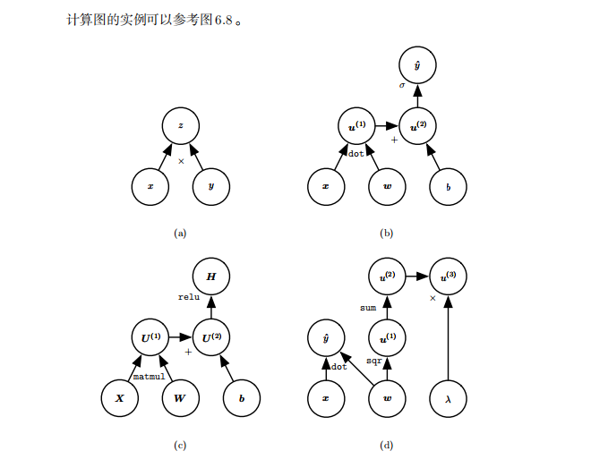
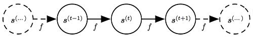
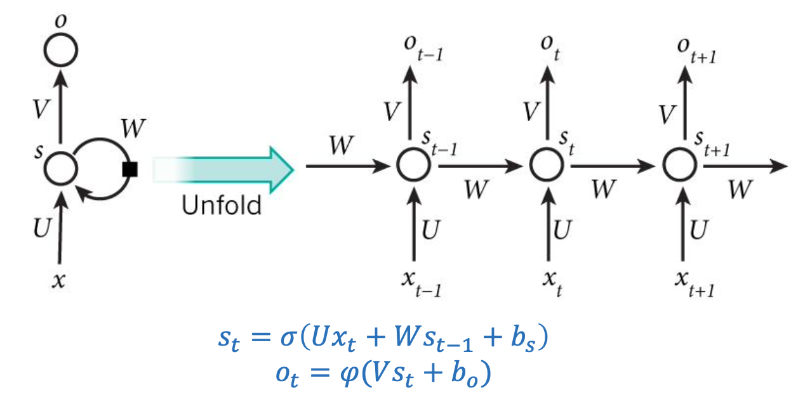
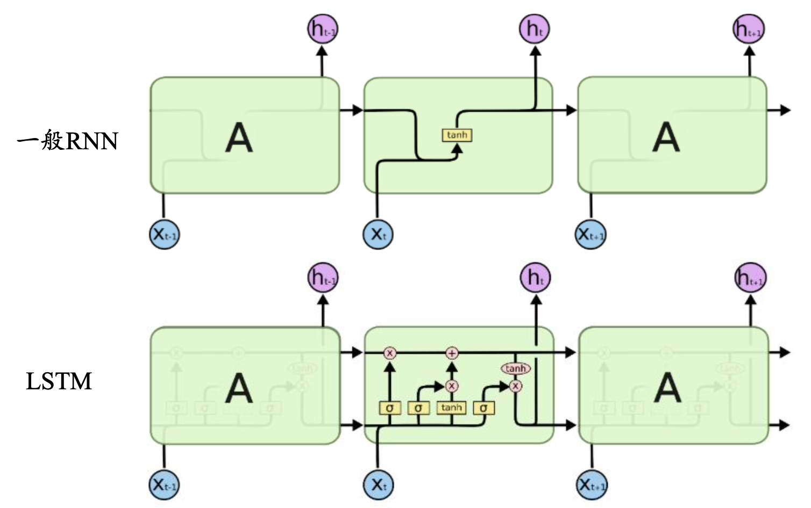

# Task05: 循环神经网络RNN
----
>（本学习笔记来源于DataWhale-11月组队学习：[水很深的深度学习学习地址](https://datawhalechina.github.io/unusual-deep-learning/#/06.RNN) ,[B站视频讲解](https://www.bilibili.com/video/BV1iq4y197L4?p=3) ）

```md
 随机数的产生实在太重要了，不能够让它由偶然性来决定。 
--Robert R. Coveyou, Oak Ridge National Laboratory
```

**循环神经网络(recurrent neural network，RNN)**是一类用于处理序列数据的神经网络，最先在**自然语言处理**中被使用起来。摘自[《Deep Learning》](https://exacity.github.io/deeplearningbookchinese/Chapter10_sequence_modeling_rnn/)

使用 RNN 实现的应用包括下图中所示：


- 文本：字母和词汇的序列
- 语音：音节的序列
- 视频：图像帧的序列
- 时态数据：气象观测数据，股票交易数据、房价数据等


## 1. 计算图

### 1.1 介绍


计算图被定义为有向图，其中节点对应于数学运算。 计算图是表达和评估数学表达式的一种方式

计算图是描述计算结构的一种图，它的元素包括节点(node)和边(edge)，节点表示变量，可以是标量、矢量、张量等，而边表示的是某个操作，即函数。





(a). 使用 $×$ 操作计算 $z = xy$ 的图

(b). 用于逻辑回归预测 $\hat{y} = σ(x⊤_w + b)$ 的图。一些中间表达式在代数表达式中没有名称，但在图形中却需要。我们简单地将 第 $i$ 个这样的变量命名为 $u(i)$

(c). 表达式 $H = max{0, XW + b}$ 的计算图，在给定包含小批量输入数据的设计矩阵 $X$ 时，它计算整流线性单元激活的设计矩阵 $H$。

(d). 对变量实施多个操作也是可能的。该计算图对线性回归模型的权重 $w$ 实施多个操作。这个权重不仅用于预测 $\hat{y}，也用于权重衰减罚项 $λ∑_i w^2_i$。这就是所谓的结构化风险评估。

### 1.2  展开计算图

经典动态系统：

$$
s^{t} = f(s^{(t-1)};\theta),      （5.1）
$$
其中 s(t) 称为系统的状态。$s$ 在时刻 $t$ 的定义需要参考时刻 $t−1$时同样的定义，因此上式是循环的。对有限时间步 τ，τ − 1 次应用这个定义可以展开这个图。例如 τ = 3，我们对式 (5.1) 展开，可以得到：
$$
s^{(3)} = f(s^{(2)}; θ) \\
= f(f(s^{(1)}; θ); θ).
$$

以这种方式重复应用定义，展开等式，就能得到不涉及循环的表达。下面我们使用传统的有向无环计算图呈现这样的表达。



上图将经典动态系统表示为展开的计算图：每个节点表示在某个时刻 $t$ 的状态，并且函数 $f$ 将 $t$ 处的状态映射到 $t+1$ 处的状态。所有时间步都使用相同的参数（用于参数化 $f$ 的相同 $θ$ 值）。

## 2. 循环神经网络(RNN)

对于序列数据，使用**标准神经网络**存在以下问题：

- 对于不同的示例，输入和输出可能有不同的长度，因此输入层和输出层的神经元数量无法固定。
- 从输入文本的不同位置学到的同一特征无法共享。
- 模型中的参数太多，计算量太大。


为了解决这些问题，引入**循环神经网络（Recurrent Neural Network，RNN）**。

**它的核心思想：**样本间存在顺序关系，每个样本和它之前的样本存在关联。通过神经网络在时序上的展开，我们能够找到样本之间的序列相关性。

RNN的一般结构：




其中，$x_t ,s_t,o_t$分别表示的是 $t$ 时刻的输入、记忆和输出，$U,V,W$是RNN的连接权重，$b_s,b_o$
 是RNN的偏置，$σ,φ$是激活函数，$σ$通常选$tanh$或$sigmoid$，$φ$通常选用$softmax$。
 


## 3. LSTM(长短时记忆网络)

RNN存在梯度消失的问题，梯度消失的原因：

- BPTT算法
- 激活函数Tanh

解决方案：  

- ReLU函数
- 门控RNN(LSTM).

LSTM：即长短时记忆网络，于1997年被Sepp Hochreiter 和Jürgen Schmidhuber提出来。

LSTM（Long Short Term Memory，长短期记忆）网络比 GRU 更加灵活和强大，它额外引入了遗忘门（Forget Gate） Γf和输出门（Output Gate） Γo。其结构图和公式如下：

LSTM是一种用于深度学习领域的人工循环神经网络（RNN）结构。一个LSTM单元由输入门、输出门和遗忘门组成，三个门控制信息进出单元。



-  LSTM依靠贯穿隐藏层的细胞状态实现隐藏单元之间的信息传递，只需要少量的线性操作。
-  LSTM引入了“门”机制对细胞状态信息进行添加或删除，由此实现稍长记忆。
-  “门”机制由一个$sigmoid$激活函数层和一个向量点乘操作组成，$sigmoid$层的输出控制了信息传递的比例。


## 4. 其他经典的循环神经网络

- Gated Recurrent Unit(GRU)：2014年提出的，可认为是LSTM 的变种，它的细胞状态与隐状态合并，在计算当前时刻新信息的方法和LSTM有 所不同；GRU只包含重置门和更新门；在音乐建模与语音信号建模领域与LSTM具有相似的性能，但是参数更少，只有两个门控。

- Peephole LSTM

- Bi-directional RNN(双向RNN)

- Continuous time RNN(CTRNN)


## 5. RNN主要应用

- 语言模型: 根据之前和当前词预测下一个单词或者字母.或 问答系统
- 自动作曲
- 机器翻译
- 自动写作
- 图像描述


## 参考资料：

1. [计算图(Computational Graphs)](https://iowiki.com/python_deep_learning/python_deep_learning_computational_graphs.html)
2. [AI算法工程师手册.循环神经网络](https://www.bookstack.cn/read/huaxiaozhuan-ai/spilt.1.017a5afe2adab014.md)
3. [RNN 循环神经网络（上）：计算图与网络设计模式](https://xiaosheng.run/2017/06/07/article68/)
4. [深度学习.中文翻译](https://github.com/exacity/deeplearningbook-chinese)


```python

```
