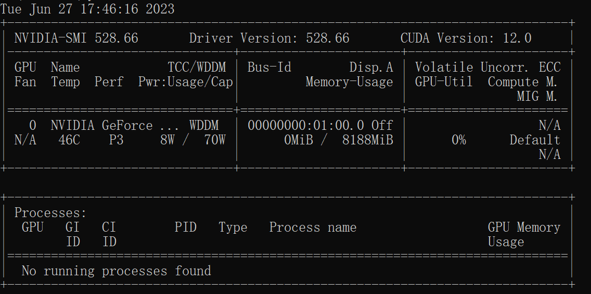

# PyTorch简介和安装

（本学习笔记来源于[DataWhale-深入浅出PyTorch](https://datawhalechina.github.io/thorough-pytorch/)）
## PyTorch简介

### 1.1.1 PyTorch的介绍

PyTorch是由Facebook人工智能研究小组开发的一种基于Lua编写的Torch库的Python实现的深度学习库，目前被广泛应用于学术界和工业界，而随着Caffe2项目并入Pytorch， Pytorch开始影响到TensorFlow在深度学习应用框架领域的地位。总的来说，PyTorch是当前难得的简洁优雅且高效快速的框架。因此本课程我们选择了PyTorch来进行开源学习。

### 1.1.2 PyTorch的优势

##### PyTorch有着下面的优势：

+ **更加简洁**，相比于其他的框架，PyTorch的框架更加简洁，易于理解。PyTorch的设计追求最少的封装，避免重复造轮子。
+ **上手快**，掌握numpy和基本的深度学习知识就可以上手。
+ PyTorch有着**良好的文档和社区支持**，作者亲自维护的论坛供用户交流和求教问题。Facebook 人工智能研究院对PyTorch提供了强力支持，作为当今排名前三的深度学习研究机构，FAIR的支持足以确保PyTorch获得持续的开发更新。
+ **项目开源**，在Github上有越来越多的开源代码是使用PyTorch进行开发。
+ 可以**更好的调试代码**，PyTorch可以让我们逐行执行我们的脚本。这就像调试NumPy一样 – 我们可以轻松访问代码中的所有对象，并且可以使用打印语句（或其他标准的Python调试）来查看方法失败的位置。
+ 越来越完善的扩展库，活力旺盛，正处在**当打之年**。

## PyTorch安装

PyTorch的安装，一般常见的是**Anaconda/miniconda+Pytorch**+ (Pycharm) 的工具，我们的安装分为以下几步

1. Anaconda的安装
2. 检查有无NVIDIA GPU
3. PyTorch的安装
4. Pycharm的安装 ( Windows系统上更为常用）

### 1.2.1 Anaconda的安装

**Step 1**：登陆[Anaconda | Individual Edition](https://www.anaconda.com/products/individual)，选择相应系统DownLoad，具体安装详见官方文档。

**Step 2**：安装好Anaconda后，我们项目创建虚拟环境`Pytorch39`，Linux在终端(`Ctrl`+`Alt`+`T`)进行，Windows在`Anaconda Prompt`或者`cmd`进行,相关命令：

```md
conda update --all  # 更新所有包
conda env list # 检查本地已创建的虚拟环境
conda create -n Pytorch39 python==3.9 #创建新的虚拟环境
conda activate Pytorch39  #为本激活虚拟环境
conda deactivate Pytorch39  #退出激活的虚拟环境
# 需要先删除虚拟环境，使用这个命令（慎用）
conda remove -n Pytorch39 --all  # 删除虚拟环境
```

**Step 3**：Anaconda换源(可选)
清华anaconda镜像：
```md
conda config --add channels https://mirrors.tuna.tsinghua.edu.cn/anaconda/pkgs/free/
conda config --add channels https://mirrors.tuna.tsinghua.edu.cn/anaconda/pkgs/main/
conda config --add channels https://mirrors.tuna.tsinghua.edu.cn/anaconda/cloud/conda-forge 
conda config --add channels https://mirrors.tuna.tsinghua.edu.cn/anaconda/cloud/msys2/
 
conda config --set show_channel_urls yes

conda clean -i 
```
[官方换源帮助](https://mirrors.tuna.tsinghua.edu.cn/help/anaconda/)

### 1.2.2 查看自己的显卡（CPU或者集显的小伙伴们可以跳过该部分）

在`cmd/terminal中`输入`nvidia-smi`（Linux和Win命令一样）、使用NVIDIA控制面板或者使用任务管理器查看自己是否有NVIDIA的独立显卡及其型号.


可以安装不高于该版本的cuda的版本，不一定需要完全一样。

### 1.2.3 安装 PyTorch

1. 先查看cuda安装有没有问题：`nvcc -V`
```
nvcc: NVIDIA (R) Cuda compiler driver
Copyright (c) 2005-2022 NVIDIA Corporation
Built on Wed_Sep_21_10:41:10_Pacific_Daylight_Time_2022
Cuda compilation tools, release 11.8, V11.8.89
Build cuda_11.8.r11.8/compiler.31833905_0
```
2. 登录官网[Pytorch官网](https://pytorch.org/) 或者根据版本执行下面的命令
```md
# conda方式
conda install pytorch torchvision torchaudio pytorch-cuda=11.8 -c pytorch -c nvidia
# pip方式

pip3 install numpy --pre torch torchvision torchaudio --force-reinstall --index-url https://download.pytorch.org/whl/nightly/cu118 -i https://pypi.tuna.tsinghua.edu.cn/simple/
```
注意下一定要保持Pytorch和cudatoolkit的版本适配。本机 cuda=11.8 ，因此使用这个命令。

### 1.2.4 检验本地环境是否安装成功

进入所在的**虚拟环境**`conda activate Pytorch39 `，紧接着输入`python`，在输入下面的代码。

```shell
>>> import torch                                                      
>>> torch.cuda.is_available()
True
```
到此环境安装成功！

### 1.2.5 jupyter notebook添加指定环境

```shell
pip install ipykernel
python -m ipykernel install --name Pytorch39
```
(Pytorch39换成你自己的虚拟环境名字)

## 1.3 PyTorch相关资源
PyTorch之所以被越来越多的人使用，不仅在于其完备的教程，还受益于许多相关的资源和完善的论坛。

经过本节的学习，你将收获：

- PyTorch的优质学习资源

### 1.3.1 PyTorch学习资源
1. [Awesome-pytorch-list](https://github.com/bharathgs/Awesome-pytorch-list)：目前已获12K Star，包含了NLP,CV,常见库，论文实现以及Pytorch的其他项目。
2. [PyTorch官方文档](https://pytorch.org/docs/stable/index.html)：官方发布的文档，十分丰富。
3. [Pytorch-handbook](https://github.com/zergtant/pytorch-handbook)：GitHub上已经收获14.8K，pytorch手中书。
4. [PyTorch官方社区](https://discuss.pytorch.org/)：PyTorch拥有一个活跃的社区，在这里你可以和开发pytorch的人们进行交流。
5. [PyTorch官方tutorials](https://pytorch.org/tutorials/)：官方编写的tutorials，可以结合colab边动手边学习
6. [动手学深度学习](https://zh.d2l.ai/)：动手学深度学习是由李沐老师主讲的一门深度学习入门课，拥有成熟的书籍资源和课程资源，在B站，Youtube均有回放。
7. [Awesome-PyTorch-Chinese](https://github.com/INTERMT/Awesome-PyTorch-Chinese)：常见的中文优质PyTorch资源
8. [labml.ai Deep Learning Paper Implementations](https://github.com/labmlai/annotated_deep_learning_paper_implementations)：手把手实现经典网络代码
9. [YSDA course in Natural Language Processing](https://github.com/yandexdataschool/nlp_course):YSDA course in Natural Language Processing
10. [huggingface](https://huggingface.co/):hugging face
11. [ModelScope](https://modelscope.cn/models): 魔搭社区

除此之外，还有很多学习pytorch的资源在b站，stackoverflow，知乎......未来大家还需要多多探索，我们希望大家可以在实战中不断学习，不断给予我们课程反馈。