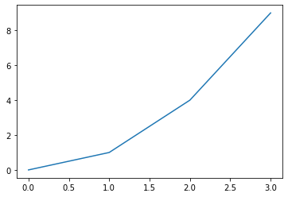
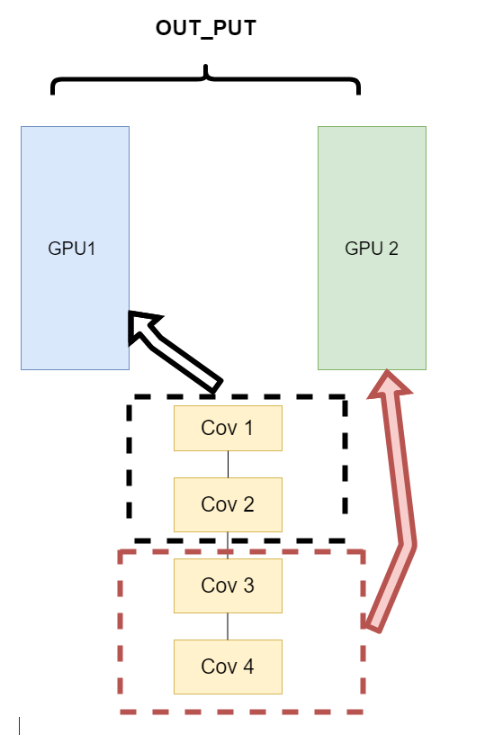
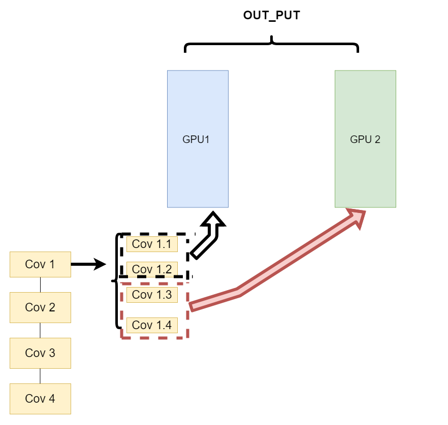
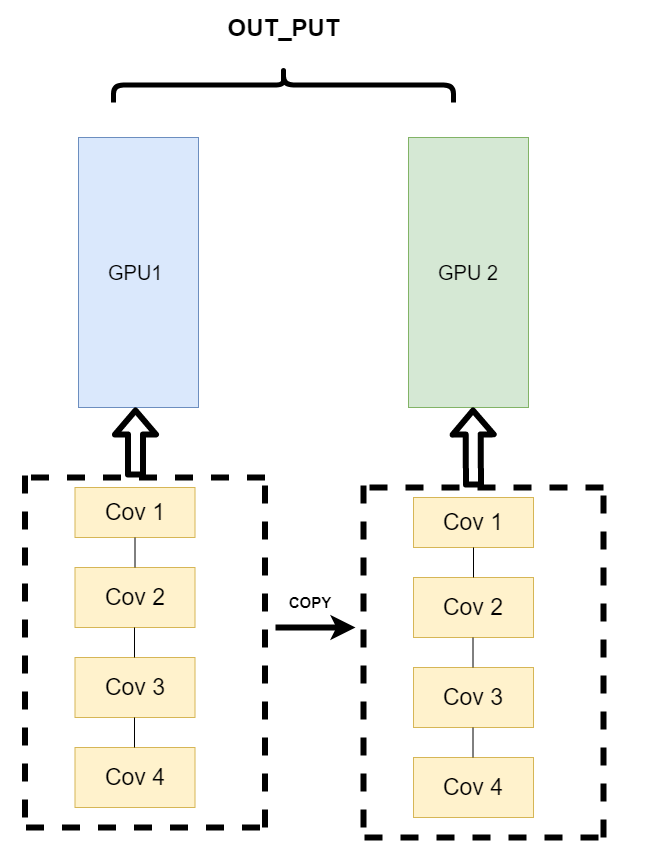

# 第二章 PyTorch基础知识

（本学习笔记来源于[DataWhale-深入浅出PyTorch](https://datawhalechina.github.io/thorough-pytorch/)）

## 2.1 数据操作

深度学习存储和操作数据的主要接口是张量（\(n\)维数组）。它提供了各种功能，包括基本数学运算、广播、索引、切片、内存节省和转换其他Python对象。

几何代数中定义的张量是基于向量和矩阵的推广，比如我们可以将标量视为零阶张量，矢量可以视为一阶张量，矩阵就是二阶张量。

- 0D：**标量** 标量是一个数字
- 1D：**向量**  1维张量称为“向量”。
- 2D： 2维张量称为**矩阵**
- 3D： 公用数据存储在**张量** 时间序列数据 股价 文本数据 彩色图片(**RGB**)
- 4D:  批量3维张量，比如10,000张彩色图片的集合；

一个图像可以用三个字段表示：

```
(width, height, channel) = 3D
```
4D张量：

```
(sample_size, width, height, channel) = 4D
````

在PyTorch中， `torch.Tensor` 是存储和变换数据的主要工具。如果你之前用过NumPy，你会发现 `Tensor` 和NumPy的多维数组非常类似。然而，`Tensor` 提供GPU计算和自动求梯度等更多功能，这些使 `Tensor` 这一数据类型更加适合深度学习


### 2.1.1. 创建`Tensor`

首先，我们导入`torch`。请注意，虽然它被称为PyTorch，但是代码中使用`torch`而不是pytorch。


```python
import torch
```

首先，我们可以使用 arange 创建一个行向量 x。这个行向量包含以0开始的前12个整数，它们默认创建为整数。也可指定创建类型为浮点数。张量中的每个值都称为张量的 元素（element）。例如，张量 x 中有 12 个元素。除非额外指定，新的张量将存储在内存中，并采用基于CPU的计算。


```python
x = torch.arange(12)
x
```


    tensor([ 0,  1,  2,  3,  4,  5,  6,  7,  8,  9, 10, 11])


可以通过张量的shape属性来访问张量（沿每个轴的长度）的形状 。


```python
x.shape
```


    torch.Size([12])


如果只想知道张量中元素的总数，即形状的所有元素乘积，可以检查它的大小（size）。 因为这里在处理的是一个向量，所以它的shape与它的size相同。


```python
x.numel()
```


    12


要想改变一个张量的形状而不改变元素数量和元素值，可以调用reshape函数。 例如，可以把张量x从形状为（12,）的行向量转换为形状为（3,4）的矩阵。 这个新的张量包含与转换前相同的值，但是它被看成一个3行4列的矩阵。 要重点说明一下，虽然张量的形状发生了改变，但其元素值并没有变。 注意，通过改变张量的形状，张量的大小不会改变。


```python
X = x.reshape(3,4)
X
```


    tensor([[ 0,  1,  2,  3],
            [ 4,  5,  6,  7],
            [ 8,  9, 10, 11]])


我们不需要通过手动指定每个维度来改变形状。 也就是说，如果我们的目标形状是（高度,宽度）， 那么在知道宽度后，高度会被自动计算得出，不必我们自己做除法。 在上面的例子中，为了获得一个3行的矩阵，我们手动指定了它有3行和4列。 幸运的是，我们可以通过-1来调用此自动计算出维度的功能。 即我们可以用x.reshape(-1,4)或x.reshape(3,-1)来取代x.reshape(3,4)。


```python
X1 = x.reshape(-1,4)
X1

```


    tensor([[ 0,  1,  2,  3],
            [ 4,  5,  6,  7],
            [ 8,  9, 10, 11]])


```python
X2 = x.reshape(3,-1)
X2
```


    tensor([[ 0,  1,  2,  3],
            [ 4,  5,  6,  7],
            [ 8,  9, 10, 11]])


有时，我们希望使用全0、全1、其他常量，或者从特定分布中随机采样的数字来初始化矩阵。 我们可以创建一个形状为（2,3,4）的张量，其中所有元素都设置为0。代码如下：


```python
torch.zeros((2,3,4))
```


    tensor([[[0., 0., 0., 0.],
             [0., 0., 0., 0.],
             [0., 0., 0., 0.]],
    
            [[0., 0., 0., 0.],
             [0., 0., 0., 0.],
             [0., 0., 0., 0.]]])


同样，我们可以创建一个形状为(2,3,4,6)的张量，其中所有元素都设置为1。代码如下：


```python
torch.ones((2,3,4,6))
```


    tensor([[[[1., 1., 1., 1., 1., 1.],
              [1., 1., 1., 1., 1., 1.],
              [1., 1., 1., 1., 1., 1.],
              [1., 1., 1., 1., 1., 1.]],
    
             [[1., 1., 1., 1., 1., 1.],
              [1., 1., 1., 1., 1., 1.],
              [1., 1., 1., 1., 1., 1.],
              [1., 1., 1., 1., 1., 1.]],
    
             [[1., 1., 1., 1., 1., 1.],
              [1., 1., 1., 1., 1., 1.],
              [1., 1., 1., 1., 1., 1.],
              [1., 1., 1., 1., 1., 1.]]],


​    
​            [[[1., 1., 1., 1., 1., 1.],
​              [1., 1., 1., 1., 1., 1.],
​              [1., 1., 1., 1., 1., 1.],
​              [1., 1., 1., 1., 1., 1.]],
​    
​             [[1., 1., 1., 1., 1., 1.],
​              [1., 1., 1., 1., 1., 1.],
​              [1., 1., 1., 1., 1., 1.],
​              [1., 1., 1., 1., 1., 1.]],
​    
​             [[1., 1., 1., 1., 1., 1.],
​              [1., 1., 1., 1., 1., 1.],
​              [1., 1., 1., 1., 1., 1.],
​              [1., 1., 1., 1., 1., 1.]]]])


有时我们想通过从某个特定的概率分布中随机采样来得到张量中每个元素的值。 例如，当我们构造数组来作为神经网络中的参数时，我们通常会随机初始化参数的值。 以下代码创建一个形状为（3,4）的张量。 其中的每个元素都从均值为0、标准差为1的标准高斯分布（正态分布）中随机采样。


```python
torch.randn(3,4)
```


    tensor([[-0.9263,  0.3160, -0.7383,  0.6722],
            [ 0.3053, -1.6233,  0.2146, -0.2511],
            [-0.6606, -0.5726, -0.1318, -1.1029]])


我们还可以通过提供包含数值的Python列表（或嵌套列表），来为所需张量中的每个元素赋予确定值。 在这里，最外层的列表对应于轴0，内层的列表对应于轴1。


```python
x = torch.tensor([[2,1,4,3],[1,2,3,4],[4,3,2,1]])
```

我们可以通过shape或者size()来获取Tensor的形状:


```python
print(x.size())
print(x.shape)
```

    torch.Size([3, 4])
    torch.Size([3, 4])


> 注意：返回的torch.Size其实就是一个tuple, 支持所有tuple的操作。

还有很多函数可以创建`Tensor`，去翻翻官方API就知道了，下表给了一些常用的作参考。


|函数	|功能| 示例|
| --- |---| ---|
| Tensor(*sizes) | 基础构造函数|  |
|tensor(data,)	|类似np.array的构造函数|torch.tensor([1.0, 2.0]) or torch.tensor((1, 2))|
|ones(*sizes)	|全1Tensor|torch.ones(3,4,5)|
|zeros(*sizes)	|全0Tensor|torch.zeros(3,4,5)|
|eye(*sizes)	|对角线为1，其他为0|torch.eye(3,4)|
|arange(s,e,step)|	从s到e，步长为step|torch.arange(1, 4) or torch.arange(1, 2.5, 0.5)|
|linspace(s,e,steps)	| 从s到e，均匀切分成steps份|torch.linspace(0,10,steps=4)|
|rand/randn(*sizes)     |	均匀/标准分布||
|normal(mean,std)/uniform(from,to)|正态分布/均匀分布||
|randperm(m) |	随机排列 ||

这些创建方法都可以在创建的时候指定数据类型dtype和存放device(cpu/gpu)。

### 2.1.2. 操作


本小节介绍`Tensor`的各种操作。


在数学表示法中，我们将通过符号 $f: \mathbb{R} \rightarrow \mathbb{R}$  来表示一元标量运算符（只接收一个输入）。 这意味着该函数从任何实数（ $\mathbb{R}$ ）映射到另一个实数。 同样，我们通过符号 $f: \mathbb{R}, \mathbb{R} \rightarrow \mathbb{R}$  表示二元标量运算符，这意味着该函数接收两个输入，并产生一个输出。 给定同一形状的任意两个向量 $u$ 和 $v$ 和二元运算符 $f$ ， 我们可以得到向量 $c=F(u,v)$ 。 具体计算方法是 $c_i←f(u_i,v_i)$ ， 其中 $c_i 、 u_i 和 v_i$ 分别是向量 $c 、 u 和 v$ 中的元素。 在这里，我们通过将标量函数升级为按元素向量运算来生成向量值  $F: \mathbb{R}^d, \mathbb{R}^d \rightarrow \mathbb{R}^d$ 。

对于任意具有相同形状的张量， 常见的标准算术运算符$（+、-、*、/和**）$都可以被升级为按元素运算。 我们可以在同一形状的任意两个张量上调用按元素操作。 在下面的例子中，我们使用逗号来表示一个具有5个元素的元组，其中每个元素都是按元素操作的结果。


```python
x = torch.tensor([1.0,2,4,8])
y = torch.tensor([2,2,2,2])

x + y, x - y,x * y,x/y,x**y 
```


    (tensor([ 3.,  4.,  6., 10.]),
     tensor([-1.,  0.,  2.,  6.]),
     tensor([ 2.,  4.,  8., 16.]),
     tensor([0.5000, 1.0000, 2.0000, 4.0000]),
     tensor([ 1.,  4., 16., 64.]))


**算术操作**

在PyTorch中，同一种操作可能有很多种形式，下面用加法作为例子。

- **加法形式一**


```python
x = x.new_ones(5, 3, dtype=torch.float64)  # 返回的tensor默认具有相同的torch.dtype和torch.device

y = torch.rand(5, 3)

print(x + y)

```

    tensor([[1.5797, 1.0652, 1.1602],
            [1.4770, 1.5374, 1.9931],
            [1.7169, 1.9392, 1.6505],
            [1.9700, 1.4227, 1.5914],
            [1.4348, 1.9572, 1.8105]], dtype=torch.float64)


- **加法形式二**


```python
print(torch.add(x, y))
```

    tensor([[1.5797, 1.0652, 1.1602],
            [1.4770, 1.5374, 1.9931],
            [1.7169, 1.9392, 1.6505],
            [1.9700, 1.4227, 1.5914],
            [1.4348, 1.9572, 1.8105]], dtype=torch.float64)


还可指定输出：


```python
result = torch.empty(5,3)
torch.add(x,y,out=result)
print(result)
```

    tensor([[1.5797, 1.0652, 1.1602],
            [1.4770, 1.5374, 1.9931],
            [1.7169, 1.9392, 1.6505],
            [1.9700, 1.4227, 1.5914],
            [1.4348, 1.9572, 1.8105]])


- **加法形式三、inplace**


```python
# adds x to y 

y.add_(x)
print(y)
```

    tensor([[4.5797, 4.0652, 4.1602],
            [4.4770, 4.5374, 4.9931],
            [4.7169, 4.9392, 4.6505],
            [4.9700, 4.4227, 4.5914],
            [4.4348, 4.9572, 4.8105]])


> 注：PyTorch操作inplace版本都有后缀_, 例如x.copy_(y), x.t_()

“按元素”方式可以应用更多的计算，包括像求幂这样的一元运算符。


```python
torch.exp(x)
```


    tensor([[2.7183, 2.7183, 2.7183],
            [2.7183, 2.7183, 2.7183],
            [2.7183, 2.7183, 2.7183],
            [2.7183, 2.7183, 2.7183],
            [2.7183, 2.7183, 2.7183]], dtype=torch.float64)


除了按元素计算外，我们还可以执行线性代数运算，包括向量点积和矩阵乘法。


我们也可以把多个张量连结（concatenate）在一起， 把它们端对端地叠起来形成一个更大的张量。 我们只需要提供张量列表，并给出沿哪个轴连结。 下面的例子分别演示了当我们沿行（轴-0，形状的第一个元素） 和按列（轴-1，形状的第二个元素）连结两个矩阵时，会发生什么情况。 我们可以看到，第一个输出张量的轴-0长度（\(6\)）是两个输入张量轴-0长度的总和（\(3 + 3\)）； 第二个输出张量的轴-1长度（\(8\)）是两个输入张量轴-1长度的总和（\(4 + 4\)）。


```python
X = torch.arange(12,dtype=torch.float32).reshape((3,4))
Y = torch.tensor([[2.0, 1.0, 4, 3], [1, 2, 3, 4], [4, 3, 2, 1]])
torch.cat((X,Y),dim=0),torch.cat((X,Y),dim=1)
```


    (tensor([[ 0.,  1.,  2.,  3.],
             [ 4.,  5.,  6.,  7.],
             [ 8.,  9., 10., 11.],
             [ 2.,  1.,  4.,  3.],
             [ 1.,  2.,  3.,  4.],
             [ 4.,  3.,  2.,  1.]]),
     tensor([[ 0.,  1.,  2.,  3.,  2.,  1.,  4.,  3.],
             [ 4.,  5.,  6.,  7.,  1.,  2.,  3.,  4.],
             [ 8.,  9., 10., 11.,  4.,  3.,  2.,  1.]]))


有时，我们想通过逻辑运算符构建二元张量。 以X == Y为例： 对于每个位置，如果X和Y在该位置相等，则新张量中相应项的值为1。 这意味着逻辑语句X == Y在该位置处为真，否则该位置为0。


```python
X==Y
```


    tensor([[False,  True, False,  True],
            [False, False, False, False],
            [False, False, False, False]])


对张量中的所有元素进行求和，会产生一个单元素张量。


```python
x.sum().item()
```


    15.0


### 2.1.3. 广播机制

在上面的部分中，我们看到了如何在相同形状的两个张量上执行按元素操作。 在某些情况下，即使形状不同，我们仍然可以通过调用 广播机制（broadcasting mechanism）来执行按元素操作。 

这种机制的工作方式如下：
- 首先，通过适当复制元素来扩展一个或两个数组， 以便在转换之后，两个张量具有相同的形状。 
- 其次，对生成的数组执行按元素操作。

在大多数情况下，我们将沿着数组中长度为1的轴进行广播，如下例子：


```python
a = torch.arange(3).reshape((3,1))
b = torch.arange(2).reshape((1,2))
a,b
```


    (tensor([[0],
             [1],
             [2]]),
     tensor([[0, 1]]))


由于a和b分别是$3\times1$和$1\times2$矩阵，如果让它们相加，它们的形状不匹配。 我们将两个矩阵广播为一个更大的$3\times2$矩阵，如下所示：矩阵a将复制列， 矩阵b将复制行，然后再按元素相加。


```python
a + b
```


    tensor([[0, 1],
            [1, 2],
            [2, 3]])


### 2.1.4. 索引和切片

就像在任何其他Python数组中一样，张量中的元素可以通过索引访问。 与任何Python数组一样：第一个元素的索引是0，最后一个元素索引是-1； 可以指定范围以包含第一个元素和最后一个之前的元素。

如下所示，我们可以用[-1]选择最后一个元素，可以用[1:3]选择第二个和第三个元素：


```python
X,X[-1], X[1:3]
```


    (tensor([[ 0.,  1.,  2.,  3.],
             [ 4.,  5.,  6.,  7.],
             [ 8.,  9., 10., 11.]]),
     tensor([ 8.,  9., 10., 11.]),
     tensor([[ 4.,  5.,  6.,  7.],
             [ 8.,  9., 10., 11.]]))


除读取外，我们还可以通过指定索引来将元素写入矩阵。


```python
X[1,2]=9
X
```


    tensor([[ 0.,  1.,  2.,  3.],
            [ 4.,  5.,  9.,  7.],
            [ 8.,  9., 10., 11.]])


如果我们想为多个元素赋值相同的值，我们只需要索引所有元素，然后为它们赋值。 例如，[0:2, :]访问第1行和第2行，其中“:”代表沿轴1（列）的所有元素。 虽然我们讨论的是矩阵的索引，但这也适用于向量和超过2个维度的张量。


```python
X[:2,:]=12
X
```


    tensor([[12., 12., 12., 12.],
            [12., 12., 12., 12.],
            [ 8.,  9., 10., 11.]])


除了常用的索引选择数据之外，PyTorch还提供了一些高级的选择函数:

|函数|	功能|
| --- | --- |
|index_select(input, dim, index)|	在指定维度dim上选取，比如选取某些行、某列|
|masked_select(input, mask)|	例子如上，a[a>0]，使用ByteTensor进行选取 |
|nonzero(input)|非0元素的下标|
|gather(input, dim, index)	|根据index，在dim维度上选取数据，输出的size与inde一样|


这里不详细介绍，用到了再查官方文档。

### 2.1.5 改变形状

用`view()`来改变`Tensor`的形状：


```python
y = x.view(15)
z = x.view(-1,5) # -1 所指的维度可以根据其他维度的值推出来
print(x.size(),y.shape,z.shape)
print(x)
print(y)
print(z)
```

    torch.Size([5, 3]) torch.Size([15]) torch.Size([3, 5])
    tensor([[1., 1., 1.],
            [1., 1., 1.],
            [1., 1., 1.],
            [1., 1., 1.],
            [1., 1., 1.]], dtype=torch.float64)
    tensor([1., 1., 1., 1., 1., 1., 1., 1., 1., 1., 1., 1., 1., 1., 1.],
           dtype=torch.float64)
    tensor([[1., 1., 1., 1., 1.],
            [1., 1., 1., 1., 1.],
            [1., 1., 1., 1., 1.]], dtype=torch.float64)


注意`view()`返回的新`Tensor`与源`Tensor`虽然可能有不同的`size`，但是是共享`data`的，也即更改其中的一个，另外一个也会跟着改变。(顾名思义，view仅仅是改变了对这个张量的观察角度，内部数据并未改变)


```python
x +=1
print(x)
print(y) # 也加了1
```

    tensor([[2., 2., 2.],
            [2., 2., 2.],
            [2., 2., 2.],
            [2., 2., 2.],
            [2., 2., 2.]], dtype=torch.float64)
    tensor([2., 2., 2., 2., 2., 2., 2., 2., 2., 2., 2., 2., 2., 2., 2.],
           dtype=torch.float64)


所以如果我们想返回一个真正新的副本（即不共享data内存）该怎么办呢？Pytorch还提供了一个`reshape()`可以改变形状，但是此函数并不能保证返回的是其拷贝，所以不推荐使用。推荐先用`clone`创造一个副本然后再使用`view`。[参考此处](https://stackoverflow.com/questions/49643225/whats-the-difference-between-reshape-and-view-in-pytorch)


```python
x_cp =  x.clone().view(15)
x-=1
print(x)
print(y)
```

    tensor([[1., 1., 1.],
            [1., 1., 1.],
            [1., 1., 1.],
            [1., 1., 1.],
            [1., 1., 1.]], dtype=torch.float64)
    tensor([1., 1., 1., 1., 1., 1., 1., 1., 1., 1., 1., 1., 1., 1., 1.],
           dtype=torch.float64)


> 使用`clone`还有一个好处是会被记录在计算图中，即梯度回传到副本时也会传到源`Tensor`。

另外一个常用的函数就是`item()`, 它可以将一个标量`Tensor`转换成一个Python number：


```python
x = torch.randn(1)
print(x)
print(x.item())
```

    tensor([0.2106])
    0.21058855950832367


### 2.1.6. 节省内存

运行一些操作可能会导致为新结果分配内存。 例如，如果我们用Y = X + Y，我们将取消引用Y指向的张量，而是指向新分配的内存处的张量。

在下面的例子中，我们用Python的id()函数演示了这一点， 它给我们提供了内存中引用对象的确切地址。 运行Y = Y + X后，我们会发现id(Y)指向另一个位置。 这是因为Python首先计算Y + X，为结果分配新的内存，然后使Y指向内存中的这个新位置。


```python
before = id(Y)
Y = Y+X
id(Y) == before
```


    False


幸运的是，执行原地操作非常简单。 我们可以使用切片表示法将操作的结果分配给先前分配的数组，例如Y[:] = <expression>。 为了说明这一点，我们首先创建一个新的矩阵Z，其形状与另一个Y相同， 使用zeros_like来分配一个全\(0\)的块。


```python
Z = torch.zeros_like(Y)
print('id(Z):', id(Z))
Z[:] = X + Y
print('id(Z):', id(Z))
```

    id(Z): 1561725302656
    id(Z): 1561725302656


如果在后续计算中没有重复使用X， 我们也可以使用X[:] = X + Y或X += Y来减少操作的内存开销。


```python
before = id(X)
X += Y
id(X) == before
```


    True


### 2.1.7. 转换为其他Python对象

将深度学习框架定义的张量转换为NumPy张量（ndarray）很容易，反之也同样容易。 torch张量和numpy数组将共享它们的底层内存，就地操作更改一个张量也会同时更改另一个张量。


```python
A = X.numpy()
B = torch.tensor(A)
type(A),type(B),A,B
```


    (numpy.ndarray,
     torch.Tensor,
     array([[26., 25., 28., 27.],
            [25., 26., 27., 28.],
            [20., 21., 22., 23.]], dtype=float32),
     tensor([[26., 25., 28., 27.],
             [25., 26., 27., 28.],
             [20., 21., 22., 23.]]))


要将大小为1的张量转换为Python标量，我们可以调用item函数或Python的内置函数。


```python
a = torch.tensor([3.5])
a,a.item(),float(a),int(a)
```


    (tensor([3.5000]), 3.5, 3.5, 3)


其他一些尝试，关于`backward`（反向求导）,`grad`,`TensorDataset`（打包）,`DataLoader`（封装）：


```python
x =torch.tensor(3.5,requires_grad=True)
y =(x-1)*(x-2)*(x-3)
y.backward()
x.grad
```


    tensor(5.7500)


```python
import torch
from torch.utils.data import TensorDataset
from torch.utils.data import DataLoader

a = torch.tensor([[1, 2, 3], [4, 5, 6], [7, 8, 9], [1, 2, 3], [4, 5, 6], [7, 8, 9], [1, 2, 3], [4, 5, 6], [7, 8, 9], [1, 2, 3], [4, 5, 6], [7, 8, 9]])
b = torch.tensor([44, 55, 66, 44, 55, 66, 44, 55, 66, 44, 55, 66])
train_ids = TensorDataset(a, b) 
# 切片输出
print(train_ids[0:2])
print('=' * 80)
# 循环取数据
for x_train, y_label in train_ids:
    print(x_train, y_label)
# DataLoader进行数据封装
print('=' * 80)
```

    (tensor([[1, 2, 3],
            [4, 5, 6]]), tensor([44, 55]))
    ================================================================================
    tensor([1, 2, 3]) tensor(44)
    tensor([4, 5, 6]) tensor(55)
    tensor([7, 8, 9]) tensor(66)
    tensor([1, 2, 3]) tensor(44)
    tensor([4, 5, 6]) tensor(55)
    tensor([7, 8, 9]) tensor(66)
    tensor([1, 2, 3]) tensor(44)
    tensor([4, 5, 6]) tensor(55)
    tensor([7, 8, 9]) tensor(66)
    tensor([1, 2, 3]) tensor(44)
    tensor([4, 5, 6]) tensor(55)
    tensor([7, 8, 9]) tensor(66)
    ================================================================================


```python
import torch
import torch.utils.data as Data
BATCH_SIZE = 5
# linspace, 生成1到10的10个数构成的等差数列
x = torch.linspace(1, 10, 10)
y = torch.linspace(10, 1, 10)

# 把数据放在数据库中
torch_dataset = Data.TensorDataset(x, y)
# 从数据库中每次抽出batch size个样本
loader = Data.DataLoader(dataset=torch_dataset,
                         batch_size=BATCH_SIZE, # x, y 是相差为1个数为10的等差数列, batch= 5, 遍历loader就只有两个数据
                         shuffle=False, # 不打乱顺序,便于查看
                         num_workers=0)

def show_batch():
    #for epoch in range(10):
    for step, (batch_x, batch_y) in enumerate(loader):
        # training
        print("steop:{}, batch_x:{}, batch_y:{}".format(step, batch_x, batch_y)) #方便输出

if __name__ == '__main__':
    show_batch()
```

    steop:0, batch_x:tensor([1., 2., 3., 4., 5.]), batch_y:tensor([10.,  9.,  8.,  7.,  6.])
    steop:1, batch_x:tensor([ 6.,  7.,  8.,  9., 10.]), batch_y:tensor([5., 4., 3., 2., 1.])


### 2.1.8 线性代数

另外，PyTorch还支持一些线性函数，这里提一下，免得用起来的时候自己造轮子，具体用法参考官方文档。如下表所示


|函数|	功能|
|----|----|
|trace|	对角线元素之和(矩阵的迹)|
|diag|	对角线元素|
|triu/tril|	矩阵的上三角/下三角，可指定偏移量|
|mm/bmm|	矩阵乘法，batch的矩阵乘法|
|addmm/addbmm/addmv/addr/baddbmm..|	矩阵运算|
|t|	转置|
|dot/cross|	内积/外积|
|inverse|	求逆矩阵|
|svd	|奇异值分解|

PyTorch中的`Tensor`支持超过一百种操作，包括转置、索引、切片、数学运算、线性代数、随机数等等，可参考[官方文档](https://pytorch.org/docs/stable/tensors.html)。

###  2.1.9 `Tensor` on GPU

用方法`to()`可以将`Tensor`在**CPU和GPU**（需要硬件支持）之间相互移动。


```python
# 以下代码只有PyTorch GPU版本上才会执行

if torch.cuda.is_available():
    device = torch.device("cuda")          # GPU
    y = torch.ones_like(x,device=device)   # 直接创建一个在GPU上的Tensor
    x = x.to(device)                       # 等价于 .to("cuda")
    z = x + y 
    print(z)
    print(z.to("cpu",torch.double))        # to()还可以同时更改数据类型
    
```

### 2.1.10. 练习

**问题1.** 运行本节中的代码。将本节中的条件语句X == Y更改为X < Y或X > Y，然后看看你可以得到什么样的张量。

**解答：**


```python
X = torch.arange(12,dtype=torch.float32).reshape(3,4)
Y = torch.tensor([[3,4,6,5],[6,1,2,7],[3,5,4,9]])
X,Y,X<Y,X>Y
```


    (tensor([[ 0.,  1.,  2.,  3.],
             [ 4.,  5.,  6.,  7.],
             [ 8.,  9., 10., 11.]]),
     tensor([[3, 4, 6, 5],
             [6, 1, 2, 7],
             [3, 5, 4, 9]]),
     tensor([[ True,  True,  True,  True],
             [ True, False, False, False],
             [False, False, False, False]]),
     tensor([[False, False, False, False],
             [False,  True,  True, False],
             [ True,  True,  True,  True]]))


**问题2.**用其他形状（例如三维张量）替换广播机制中按元素操作的两个张量。结果是否与预期相同？

**解答：**


```python
X = torch.arange(12,dtype=torch.float32).reshape((3,4,1))
Y = torch.arange(9,dtype=torch.float32).reshape((3,1,3))
X.shape,Y.shape,(X+Y).shape
```


    (torch.Size([3, 4, 1]), torch.Size([3, 1, 3]), torch.Size([3, 4, 3]))


可以看到结果与预期相同，我们换一种来看看


```python
X = torch.arange(12,dtype=torch.float32).reshape((3,4,1))
Y = torch.arange(9,dtype=torch.float32).reshape((3,3,1))
X.shape,Y.shape
```


    (torch.Size([3, 4, 1]), torch.Size([3, 3, 1]))


```python
C = (X+Y)
C.shape
```


    torch.Size([3, 2, 2])


```python
X = torch.arange(12,dtype=torch.float32).reshape((3,2,2))
Y = torch.arange(6,dtype=torch.float32).reshape((3,2,1))
X.shape,Y.shape
```


    (torch.Size([3, 2, 2]), torch.Size([3, 2, 1]))


```python
(X+Y).shape
```


    torch.Size([3, 2, 2])


符合逾期

**结论：** 多维数据对于最后显示的二维数[x,y]，满足两个x={y_row=n时，(n|1)},y={x_column=m时，m|1}，广播才符合逾期；

## 2.2 自动求梯度


在深度学习中，我们经常需要对函数求梯度（gradient）。PyTorch中所有神经网络的核心是`autograd`包，它能够根据输入和前向传播过程自动构建计算图，并执行反向传播。

### 2.2.1 概念

`torch.Tensor `是这个包的核心类。如果设置它的属性` .requires_grad` 为 `True`，那么它将会追踪对于该张量的所有操作（这样就可以利用链式法则进行梯度传播了）。完成计算后,可以调用` .backward()`，来自动计算所有的梯度。此`Tensor`的梯度将会自动积累到`.grad`属性。


> 注意：在 `y.backward()` 时，如果 y 是标量，则不需要为 backward() 传入任何参数；否则，需要传入一个与 y 同形的Tensor。

要阻止张量跟踪历史记录，可以调用` .detach() `将其从追踪记录中分离出来，这样就可以防止将来的计算被追踪。

此外，还可以用`with torch.no_grad()`将不想被追踪的操作代码块包裹起来，这种方法在评估模型的时候很常用，因为在评估模型时，我们并不需要计算可训练参数（`requires_grad=True`）的梯度。

在自动梯度计算中还有另外一个重要的类`Function`

 `Tensor `和` Function` 互相结合就可以构建一个记录有整个计算过程的有向无环图 (acyclic graph DAG)，它表示和存储了完整的计算历史。每个张量`Tensor`都有一个` .grad_fn `属性，该属性创建该 `Tensor `的`Function`，就是说该`Tensor`是不是通过某些运算得到的，若是，则`grad_fn`返回一个与这些运算相关的对象，否则是None。

下面通过一些例子来理解这些概念。


### 2.2.1. `Tensor`举例

作为一个演示例子，假设我们想对函数$y=2\mathbf{x}^{\top}\mathbf{x}$关于列向量$\mathbf{x}$求导。 首先，我们创建变量x并为其分配一个初始值。


```python
import torch
x = torch.arange(4.0)
x
```


    tensor([0., 1., 2., 3.])


```python
print(x.grad_fn)
```

    None


[**在我们计算$y$关于$\mathbf{x}$的梯度之前，我们需要一个地方来存储梯度。**]
重要的是，我们不会在每次对一个参数求导时都分配新的内存。
因为我们经常会成千上万次地更新相同的参数，每次都分配新的内存可能很快就会将内存耗尽。
注意，一个标量函数关于向量$\mathbf{x}$的梯度是向量，并且与$\mathbf{x}$具有相同的形状。


```python
x.requires_grad_(True) # 等价于 `x = torch.arange(4.0, requires_grad=True)`
x.grad # 默认值是None
```


```python
print(x.grad_fn)
```

    None


现在我们计算$y$,根据函数$y=2\mathbf{x}^{\top}\mathbf{x}$


```python
y = 2 * torch.dot(x,x)
print(y)
print(y.grad_fn)
```

    tensor(28., grad_fn=<MulBackward0>)
    <MulBackward0 object at 0x0000016BA286B310>


注意$x$是直接创建的，所以它没有`grad_fn`, 而$y$是通过一个函数操作创建的，所以它有一个为`<MulBackward0>`的`grad_fn`。


像$x$这种直接创建的称为叶子节点，叶子节点对应的`grad_fn`是`None`。

```python
print(x.is_leaf, y.is_leaf) # True False
```

    True False


再来点复杂度运算操作：


```python
y1 = x + 2
z = y1 * y1 * 3
out = z.mean()
print(y1,z,out)
```

    tensor([2., 3., 4., 5.], grad_fn=<AddBackward0>) tensor([12., 27., 48., 75.], grad_fn=<MulBackward0>) tensor(40.5000, grad_fn=<MeanBackward0>)


通过`.requires_grad_()`来用in-place的方式改变`requires_grad`属性：


```python
a = torch.randn(2,2) # 缺失情况下默认 requires_grad = False
a = ((a * 3) / (a - 1))
print(a.grad_fn)
print(a.requires_grad) # False
a.requires_grad_(True)
print(a.grad_fn)
print(a.requires_grad) # True
b = (a * a).sum()
print(b.grad_fn)
```

    None
    False
    None
    True
    <SumBackward0 object at 0x0000016BA294C370>


### 2.2.2 梯度

`x`是一个长度为4的向量，计算`x`和`x`的点积，得到了我们赋值给`y`的标量输出。接下来，我们[**通过调用反向传播函数来自动计算`y`关于`x`每个分量的梯度**]，并打印这些梯度。

因为`y`是一个标量，所以调用`backward()`时不需要指定求导变量：


```python
y.backward() # 等价于 y.backward(torch.tensor(1.))
```

我们来看看`y`关于`x`的梯度$\frac{d_{(y)}}{d_x}$


```python
print(x.grad)
```

    tensor([ 0.,  4.,  8., 12.])


函数$y=2\mathbf{x}^{\top}\mathbf{x}$关于$\mathbf{x}$的梯度应为$4\mathbf{x}$。
让我们快速验证这个梯度是否计算正确。


```python
x.grad == 4 * x
```


    tensor([True, True, True, True])


**现在让我们计算`x`的另一个函数。**


```python
# 在默认情况下，PyTorch会累计梯度，我们需要清除之前的值

x.grad.zero_()
```


    tensor([0., 0., 0., 0.])


```python
y = x.sum()
y
```


    tensor(6., grad_fn=<SumBackward0>)


```python
y.backward()
x.grad
```


    tensor([1., 1., 1., 1.])


**非标量变量的反向传播**

当`y`不是标量时，向量`y`关于向量`x`的导数的最自然解释是一个矩阵。
对于高阶和高维的`y`和`x`，求导的结果可以是一个高阶张量。

然而，虽然这些更奇特的对象确实出现在高级机器学习中（包括[**深度学习中**]），
但当我们调用向量的反向计算时，我们通常会试图计算一批训练样本中每个组成部分的损失函数的导数。
这里(**，我们的目的不是计算微分矩阵，而是单独计算批量中每个样本的偏导数之和。**)


```python
# 对非标量调用backward需要传入一个gradient参数，该参数指定微分函数关于self的梯度。
# 在我们的例子中，我们只想求偏导数的和，所以传递一个1的梯度是合适的
print(x)
x.grad.zero_()
y = x * x
# 等价于y.backward(torch.ones(len(x)))
y.sum().backward()
x.grad
```

    tensor([0., 1., 2., 3.], requires_grad=True)


    tensor([0., 2., 4., 6.])


```python
import matplotlib.pyplot as plt
%matplotlib inline
plt.plot(x.detach().numpy(), y.detach().numpy())
plt.show()
```



`autograd` 和 `Function` 的官方文档 https://pytorch.org/docs/autograd    

## 2.3 并行计算

利用PyTorch做深度学习的过程中，可能会遇到数据量较大无法在单块GPU上完成，或者需要提升计算速度的场景，这时就需要用到并行计算。本节让我们来简单地了解一下并行计算的基本概念和主要实现方式。

### 2.3.1 为什么要做并行计算

我们学习PyTorch的目的就是可以编写我们自己的框架，来完成特定的任务。可以说，在深度学习时代，GPU的出现让我们可以训练的更快，更好。所以，如何充分利用GPU的性能来提高我们模型学习的效果，这一技能是我们必须要学习的。

### 2.3.2 `CUDA`

`CUDA`是我们使用GPU的提供商——NVIDIA提供的GPU并行计算框架。对于GPU本身的编程，使用的是`CUDA`语言来实现的。但是，在我们使用PyTorch编写深度学习代码时，使用的`CUDA`又是另一个意思。在PyTorch使用 `CUDA`表示要开始要求我们的模型或者数据开始使用GPU了。

在编写程序中，当我们使用了 `cuda()` 时，其功能是让我们的模型或者数据迁移到GPU当中，通过GPU开始计算。

### 2.3.3 并行计算方法

**1) 网络结构分布到不同的设备中(Network partitioning)**

**逻辑思路：** 将一个模型的各个部分拆分，然后将不同的部分放入到GPU来做不同任务的计算。

**缺点：** 不同模型组件在不同的GPU上时，GPU之间的传输就很重要，对于GPU之间的通信是一个考验。但是GPU的通信在这种密集任务中很难办到。所有这个方式慢慢淡出了视野。

架构如图：




**2）同一层的任务分布到不同数据中(Layer-wise partitionign)**

**逻辑思路：** 同一层的模型做一个拆分，让不同的GPU去训练同一层模型的部分任务。

**缺点：** 这样可以保证在不同组件之间传输的问题，但是在我们需要大量的训练，同步任务加重的情况下，会出现和第一种方式一样的问题。

其架构如下：




**3）不同的数据分布到不同的设备中，执行相同的任务(Data parallelism) **

**逻辑思路：** 不再拆分模块，训练的时候模型都是一整个模型，但是将输入数据进行拆分。所谓的拆分数据是指，同一个模型在不同GPU中训练一部分数据，然后再分别计算一部分数据之后，只需要将输出的数据做一个汇总，然后再反传。


其架构如下：




**现在的主流方式，这种方式可以解决之前模式遇到的通讯问题。**


## 2.4 参考资料

1. [动手学深度学习之自动求梯度](https://tangshusen.me/Dive-into-DL-PyTorch/#/chapter02_prerequisite/2.3_autograd?id=_23-自动求梯度)
2. [计算机体系结构基础之NVIDIA GPU](https://foxsen.github.io/archbase/%E5%A4%9A%E6%A0%B8%E5%A4%84%E7%90%86%E7%BB%93%E6%9E%84.html#nvidia-gpu)

