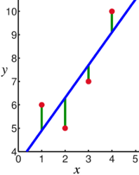
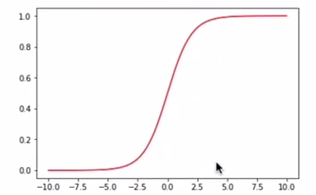
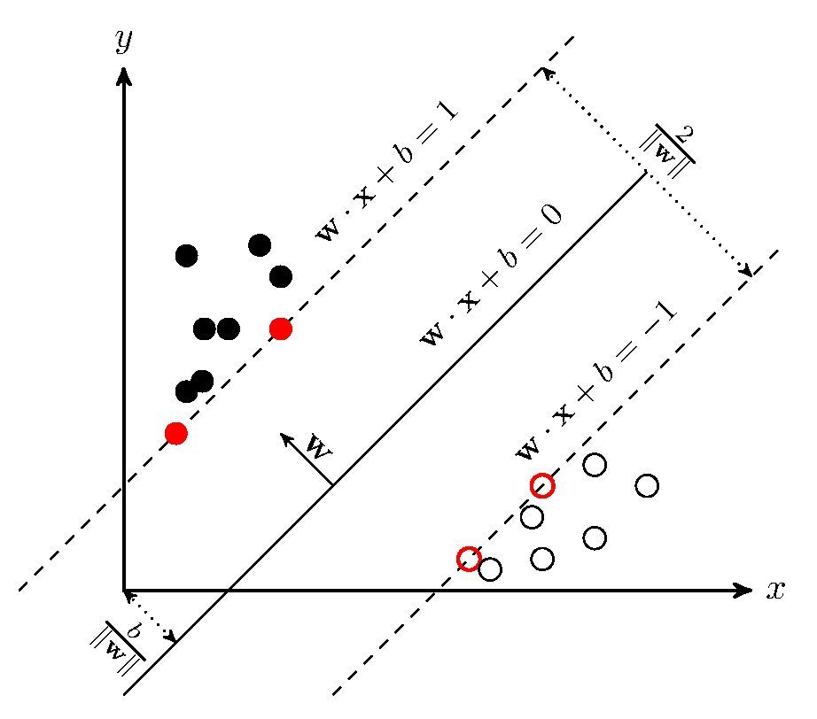

# Task02: 机器学习基础
----
>（本学习笔记来源于DataWhale-11月组队学习：[水很深的深度学习学习地址](https://datawhalechina.github.io/unusual-deep-learning/#/3.%E6%9C%BA%E5%99%A8%E5%AD%A6%E4%B9%A0%E5%9F%BA%E7%A1%80) ,[B站视频讲解地址](https://www.bilibili.com/video/BV1iq4y197L4?from=search&seid=15514429050345514467&spm_id_from=333.337.0.0) ）
```md
Life is just a sum of our choices.
生活，是由我们每一个选择构成的。
```
                                                                

## 1. 机器学习
---

机器学习是指让计算机具有像人一样的学习和思考能力的技术的总称。具体来说是从已知数据中获得规律，并利用规律对未知数据进行预测的技术。


## 2. 误差分析

误差分析是指对误差在完成系统功能时，对所要求的目标的偏离产生的原因、后果及发生在系统的哪一个阶段进行分析，把误差减少到最低限度。

在数学上，误差分析是对解决问题可能存在的错误或不确定性的种类和数量的研究。 这个问题在数值分析和统计等应用领域尤为突出。

在模型中根据数据集的分类，误差分为三种：

- 训练集误差：**“训练误差”**
- 总体样本误差：**“泛化误差”**
- 测试集误：**“测试误差”**

### 2.1 过拟合：

过拟合是指训练误差和测试误差之间的差距太大。换句换说，就是模型复杂度高于实际问题，模型在训练集上表现很好，但在测试集上却表现很差。（模型对训练集"死记硬背"，表现为**泛化能力差**）

**为什么会出现过拟合现象？**

造成原因主要有以下几种：

1. 训练数据集样本单一，样本不足。如果训练样本只有负样本，然后那生成的模型去预测正样本，这肯定预测不准。所以训练样本要尽可能的全面，覆盖所有的数据类型。
2. 训练数据中噪声干扰过大。噪声指训练数据中的干扰数据。过多的干扰会导致记录了很多噪声特征，忽略了真实输入和输出之间的关系。
3. 模型过于复杂。模型太复杂，已经能够“死记硬背”记下了训练数据的信息，但是遇到没有见过的数据的时候不能够变通，泛化能力太差。我们希望模型对不同的模型都有稳定的输出。模型太复杂是过拟合的重要因素。

**如何防止过拟合？**

> 防止“过拟合”的方法：，可以选择减少参数、降低模型复杂度、正则化等。

要想解决过拟合问题，就要显著减少测试误差而不过度增加训练误差，从而提高模型的泛化能力。

1. 获取和使用更多的数据（数据集增强）——解决过拟合的根本性方法

让机器学习或深度学习模型泛化能力更好的办法就是使用更多的数据进行训练。但是，在实践中，我们拥有的数据量是有限的。解决这个问题的一种方法就是创建“假数据”并添加到训练集中——数据集增强。通过增加训练集的额外副本来增加训练集的大小，进而改进模型的泛化能力。

我们以图像数据集举例，能够做：旋转图像、缩放图像、随机裁剪、加入随机噪声、平移、镜像等方式来增加数据量。另外补充一句，在物体分类问题里，CNN在图像识别的过程中有强大的“不变性”规则，即待辨识的物体在图像中的形状、姿势、位置、图像整体明暗度都不会影响分类结果。我们就可以通过图像平移、翻转、缩放、切割等手段将数据库成倍扩充。

2. 采用合适的模型（控制模型的复杂度）

过于复杂的模型会带来过拟合问题。对于模型的设计，目前公认的一个深度学习规律"deeper is better"。国内外各种大牛通过实验和竞赛发现，对于CNN来说，层数越多效果越好，但是也更容易产生过拟合，并且计算所耗费的时间也越长。

根据奥卡姆剃刀法则：在同样能够解释已知观测现象的假设中，我们应该挑选“最简单”的那一个。对于模型的设计而言，我们应该选择简单、合适的模型解决复杂的问题。

3. 降低特征的数量

对于一些特征工程而言，可以降低特征的数量——删除冗余特征，人工选择保留哪些特征。这种方法也可以解决过拟合问题。

4. L1 / L2 正则化


正则化是指修改学习算法，使其降低泛化误差而非训练误差。

常用的正则化方法根据具体的使用策略不同可分为：

（1）直接提供正则化约束的参数正则化方法，如L1/L2正则化；  
（2）通过工程上的技巧来实现更低泛化误差的方法，如提前终止(Early stopping)和Dropout；  
（3）不直接提供约束的隐式正则化方法，如数据增强等。  


5. Dropout 

Dropout是在训练网络时用的一种技巧（trike），相当于在隐藏单元增加了噪声。Dropout 指的是在训练过程中每次按一定的概率（比如50%）随机地“删除”一部分隐藏单元（神经元）。所谓的“删除”不是真正意义上的删除，其实就是将该部分神经元的激活函数设为0（激活函数的输出为0），让这些神经元不计算而已。

Dropout为什么有助于防止过拟合呢？

（a）在训练过程中会产生不同的训练模型，不同的训练模型也会产生不同的的计算结果。随着训练的不断进行，计算结果会在一个范围内波动，但是均值却不会有很大变化，因此可以把最终的训练结果看作是不同模型的平均输出。

（b）它消除或者减弱了神经元节点间的联合，降低了网络对单个神经元的依赖，从而增强了泛化能力。


### 2.2 欠拟合


欠拟合是指模型不能在训练集上获得足够低的误差。换句换说，就是模型复杂度低，模型在训练集上就表现很差，没法学习到数据背后的规律。


**如何解决欠拟合？**

欠拟合基本上都会发生在训练刚开始的时候，经过不断训练之后欠拟合应该不怎么考虑了。但是如果真的还是存在的话，可以通过**增加网络复杂度**或者**在模型中增加特征**，这些都是很好解决欠拟合的方法。


### 2.3 泛化误差分析

假设数据集上需要预测的样本为$Y$，特征为$X$，潜在模型为$Y=f(X)+ε$，其中$ε∼N(0,σ_ε)$是噪声,
估计的模型为$\hat{f}(X)$

$$
Err(\hat{f}) = Bias^2(\hat{f}) + Var(\hat{f}) + \theta^2_{ε}
$$

**泛化误差**反映的是整个模型的准确度，$Bias$反映的是模型在样本上的输出与真实值之间的误差，即模型本身的精准度，反映模型本身的拟合能力。$Var$反映的是模型每一次输出结果与模型输出期望之间的误差，即模型的稳定性。反应模型的波动情况。

**欠拟合：高偏差低方差**

- 寻找更好的特征，提升对数据的刻画能力
- 增加特征数量
- 重新选择更加复杂的模型

**过拟合：低偏差高方差**

- 增加训练样本数量
- 减少特征维数，高维空间密度小
- 加入正则化项，使得模型更加平滑

### 2.4 交叉验证

基本思路：将训练集划分为$K$份，每次采用其中$K-1$份作为训练集， 另外一份作为验证集，多次计算模型的精确性来评估模型的平均准确程度。训练集和测试集的划分会干扰模型的结果，因此用交叉验证k次的结果求出的平均值，是对模型效果的一个更好的度量。 这种方法被称为：**K折交叉验证**

1. $K$折重复多次，每次重复中产生不同的分割
2. 留一交叉验证(Leave-One-Out)


**为什么要用交叉验证？**

1. 交叉验证可以用于评估模型的预测性能，尤其是训练好的模型在新数据上的表现，在一定程度上减小过拟合。
2. 可以从有限的数据中获取尽可能多的有效信息。
3. 在数据量较少时，更方便找到适合的模型参数。

交叉验证适用于**中小型**的数据集，如果数据量较大（如深度学习）时，则不推荐使用。原因有**训练时间拉长了，时间成本高，因此没必要。**

这里有一个实例，有兴趣的可以练练手：[Pandas与机器学习实例——肝炎数据集](https://zhuanlan.zhihu.com/p/115034526)

## 3. 监督学习

监督学习（Supervised Learning）也叫有监督学习，监督学习是机器学习中的一种训练方式/学习方式。 

监督学习是指通过让机器学习大量带有标签的样本数据，训练出一个模型，并使该模型可以根据输入得到相应输出的过程。

通过已有的一部分输入数据与输出数据之间的对应关系，生成一个函数，将输入映射到合适的输出。

- 若预测的值是离散值，如年龄，此类学习任务称为“分类”
- 若预测的值是连续值，如房价，此类学习任务称为“回归”


### 3.1 线性回归

线性回归是一种有监督的学习算法，旨在采用线性方法来建模因变量和自变量之间的关系。换句话说，它的目标是拟合一条最好地捕捉数据关系的线性趋势线，并且，从这条线，它可以预测目标值可能是什么。[参考出处]((https://www.cnblogs.com/panchuangai/p/13929159.html))





**线性回归如何工作的呢?**

1. 拟合数据（如上图所示）。

2. 计算点之间的距离（图上的红点是点，绿线是距离），然后求平方，然后求和（这些值是平方的，以确保负值不会产生错误的值并阻碍计算）。这是算法的误差，或者更好地称为残差

3. 存储迭代的残差

4. 基于一个优化算法，使得该线稍微“移动”，以便该线可以更好地拟合数据。

5. 重复步骤2-5，直到达到理想的结果，或者剩余误差减小到零。

这种拟合直线的方法称为**最小二乘法**。


**线性回归数学公式**

若用 $x_i^k$表示第$𝑘$个样本的第$𝑖$个属性，则线性模型一般形式为：

$$
f(x^k) = w_1x_1^k +  w_2x_2^k + ... +  w_mx_m^k +b = \sum^{m}_{i=1}w_ix_i^k + b
$$


线性回归学习的对象就是权重向量$𝑤$和偏置向量$𝑏$。如果用最小均方误差来衡量预测值与样本标签的差距，
线性回归学习的目标可以表示为：

线性回归学习的对象就是权重向量𝑤和偏置向量𝑏。如果用最小均方 误差来衡量预测值与样本标签的差距，那么线性回归学习的目标可以表示为：

$$
(w^*，b^*) = argmin_(w,b)\sum^{n}_{k=1}(f(x^k) - y^k)^2 = argmin_(w,b)\sum^{n}{k=1}(w^Tx^k + b -y^k)^2
$$
 
### 3.2 逻辑回归

逻辑回归（LR,Logistic Regression）是传统机器学习中的一种分类模型，由于LR算法具有简单、高效、易于并行且在线学习（动态扩展）的特点，在工业界具有非常广泛的应用。[参考](https://cloud.tencent.com/developer/article/1335263)

逻辑回归通过在线性回归模型中引入Sigmoid函数，将线性回归的不确定范围的连续输出值映射到（0，1）范围内，成为一个概率预测问题。

LR目标函数：

$$
h_{\theta}(x) = g(\theta^TX)
$$

其中Sigmoid函数g(z)的定义如下：

$$
g(z) = \frac{1}{1+e^{-z}}
$$

Sigmoid函数的函数图像为：




### 3.3 支持向量机

[](https://www.cnblogs.com/panchuangai/p/13929159.html)

支持向量机是有监督学习中最具有影响力的方法之一，是基于线性判别函数的一种模型。

支持向量机（support vector machines, SVM）是一种二分类模型，它的基本模型是定义在特征空间上的间隔最大的线性分类器，间隔最大使它有别于感知机；SVM还包括核技巧，这使它成为实质上的非线性分类器。SVM的的学习策略就是间隔最大化，可形式化为一个求解凸二次规划的问题，也等价于正则化的合页损失函数的最小化问题。SVM的的学习算法就是求解凸二次规划的最优化算法。

SVM 算法原理 [参考](https://zhuanlan.zhihu.com/p/31886934)

SVM学习的基本想法是求解能够正确划分训练数据集并且几何间隔最大的分离超平面。如下图所示，$ w . x + b = 0 $ 即为分离超平面，对于线性可分的数据集来说，这样的超平面有无穷多个（即感知机），但是几何间隔最大的分离超平面却是唯一的。



### 3.4 决策树

决策树是一种基于树结构进行决策的机器学习方法，这恰是人类面临决策 时一种很自然的处理机制。

- 在这些树的结构里，叶子节点给出类标而内部节点代表某个属性；
- 例如，银行在面对是否借贷给客户的问题时，通常会进行一系列的决 策。银行会首先判断:客户的信贷声誉是否良好?良好的话，再判断 客户是否有稳定的工作? 不良好的话，可能直接拒绝，也可能判断客 户是否有可抵押物?......这种思考过程便是决策树的生成过程。

决策树的生成过程中，最重要的因素便是根节点的选择，即选择哪种特征作为决策因素：ID3算法使用信息增益作为准则。

### 3.5 随机森林

1. 集成学习(Ensemblelearning)

 - 组合多个弱监督模型以期得到一个更好更全面的强监督模型，集成学 习潜在的思想是即便某一个弱分类器得到了错误的预测，其他的弱分 类器也可以将错误纠正回来。

2.  随机森林用随机的方式建立起一棵棵决策树，然后由这些决策树组成 一个森林，其中每棵决策树之间没有关联，当有一个新的样本输入 时，就让每棵树独立的做出判断，按照多数原则决定该样本的分类 结果。


**随机森林构建的基本步骤**

- 随机有放回地从训练集中的抽取m个训练样本,训练集 $D_t$
- 从 $D_t$ 对应的特征属性中随机选择部分特征，构建决策树
- 重复上述步骤构建多个决策树

**预测步骤**

- 向建立好的随机森林中输入一个新样本
- 随机森林中的每棵决策树都独立的做出判断
- 将得到票数最多的分类结果作为该样本最终的类别

## 4. 无监督学习 

- 数据集没有标记信息(自学)

- 聚类：我们可以使用无监督学习来预测各样本之间的关联度，把关 联度大的样本划为同一类，关联度小的样本划为不同类，这便是 “聚类”
- 降维：我们也可以使用无监督学习处理数据，把维度较高、计算复 杂的数据，转化为维度低、易处理、且蕴含的信息不丢失或较少丢 失的数据，这便是“降维”


### 4.1 聚类

聚类的目的是将数据分成多个类别，在同一个类内，对象(实体)之间具 有较高的相似性，在不同类内，对象之间具有较大的差异。

对一批没有类别标签的样本集，按照样本之间的相似程度分类，相似的归为一类，不相似的归为其它类。这种分类称为聚类分析，也 称为无监督分类

常见方法有K-Means聚类、均值漂移聚类、基于密度的聚类等

K-means聚类是一个反复迭代的过程，算法分为四个步骤：

1. 选取数据空间中的K个对象作为初始中心，每个对象代表一个聚 类中心；
2. 对于样本中的数据对象，根据它们与这些聚类中心的欧氏距离， 按距离最近的准则将它们分到距离它们最近的聚类中心(最相似) 所对应的类；
3. 更新聚类中心:将每个类别中所有对象所对应的均值作为该类别 的聚类中心，计算目标函数的值；
4. 判断聚类中心和目标函数的值是否发生改变，若不变，则输出结 果，若改变，则返回2)。

### 4.2 降维

降维的目的就是将原始样本数据的维度𝑑降低到一个更小的数𝑚，且尽量使得样本蕴含信息量损失最小，或还原数据时产生的误差最小。比如主成分分析法...

降维的优势：

1. 数据在低维下更容易处理、更容易使用；
2. 相关特征，特别是重要特征更能在数据中明确的显示出来；
3. 如果只有二维或者三维的话，能够进行可视化展示；
4. 去除数据噪声，降低算法开销等。
