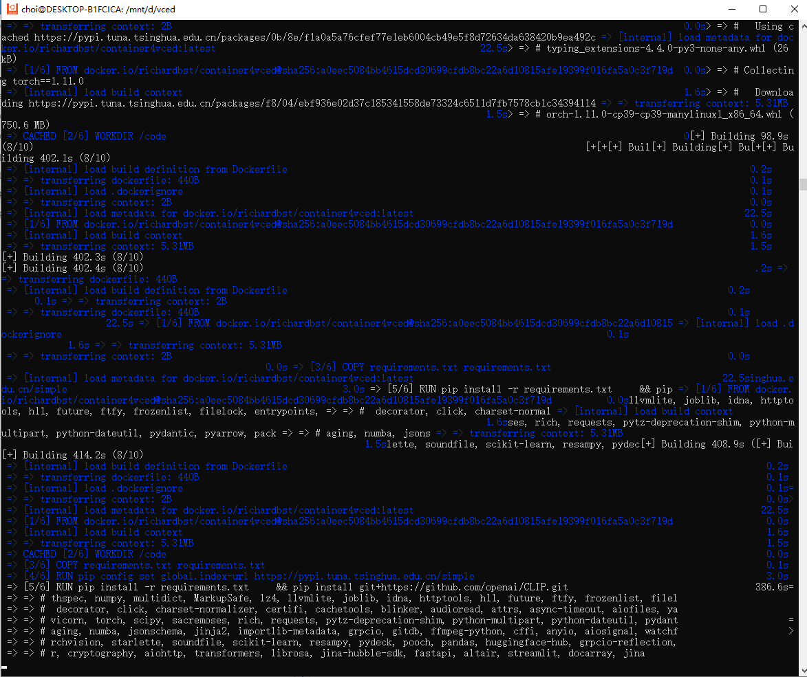

# Task01-课程环境准备

---

> （本学习笔记来源于DataWhale-第43期组队学习：[跨模态神经搜索实践](https://mp.weixin.qq.com/s/X7UXQIYOpckj6fCstPdH4A)）

```md
“生活中有一些决定只有你可以选择。” ——(默尔·沙困)
```

这里只给出部分截图



https://mirrors.tuna.tsinghua.edu.cn/help/ubuntu/
## 参考
[1. 安装 WSL2、Ubuntu 及 docker（详细步骤）](https://www.cnblogs.com/tujia/p/13438639.html)
[2. win10利用WSL2安装docker的2种方式](https://zhuanlan.zhihu.com/p/148511634)
[3. Ubuntu下安装Anaconda的步骤（带图）](https://zhuanlan.zhihu.com/p/426655323)
[4.Linux(Ubuntu系统)安装yum及源的更新(详细操作+文字描述！！！)](https://blog.csdn.net/qq_45261963/article/details/117520995)
